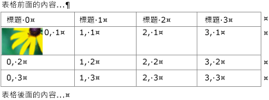
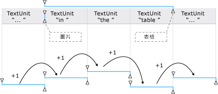
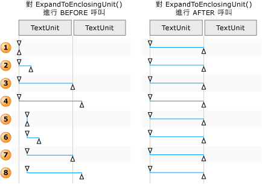

# TextPattern 和 Embedded 物件概觀
> [!NOTE]
>  這份文件適用於想要使用 <xref:System.Windows.Automation> 命名空間中定義之 Managed [!INCLUDE[TLA2#tla_uiautomation](../../../includes/tla2sharptla-uiautomation-md.md)] 類別的 .NET Framework 開發人員。 如需最新資訊[!INCLUDE[TLA2#tla_uiautomation](../../../includes/tla2sharptla-uiautomation-md.md)]，請參閱[Windows Automation API:使用者介面自動化](https://go.microsoft.com/fwlink/?LinkID=156746)。  
  
 本概觀描述 [!INCLUDE[TLA#tla_uiautomation](../../../includes/tlasharptla-uiautomation-md.md)] 如何公開內嵌物件或文字文件或容器內的子元素。  
  
 在 [!INCLUDE[TLA2#tla_uiautomation](../../../includes/tla2sharptla-uiautomation-md.md)] 中，內嵌物件是任何具有非文字界限的元素；例如：影像、超連結、表格或文件類型 (如 [!INCLUDE[TLA#tla_xl](../../../includes/tlasharptla-xl-md.md)] 試算表或 [!INCLUDE[TLA#tla_winmedia](../../../includes/tlasharptla-winmedia-md.md)] 檔案)。 這不同於下列標準定義：元素建立於一個應用程式中，並內嵌或連結在另一個應用程式中。 物件是否可以在其原始應用程式中進行編輯與 [!INCLUDE[TLA2#tla_uiautomation](../../../includes/tla2sharptla-uiautomation-md.md)]的內容無關。  
  
   
## 內嵌物件和 UI 自動化樹狀目錄  
 內嵌物件會被視為 [!INCLUDE[TLA2#tla_uiautomation](../../../includes/tla2sharptla-uiautomation-md.md)] 樹狀結構的控制項檢視內的個別項目。 這些元素會公開成為文字容器的子系，以便透過與 [!INCLUDE[TLA2#tla_uiautomation](../../../includes/tla2sharptla-uiautomation-md.md)]中其他控制項相同的模式進行存取。  
  
   
表格、影像和超連結內嵌物件的文字容器範例  
  
   
上述文字容器之一部分的內容檢視範例  
  
   
## 使用 TextPattern 和 TextPatternRange 公開內嵌物件  
 <xref:System.Windows.Automation.TextPattern> 控制項模式類別和 <xref:System.Windows.Automation.Text.TextPatternRange> 類別搭配使用，可公開方法和屬性，以便瀏覽和查詢內嵌物件。  
  
 在 [!INCLUDE[TLA2#tla_uiautomation](../../../includes/tla2sharptla-uiautomation-md.md)] 樹狀目錄的控制項檢視和內容檢視 (例如超連結或表格儲存格) 中，文字容器和內嵌物件的文字內容 (或內部文字) 會公開為單一連續的文字資料流； 物件界限會被忽略。 如果使用者介面自動化用戶端為了以某種方式進行敘述、解譯或分析而擷取文字，則應檢查特殊案例 (例如具有文字內容或其他內嵌物件的表格) 的文字範圍。 呼叫 <xref:System.Windows.Automation.Text.TextPatternRange.GetChildren%2A> 以取得每個內嵌物件的 <xref:System.Windows.Automation.AutomationElement> ，然後呼叫 <xref:System.Windows.Automation.TextPattern.RangeFromChild%2A> 以取得每個元素的文字範圍，即可達成。 這會以遞迴方式進行，直到擷取所有的文字內容為止。  
  
   
具有內嵌物件及其範圍的文字資料流範例  
  
 如需周遊文字範圍的內容，則應在幕後執行一連串的步驟，才能成功執行 <xref:System.Windows.Automation.Text.TextPatternRange.Move%2A> 方法。  
  
1.  文字範圍已正規化；也就是，文字範圍已在 <xref:System.Windows.Automation.Text.TextPatternRangeEndpoint.Start> 端點摺疊為變質範圍，以致 <xref:System.Windows.Automation.Text.TextPatternRangeEndpoint.End> 端點變成多餘的。 需要此步驟，才能移除模稜兩可情況下，文字範圍跨越<xref:System.Windows.Automation.Text.TextUnit>界限： 比方說，`{The URL https://www.microsoft.com is embedded in text`其中"{"和"}"是文字範圍端點。  
  
2.  結果產生的範圍會在 <xref:System.Windows.Automation.TextPattern.DocumentRange%2A> 中向後移至所要求 <xref:System.Windows.Automation.Text.TextUnit> 界限的開頭。  
  
3.  範圍會在 <xref:System.Windows.Automation.TextPattern.DocumentRange%2A> 中依所要求的 <xref:System.Windows.Automation.Text.TextUnit> 界限數目向前或向後移動。  
  
4.  範圍會接著依一個要求的 <xref:System.Windows.Automation.Text.TextPatternRangeEndpoint.End> 界限移動 <xref:System.Windows.Automation.Text.TextUnit> 端點，從變質範圍狀態展開。  
  
   
如何針對 Move() 和 ExpandToEnclosingUnit() 調整文字範圍的範例  
  
   
## 常見案例  
 下列各節提供有關內嵌物件的最常見案例的範例。  
  
 所示範例的圖例：  
  
 { = <xref:System.Windows.Automation.Text.TextPatternRangeEndpoint.Start>  
  
 } = <xref:System.Windows.Automation.Text.TextPatternRangeEndpoint.End>  
  
### 超連結  

**範例 1 - 包含內嵌文字超連結的文字範圍**
  
`{The URL https://www.microsoft.com is embedded in text}.`
  
|呼叫的方法|結果|  
|-------------------|------------|  
|<xref:System.Windows.Automation.Text.TextPatternRange.GetText%2A>|傳回 `The URL https://www.microsoft.com is embedded in text` 字串。|  
|<xref:System.Windows.Automation.Text.TextPatternRange.GetEnclosingElement%2A>|傳回圍住文字範圍的最內層 <xref:System.Windows.Automation.AutomationElement> ；在此情況下是代表文字提供者本身的 <xref:System.Windows.Automation.AutomationElement> 。|  
|<xref:System.Windows.Automation.Text.TextPatternRange.GetChildren%2A>|傳回表示超連結控制項的 <xref:System.Windows.Automation.AutomationElement> 。|  
|<xref:System.Windows.Automation.TextPattern.RangeFromChild%2A> ，其中 <xref:System.Windows.Automation.AutomationElement> 是先前 `GetChildren` 方法傳回的物件。|傳回表示範圍 」 https://www.microsoft.com "。|  
  
 **範例 2 - 部分跨越內嵌文字超連結的文字範圍**  
  
 URL`https://{[www]}`內嵌於文字。  
  
|呼叫的方法|結果|  
|-------------------|------------|  
|<xref:System.Windows.Automation.Text.TextPatternRange.GetText%2A>|傳回字串 "www"。|  
|<xref:System.Windows.Automation.Text.TextPatternRange.GetEnclosingElement%2A>|傳回圍住文字範圍的最內層 <xref:System.Windows.Automation.AutomationElement> ；在此情況下是超連結控制項。|  
|<xref:System.Windows.Automation.Text.TextPatternRange.GetChildren%2A>|傳回 `null` ，因為文字範圍未跨越整個 URL 字串。|  
  
**範例 3-部分跨越文字容器內容的文字範圍。此文字容器有不屬於此文字範圍的內嵌的文字超連結。**  
  
`{The URL} [https://www.microsoft.com](https://www.microsoft.com) is embedded in text.`
  
|呼叫的方法|結果|  
|-------------------|------------|  
|<xref:System.Windows.Automation.Text.TextPatternRange.GetText%2A>|傳回字串 "The URL"。|  
|<xref:System.Windows.Automation.Text.TextPatternRange.GetEnclosingElement%2A>|傳回圍住文字範圍的最內層 <xref:System.Windows.Automation.AutomationElement> ；在此情況下是代表文字提供者本身的 <xref:System.Windows.Automation.AutomationElement> 。|  
|<xref:System.Windows.Automation.Text.TextPatternRange.Move%2A> ，參數為 (TextUnit.Word, 1)。|將文字範圍移至 "http"，因為超連結文字是由個別字詞所組成。 在此情況下，並未將超連結視為單一物件。   {[Http]} 的 URL 會內嵌在文字中。|  
  
   
### Image  
 **範例 1 - 包含內嵌影像的文字範圍**  
  
 {映像內嵌於文字}。  
  
|呼叫的方法|結果|  
|-------------------|------------|  
|<xref:System.Windows.Automation.Text.TextPatternRange.GetText%2A>|傳回字串 "The is embedded in text"。 任何與影像相關聯的 ALT 文字不應該包含在文字資料流中。|  
|<xref:System.Windows.Automation.Text.TextPatternRange.GetEnclosingElement%2A>|傳回圍住文字範圍的最內層 <xref:System.Windows.Automation.AutomationElement> ；在此情況下是代表文字提供者本身的 <xref:System.Windows.Automation.AutomationElement> 。|  
|<xref:System.Windows.Automation.Text.TextPatternRange.GetChildren%2A>|傳回表示影像控制項的 <xref:System.Windows.Automation.AutomationElement> 。|  
|<xref:System.Windows.Automation.TextPattern.RangeFromChild%2A> ，其中 <xref:System.Windows.Automation.AutomationElement> 是先前 <xref:System.Windows.Automation.Text.TextPatternRange.GetChildren%2A> 方法傳回的物件。|傳回代表變質範圍 」"。|  
  
 **範例 2-部分跨越文字容器內容的文字範圍。此文字容器有內嵌的影像，但不是文字範圍的一部分。**  
  
 {映像}內嵌於文字。  
  
|呼叫的方法|結果|  
|-------------------|------------|  
|<xref:System.Windows.Automation.Text.TextPatternRange.GetText%2A>|傳回字串 "The image"。|  
|<xref:System.Windows.Automation.Text.TextPatternRange.GetEnclosingElement%2A>|傳回圍住文字範圍的最內層 <xref:System.Windows.Automation.AutomationElement> ；在此情況下是代表文字提供者本身的 <xref:System.Windows.Automation.AutomationElement> 。|  
|<xref:System.Windows.Automation.Text.TextPatternRange.Move%2A> ，參數為 (TextUnit.Word, 1)。|將文字範圍移至 "is"。 因為只有以文字為基礎的內嵌物件會被視為文字資料流的一部分，所以此範例中的影像不會影響 Move 或其傳回值 (在本例中為 1)。|  
  
   
### 資料表  
  
### 範例使用的資料表  
  
|包含影像的儲存格|包含文字的儲存格|  
|---------------------|--------------------|  
||X|  
||Y|  
|   Z 的影像|Z|  
  
 **範例 1：從儲存格內容取得文字容器。**  
  
|呼叫的方法|結果|  
|-------------------|------------|  
|<xref:System.Windows.Automation.GridPattern.GetItem%2A> ，參數為 (0,0)|傳回 <xref:System.Windows.Automation.AutomationElement> ，表示表格儲存格的內容；在此情況下，此元素是文字控制項。|  
|<xref:System.Windows.Automation.TextPattern.RangeFromChild%2A> ，其中 <xref:System.Windows.Automation.AutomationElement> 是先前 `GetItem` 方法傳回的物件。|傳回跨越影像的範圍。|  
|<xref:System.Windows.Automation.Text.TextPatternRange.GetEnclosingElement%2A> ，適用於先前 `RangeFromChild` 方法所傳回的物件。|傳回表示表格儲存格的 <xref:System.Windows.Automation.AutomationElement> ；在此情況下，此元素是支援 TableItemPattern 的文字控制項。|  
|<xref:System.Windows.Automation.Text.TextPatternRange.GetEnclosingElement%2A> ，適用於先前 `GetEnclosingElement` 方法所傳回的物件。|傳回表示表格的 <xref:System.Windows.Automation.AutomationElement> 。|  
|<xref:System.Windows.Automation.Text.TextPatternRange.GetEnclosingElement%2A> ，適用於先前 `GetEnclosingElement` 方法所傳回的物件。|傳回表示文字提供者本身的 <xref:System.Windows.Automation.AutomationElement>|  
  
 **範例 2：取得儲存格的文字內容。**  
  
|呼叫的方法|結果|  
|-------------------|------------|  
|<xref:System.Windows.Automation.GridPattern.GetItem%2A> ，參數為 (1,1)。|傳回 <xref:System.Windows.Automation.AutomationElement> ，表示表格儲存格的內容；在此情況下，此元素是文字控制項。|  
|<xref:System.Windows.Automation.TextPattern.RangeFromChild%2A> ，其中 <xref:System.Windows.Automation.AutomationElement> 是先前 `GetItem` 方法傳回的物件。|傳回 "Y"。|  
  
## 另請參閱
- <xref:System.Windows.Automation.TextPattern>
- <xref:System.Windows.Automation.Text.TextPatternRange>
- <xref:System.Windows.Automation.Provider.ITextProvider>
- <xref:System.Windows.Automation.Provider.ITextRangeProvider>
- [使用 UI 自動化存取內嵌物件](../../../docs/framework/ui-automation/access-embedded-objects-using-ui-automation.md)
- [使用 UI 自動化公開資料表的內容](../../../docs/framework/ui-automation/expose-the-content-of-a-table-using-ui-automation.md)
- [使用 UI 自動化周遊文字](../../../docs/framework/ui-automation/traverse-text-using-ui-automation.md)
- [TextPattern 搜尋和選取範例](https://msdn.microsoft.com/library/0a3bca57-8b72-489d-a57c-da85b7a22c7f)
