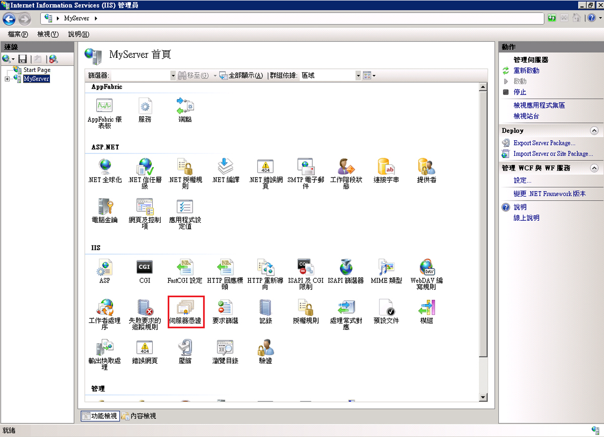
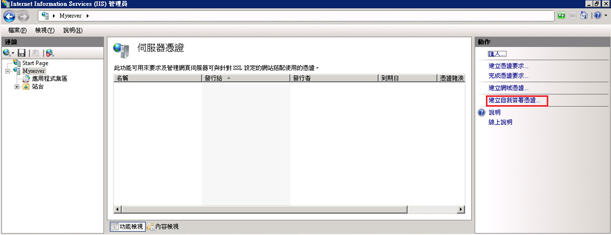
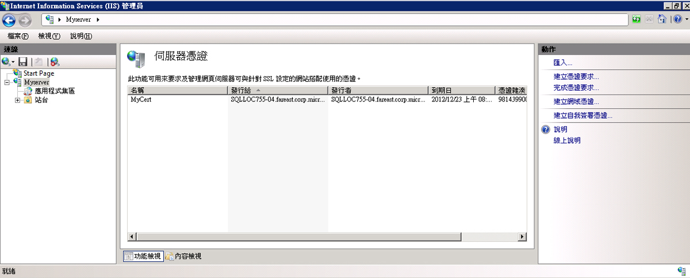
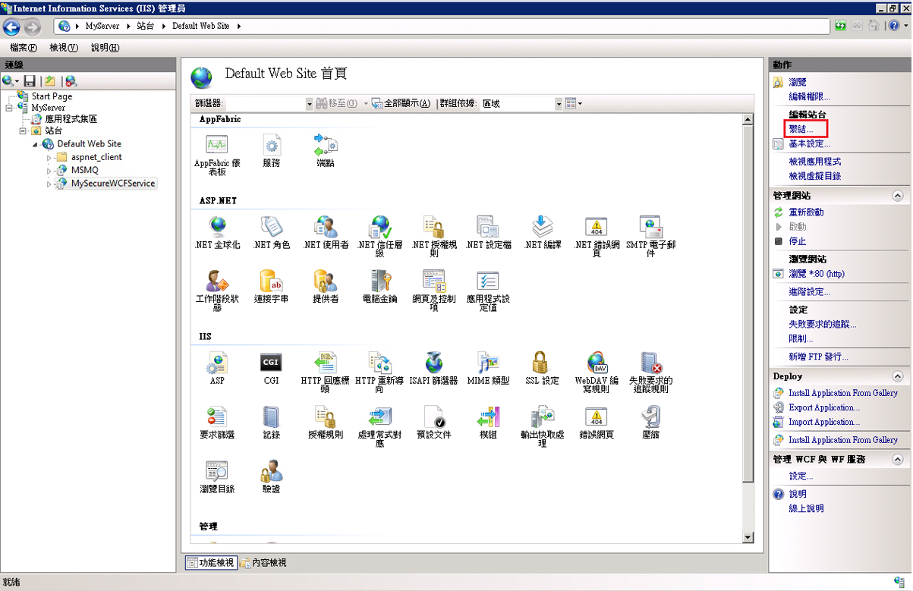
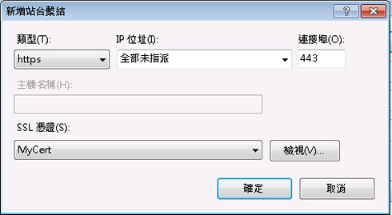

# <a name="how-to-configure-an-iis-hosted-wcf-service-with-ssl"></a>HOW TO：以 SSL 設定 IIS 裝載的 WCF 服務
本主題說明如何設定 IIS 裝載的 WCF 服務以使用 HTTP 傳輸安全性。 HTTP 傳輸安全性必須使用 SSL 憑證才能註冊到 IIS。 如果您沒有 SSL 憑證，則可以使用 IIS 來產生測試憑證。 接下來，您必須將 SSL 繫結加入至網站，並設定網站的驗證屬性。 最後，您需要將 WCF 服務設定為使用 HTTPS。  
  
### <a name="creating-a-self-signed-certificate"></a>建立自我簽署憑證  
  
1.  開啟網際網路資訊服務管理員 (inetmgr.exe)，並在左側樹狀檢視中選取您的電腦名稱。 在螢幕右側選取 [伺服器憑證]  
  
       
  
2.  在 [伺服器憑證] 視窗中按一下**建立自我簽署憑證...** 連結。  
  
       
  
3.  輸入的自我簽署憑證的易記名稱，然後按一下**確定**。  
  
       
  
     新建立的自我簽署的憑證的詳細資訊會顯示在**伺服器憑證**視窗。  
  
       
  
     產生的憑證會安裝在 [受信任的根憑證授權單位] 存放區中。  
  
### <a name="add-ssl-binding"></a>加入 SSL 繫結  
  
1.  仍在網際網路資訊服務管理員中，依序展開**網站**資料夾，然後**Default Web Site**螢幕左側樹狀檢視中的資料夾。  
  
2.  按一下**繫結...** 連結中**動作**視窗右上方部分中的一節。  
  
       
  
3.  在 網站繫結 視窗中按一下**新增** 按鈕。  
  
       
  
4.  在**新增網站繫結**對話方塊中，選取 https 的類型以及您剛才的自我簽署憑證的易記名稱建立。  
  
       
  
### <a name="configure-virtual-directory-for-ssl"></a>設定 SSL 的虛擬目錄  
  
1.  仍舊在網際網路資訊服務管理員中，選取包含您的 WCF 安全服務的虛擬目錄。  
  
2.  在視窗的中央窗格中，選取**SSL 設定**的 IIS 區段中。  
  
       
  
3.  在 SSL 設定 窗格中，選取**需要 SSL**核取方塊，按一下 **套用**中連結**動作**螢幕的右邊區段。  
  
       
  
### <a name="configure-wcf-service-for-http-transport-security"></a>設定 HTTP 傳輸安全性的 WCF 服務  
  
1.  在 WCF 服務的 web.config 中，將 HTTP 繫結設定為使用傳輸安全性，如下列 XML 所示。  
  
    ```xml  
    <bindings>  
          <basicHttpBinding>  
            <binding name="secureHttpBinding">  
              <security mode="Transport">  
                <transport clientCredentialType="None"/>  
              </security>  
            </binding>  
          </basicHttpBinding>  
    </bindings>  
    ```  
  
2.  指定您的服務和服務端點，如下列 XML 所示。  
  
    ```xml  
    <services>  
          <service name="MySecureWCFService.Service1">  
            <endpoint address=""  
                      binding="basicHttpBinding"  
                      bindingConfiguration="secureHttpBinding"  
                      contract="MySecureWCFService.IService1"/>  
  
            <endpoint address="mex"  
                      binding="mexHttpsBinding"  
                      contract="IMetadataExchange" />  
          </service>  
    </services>  
    ```  
  
## <a name="example"></a>範例  
 下列是使用 HTTP 傳輸安全性之 WCF 服務的 web.config 檔的完整範例  
  
```xml  
<?xml version="1.0"?>  
<configuration>  
  
  <system.web>  
    <compilation debug="true" targetFramework="4.0" />  
  </system.web>  
  <system.serviceModel>  
    <services>  
      <service name="MySecureWCFService.Service1">  
        <endpoint address=""  
                  binding="basicHttpBinding"  
                  bindingConfiguration="secureHttpBinding"  
                  contract="MySecureWCFService.IService1"/>  
  
        <endpoint address="mex"  
                  binding="mexHttpsBinding"  
                  contract="IMetadataExchange" />  
      </service>  
    </services>  
    <bindings>  
      <basicHttpBinding>  
        <binding name="secureHttpBinding">  
          <security mode="Transport">  
            <transport clientCredentialType="None"/>  
          </security>  
        </binding>  
      </basicHttpBinding>  
    </bindings>  
    <behaviors>  
      <serviceBehaviors>  
        <behavior>  
          <!-- To avoid disclosing metadata information, set the value below to false and remove the metadata endpoint above before deployment -->  
          <serviceMetadata httpsGetEnabled="true"/>  
          <!-- To receive exception details in faults for debugging purposes, set the value below to true.  Set to false before deployment to avoid disclosing exception information -->  
          <serviceDebug includeExceptionDetailInFaults="false"/>  
        </behavior>  
      </serviceBehaviors>  
    </behaviors>  
    <serviceHostingEnvironment multipleSiteBindingsEnabled="true" />  
  </system.serviceModel>  
  <system.webServer>  
    <modules runAllManagedModulesForAllRequests="true"/>  
  </system.webServer>  
  
</configuration>  
```  
  
## <a name="see-also"></a>另請參閱  
 [在 Internet Information Services 中裝載](../../../../docs/framework/wcf/feature-details/hosting-in-internet-information-services.md)  
 [Internet Information Service 裝載指示](../../../../docs/framework/wcf/samples/internet-information-service-hosting-instructions.md)  
 [Internet Information Services 裝載最佳做法](../../../../docs/framework/wcf/feature-details/internet-information-services-hosting-best-practices.md)  
 [使用內嵌程式碼的 IIS 裝載](../../../../docs/framework/wcf/samples/iis-hosting-using-inline-code.md)
