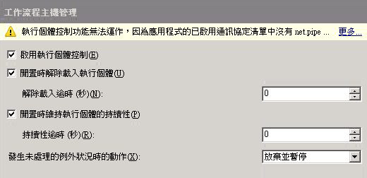

# HOW TO：使用 Windows Server App Fabric 的工作流程服務主機
在 AppFabric 中裝載工作流程服務與在 IIS/WAS 底下裝載很相似。 唯一的差異在於 AppFabric 針對部署、監視和管理工作流程服務所提供的工具。 本主題會使用工作流程服務中建立[建立長時間執行的工作流程服務](../../../../docs/framework/wcf/feature-details/creating-a-long-running-workflow-service.md)。 該主題將逐步引導您建立工作流程服務。 本主題會說明如何使用 AppFabric 來裝載工作流程服務。 如需有關 Windows Server App Fabric 的詳細資訊，請參閱 < [Windows Server App Fabric 文件](https://go.microsoft.com/fwlink/?LinkID=193037&clcid=0x409)。 完成下列步驟之前，請先確定您已安裝 Windows Server AppFabric。  若要執行這會開啟 Internet Information services (inetmgr.exe)，按一下 在您的伺服器名稱**連線**檢視，按一下 網站，然後按一下**Default Web Site**。 在右手邊的畫面應該會看到一個小節稱為**App Fabric**。 如果您沒有看見此區段 (位於右側窗格的頂端)，表示您沒有安裝 App Fabric。 如需安裝 Windows Server App Fabric 的詳細資訊，請參閱[安裝 Windows Server App Fabric](https://go.microsoft.com/fwlink/?LinkId=193136)。  
  
### 建立簡單的工作流程服務  
  
1.  開啟 Visual Studio 2012，並載入您在中建立的 OrderProcessing 方案[建立長時間執行的工作流程服務](../../../../docs/framework/wcf/feature-details/creating-a-long-running-workflow-service.md)主題。  
  
2.  以滑鼠右鍵按一下**OrderService**專案，然後選取**屬性**，然後選取**Web**  索引標籤。  
  
3.  在 **起始動作**區段的 屬性 頁面中，選取**特定頁面**編輯方塊中輸入 Service1.xamlx。  
  
4.  在 **伺服器**區段的 屬性 頁面中，選取**使用本機 IIS Web 伺服器**，並輸入下列 URL: `http://localhost/OrderService`。  
  
5.  按一下 [**建立虛擬目錄**] 按鈕。 這樣就會建立新的虛擬目錄並設定專案，以便在建置專案時，將所需的檔案複製到虛擬目錄。  或者，您也可以將 .xamlx、web.config 和任何所需的 DLL 手動複製到虛擬目錄。  
  
### 設定在 Windows Server AppFabric 中裝載的工作流程服務  
  
1.  開啟 Internet Information Services 管理員 (inetmgr.exe)。  
  
2.  巡覽至 OrderService 虛擬目錄中**連線**窗格。  
  
3.  以滑鼠右鍵按一下 [orderservice] 並選取**管理 WCF 和 WF 服務**，**設定...**. **設定的 WCF 和 WF 應用程式**對話方塊隨即出現。  
  
4.  選取 **一般**索引標籤，顯示應用程式的一般資訊，如下列螢幕擷取畫面所示。  
  
       
  
5.  選取 [**監視**] 索引標籤。這樣就會顯示各種監控設定，如下列螢幕擷取畫面所示。  
  
       
  
     如需有關設定工作流程服務監視在 Appfabric 中看到[設定使用 App Fabric 監控](https://go.microsoft.com/fwlink/?LinkId=193153)。  
  
6.  選取 [**工作流程持續性**] 索引標籤。這樣可讓您將應用程式設定為使用 AppFabric 的預設持續性提供者，如下列螢幕擷取畫面所示。  
  
       
  
     如需在 Windows Server App Fabric 中設定工作流程持續性的詳細資訊，請參閱[在 Appfabric 中設定工作流程持續性](https://go.microsoft.com/fwlink/?LinkId=193148)。  
  
7.  選取 [**工作流程主機管理**] 索引標籤。這樣可讓您指定應該卸載並保存閒置工作流程服務執行個體的時間，如下列螢幕擷取畫面所示。  
  
       
  
     如需工作流程主機管理組態的詳細資訊，請參閱[在 Appfabric 中設定工作流程主機管理](https://go.microsoft.com/fwlink/?LinkId=193151)。  
  
8.  選取 [**自動啟動**] 索引標籤。這樣可讓您針對應用程式中的工作流程服務指定自動啟動設定，如下列螢幕擷取畫面所示。  
  
       
  
     如需設定自動啟動的詳細資訊，請參閱[設定自動啟動使用 App Fabric](https://go.microsoft.com/fwlink/?LinkId=193150)。  
  
9. 選取 [**節流**] 索引標籤。這樣可讓您針對工作流程服務進行節流設定，如下列螢幕擷取畫面所示。  
  
       
  
     如需設定節流的詳細資訊，請參閱[使用 App Fabric 設定節流](https://go.microsoft.com/fwlink/?LinkId=193149)。  
  
10. 選取 [**安全性**] 索引標籤。這樣可讓您針對應用程式進行安全性設定，如下列螢幕擷取畫面所示。  
  
       
  
     如需使用 Windows Server App Fabric 設定安全性的詳細資訊，請參閱[設定的安全性，使用 App Fabric](https://go.microsoft.com/fwlink/?LinkId=193152)。  
  
### 使用 Windows Server AppFabric  
  
1.  建置方案，以便將必要的檔案複製到虛擬目錄。  
  
2.  以滑鼠右鍵按一下 [orderclient] 專案，然後選取**偵錯**，**開始新執行個體**啟動用戶端應用程式。  
  
3.  用戶端執行時間，以及 Visual Studio 會顯示**附加安全性警告** 對話方塊中，按一下**不附加** 按鈕。 這樣會告知 Visual Studio 不要附加至 IIS 處理序進行偵錯。  
  
4.  用戶端應用程式會立即呼叫工作流程服務，然後等候。 工作流程服務將處於閒置狀態並保存。 您可以啟動 Internet Information Services (inetmgr.exe)、在 [連線] 窗格中巡覽至 OrderService，然後選取它，藉以確認這點。 接著，在右側窗格中，按一下 [AppFabric 儀表板] 圖示。 在 [持續性 WF 執行個體] 底下，您將看見一個已保存的工作流程服務執行個體，如下列螢幕擷取畫面所示。  
  
       
  
     **WF 執行個體記錄**列出工作流程服務的工作流程服務啟用數目、 工作流程服務執行個體完成項數目等失敗的工作流程執行個體數目的相關資訊。 [作用中或閒置的執行個體] 底下會顯示一個連結。按一下此連結就會顯示有關閒置工作流程執行個體的詳細資訊，如下列螢幕擷取畫面所示。  
  
       
  
     如需有關 Windows Server Appfabric 功能以及如何使用它們看到[Windows Server Appfabric 裝載功能](https://go.microsoft.com/fwlink/?LinkID=193143&clcid=0x409)  
  
## 另請參閱
- [建立長期執行的工作流程服務](../../../../docs/framework/wcf/feature-details/creating-a-long-running-workflow-service.md)
- [Windows Server AppFabric 裝載功能](https://go.microsoft.com/fwlink/?LinkId=193143)
- [安裝 Windows Server App Fabric](https://go.microsoft.com/fwlink/?LinkId=193136)
- [Windows Server App Fabric 文件](https://go.microsoft.com/fwlink/?LinkID=193037&clcid=0x409)
