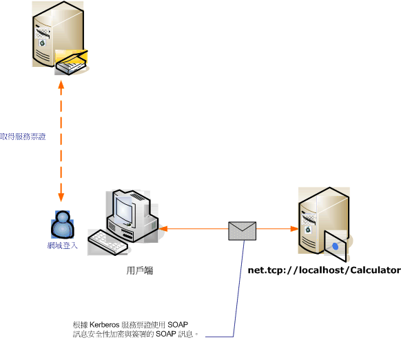

# <a name="message-security-with-a-windows-client-without-credential-negotiation"></a>未使用認證交涉的 Windows 用戶端訊息安全性

下列案例顯示由 Kerberos 通訊協定保護的 Windows Communication Foundation (WCF) 用戶端和服務。

服務和用戶端都是在相同的網域或受信任網域中。

> [!NOTE]
> 此案例與[Windows 用戶端的訊息安全性](../../../../docs/framework/wcf/feature-details/message-security-with-a-windows-client.md)之間的差異在於, 此案例不會在傳送應用程式訊息之前, 與服務協商服務認證。 此外，因為這必須使用 Kerberos 通訊協定，所以此案例還需要 Windows 網域環境。



|特性|描述|
|--------------------|-----------------|
|安全性模式|訊息|
|互通性|具備此特性，有 WS-Security 搭配 Kerberos 權杖設定檔相容的用戶端|
|驗證 (伺服器)|交互驗證伺服器和用戶端|
|驗證 (用戶端)|交互驗證伺服器和用戶端|
|完整性|是|
|機密性|是|
|Transport|HTTP|
|繫結|<xref:System.ServiceModel.WSHttpBinding>|

## <a name="service"></a>服務

下列程式碼和組態要獨立執行。 執行下列任一步驟：

- 使用不含組態的程式碼建立獨立服務。

- 使用提供的組態建立服務，但不要定義任何端點。

### <a name="code"></a>程式碼

下列程式碼會建立使用訊息安全性的服務端點。 程式碼會停用服務認證交涉以及安全性內容權杖 (SCT) 的建立。

> [!NOTE]
> 若要在沒有交涉的情況下使用 Windows 認證類型，服務的使用者帳戶必須可以存取已在 Active Directory 網域中註冊的服務主要名稱 (SPN)。 執行這項作業的方法有兩種：

1. 使用 `NetworkService` 或 `LocalSystem` 帳戶來執行服務。 因為這些帳戶可以存取電腦加入 Active Directory 網域時所建立的電腦 SPN, 所以 WCF 會自動在服務的中繼資料 (Web 服務描述) 中的服務端點內產生適當的 SPN 元素。Language 或 WSDL)。

2. 使用任意的 Active Directory 網域帳戶來執行服務。 在這種情況下，您必須建立該網域帳戶的 SPN。 使用 Setspn.exe 公用程式工具來建立，是其中一種方法。 建立服務帳戶的 SPN 之後, 請將 WCF 設定為透過其中繼資料 (WSDL) 將該 SPN 發行至服務的用戶端。 不論是透過應用程式組態檔或程式碼，都可以設定公開端點的端點身分識別來完成此作業。 下列範例會以程式設計方式發行身分識別。

如需 Spn、Kerberos 通訊協定和 Active Directory 的詳細資訊, 請參閱[Windows 的 Kerberos 技術補充](https://go.microsoft.com/fwlink/?LinkId=88330)。 如需端點身分識別的詳細資訊, 請參閱[SecurityBindingElement 驗證模式](../../../../docs/framework/wcf/feature-details/securitybindingelement-authentication-modes.md)。

[!code-csharp[C_SecurityScenarios#12](../../../../samples/snippets/csharp/VS_Snippets_CFX/c_securityscenarios/cs/source.cs#12)]
[!code-vb[C_SecurityScenarios#12](../../../../samples/snippets/visualbasic/VS_Snippets_CFX/c_securityscenarios/vb/source.vb#12)]

### <a name="configuration"></a>組態

可以使用以下組態來取代程式碼。

```xml
<?xml version="1.0" encoding="utf-8"?>
<configuration>
  <system.serviceModel>
    <behaviors />
    <services>
      <service behaviorConfiguration="" name="ServiceModel.Calculator">
        <endpoint address="http://localhost/Calculator"
                  binding="wsHttpBinding"
                  bindingConfiguration="KerberosBinding"
                  name="WSHttpBinding_ICalculator"
                  contract="ServiceModel.ICalculator"
                  listenUri="net.tcp://localhost/metadata" >
         <identity>
            <servicePrincipalName value="service_spn_name" />
         </identity>
        </endpoint>
      </service>
    </services>
    <bindings>
      <wsHttpBinding>
        <binding name="KerberosBinding">
          <security>
            <message negotiateServiceCredential="false"
                     establishSecurityContext="false" />
          </security>
        </binding>
      </wsHttpBinding>
    </bindings>
    <client />
  </system.serviceModel>
</configuration>
```

## <a name="client"></a>用戶端

下列程式碼和組態要獨立執行。 執行下列任一步驟：

- 使用此程式碼 (和用戶端程式碼) 建立獨立用戶端。

- 建立未定義任何端點位址的用戶端， 然後改用可接受組態名稱當做引數的用戶端建構函式。 例如：

  [!code-csharp[C_SecurityScenarios#0](../../../../samples/snippets/csharp/VS_Snippets_CFX/c_securityscenarios/cs/source.cs#0)]
  [!code-vb[C_SecurityScenarios#0](../../../../samples/snippets/visualbasic/VS_Snippets_CFX/c_securityscenarios/vb/source.vb#0)]

### <a name="code"></a>程式碼

下列程式碼會設定用戶端。 安全性模式設定為 Message，而用戶端認證類型設定為 Windows。 請注意，<xref:System.ServiceModel.MessageSecurityOverHttp.NegotiateServiceCredential%2A> 和 <xref:System.ServiceModel.NonDualMessageSecurityOverHttp.EstablishSecurityContext%2A> 屬性會設定為 `false`。

> [!NOTE]
> 若要在沒有交涉的情況下使用 Windows 認證類型，就必須先使用服務的帳戶 SPN 設定用戶端，再開始與服務進行通訊。 用戶端會使用 SPN 取得 Kerberos 權杖，以驗證並保護與服務進行的通訊。 下列範例示範如何使用服務的 SPN 來設定用戶端。 如果您使用[System.servicemodel 中繼資料公用程式工具 (Svcutil)](../../../../docs/framework/wcf/servicemodel-metadata-utility-tool-svcutil-exe.md)來產生用戶端, 服務的 SPN 將會自動從服務的中繼資料 (WSDL) 傳播至用戶端 (如果服務的中繼資料包含該資訊)。 如需如何設定服務以在服務的中繼資料中包含其 SPN 的詳細資訊, 請參閱本主題稍後的「服務」一節。
>
> 如需 Spn、Kerberos 和 Active Directory 的詳細資訊, 請參閱[Windows 的 Kerberos 技術補充](https://go.microsoft.com/fwlink/?LinkId=88330)。 如需有關端點身分識別的詳細資訊, 請參閱[SecurityBindingElement Authentication 模式](../../../../docs/framework/wcf/feature-details/securitybindingelement-authentication-modes.md)主題。

[!code-csharp[C_SecurityScenarios#19](../../../../samples/snippets/csharp/VS_Snippets_CFX/c_securityscenarios/cs/source.cs#19)]
[!code-vb[C_SecurityScenarios#19](../../../../samples/snippets/visualbasic/VS_Snippets_CFX/c_securityscenarios/vb/source.vb#19)]

### <a name="configuration"></a>組態

下列程式碼會設定用戶端。 請注意, [ \<servicePrincipalName >](../../../../docs/framework/configure-apps/file-schema/wcf/serviceprincipalname.md)元素必須設定為符合服務的 SPN, 如在 Active Directory 網域中為服務的帳戶註冊。

```xml
<?xml version="1.0" encoding="utf-8"?>
<configuration>
  <system.serviceModel>
    <bindings>
      <wsHttpBinding>
        <binding name="WSHttpBinding_ICalculator" >
          <security mode="Message">
            <message clientCredentialType="Windows"
                     negotiateServiceCredential="false"
                     establishSecurityContext="false" />
          </security>
        </binding>
      </wsHttpBinding>
    </bindings>
    <client>
      <endpoint address="http://localhost/Calculator"
                binding="wsHttpBinding"
                bindingConfiguration="WSHttpBinding_ICalculator"
                contract="ICalculator"
                name="WSHttpBinding_ICalculator">
        <identity>
          <servicePrincipalName value="service_spn_name" />
        </identity>
      </endpoint>
    </client>
  </system.serviceModel>
</configuration>
```

## <a name="see-also"></a>另請參閱

- [安全性概觀](../../../../docs/framework/wcf/feature-details/security-overview.md)
- [服務身分識別和驗證](../../../../docs/framework/wcf/feature-details/service-identity-and-authentication.md)
- [Windows Server App Fabric 的安全性模型](https://go.microsoft.com/fwlink/?LinkID=201279&clcid=0x409)
