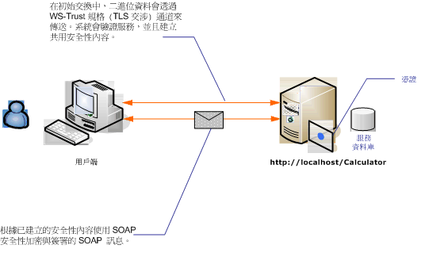

# <a name="message-security-with-an-anonymous-client"></a>匿名用戶端的訊息安全性
下列案例會顯示 [!INCLUDE[indigo1](../../../../includes/indigo1-md.md)] 訊息安全性所保護的用戶端和服務。 這樣的設計目的是使用訊息安全性而非傳輸安全性，如此未來可以支援更豐富的宣告型模型。 [!INCLUDE[crabout](../../../../includes/crabout-md.md)]使用豐富的宣告進行授權，請參閱[管理宣告和授權的方式識別模型](../../../../docs/framework/wcf/feature-details/managing-claims-and-authorization-with-the-identity-model.md)。  
  
 範例應用程式，請參閱[訊息安全性匿名](../../../../docs/framework/wcf/samples/message-security-anonymous.md)。  
  
   
  
|特性|描述|  
|--------------------|-----------------|  
|安全性模式|訊息|  
|互通性|僅限 [!INCLUDE[indigo2](../../../../includes/indigo2-md.md)]|  
|驗證 (伺服器)|初始交涉需要伺服器驗證，而不需要用戶端驗證|  
|驗證 (用戶端)|無|  
|完整性|是，使用共用安全性內容|  
|機密性|是，使用共用安全性內容|  
|Transport|HTTP|  
  
## <a name="service"></a>服務  
 下列程式碼和組態要獨立執行。 執行下列任一步驟：  
  
-   使用不含組態的程式碼建立獨立服務。  
  
-   使用提供的組態建立服務，但不要定義任何端點。  
  
### <a name="code"></a>程式碼  
 下列程式碼會顯示如何建立會使用訊息安全性的服務端點。  
  
 [!code-csharp[C_SecurityScenarios#8](../../../../samples/snippets/csharp/VS_Snippets_CFX/c_securityscenarios/cs/source.cs#8)]
 [!code-vb[C_SecurityScenarios#8](../../../../samples/snippets/visualbasic/VS_Snippets_CFX/c_securityscenarios/vb/source.vb#8)]  
  
### <a name="configuration"></a>組態  
 可以使用以下組態來取代程式碼。 使用服務行為項目來指定用來驗證用戶端服務的憑證。 服務項目必須使用 `behaviorConfiguration` 屬性來指定行為。 繫結項目會指定用戶端認證類型為 `None`，因此可讓匿名用戶端使用服務。  
  
```xml  
<?xml version="1.0" encoding="utf-8"?>  
<configuration>  
  <system.serviceModel>  
    <behaviors>  
      <serviceBehaviors>  
        <behavior name="ServiceCredentialsBehavior">  
          <serviceCredentials>  
            <serviceCertificate findValue="contoso.com"   
                                storeLocation="LocalMachine"  
                                storeName="My" />  
          </serviceCredentials>  
        </behavior>  
      </serviceBehaviors>  
    </behaviors>  
    <services>  
      <service behaviorConfiguration="ServiceCredentialsBehavior"   
               name="ServiceModel.Calculator">  
        <endpoint address="http://localhost/Calculator"   
                  binding="wsHttpBinding"  
                  bindingConfiguration="WSHttpBinding_ICalculator"   
                  name="CalculatorService"  
                  contract="ServiceModel.ICalculator" />  
      </service>  
    </services>  
    <bindings>  
      <wsHttpBinding>  
        <binding name="WSHttpBinding_ICalculator" >  
          <security mode="Message">  
            <message clientCredentialType="None" />  
          </security>  
        </binding>  
      </wsHttpBinding>  
    </bindings>  
    <client />  
  </system.serviceModel>  
</configuration>  
```  
  
## <a name="client"></a>用戶端  
 下列程式碼和組態要獨立執行。 執行下列任一步驟：  
  
-   使用此程式碼 (和用戶端程式碼) 建立獨立用戶端。  
  
-   建立未定義任何端點位址的用戶端， 然後改用可接受組態名稱當做引數的用戶端建構函式。 例如：  
  
     [!code-csharp[C_SecurityScenarios#0](../../../../samples/snippets/csharp/VS_Snippets_CFX/c_securityscenarios/cs/source.cs#0)]
     [!code-vb[C_SecurityScenarios#0](../../../../samples/snippets/visualbasic/VS_Snippets_CFX/c_securityscenarios/vb/source.vb#0)]  
  
### <a name="code"></a>程式碼  
 下列程式碼會建立用戶端的執行個體。 繫結會使用訊息模式安全性，而且用戶端認證類型設為 none。  
  
 [!code-csharp[C_SecurityScenarios#15](../../../../samples/snippets/csharp/VS_Snippets_CFX/c_securityscenarios/cs/source.cs#15)]
 [!code-vb[C_SecurityScenarios#15](../../../../samples/snippets/visualbasic/VS_Snippets_CFX/c_securityscenarios/vb/source.vb#15)]  
  
### <a name="configuration"></a>組態  
 下列程式碼會設定用戶端。  
  
```xml  
<?xml version="1.0" encoding="utf-8"?>  
<configuration>  
  <system.serviceModel>  
    <bindings>  
      <wsHttpBinding>  
        <binding name="WSHttpBinding_ICalculator" >  
          <security mode="Message">  
            <message clientCredentialType="None" />  
          </security>  
        </binding>  
      </wsHttpBinding>  
    </bindings>  
    <client>  
      <endpoint address="http://machineName/Calculator"  
        binding="wsHttpBinding"  
        bindingConfiguration="WSHttpBinding_ICalculator"   
        contract="ICalculator"  
        name="WSHttpBinding_ICalculator">  
        <identity>  
          <dns value="contoso.com" />  
        </identity>  
      </endpoint>  
    </client>  
  </system.serviceModel>  
</configuration>  
```  
  
## <a name="see-also"></a>請參閱  
 [安全性概觀](../../../../docs/framework/wcf/feature-details/security-overview.md)  
 [分散式應用程式安全性](../../../../docs/framework/wcf/feature-details/distributed-application-security.md)  
 [訊息安全性匿名](../../../../docs/framework/wcf/samples/message-security-anonymous.md)  
 [服務身分識別和驗證](../../../../docs/framework/wcf/feature-details/service-identity-and-authentication.md)  
 [Windows Server App Fabric 的安全性模型](http://go.microsoft.com/fwlink/?LinkID=201279&clcid=0x409)
