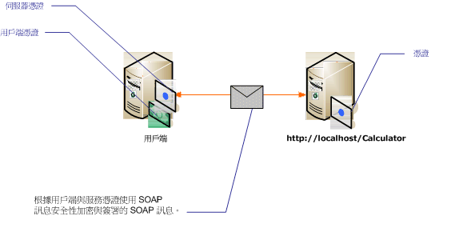

# <a name="message-security-with-mutual-certificates"></a>相互憑證的訊息安全性
下列案例顯示使用訊息安全性模式加以保護的 [!INCLUDE[indigo1](../../../../includes/indigo1-md.md)] 服務和用戶端。 用戶端與服務以憑證加以驗證。  
  
 因為案例使用具有 X.509 憑證權杖設定檔的 WS-Security，所以這個案例是互通的。  
  
> [!NOTE]
>  這個案例並不執行服務憑證的交涉。 在任何通訊前，必須先對用戶端提供服務憑證。 伺服器憑證可在應用程式散發，或在超出範圍通訊中提供。  
  
   
  
|特性|描述|  
|--------------------|-----------------|  
|安全性模式|訊息|  
|互通性|是的，採用 WS-Security 及 X.509 憑證權杖設定檔相容的用戶端及服務。|  
|驗證|伺服器和用戶端的交互驗證。|  
|完整性|是|  
|機密性|是|  
|Transport|HTTP|  
|繫結|<xref:System.ServiceModel.WSHttpBinding>|  
  
## <a name="service"></a>服務  
 下列程式碼和組態要獨立執行。 執行下列任一步驟：  
  
-   使用不含組態的程式碼建立獨立服務。  
  
-   使用提供的組態建立服務，但不要定義任何端點。  
  
### <a name="code"></a>程式碼  
 下列程式碼顯示建立使用訊息安全性的服務端點。 服務需要憑證來驗證自己。  
  
 [!code-csharp[C_SecurityScenarios#13](../../../../samples/snippets/csharp/VS_Snippets_CFX/c_securityscenarios/cs/source.cs#13)]
 [!code-vb[C_SecurityScenarios#13](../../../../samples/snippets/visualbasic/VS_Snippets_CFX/c_securityscenarios/vb/source.vb#13)]  
  
### <a name="configuration"></a>組態  
 您可使用下列組態來取代程式碼，以建立相同的服務。  
  
```xml  
<?xml version="1.0" encoding="utf-8"?>  
<configuration>  
  <system.serviceModel>  
    <behaviors>  
      <serviceBehaviors>  
        <behavior name="serviceCredentialBehavior">  
          <serviceCredentials>  
            <serviceCertificate findValue="Contoso.com"   
                                storeLocation="LocalMachine"  
                                storeName="My"   
                                x509FindType="FindBySubjectName" />  
          </serviceCredentials>  
        </behavior>  
      </serviceBehaviors>  
    </behaviors>  
    <services>  
      <service behaviorConfiguration="serviceCredentialBehavior"   
               name="ServiceModel.Calculator">  
        <endpoint address="http://localhost/Calculator"   
                  binding="wsHttpBinding"  
                  bindingConfiguration="InteropCertificateBinding"  
                  name="WSHttpBinding_ICalculator"  
                  contract="ServiceModel.ICalculator" />  
      </service>  
    </services>  
    <bindings>  
      <wsHttpBinding>  
        <binding name="InteropCertificateBinding">  
          <security mode="Message">  
            <message clientCredentialType="Certificate"  
                     negotiateServiceCredential="false"  
                     establishSecurityContext="false" />  
          </security>  
        </binding>  
      </wsHttpBinding>  
    </bindings>  
    <client />  
  </system.serviceModel>  
</configuration>  
```  
  
## <a name="client"></a>用戶端  
 下列程式碼和組態要獨立執行。 執行下列任一步驟：  
  
-   使用此程式碼 (和用戶端程式碼) 建立獨立用戶端。  
  
-   建立未定義任何端點位址的用戶端， 然後改用可接受組態名稱當做引數的用戶端建構函式。 例如：  
  
     [!code-csharp[C_SecurityScenarios#0](../../../../samples/snippets/csharp/VS_Snippets_CFX/c_securityscenarios/cs/source.cs#0)]
     [!code-vb[C_SecurityScenarios#0](../../../../samples/snippets/visualbasic/VS_Snippets_CFX/c_securityscenarios/vb/source.vb#0)]  
  
### <a name="code"></a>程式碼  
 下列程式碼會建立用戶端。 安全性模式設為訊息，而且用戶端認證類型設為憑證。  
  
 [!code-csharp[C_SecurityScenarios#20](../../../../samples/snippets/csharp/VS_Snippets_CFX/c_securityscenarios/cs/source.cs#20)]
 [!code-vb[C_SecurityScenarios#20](../../../../samples/snippets/visualbasic/VS_Snippets_CFX/c_securityscenarios/vb/source.vb#20)]  
  
### <a name="configuration"></a>組態  
 下列組態會設定用戶端。 用戶端憑證必須使用指定[ \<clientCertificate >](../../../../docs/framework/configure-apps/file-schema/wcf/clientcertificate-of-clientcredentials-element.md)。 此外，使用指定的服務憑證[ \<defaultCertificate >](../../../../docs/framework/configure-apps/file-schema/wcf/defaultcertificate-element.md)。  
  
```xml  
<?xml version="1.0" encoding="utf-8"?>  
<configuration>  
  <system.serviceModel>  
    <behaviors>  
      <endpointBehaviors>  
        <behavior name="ClientCredentialsBehavior">  
          <clientCredentials>  
            <clientCertificate findValue="Cohowinery.com"   
                 storeLocation="CurrentUser"  
                 storeName="My"  
                 x509FindType="FindBySubjectName" />  
            <serviceCertificate>  
              <defaultCertificate findValue="Contoso.com"   
                                  storeLocation="CurrentUser"  
                                  storeName="TrustedPeople"  
                                  x509FindType="FindBySubjectName" />  
            </serviceCertificate>  
          </clientCredentials>  
        </behavior>  
      </endpointBehaviors>  
    </behaviors>  
    <bindings>  
      <wsHttpBinding>  
        <binding name="WSHttpBinding_ICalculator" >  
          <security mode="Message">  
            <message clientCredentialType="Certificate"   
                     negotiateServiceCredential="false"  
                     establishSecurityContext="false" />  
          </security>  
        </binding>  
      </wsHttpBinding>  
    </bindings>  
    <client>  
      <endpoint address="http://machineName/Calculator"   
                behaviorConfiguration="ClientCredentialsBehavior"  
                binding="wsHttpBinding"   
                bindingConfiguration="WSHttpBinding_ICalculator"  
                contract="ICalculator"  
                name="WSHttpBinding_ICalculator">  
        <identity>  
          <certificate encodedValue="Encoded_Value_Not_Shown" />  
        </identity>  
      </endpoint>  
    </client>  
  </system.serviceModel>  
</configuration>  
```  
  
## <a name="see-also"></a>請參閱  
 [安全性概觀](../../../../docs/framework/wcf/feature-details/security-overview.md)  
 [Windows Server App Fabric 的安全性模型](http://go.microsoft.com/fwlink/?LinkID=201279&clcid=0x409)  
 [如何： 建立並在開發期間針對傳輸安全性安裝暫時憑證在 WCF 中](http://go.microsoft.com/fwlink/?LinkId=244264)
