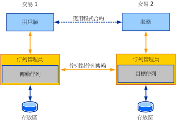

# 佇列概觀
本節將介紹已佇列通訊背後的一般和核心概念。 後續各節討論有關此處所述的佇列概念會列印文件的顯示，請在 Windows Communication Foundation (WCF) 的詳細資料。  
  
## 基本佇列概念  
 當設計分散式應用程式時，為服務和用戶端之間的通訊選擇正確的傳輸是很重要的。 有數個因素會影響所使用的傳輸種類。 服務、用戶端和傳輸之間的隔離是一個重要的因素，它會決定要使用佇列傳輸或直接傳輸，例如 TCP 或 HTTP。 由於直接傳輸 (例如 TCP 和 HTTP) 的性質之故，如果服務或用戶端停止運作或網路失敗，通訊也會一起停止。 服務、用戶端和網路必須同時執行，應用程式才能運作。 已佇列之傳輸提供隔離，意指如果服務或用戶端失敗或它們之間的通訊連結失敗，用戶端和服務可以繼續運作。  
  
 即使通訊方或網路失敗，佇列仍會提供可靠的通訊。 佇列會擷取及傳遞在通訊方之間交換的訊息。 佇列通常是受到某種存放區所支持，它可能是永久性或變動性的。 佇列會代表服務儲存來自用戶端的訊息，稍後再將這些訊息轉送至服務。 由於間接佇列為任一方的失敗提供保護隔離，因此讓它成為高度可用的系統和連線中斷的服務慣用的通訊機制。 間接所伴隨的代價是高延遲時間。 *延遲*是用戶端傳送訊息的時間和服務接收它的時間之間的時間延遲。 這表示訊息一旦送出，您就不知道可能何時才會處理該訊息。 大部分的佇列應用程式都會處理高延遲時間的問題。 下圖顯示已佇列通訊的概念模型。  
  
   
  
 已佇列通訊概念模型  
  
 事實上，佇列是一種分散式的概念。 因此，它們可以是其中一方的本機或雙方的遠端。 一般來說，佇列對服務來說是本機的。 在這個組態中，用戶端無法根據與遠端佇列的連線持續取得。 同樣地，佇列必須與從佇列讀取之服務的可用性無關，才可使用。 佇列管理員會管理佇列的集合。 它負責接受從其他佇列管理員傳送至其佇列的訊息。 它也負責管理與遠端佇列的連線，以及將訊息傳輸到這些遠端佇列。 不論用戶端或服務應用程式是否失敗，為確保佇列的可用性，佇列管理員通常會執行為外部服務。  
  
 當用戶端將訊息傳送至佇列時，它會將訊息定址到目標佇列，也就是由服務的佇列管理員所管理的佇列。 用戶端上的佇列管理員會將訊息傳送至傳輸 (或傳出) 佇列。 傳輸佇列是用戶端佇列管理員上的佇列，其中儲存傳輸至目標佇列的訊息。 然後佇列管理員會尋找擁有目標佇列之佇列管理員的路徑，再將訊息傳輸給它。 為確保可靠的通訊，佇列管理員會實作可靠的傳輸通訊協定，以防資料遺失。 目的佇列管理員會接受定址到其擁有之目標佇列的訊息，並儲存訊息。 服務會要求從目標佇列讀取，然後此時佇列管理員會將訊息傳遞至目的應用程式。 下圖顯示四方之間的通訊。  
  
   
  
 一般部署案例中的已佇列通訊  
  
 因此，佇列管理員提供所需要的隔離，讓傳送者和接收者可以單獨失敗，而不會影響到實際的通訊。 佇列所提供之額外間接的好處也可讓多個應用程式執行個體從相同的佇列讀取，讓節點中的伺服陣列工作達到更高的輸送量。 因此，使用佇列來達成更大規模和輸送量需求是很常見的。  
  
## 佇列與異動  
 交易允許您組成一組作業，如果一個作業失敗，所有作業都會失敗。 下列範例說明如何使用異動，當有人使用 ATM 將 $1,000 從他的存款帳戶轉到他的支票帳戶時， 這需要下列作業：  
  
-   從存款帳戶提款 $1,000。  
  
-   將 $1,000 存入支票帳戶。  
  
 如果第一個作業成功，並從存款帳戶提款 $1,000，但是第二個作業失敗，則會因為已經從存款帳戶中提出 $1,000，而遺失了 $1,000。 為了讓帳戶處於有效狀態，如果其中一個作業失敗，兩個作業都必須失敗。  
  
 在異動訊息中，訊息可以在異動下傳送至佇列以及從佇列接收。 因此，如果在異動中傳送訊息，且異動已回復，則結果就像是訊息從未傳送到佇列過一樣。 同樣地，如果訊息是在異動中收到，且異動已回復，則結果就像是訊息從未被收到過一樣。 訊息會保留在佇列中以供讀取。  
  
 由於高延遲時間之故，當您傳送訊息時，您無法得知要花多長的時間才能到達目標佇列，或要花多長的時間才能讓服務處理此訊息。 因此，您不想使用單一異動來傳送訊息、接收訊息然後處理訊息。 這會建立不為未定時間量認可的異動。 當用戶端和服務透過使用異動的佇列來通訊時，會包含兩個異動：一個在用戶端上，另一個在服務上。 下圖顯示一般已佇列通訊中的異動界限。  
  
   
  
 顯示擷取和傳遞之個別異動的已佇列通訊  
  
 用戶端交易會處理並傳送訊息。 當認可異動時，訊息會位於傳輸佇列中。 在服務上，異動會從目標佇列讀取訊息、處理訊息，然後認可異動。 如果在處理期間發生錯誤，訊息便會復原並放在目標佇列中。  
  
## 使用佇列的非同步通訊  
 佇列提供通訊的非同步方式。 由於佇列管理員引入的高延遲時間之故，因此使用佇列傳送訊息的應用程式無法等待接收者接收及處理訊息。 訊息留在佇列中的時間長度可能遠超過應用程式的預期。 如果要避免這種情況，應用程式可以在訊息上指定「存留時間」值。 這個值會指定訊息應留在傳輸佇列中的時間長度。 如果超過這個時間值，訊息仍未傳送給目標佇列，可以將訊息傳輸到寄不出的信件佇列。  
  
 當傳送者傳送訊息時，從傳送作業傳回意指訊息只傳送到傳送者的傳輸佇列。 因此，如果訊息在傳送到目標佇列時失敗，傳送應用程式無法立即得知。 為記錄這類失敗，會將失敗的訊息傳送到寄不出的信件佇列。  
  
 任何錯誤 (例如無法到達目標佇列或存留時間過期的訊息) 都必須分開處理。 因此，已佇列應用程式撰寫兩套邏輯是很常見的：  
  
-   傳送及接收訊息的一般用戶端和服務邏輯。  
  
-   處理來自失敗傳輸或傳遞之訊息的補償邏輯。  
  
 下列各節將說明這些概念。  
  
## 寄不出的信件佇列程式設計  
 寄不出的信件佇列包含因故無法到達目標佇列的訊息。 原因的範圍可能從訊息過期，到無法將訊息傳送到目標佇列的連線問題。  
  
 一般來說，應用程式可以從整個系統之寄不出的信件佇列讀取訊息，判斷問題所在，然後採取適當的行動，例如更正錯誤並重新傳送訊息或做記錄。  
  
## 有害訊息佇列程式設計  
 在訊息到達目標佇列之後，服務可能會重複失敗而無法處理訊息。 例如，在交易下從佇列讀取訊息並更新資料庫的應用程式可能會發現資料庫暫時斷線。 在這種情況下，交易會復原，建立新的交易，然後從佇列重新讀取訊息。 第二次嘗試可能會成功或失敗。 在某些情況中，訊息可能會重複失敗而無法傳遞至應用程式，這要視錯誤的原因而定。 在這種情況下，會將訊息視為「有害」。 此類訊息會移到有害佇列中，可由有害處理的應用程式讀取。  
  
## 另請參閱

- [WCF 中的佇列](../../../../docs/framework/wcf/feature-details/queuing-in-wcf.md)
- [工作階段和佇列](../../../../docs/framework/wcf/samples/sessions-and-queues.md)
- [寄不出的信件佇列](../../../../docs/framework/wcf/samples/dead-letter-queues.md)
- [變動性佇列通訊](../../../../docs/framework/wcf/samples/volatile-queued-communication.md)
- [Windows Communication Foundation 至訊息佇列](../../../../docs/framework/wcf/samples/wcf-to-message-queuing.md)
- [安裝訊息佇列 (MSMQ)](../../../../docs/framework/wcf/samples/installing-message-queuing-msmq.md)
- [訊息佇列至 Windows Communication Foundation](../../../../docs/framework/wcf/samples/message-queuing-to-wcf.md)
- [訊息佇列上的訊息安全性](../../../../docs/framework/wcf/samples/message-security-over-message-queuing.md)
