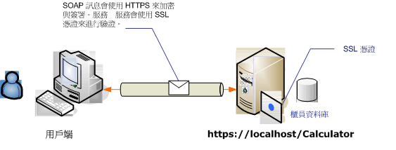

# <a name="transport-security-with-an-anonymous-client"></a><span data-ttu-id="d7ce2-102">匿名用戶端的傳輸安全性</span><span class="sxs-lookup"><span data-stu-id="d7ce2-102">Transport security with an anonymous client</span></span>

<span data-ttu-id="d7ce2-103">此 Windows Communication Foundation （WCF）案例會使用傳輸安全性（HTTPS）來確保機密性和完整性。</span><span class="sxs-lookup"><span data-stu-id="d7ce2-103">This Windows Communication Foundation (WCF) scenario uses transport security (HTTPS) to ensure confidentiality and integrity.</span></span> <span data-ttu-id="d7ce2-104">伺服器必須使用安全通訊端層 (SSL) 憑證進行驗證，而且用戶端必須信任該伺服器的憑證。</span><span class="sxs-lookup"><span data-stu-id="d7ce2-104">The server must be authenticated with a Secure Sockets Layer (SSL) certificate, and the clients must trust the server's certificate.</span></span> <span data-ttu-id="d7ce2-105">此用戶端不會透過任何機制進行驗證，因此屬於匿名。</span><span class="sxs-lookup"><span data-stu-id="d7ce2-105">The client is not authenticated by any mechanism and is, therefore, anonymous.</span></span>

<span data-ttu-id="d7ce2-106">如需範例應用程式，請參閱[WS Transport Security](../samples/ws-transport-security.md)。</span><span class="sxs-lookup"><span data-stu-id="d7ce2-106">For a sample application, see [WS Transport Security](../samples/ws-transport-security.md).</span></span> <span data-ttu-id="d7ce2-107">如需有關傳輸安全性的詳細資訊，請參閱[傳輸安全性總覽](transport-security-overview.md)。</span><span class="sxs-lookup"><span data-stu-id="d7ce2-107">For more information about transport security, see [Transport Security Overview](transport-security-overview.md).</span></span>

<span data-ttu-id="d7ce2-108">如需搭配服務使用憑證的詳細資訊，請參閱使用[憑證](working-with-certificates.md)和[如何：使用 SSL 憑證設定埠](how-to-configure-a-port-with-an-ssl-certificate.md)。</span><span class="sxs-lookup"><span data-stu-id="d7ce2-108">For more information about using a certificate with a service, see [Working with Certificates](working-with-certificates.md) and [How to: Configure a Port with an SSL Certificate](how-to-configure-a-port-with-an-ssl-certificate.md).</span></span>



|<span data-ttu-id="d7ce2-110">特性</span><span class="sxs-lookup"><span data-stu-id="d7ce2-110">Characteristic</span></span>|<span data-ttu-id="d7ce2-111">描述</span><span class="sxs-lookup"><span data-stu-id="d7ce2-111">Description</span></span>|
|--------------------|-----------------|
|<span data-ttu-id="d7ce2-112">安全性模式</span><span class="sxs-lookup"><span data-stu-id="d7ce2-112">Security Mode</span></span>|<span data-ttu-id="d7ce2-113">Transport</span><span class="sxs-lookup"><span data-stu-id="d7ce2-113">Transport</span></span>|
|<span data-ttu-id="d7ce2-114">互通性</span><span class="sxs-lookup"><span data-stu-id="d7ce2-114">Interoperability</span></span>|<span data-ttu-id="d7ce2-115">與現有的 Web 服務和用戶端</span><span class="sxs-lookup"><span data-stu-id="d7ce2-115">With existing Web services and clients</span></span>|
|<span data-ttu-id="d7ce2-116">驗證 (伺服器)</span><span class="sxs-lookup"><span data-stu-id="d7ce2-116">Authentication (Server)</span></span><br /><br /> <span data-ttu-id="d7ce2-117">驗證 (用戶端)</span><span class="sxs-lookup"><span data-stu-id="d7ce2-117">Authentication (Client)</span></span>|<span data-ttu-id="d7ce2-118">是</span><span class="sxs-lookup"><span data-stu-id="d7ce2-118">Yes</span></span><br /><br /> <span data-ttu-id="d7ce2-119">應用層級（沒有 WCF 支援）</span><span class="sxs-lookup"><span data-stu-id="d7ce2-119">Application level (no WCF support)</span></span>|
|<span data-ttu-id="d7ce2-120">完整性</span><span class="sxs-lookup"><span data-stu-id="d7ce2-120">Integrity</span></span>|<span data-ttu-id="d7ce2-121">是</span><span class="sxs-lookup"><span data-stu-id="d7ce2-121">Yes</span></span>|
|<span data-ttu-id="d7ce2-122">機密性</span><span class="sxs-lookup"><span data-stu-id="d7ce2-122">Confidentiality</span></span>|<span data-ttu-id="d7ce2-123">是</span><span class="sxs-lookup"><span data-stu-id="d7ce2-123">Yes</span></span>|
|<span data-ttu-id="d7ce2-124">Transport</span><span class="sxs-lookup"><span data-stu-id="d7ce2-124">Transport</span></span>|<span data-ttu-id="d7ce2-125">HTTPS</span><span class="sxs-lookup"><span data-stu-id="d7ce2-125">HTTPS</span></span>|
|<span data-ttu-id="d7ce2-126">繫結</span><span class="sxs-lookup"><span data-stu-id="d7ce2-126">Binding</span></span>|<xref:System.ServiceModel.WSHttpBinding>|

## <a name="service"></a><span data-ttu-id="d7ce2-127">服務</span><span class="sxs-lookup"><span data-stu-id="d7ce2-127">Service</span></span>

<span data-ttu-id="d7ce2-128">下列程式碼和組態要獨立執行。</span><span class="sxs-lookup"><span data-stu-id="d7ce2-128">The following code and configuration are meant to run independently.</span></span> <span data-ttu-id="d7ce2-129">請執行下列其中一項動作：</span><span class="sxs-lookup"><span data-stu-id="d7ce2-129">Do one of the following:</span></span>

- <span data-ttu-id="d7ce2-130">使用不含組態的程式碼建立獨立服務。</span><span class="sxs-lookup"><span data-stu-id="d7ce2-130">Create a stand-alone service using the code with no configuration.</span></span>

- <span data-ttu-id="d7ce2-131">使用提供的組態建立服務，但不要定義任何端點。</span><span class="sxs-lookup"><span data-stu-id="d7ce2-131">Create a service using the supplied configuration, but do not define any endpoints.</span></span>

### <a name="code"></a><span data-ttu-id="d7ce2-132">程式碼</span><span class="sxs-lookup"><span data-stu-id="d7ce2-132">Code</span></span>

<span data-ttu-id="d7ce2-133">下列程式碼會示範如何建立會使用傳輸安全性的端點：</span><span class="sxs-lookup"><span data-stu-id="d7ce2-133">The following code shows how to create an endpoint using transport security:</span></span>

[!code-csharp[c_SecurityScenarios#5](~/samples/snippets/csharp/VS_Snippets_CFX/c_securityscenarios/cs/source.cs#5)]
[!code-vb[c_SecurityScenarios#5](~/samples/snippets/visualbasic/VS_Snippets_CFX/c_securityscenarios/vb/source.vb#5)]

### <a name="configuration"></a><span data-ttu-id="d7ce2-134">組態</span><span class="sxs-lookup"><span data-stu-id="d7ce2-134">Configuration</span></span>

<span data-ttu-id="d7ce2-135">下列程式碼會使用組態設定相同端點。</span><span class="sxs-lookup"><span data-stu-id="d7ce2-135">The following code sets up the same endpoint using configuration.</span></span> <span data-ttu-id="d7ce2-136">此用戶端不會透過任何機制進行驗證，因此屬於匿名。</span><span class="sxs-lookup"><span data-stu-id="d7ce2-136">The client is not authenticated by any mechanism, and is therefore anonymous.</span></span>

```xml
<?xml version="1.0" encoding="utf-8"?>
<configuration>
  <system.serviceModel>
    <services>
      <service name="ServiceModel.Calculator">
        <endpoint address="https://localhost/Calculator"
                  binding="wsHttpBinding"
                  bindingConfiguration="WSHttpBinding_ICalculator"
                  name="SecuredByTransportEndpoint"
                  contract="ServiceModel.ICalculator" />
      </service>
    </services>
    <bindings>
      <wsHttpBinding>
        <binding name="WSHttpBinding_ICalculator">
          <security mode="Transport">
            <transport clientCredentialType="None" />
          </security>
        </binding>
      </wsHttpBinding>
    </bindings>
    <client />
  </system.serviceModel>
</configuration>
```

## <a name="client"></a><span data-ttu-id="d7ce2-137">Client</span><span class="sxs-lookup"><span data-stu-id="d7ce2-137">Client</span></span>

<span data-ttu-id="d7ce2-138">下列程式碼和組態要獨立執行。</span><span class="sxs-lookup"><span data-stu-id="d7ce2-138">The following code and configuration are meant to run independently.</span></span> <span data-ttu-id="d7ce2-139">請執行下列其中一項動作：</span><span class="sxs-lookup"><span data-stu-id="d7ce2-139">Do one of the following:</span></span>

- <span data-ttu-id="d7ce2-140">使用此程式碼 (和用戶端程式碼) 建立獨立用戶端。</span><span class="sxs-lookup"><span data-stu-id="d7ce2-140">Create a stand-alone client using the code (and client code).</span></span>

- <span data-ttu-id="d7ce2-141">建立未定義任何端點位址的用戶端，</span><span class="sxs-lookup"><span data-stu-id="d7ce2-141">Create a client that does not define any endpoint addresses.</span></span> <span data-ttu-id="d7ce2-142">然後改用可接受組態名稱當做引數的用戶端建構函式。</span><span class="sxs-lookup"><span data-stu-id="d7ce2-142">Instead, use the client constructor that takes the configuration name as an argument.</span></span> <span data-ttu-id="d7ce2-143">例如：</span><span class="sxs-lookup"><span data-stu-id="d7ce2-143">For example:</span></span>

     [!code-csharp[C_SecurityScenarios#0](~/samples/snippets/csharp/VS_Snippets_CFX/c_securityscenarios/cs/source.cs#0)]
     [!code-vb[C_SecurityScenarios#0](~/samples/snippets/visualbasic/VS_Snippets_CFX/c_securityscenarios/vb/source.vb#0)]

### <a name="code"></a><span data-ttu-id="d7ce2-144">程式碼</span><span class="sxs-lookup"><span data-stu-id="d7ce2-144">Code</span></span>

[!code-csharp[c_SecurityScenarios#6](~/samples/snippets/csharp/VS_Snippets_CFX/c_securityscenarios/cs/source.cs#6)]
[!code-vb[c_SecurityScenarios#6](~/samples/snippets/visualbasic/VS_Snippets_CFX/c_securityscenarios/vb/source.vb#6)]

### <a name="configuration"></a><span data-ttu-id="d7ce2-145">組態</span><span class="sxs-lookup"><span data-stu-id="d7ce2-145">Configuration</span></span>

<span data-ttu-id="d7ce2-146">可以使用下列組態來取代程式碼，進行設定服務。</span><span class="sxs-lookup"><span data-stu-id="d7ce2-146">The following configuration can be used instead of the code to set up the service.</span></span>

```xml
<configuration>
  <system.serviceModel>
    <bindings>
      <wsHttpBinding>
        <binding name="WSHttpBinding_ICalculator" >
          <security mode="Transport">
            <transport clientCredentialType="None" />
          </security>
        </binding>
      </wsHttpBinding>
    </bindings>
    <client>
      <endpoint address="https://machineName/Calculator"
                binding="wsHttpBinding"
                bindingConfiguration="WSHttpBinding_ICalculator"
                contract="ICalculator"
                name="WSHttpBinding_ICalculator" />
    </client>
  </system.serviceModel>
</configuration>
```

## <a name="see-also"></a><span data-ttu-id="d7ce2-147">請參閱</span><span class="sxs-lookup"><span data-stu-id="d7ce2-147">See also</span></span>

- [<span data-ttu-id="d7ce2-148">安全性概觀</span><span class="sxs-lookup"><span data-stu-id="d7ce2-148">Security Overview</span></span>](security-overview.md)
- [<span data-ttu-id="d7ce2-149">WS 傳輸安全性</span><span class="sxs-lookup"><span data-stu-id="d7ce2-149">WS Transport Security</span></span>](../samples/ws-transport-security.md)
- [<span data-ttu-id="d7ce2-150">傳輸安全性概觀</span><span class="sxs-lookup"><span data-stu-id="d7ce2-150">Transport Security Overview</span></span>](transport-security-overview.md)
- <span data-ttu-id="d7ce2-151">[Windows Server App Fabric 的安全性模型](https://docs.microsoft.com/previous-versions/appfabric/ee677202(v=azure.10))</span><span class="sxs-lookup"><span data-stu-id="d7ce2-151">[Security Model for Windows Server App Fabric](https://docs.microsoft.com/previous-versions/appfabric/ee677202(v=azure.10))</span></span>
