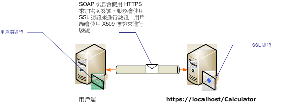

# <a name="transport-security-with-certificate-authentication"></a>憑證驗證的傳輸安全性
本主題討論使用傳輸安全性時，如何使用 X.509 憑證進行伺服器和用戶端驗證。 如需 X.509 憑證的詳細資訊，請參閱 [X.509 公用金鑰憑證](/windows/desktop/SecCertEnroll/about-x-509-public-key-certificates)。 憑證必須由憑證授權單位，通常是憑證的協力廠商簽發者發行。 在 Windows Server 網域中，可以使用 Active Directory 憑證服務對網域中的用戶端電腦發行憑證。 如需詳細資訊，請參閱[Windows 2008 R2 憑證服務](https://go.microsoft.com/fwlink/?LinkID=209949&clcid=0x409)。 在此案例中，服務是在使用安全通訊端層 (SSL) 設定的 Internet Information Services (IIS) 之下裝載。 此服務使用 SSL (X.509) 憑證設定，以允許使用者驗證伺服器的身分識別。 用戶端也使用 X.509 憑證設定，以允許服務驗證用戶端的身分識別。 伺服器的憑證必須受到用戶端的信任，而用戶端的憑證則必須受到伺服器的信任。 服務和用戶端如何驗證彼此的身分識別的實際機制，不在本主題的範圍之內。 如需詳細資訊，請參閱[維基百科上的數位簽章](https://go.microsoft.com/fwlink/?LinkId=253157)。  
  
 此案例會實作要求/回覆訊息模式，如下列圖表所示。  
  
   
  
 如需服務中使用憑證的詳細資訊，請參閱[Working with Certificates](../../../../docs/framework/wcf/feature-details/working-with-certificates.md)和[How to:使用 SSL 憑證設定連接埠](../../../../docs/framework/wcf/feature-details/how-to-configure-a-port-with-an-ssl-certificate.md)。 下表描述此案例的各種特性。  
  
|特性|描述|  
|--------------------|-----------------|  
|安全性模式|Transport|  
|互通性|使用現有 Web 服務用戶端和服務。|  
|驗證 (伺服器)<br /><br /> 驗證 (用戶端)|是 (使用 SSL 憑證)<br /><br /> 是 (使用 X.509 憑證)|  
|資料完整性|是|  
|資料機密性|是|  
|Transport|HTTPS|  
|繫結|<xref:System.ServiceModel.WSHttpBinding>|  
  
## <a name="configure-the-service"></a>設定服務  
 由於此案例中的服務是在 IIS 之下裝載，因此該服務使用 web.config 檔案設定。 以下的 web.config 示範如何設定 <xref:System.ServiceModel.WSHttpBinding> 使用傳輸安全性和 X.509 用戶端認證。  
  
```xml  
<configuration>  
  <system.serviceModel>  
    <protocolMapping>  
      <add scheme="https" binding="wsHttpBinding" />  
    </protocolMapping>  
    <bindings>  
      <wsHttpBinding>  
        <!-- configure wsHttp binding with Transport security mode and clientCredentialType as Certificate -->  
        <binding>  
          <security mode="Transport">  
            <transport clientCredentialType="Certificate"/>              
          </security>  
        </binding>  
      </wsHttpBinding>  
    </bindings>  
    <!--For debugging purposes set the includeExceptionDetailInFaults attribute to true-->  
    <behaviors>  
      <serviceBehaviors>  
        <behavior>            
           <serviceDebug includeExceptionDetailInFaults="True" />  
        </behavior>  
      </serviceBehaviors>  
    </behaviors>  
  </system.serviceModel>  
</configuration>  
```  
  
## <a name="configure-the-client"></a>設定用戶端  
 用戶端可以在程式碼或 app.config 檔案中設定。 下列範例示範如何在程式碼中設定用戶端。  
  
```vb  
// Create the binding.  
WSHttpBinding myBinding = new WSHttpBinding();  
myBinding.Security.Mode = SecurityMode.Transport;  
myBinding.Security.Transport.ClientCredentialType =  
   HttpClientCredentialType.Certificate;  
  
// Create the endpoint address. Note that the machine name   
// must match the subject or DNS field of the X.509 certificate  
// used to authenticate the service.   
EndpointAddress ea = new  
   EndpointAddress("https://localhost/CalculatorService/service.svc");  
  
// Create the client. The code for the calculator   
// client is not shown here. See the sample applications  
// for examples of the calculator code.  
CalculatorClient cc =  
   new CalculatorClient(myBinding, ea);  
  
// The client must specify a certificate trusted by the server.  
cc.ClientCredentials.ClientCertificate.SetCertificate(  
    StoreLocation.CurrentUser,  
    StoreName.My,  
    X509FindType.FindBySubjectName,  
    "contoso.com");  
  
// Begin using the client.  
Console.WriteLine(cc.Add(100, 1111));  
//...  
cc.Close();  
```  
  
 或者，您可以在 App.config 檔案中設定用戶端，如下列範例所示：  
  
```xml  
<configuration>  
  <system.serviceModel>  
    <client>  
      <!-- this endpoint has an https: address -->  
      <endpoint address=" https://localhost/CalculatorService/service.svc "   
                behaviorConfiguration="endpointCredentialBehavior"  
                binding="wsHttpBinding"   
                bindingConfiguration="Binding1"   
                contract="Microsoft.Samples.TransportSecurity.ICalculator"/>  
    </client>  
    <behaviors>  
      <endpointBehaviors>  
        <behavior name="endpointCredentialBehavior">  
          <clientCredentials>  
            <clientCertificate findValue="contoso.com"  
                               storeLocation="CurrentUser"  
                               storeName="My"  
                               x509FindType="FindBySubjectName" />  
          </clientCredentials>  
        </behavior>  
      </endpointBehaviors>  
    </behaviors>  
    <bindings>  
      <wsHttpBinding>  
        <!-- configure wsHttpbinding with Transport security mode  
                   and clientCredentialType as Certificate -->  
        <binding name="Binding1">  
          <security mode="Transport">  
            <transport clientCredentialType="Certificate"/>  
          </security>  
        </binding>  
      </wsHttpBinding>  
    </bindings>  
  </system.serviceModel>  
  
<startup><supportedRuntime version="v4.0" sku=".NETFramework,Version=v4.0"/></startup></configuration>  
```  
  
## <a name="see-also"></a>另請參閱  
 [安全性概觀](../../../../docs/framework/wcf/feature-details/security-overview.md)  
 [Windows Server App Fabric 的安全性模型](https://go.microsoft.com/fwlink/?LinkID=201279&clcid=0x409)
