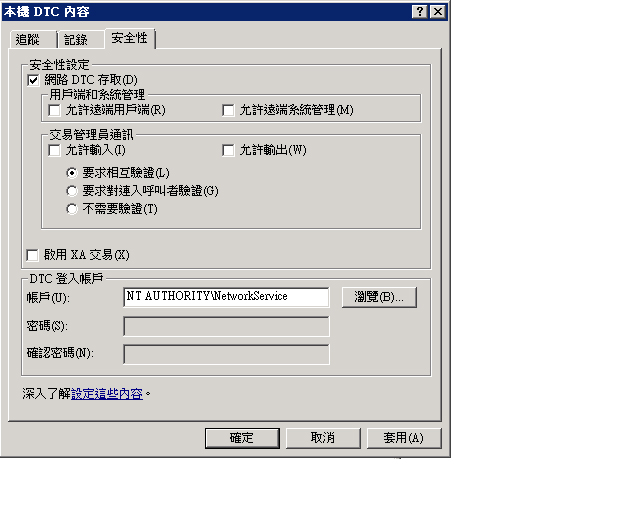

# <a name="troubleshooting-queued-messaging"></a>佇列訊息的疑難排解
本章節包含常見問題與疑難排解說明，以便使用 Windows Communication Foundation (WCF) 中的佇列。  
  
## <a name="common-questions"></a>常見問題  
 **問：** 我使用了 WCF Beta 1，我已安裝 MSMQ hotfix。 我是否需要移除這個 Hotfix？  
  
 **答：** 可以。 不再支援這個 Hotfix。 WCF 現在可以執行 MSMQ 而不需要 hotfix。  
  
 **問：** 有兩個 MSMQ 繫結：<xref:System.ServiceModel.NetMsmqBinding>和<xref:System.ServiceModel.MsmqIntegration.MsmqIntegrationBinding>。 我應該在什麼狀況下使用它們？  
  
 **答：** 使用<xref:System.ServiceModel.NetMsmqBinding>當您想要使用 MSMQ 做為傳輸，兩個 WCF 應用程式之間佇列通訊時。 使用<xref:System.ServiceModel.MsmqIntegration.MsmqIntegrationBinding>當您想要使用現有的 MSMQ 應用程式與新的 WCF 應用程式通訊。  
  
 **問：** 我需要升級 MSMQ 才能使用<xref:System.ServiceModel.NetMsmqBinding>和`MsmqIntegration`繫結嗎？  
  
 **答：** 否。 兩種繫結都可以配合 [!INCLUDE[wxp](../../../../includes/wxp-md.md)] 和 [!INCLUDE[ws2003](../../../../includes/ws2003-md.md)] 上的 MSMQ 3.0 使用。 這些繫結中的特定功能要等到您使用 [!INCLUDE[wv](../../../../includes/wv-md.md)] 升級至 MSMQ 4.0 時才可使用。  
  
 **問：** 功能<xref:System.ServiceModel.NetMsmqBinding>和<xref:System.ServiceModel.MsmqIntegration.MsmqIntegrationBinding>繫結是否可用在 MSMQ 4.0，但不是能在 MSMQ 3.0？  
  
 **答：** 在 MSMQ 4.0，但不是能在 MSMQ 3.0 中有下列功能：  
  
-   只有 MSMQ 4.0 支援自訂的寄不出的信件佇列。  
  
-   MSMQ 3.0 和 4.0 以不同的方式處理有害訊息。  
  
-   只有 MSMQ 4.0 支援遠端交易讀取。  
  
 如需詳細資訊，請參閱 < [Windows Vista、 Windows Server 2003 和 Windows XP 中的佇列功能差異](../../../../docs/framework/wcf/feature-details/diff-in-queue-in-vista-server-2003-windows-xp.md)。  
  
 **問：** 可以使用 MSMQ 3.0 上已排入佇列的通訊和 MSMQ 4.0 另一端的一方嗎？  
  
 **答：** 可以。  
  
 **問：** 我想要整合現有 MSMQ 應用程式與新的 WCF 用戶端或伺服器。 我是否需要為 MSMQ 基礎結構的兩端同時升級？  
  
 **答：** 否。 您不需要將任何一端升級至 MSMQ 4.0。  
  
## <a name="troubleshooting"></a>疑難排解  
 本章節包含最常見疑難排解問題的解答。 屬於已知限制的問題也會在版本資訊中加以說明。  
  
 **問：** 我嘗試使用私用佇列，而我得到下列例外狀況： `System.InvalidOperationException`:URL 無效。 佇列的 URL 不可包含 '$' 字元。 請使用 net.msmq://machine/private/queueName 中的語法，來定址私用佇列。  
  
 **答：** 請檢查您的組態和程式碼中的佇列統一資源識別元 (URI)。 請勿在 URI 中使用 "$" 字元。 例如，若要定址名為 OrdersQueue 的私用佇列，請將 URI 指定為 net.msmq://localhost/private/ordersQueue。  
  
 **問：** 呼叫`ServiceHost.Open()`佇列的應用程式會擲回下列例外狀況： `System.ArgumentException`:基底位址不可包含 URI 查詢字串。 為什麼？  
  
 **答：** 檢查佇列組態檔中，並在您的程式碼中的 URI。 雖然 MSMQ 佇列支援使用 '?' 字元，但 URI 會將這個字元解譯為字串查詢的開頭。 為了避免這個問題，請使用不含 '?' 字元的佇列名稱。  
  
 **問：** 我傳送成功，但是接收者上叫用任何服務作業。 為什麼？  
  
 **答：** 若要判斷答案，逐步完成下列檢查清單：  
  
-   檢查異動式佇列需求是否相容於指定的保證。 請注意下列準則：  
  
    -   您可以傳送永久性的訊息 （資料包和工作階段） 具有 「 正好一次 」 保證 (<xref:System.ServiceModel.MsmqBindingBase.ExactlyOnce%2A> = `true`) 才能異動式佇列。  
  
    -   您只能傳送具有「正好一次」保證的工作階段。  
  
    -   從異動式佇列接收工作階段中的訊息時需要進行異動。  
  
    -   您可以傳送或接收永久性或變動性訊息 （僅限資料包） 不具保證 (<xref:System.ServiceModel.MsmqBindingBase.ExactlyOnce%2A> = `false`) 只能以非異動式佇列。  
  
-   檢查寄不出的信件佇列。 如果您在其中找到訊息，請判斷它們為何沒有傳遞。  
  
-   檢查傳出佇列是否有連接或定址問題。  
  
 **問：** 我已指定自訂的寄不出信件佇列，但當我啟動寄件者應用程式時，我會找不到寄不出信件佇列，發生例外狀況，或傳送的應用程式有沒有寄不出信件佇列的權限。 為什麼會發生這種問題？  
  
 **答：** 自訂的寄不出信件佇列 URI 必須包含"localhost"或電腦名稱，在第一個區段中，例如，net.msmq: //localhost/private/myappdead-letter 佇列。  
  
 **問：** 是否一定要定義自訂的寄不出信件佇列，或是否有預設的寄不出信件佇列？  
  
 **答：** 如果保證是 「 只一次性 」 (<xref:System.ServiceModel.MsmqBindingBase.ExactlyOnce%2A> = `true`)，如果您未指定自訂的寄不出信件佇列，預設值為整個系統異動式寄不出信件佇列。  
  
 如果沒有保證 (<xref:System.ServiceModel.MsmqBindingBase.ExactlyOnce%2A> = `false`)，則預設值是沒有寄不出信件佇列功能。  
  
 **問：** 我的服務會擲回例外狀況，當時具有訊息 「 Listenerfactory 無法符合需求時 」。 為什麼？  
  
 答： 請檢查您的服務合約。 您可能忘記將"IsOneWay =`true`」 在所有服務作業。 佇列只會支援單向服務作業。  
  
 **問：** 在佇列中的訊息，但不會叫用服務作業。 問題出在哪裡？  
  
 **答：** 判斷您的服務主機會發生錯誤。 您可以查看追蹤，或是實作 `IErrorHandler` 以檢查這點。 根據預設，如果偵測到有害訊息，便會發生服務主機錯誤。  
  
 **問：** 在佇列中的訊息，但我 Web 裝載的佇列的服務卻沒有啟動。 為什麼？  
  
 **答：** 最常見的原因是權限。  
  
1.  請確定 `NetMsmqActivator` 處理序正在執行，而且 `NetMsmqActivator` 處理序的身分識別已授與在佇列上讀取和搜尋的權限。  
  
2.  如果 `NetMsmqActivator` 正在監視遠端電腦上的佇列，請確定 `NetMsmqActivator` 不是以受限制的權杖執行。 若要以不受限制的權杖執行 `NetMsmqActivator`：  
  
    ```  
    sc sidtype NetMsmqActivator unrestricted  
    ```  
  
 如非安全性相關的 Web 主機問題請參閱：[Web 裝載佇列應用程式](../../../../docs/framework/wcf/feature-details/web-hosting-a-queued-application.md)。  
  
 **問：** 什麼是最簡單的方式來存取工作階段？  
  
 **答：** 設定 AutoComplete =`true`對應至上次的作業上訊息工作階段中，並設定 AutoComplete =`false`在所有剩餘的服務作業。  
  
 **問：** 哪裡可以找到常見問題的解答 msmq？  
  
 **答：** 如需 MSMQ 的詳細資訊，請參閱[Microsoft Message Queuing](https://go.microsoft.com/fwlink/?LinkId=87810)。  
  
 **問：** 為什麼沒有我的服務會擲回`ProtocolException`從同時包含佇列讀取時已排入佇列工作階段訊息和佇列資料包訊息？  
  
 **答：** 方法已排入佇列的工作階段訊息中的基本差異，並已排入佇列的資料包訊息的組成。 因此，預期要讀取佇列工作階段訊息的服務無法接收佇列資料包訊息，而預期要讀取佇列資料包訊息的服務無法接收工作階段訊息。 嘗試從相同佇列同時讀取這兩種訊息類型時，便會擲回下列例外狀況：  
  
```  
System.ServiceModel.MsmqPoisonMessageException: The transport channel detected a poison message. This occurred because the message exceeded the maximum number of delivery attempts or because the channel detected a fundamental problem with the message. The inner exception may contain additional information.   
---> System.ServiceModel.ProtocolException: An incoming MSMQ message contained invalid or unexpected .NET Message Framing information in its body. The message cannot be received. Ensure that the sender is using a compatible service contract with a matching SessionMode.  
```  
  
 當應用程式從相同的電腦同時傳送佇列工作階段訊息和佇列資料包訊息時，系統的寄不出的信件佇列以及自訂的寄不出的信件佇列特別容易受到這個問題影響。 無法成功傳送的訊息會移到寄不出的信件佇列中。 在這些狀況下，寄不出的信件佇列中可能會同時有工作階段訊息和資料包訊息。 在執行階段從佇列讀取時，沒有任何方法可以分開這兩種訊息，因此，應用程式不應該從相同的電腦同時傳送佇列工作階段訊息和佇列資料包訊息。  
  
### <a name="msmq-integration-specific-troubleshooting"></a>MSMQ 整合：特定的疑難排解  
 **問：** 當我傳送訊息，或當我開啟服務主機時，我會收到錯誤，指出配置錯誤。 為什麼？  
  
 **答：** 當您使用 MSMQ 整合繫結時，您必須使用 msmq.formatname 配置。 例如，msmq.formatname:DIRECT=OS:.\private$\OrdersQueue。 不過當指定自訂的寄不出的信件佇列時，您必須使用 net.msmq 配置。  
  
 **問：** 當我使用公用或私用格式名稱，然後開啟服務主機上[!INCLUDE[wv](../../../../includes/wv-md.md)]，會發生錯誤。 為什麼？  
  
 **答：** WCF 整合通道上的[!INCLUDE[wv](../../../../includes/wv-md.md)]檢查以查看 是否可以處理有害訊息的主要應用程式佇列開啟子佇列。 子佇列的名稱衍生自傳遞至接聽項的 msmq.formatname URI。 但是 MSMQ 中的子佇列名稱只能是直接格式名稱。 所以您會看到錯誤。 請將佇列 URI 變更為直接格式名稱。  
  
 **問：** 當從 MSMQ 應用程式中接收訊息，訊息就會在佇列中，且不會讀取所接收的 WCF 應用程式。 為什麼？  
  
 **答：** 請檢查訊息是否有內文。 如果訊息沒有本文，MSMQ 整合通道便會忽略該訊息。 實作 `IErrorHandler`，即可獲得例外狀況的通知和檢查追蹤。  
  
### <a name="security-related-troubleshooting"></a>安全性相關疑難排解  
 **問：** 當我執行在工作群組模式中使用預設繫結的範例時，訊息似乎有傳送，但永遠不會被接收者接收。  
  
 **答：** 根據預設，訊息會使用需要 Active Directory 目錄服務的 MSMQ 內部憑證來簽署。 由於工作群組模式中並沒有提供 Active Directory，因此簽署訊息會失敗。 因此，訊息會落入寄不出信件佇列中，會指出失敗原因，例如 「 不正確簽章 」。  
  
 解決方法是關閉安全性。 這是藉由設定<xref:System.ServiceModel.NetMsmqSecurity.Mode%2A>  =  <xref:System.ServiceModel.NetMsmqSecurityMode.None> ，讓它在工作群組模式中運作。  
  
 另一個解決方法是從 <xref:System.ServiceModel.MsmqTransportSecurity> 屬性取得 <xref:System.ServiceModel.NetMsmqSecurity.Transport%2A>，並將其設定為 <xref:System.ServiceModel.MsmqAuthenticationMode.Certificate>，並設定用戶端憑證。  
  
 而另外一種解決方法是搭配 Active Directory 整合來安裝 MSMQ。  
  
 **問：** 當我使用預設繫結，會在傳送訊息時 （傳輸安全性已啟用） 在 Active Directory 到佇列中，我收到 「 找不到的內部憑證 」 訊息。 我要如何修正此問題？  
  
 **答：** 這表示，必須更新傳送者在 Active Directory 中的憑證。 若要這樣做，請開啟**控制台中**，**系統管理工具**，**電腦管理**，以滑鼠右鍵按一下**MSMQ**，然後選取**屬性**。 選取 [**使用者憑證**索引標籤，然後按一下**更新**] 按鈕。  
  
 **問：** 當我將傳送訊息，使用<xref:System.ServiceModel.MsmqAuthenticationMode.Certificate>並指定要使用的憑證，我收到 「 無效的憑證 」 訊息。 我要如何修正此問題？  
  
 **答：** 您無法在憑證模式下使用本機電腦憑證存放區。 您必須使用憑證嵌入式管理單元，將憑證從電腦憑證存放區複製到目前使用者存放區。 若要取得憑證嵌入式管理單元：  
  
1.  按一下 **開始**，選取**執行**，型別`mmc`，然後按一下**確定**。  
  
2.  在  **Microsoft Management Console**，開啟**檔案**功能表，然後選取**新增/移除嵌入式管理單元**。  
  
3.  在 **新增/移除嵌入式管理單元** 對話方塊中，按一下**新增** 按鈕。  
  
4.  在 **新增獨立嵌入式管理單元** 對話方塊中，選取憑證然後按一下 **新增**。  
  
5.  在 **憑證**嵌入式管理單元對話方塊方塊中，選取**我的使用者帳戶**，按一下 **完成**。  
  
6.  接下來，新增第二個憑證嵌入式管理單元使用先前步驟中，但這次請選取**電腦帳戶**然後按一下**下一步**。  
  
7.  選取 **本機電腦**然後按一下**完成**。 現在，您可以從電腦憑證存放區將憑證拖放到目前使用者存放區。  
  
 **問：** 當我的服務會從工作群組模式中的另一部電腦上的佇列讀取時，我會收到 「 拒絕存取 」 例外狀況。  
  
 **答：** 在工作群組模式中，遠端應用程式來存取佇列，應用程式必須擁有存取佇列的權限。 將 [匿名登入] 新增至佇列的存取控制清單 (ACL)，並提供讀取權限。  
  
 **問：** 時的網路服務用戶端 （或任何沒有網域帳戶的用戶端） 傳送佇列的訊息時，傳送失敗並不正確的憑證。 我要如何修正此問題？  
  
 **答：** 請檢查繫結組態。 預設繫結會開啟 MSMQ 傳輸安全性以簽署訊息。 請關閉此選項。  
  
### <a name="remote-transacted-receives"></a>遠端交易接收  
 **問：** 上有佇列機器，並從 （遠端交易接收案例） 的機器 B 上的佇列讀取訊息的 WCF 服務，訊息會從佇列讀取。 追蹤資訊指出接收失敗訊息 「 無法匯入交易。 」 可以做什麼來修正此問題？  
  
 **答：** 這個問題可能有三個原因：  
  
-   如果您是在網域模式中，遠端交易接收便需要 Microsoft Distributed Transaction Coordinator (MSDTC) 網路存取。 您可以使用來啟用這**新增/移除元件**。  
  
       
  
-   檢查與交易管理員進行通訊的驗證模式。 如果您是在工作群組模式中，則必須選取 不需要驗證 」。 如果您是在網域模式中，則必須選取 「 需要相互驗證 」。  
  
       
  
-   請確定在清單中的例外狀況中的 MSDTC**網際網路連線防火牆**設定。  
  
-   確定您是使用 [!INCLUDE[wv](../../../../includes/wv-md.md)]。 [!INCLUDE[wv](../../../../includes/wv-md.md)] 上的 MSMQ 支援遠端交易讀取。 在舊版 Window 中的 MSMQ 並不支援遠端交易讀取。  
  
 **問：** 網路服務從佇列讀取的服務時，比方說，在 Web 主機，為什麼收到拒絕存取時的例外狀況時引發從佇列讀取嗎？  
  
 **答：** 網路服務讀取權限必須加入至佇列 ACL，以確保網路服務可以讀取佇列中。  
  
 **問：** 可以使用 MSMQ 啟動服務來啟動遠端電腦上的佇列中的訊息為基礎的應用程式嗎？  
  
 **答：** 可以。 若要這樣做，您必須將 MSMQ 啟動服務設定成當做網路服務執行，並新增在遠端電腦上佇列的網路服務存取。  
  
## <a name="using-custom-msmq-bindings-with-receivecontext-enabled"></a>使用自訂 MSMQ 繫結並啟用 ReceiveContext  
 使用自訂 MSMQ 繫結並啟用 <xref:System.ServiceModel.Channels.ReceiveContext> 時，傳入訊息的處理就會使用執行緒集區執行緒，因為原生 MSMQ 不支援非同步 <xref:System.ServiceModel.Channels.ReceiveContext> 接收的 I/O 完成。 這是因為處理這類訊息會使用 <xref:System.ServiceModel.Channels.ReceiveContext> 的內部交易，而且 MSMQ 不支援非同步處理。 若要解決這個問題，您可以將 <xref:System.ServiceModel.Description.SynchronousReceiveBehavior> 加入至端點，以便強制執行同步處理，或將 <xref:System.ServiceModel.Description.DispatcherSynchronizationBehavior.MaxPendingReceives%2A> 設定為 1。
