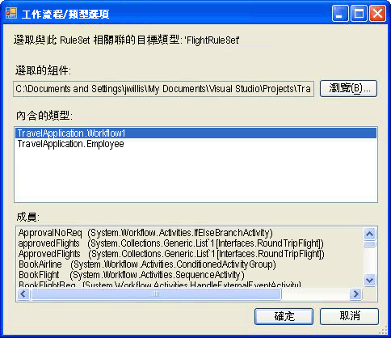

# <a name="external-ruleset-toolkit"></a>外部 Ruleset 工具組

通常在工作流程應用程式內使用規則時，這些規則算是組件的一部分。 在某些案例中，您可能會想要將 RuleSet 與組件分開維護，讓它們不需要重新建置及部署工作流程組件便可加以更新。 這個範例可讓您用資料庫來管理及編輯 RuleSet，並可從執行階段的工作流程中存取這些 RuleSet。 這樣可讓執行中的工作流程執行個體自動納入 RuleSet 變更。

外部 RuleSet 工具組範例包含 Windows Forms 工具，可用於在資料庫中管理及編輯 RuleSet 版本。 它也包含執行這些規則的活動和主機服務。

> [!NOTE]
> 這個範例需要[Microsoft SQL Server](/sql)。

Visual Studio 提供規則集編輯器做為 Windows Workflow Foundation （WF）的一部分。 您可以在工作流程中按兩下 `Policy` 活動來啟動這個編輯器；它會將已定義的 RuleSet 物件序列化到與此工作流程有關聯的 .rules 檔案 (`Policy` 活動會針對該工作流程執行 RuleSet 執行個體)。 當您建置工作流程專案時，.rules 檔案會編譯成組件來做為資源。

這個範例的元件包括：

- RuleSet 圖形使用者介面工具，它可用於編輯及管理資料庫中 RuleSet 版本。

- 設定在主應用程式上的 RuleSet 服務，它可以從資料庫存取 RuleSet。

- `ExternalPolicy` 活動，它會向 RuleSet 服務要求 RuleSet，並針對工作流程執行 RuleSet。

下圖顯示元件的互動。 後面各節將說明各個元件。


> [!IMPORTANT]
> 這些範例可能已安裝在您的電腦上。 請先檢查下列 (預設) 目錄，然後再繼續。
>
> `<InstallDrive>:\WF_WCF_Samples`
>
> 如果此目錄不存在，請移至[.NET Framework 4 的 Windows Communication Foundation （wcf）和 Windows Workflow Foundation （WF）範例](https://www.microsoft.com/download/details.aspx?id=21459)，以下載所有 WINDOWS COMMUNICATION FOUNDATION （wcf）和 [!INCLUDE[wf1](../../../../includes/wf1-md.md)] 範例。 此範例位於下列目錄。
>
> `<InstallDrive>:\WF_WCF_Samples\WF\Scenario\ExternalRuleSetToolKit`

## <a name="ruleset-tool"></a>RuleSet 工具

下圖是規則集工具的螢幕擷取畫面。 從 [**規則存放區**] 功能表，您可以從資料庫載入可用的規則集，並將修改過的規則集儲存回存放區。 應用程式組態檔會提供 RuleSet 資料庫的資料庫連線字串。 當您啟動此工具時，它會從設定的資料庫自動載入 RuleSet。


RuleSet 工具會將主要和次要版本號碼套用至 RuleSet，讓您可以同時維護及儲存多個版本 (除了版本控制功能，此工具不提供鎖定或其他組態管理功能)。 使用這個工具，您便可以建立新的 RuleSet 版本或刪除現有的版本。 當您按一下 [**新增**] 時，此工具會建立新的規則集名稱，並套用1.0 版。 當您複製某個版本時，此工具會建立所選取 RuleSet 版本的複本 (包括其內含的規則)，並指派全新的唯一版本號碼。 這些版本號碼是以現有 RuleSet 的版本號碼為基礎。 您可以使用表單中相關欄位來變更該 RuleSet 的名稱和版本號碼。

當您按一下 [**編輯規則**] 時，規則集編輯器會啟動，如下圖所示：


這是 [編輯器] 對話方塊的重新裝載，這是 Windows Workflow Foundation Visual Studio 增益集的一部分。 它會提供相同的功能，包括 Intellisense 支援。 這些規則是針對與工具中規則集相關聯的目標型別（例如工作流程）所撰寫。當您按一下主要工具對話方塊中的 **[流覽**] 時，[**工作流程/類型選取器**] 對話方塊隨即出現，如 [圖 4] 所示。



圖 4：工作流程/類型選取器

您可以使用 [**工作流程/類型選取器**] 對話方塊，指定元件和該元件內的特定類型。 這個類型就是所撰寫 (及執行) 之規則的目標類型。 在多數情況下，此目標類型是工作流程或某些其他活動類型。 然而，您可以對任何 .NET 型別執行 RuleSet。

元件檔的路徑和類型 `name are stored with the` 資料庫中的規則集，以便在從資料庫中抓取規則集時，工具會嘗試自動載入目標型別。

當您在 [**工作流程/類型選取器**] 對話方塊中按一下 **[確定**] 時，它會根據規則集驗證選取的類型，以確保目標型別具有規則所參考的所有成員。 錯誤會顯示在 [**驗證錯誤**] 對話方塊中。 即使發生錯誤，您還是可以選擇繼續變更，或按一下 [**取消**]。 從主要工具對話方塊的 [**工具**] 功能表中，您可以按一下 [**驗證**]，依據目標活動重新驗證規則集版本。

![顯示 [驗證錯誤] 對話方塊的螢幕擷取畫面。](./media/external-ruleset-toolkit/validation-errors-dialog.png)

從工具的 [**資料**] 功能表中，您可以匯入和匯出規則集。 當您按一下 [匯**入**] 時，檔案選擇器對話方塊會隨即出現，您可以在其中選取一個 [規則] 檔案。 這不一定是一開始在 Visual Studio 中建立的檔案。 此 .rules 檔案應該會包含已序列化的 `RuleDefinitions` 執行個體，該執行個體會包含條件的集合和 RuleSet 的集合。 此工具不會使用條件集合，但是它會使用 `RuleDefinitions` 的規則格式來允許與 Visual Studio 環境的互動。

選取 rules 檔案之後，**規則集選取器**對話方塊隨即出現。 您可以使用此對話方塊，選擇要匯入之檔案中的 RuleSet (預設值是指定所有 RuleSet)。 在此 .rules 檔案中的 RuleSet 並沒有版本號碼，因為它們在 WF 專案中的版本控制和組件中的版本是相同的。 在匯入過程中，此工具會自動指派下一個可用的主要版本號碼（您可以在匯入之後變更）;您可以在**規則集選取器**清單中看到指派的版本號碼。

此工具會針對其匯入的各個 RuleSet，根據 RuleSet 中所使用的成員，嘗試從 .rules 檔案 (如果存在) 位置下的 bin\Debug 資料夾找出相關聯的類型。 如果此工具找到多個相符的類型，它就會嘗試根據 .rules 檔案名稱和類型名稱之間的配對來選擇類型 (例如，`Workflow1` 類型會對應至 Workflow1.rules)。 如果存在多個相符類型，便會提示您要選取類型。 如果此自動識別機制找不到相符的元件或類型，則在匯入之後，您可以按一下主要工具對話方塊上的 **[流覽]** ，流覽至相關聯的類型。 下圖顯示規則集選取器：


當您從主要工具功能表中按一下 [**資料匯出**] 時，[**規則集選取器**] 對話方塊會再次出現，您可以從中判斷應該匯出之資料庫的規則集。 當您按一下 **[確定]** 時，就會出現 [**儲存**盤案] 對話方塊，您可以在其中指定所產生之規則檔案的名稱和位置。 由於 .rules 檔案不包含版本資訊，因此您只能選取一個具有指定 RuleSet 名稱的 RuleSet 版本。

## <a name="policyfromservice-activity"></a>PolicyFromService 活動

`PolicyFromService` 活動的程式碼是很直接的工作。 它的運作方式十分類似 WF 所提供的 `Policy` 活動，但是它不是從 .rules 檔案擷取目標 RuleSet，而是呼叫主機服務以取得 RuleSet 執行個體。 然後它會對根工作流程活動執行個體執行 RuleSet。

如果要在工作流程中使用活動，請從您的工作流程專案新增 `PolicyActivities` 和 `RuleSetService` 組件的參考。 如需如何將活動新增至工具箱的討論，請參閱本主題結尾的程序。

在將活動放入工作流程之後，您必須提供要執行的 RuleSet 的名稱。 您可以輸入名稱做為常值，或繫結至另一個活動的工作流程變數或屬性。 或者，您可以輸入應該要執行之特定 RuleSet 的版本號碼。 如果您保留主要和次要版本號碼的預設值為 0 ，該活動就會自動使用資料庫提供的最新版本號碼。

## <a name="ruleset-service"></a>RuleSet 服務

此服務會負責從資料庫擷取指定的 RuleSet 版本，並將它傳回給呼叫活動。 如先前所討論，如果傳遞到 `GetRuleSet` 呼叫中的主要和次要版本值都是 0，此服務便會擷取最新的版本。 此時並不會快取任何 RuleSet 定義或執行個體；同樣地，這時沒有可將 RuleSet 版本標記為「已部署」以便區別進行中之 RuleSet 的功能。

由服務存取的資料庫，應該要經由應用程式組態檔設定於主機上。

#### <a name="to-run-the-tool"></a>執行工具

1. 負責設定由工具和服務使用之 RuleSet 資料表的資料夾中包含 Setup.sql 檔案。 您可以執行 Setup.cmd 批次檔，以便在 SQL Express 上建立 Rules 資料庫，以及設定 RuleSet 資料表。

2. 如果您編輯批次檔或 Setup.sql，並指定不要使用 SQL Express 或是不要將資料表放入名稱有別於 `Rules` 的資料庫中，則在 RuleSet 工具和 `UsageSample` 專案中的應用程式組態檔應該要編輯成相同資訊。

3. 在執行 Setup.sql 指令碼之後，您就可以建置 `ExternalRuleSetToolkit` 方案，然後從 ExternalRuleSetTool 專案啟動 RuleSet 工具。

4. `RuleSetToolkitUsageSample` 循序工作流程主控台應用程式方案包括工作流程範例。 此工作流程是由一個 `PolicyFromService` 活動和兩個變數、`orderValue` 和 `discount` 所組成的，而且它是目標 RuleSet 執行的依據。

5. 如果要使用範例，請建置 `RuleSetToolkitUsageSample` 方案。 然後從規則集工具主功能表，按一下 [**資料匯入**]，並指向 rulesettoolkitusagesample discountruleset.rules 檔案資料夾中的 DiscountRuleSet 檔案。 按一下 [**規則存放區-儲存**] 功能表選項，將匯入的規則集儲存至資料庫。

6. 由於 `PolicyActivities` 組件是從範例工作流程專案參考的，因此 `PolicyFromService` 活動會出現在工作流程中。 然而，根據預設，它不會出現在工具箱中。 若要將它新增至工具箱，請執行下列操作：

    - 以滑鼠右鍵按一下 [工具箱]，然後選取 **[選擇專案**] （這可能需要一些時間）。

    - 出現 [**選擇工具箱專案**] 對話方塊時，按一下 [**活動**] 索引標籤。

    - 流覽至 `ExternalRuleSetToolkit` 方案中的 `PolicyActivities` 元件，然後按一下 [**開啟**]。

    - 確定已在 [**選擇工具箱專案**] 對話方塊中選取 [`PolicyFromService`] 活動，然後按一下 **[確定]** 。

    - 活動現在應該會出現在 [ **Rulesettoolkitusagesample discountruleset.rules 檔案元件**] 分類的 [工具箱] 中。

7. RuleSet 服務已經由 Program.cs 中的下列陳述式，設定於主控台應用程式主機上。

    ```csharp
    workflowRuntime.AddService(new RuleSetService());
    ```

8. 您也可以使用組態檔在主機上設定服務，如需詳細資訊，請參閱 SDK 文件。

9. 應用程式組態檔會新增至工作流程專案，以指定要由服務使用的資料庫的連線字串。 這個連線字串應該就是 RuleSet 工具所使用的連線字串，它會指向包含該 RuleSet 資料表的資料庫。

10. 現在，您可以用處理其他任何工作流程主控台應用程式的方式來執行 `RuleSetToolkitUsageSample` 專案。 在 Visual Studio 內按 F5 或 Ctrl + F5，或直接執行 Rulesettoolkitusagesample discountruleset.rules 檔案檔案。

    > [!NOTE]
    > 您必須先關閉 RuleSet 工具才可重新編譯此使用範例，因為工具會載入此使用範例組件。
