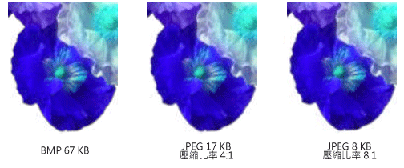

# 點陣圖類型
點陣圖是位的陣列, 可指定圖元矩形陣列中每個圖元的色彩。 專門用於個別圖元的位數會決定可以指派給該圖元的色彩數目。 例如, 如果每個圖元都是以4個位表示, 則可以為指定的圖元指派16種不同的色彩之一 (2 ^ 4 = 16)。 下表顯示數個範例, 其中有幾個可指派給指定位數所代表之圖元的色彩數目。  
  
|每圖元的位數|可以指派給圖元的色彩數目|  
|--------------------|------------------------------------------------------|  
|1|2^1 = 2|  
|2|2^2 = 4|  
|4|2^4 = 16|  
|8|2^8 = 256|  
|16|2^16 = 65,536|  
|24|2^24 = 16,777,216|  
  
 儲存點陣圖的磁片檔案通常包含一或多個資訊區塊, 其中儲存資訊, 例如每圖元的位數、每個資料列中的圖元數目, 以及陣列中的資料列數目。 這類檔案也可能包含色彩表 (有時也稱為色調色板)。 色彩表會將點陣圖中的數位對應至特定色彩。 下圖顯示放大的影像及其點陣圖和色彩表。 每個圖元都是以4位數位表示, 因此色彩表中有 2 ^ 4 = 16 個色彩。 資料表中的每個色彩都是以24位數位來表示:8位代表紅色、8位代表綠色, 而8位代表藍色。 數位會以十六進位 (基底 16) 形式顯示:A = 10、B = 11、C = 12、D = 13、E = 14、F = 15。  
  
   
  
 查看影像中第3列第5欄的圖元。 點陣圖中對應的數位為1。 色彩表告訴我們, 1 代表紅色, 因此圖元為紅色。 點陣圖頂端資料列中的所有專案都是3。 色彩表告訴我們, 3 表示藍色, 因此影像頂端資料列中的所有圖元都是藍色。  
  
> [!NOTE]
> 某些點陣圖會以底端的格式儲存;點陣圖第一個資料列中的數位會對應至影像底部列的圖元。  
  
 將索引儲存在色彩表中的點陣圖稱為「調色板索引」點陣圖。 有些點陣圖不需要色彩表。 例如, 如果點陣圖使用每圖元24個位, 則該點陣圖可以將色彩本身 (而不是索引) 儲存成色彩表。 下圖顯示直接儲存色彩的點陣圖 (每圖元24位), 而不是使用色彩表。 此圖也會顯示對應影像的放大視圖。 在點陣圖中, FFFFFF 代表白色, FF0000 代表紅色, 00FF00 代表綠色, 而0000FF 代表藍色。  
  
   
  
## 圖形檔案格式  
 在磁片檔案中儲存點陣圖有許多標準格式。 GDI + 支援下列段落中所述的圖形檔案格式。  
  
### BMP  
 BMP 是 Windows 用來儲存與裝置無關和應用程式無關之映射的標準格式。 指定之 BMP 檔案的每一像素位元數 (1、4、8、15、24、32或 64) 是在檔案標頭中指定。 具有每個圖元24位的 BMP 檔案是常見的。 BMP 檔案通常不會壓縮, 因此不適合在網際網路上傳輸。  
  
### 圖形交換格式 (GIF)  
 GIF 是出現在網頁上之影像的通用格式。 Gif 適用于線條繪圖、具有純色區塊的圖片, 以及色彩之間具有明顯界限的圖片。 Gif 已壓縮, 但壓縮程式中不會遺失任何資訊;解壓縮的映射與原始的影像完全相同。 GIF 中的一個色彩可以指定為「透明」, 如此一來, 影像就會具有顯示它之任何網頁的背景色彩。 一系列的 GIF 影像可以儲存在單一檔案中, 以形成動畫 GIF。 Gif 最多每圖元儲存8個位, 因此僅限256色彩。  
  
### 聯合攝影專家群組 (JPEG)  
 JPEG 是一種壓縮配置, 適用于自然場景, 例如掃描的相片。 某些資訊會在壓縮程式中遺失, 但通常會 imperceptible 到人眼。 Jpeg 會每圖元儲存24位, 因此能夠顯示16000000以上的色彩。 Jpeg 不支援透明度或動畫。  
  
 JPEG 影像中的壓縮層級是可設定的, 但較高的壓縮等級 (較小的檔案) 會導致更多的資訊遺失。 20:1 壓縮比率通常會產生人類眼發現很難區別原始的影像。 下圖顯示從該 BMP 影像壓縮的 BMP 影像和兩個 JPEG 影像。 第一個 JPEG 的壓縮比率為 4:1, 而第二個 JPEG 的壓縮比例為約8:1。  
  
   
  
 JPEG 壓縮不適用於線條繪圖、單色區塊和銳利界限。 下圖顯示一個 BMP 以及兩個 Jpeg 和一個 GIF。 Jpeg 和 GIF 是從 BMP 壓縮而來。 GIF 的壓縮比率為 4:1, 針對較小的 JPEG 則為 4:1, 而較大的 JPEG 則為8:3。 請注意, GIF 會維持線條的清晰界限, 但 Jpeg 通常會模糊邊界。  
  
   
  
 JPEG 是壓縮配置, 而不是檔案格式。 JPEG 檔案交換格式 (JFIF) 是一種檔案格式, 通常用來儲存和傳送已根據 JPEG 配置壓縮的影像。 網頁瀏覽器所顯示的 JFIF 檔案會使用 .jpg 副檔名。  
  
### 交換影像檔案 (EXIF)  
 EXIF 是一種檔案格式, 用於數位相機所拍攝的相片。 一個 EXIF 檔案包含根據 JPEG 規格壓縮的影像。 EXIF 檔案也包含相片的相關資訊 (拍攝的日期、快門速度、曝光時間等等), 以及相機的相關資訊 (製造商、型號等等)。  
  
### Portable Network Graphics (PNG)  
 PNG 格式會保留 GIF 格式的許多優點, 但也提供 GIF 以外的功能。 就像 GIF 檔案一樣, PNG 檔案會進行壓縮, 而不會遺失資訊。 PNG 檔案可以使用每圖元8、24或48個位儲存色彩, 並以1、2、4、8或16位每圖元的灰階。 相反地, GIF 檔案每圖元只能使用1、2、4或8位。 PNG 檔案也可以儲存每個圖元的 Alpha 值, 這會指定該圖元的色彩與背景色彩混合的程度。  
  
 PNG 改善了 GIF 的功能, 可讓您以漸進方式顯示影像 (也就是在影像抵達網路連線時, 顯示效果更好且更近似)。 PNG 檔案可以包含 gamma 更正和顏色更正資訊, 以便能夠在各種顯示裝置上精確轉譯影像。  
  
### 標記影像檔案格式 (TIFF)  
 TIFF 是各種平臺和影像處理應用程式所支援的彈性且可擴充的格式。 TIFF 檔案可以使用任意數目的每一像素位元數來儲存影像, 而且可以採用各種壓縮演算法。 有數個影像可以儲存在單一的多頁 TIFF 檔案中。 與影像相關的資訊 (掃描器製作、主機電腦、壓縮類型、方向、每圖元樣本等等) 都可以儲存在檔案中, 並透過使用標記來安排。 您可以視需要擴充 TIFF 格式, 並加入新的標記。  
  
## 另請參閱

- <xref:System.Drawing.Image?displayProperty=nameWithType>
- <xref:System.Drawing.Bitmap?displayProperty=nameWithType>
- <xref:System.Drawing.Imaging.PixelFormat?displayProperty=nameWithType>
- [影像、點陣圖和中繼檔](images-bitmaps-and-metafiles.md)
- [使用影像、點陣圖、圖示和中繼檔](working-with-images-bitmaps-icons-and-metafiles.md)
