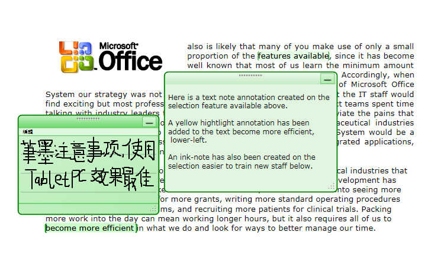
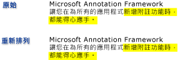

# 附註概觀
在書面文件上撰寫附註或註解是相當稀鬆平常的事，我們幾乎將它視為理所當然。 這些附註或註解是我們新增至文件的「註釋」，用以標記資訊，或反白顯示感興趣的項目以供日後參考。 雖然在書面文件上撰寫附註很容易且平常，不過在電子文件中新增個人註解的功能通常非常有限，如果有的話。  
  
 本主題回顧了幾種常見類型的注釋，特別是便箋和亮點，並說明了 Microsoft 注釋框架如何通過 Windows 演示基礎 （WPF） 在應用程式中促進這些類型的注釋） 文檔查看控制項。  WPF 文檔查看控制項<xref:System.Windows.Controls.FlowDocumentReader>支援注釋包括 和<xref:System.Windows.Controls.FlowDocumentScrollViewer>，以及派生自<xref:System.Windows.Controls.Primitives.DocumentViewerBase>等<xref:System.Windows.Controls.DocumentViewer><xref:System.Windows.Controls.FlowDocumentPageViewer>的控制項。  

## 自黏便箋  
 典型的自黏便箋包含寫在一小張色紙上，然後「黏」在文件上的資訊。 數位便箋為電子文檔提供了類似的功能，但增加了包含許多其他類型的內容的靈活性，如鍵入的文字、手寫筆記（例如 Tablet PC"墨蹟"筆劃）或 Web 連結。  
  
 下圖顯示一些反白顯示、文字自黏便箋和筆跡自黏便箋註釋的範例。  
  
   
  
 下列範例顯示您可用來在應用程式中啟用註釋支援的方法。  
  
 [!code-csharp[DocViewerAnnotationsXml#DocViewXmlStartAnnotations](~/samples/snippets/csharp/VS_Snippets_Wpf/DocViewerAnnotationsXml/CSharp/Window1.xaml.cs#docviewxmlstartannotations)]
 [!code-vb[DocViewerAnnotationsXml#DocViewXmlStartAnnotations](~/samples/snippets/visualbasic/VS_Snippets_Wpf/DocViewerAnnotationsXml/visualbasic/window1.xaml.vb#docviewxmlstartannotations)]  
  

## 重點摘要  
 人們使用有創意的方法，在標記書面文件時將注意力吸引到感興趣的項目，例如使用底線、反白顯示、圈起句子中的文字，或是在邊界繪製記號或標記法。  Microsoft 注釋框架中的突出顯示注釋提供了用於標記 WPF 文檔查看控制項中顯示的資訊的類似功能。  
  
 下圖顯示反白顯示註釋的範例。  
  
   
  
 使用者通常先選擇某些文本或感興趣的項，然後按右鍵以顯示注釋<xref:System.Windows.Controls.ContextMenu>選項來創建批註。  下面的示例顯示了[!INCLUDE[TLA#tla_xaml](../../../../includes/tlasharptla-xaml-md.md)]可用於聲明<xref:System.Windows.Controls.ContextMenu>具有路由命令的，使用者可以訪問這些命令以創建和管理批註。  
  
 [!code-xaml[DocViewerAnnotationsXps#CreateDeleteAnnotations](~/samples/snippets/csharp/VS_Snippets_Wpf/DocViewerAnnotationsXps/CSharp/Window1.xaml#createdeleteannotations)]  
  

## 資料錨定  
 注釋框架將注釋綁定到使用者選擇的資料，而不僅僅是將注釋綁定到顯示視圖中的位置。 因此，如果文件檢視變更，例如當使用者捲動或調整顯示視窗大小時，註釋會與它繫結的資料選取範圍在一起。 例如，下圖說明使用者對文字選取範圍所做的註釋。 當文件檢視變更時 (捲動、調整大小、縮放比例或其他移動)，反白顯示註釋會隨著原始資料選取範圍移動。  
  
   
  

## 比對註釋與標註物件  
 您可以比對註釋與對應的標註物件。 例如，請考慮具有註解窗格的簡單文件讀取應用程式。 註解窗格可能是清單方塊，其中顯示來自錨定到文件之註釋清單的文字。 如果使用者在清單方塊中選取項目，則應用程式會將對應註釋物件所錨定之文件中的段落帶入檢視。  
  
 下列範例示範如何為這類作為註解窗格的清單方塊實作事件處理常式。  
  
 [!code-csharp[FlowDocumentAnnotatedViewer#Handler](~/samples/snippets/csharp/VS_Snippets_Wpf/FlowDocumentAnnotatedViewer/CSharp/Window1.xaml.cs#handler)]
 [!code-vb[FlowDocumentAnnotatedViewer#Handler](~/samples/snippets/visualbasic/VS_Snippets_Wpf/FlowDocumentAnnotatedViewer/visualbasic/window1.xaml.vb#handler)]  
  
 另一個示例方案涉及應用程式，這些應用程式允許通過電子郵件在文檔閱讀器之間交換注釋和便箋。 這項功能讓這些應用程式可讓讀者巡覽至包含要交換之註釋的頁面。  
  
## 另請參閱

- <xref:System.Windows.Controls.Primitives.DocumentViewerBase>
- <xref:System.Windows.Controls.DocumentViewer>
- <xref:System.Windows.Controls.FlowDocumentPageViewer>
- <xref:System.Windows.Controls.FlowDocumentScrollViewer>
- <xref:System.Windows.Controls.FlowDocumentReader>
- <xref:System.Windows.Annotations.IAnchorInfo>
- [註釋結構描述](annotations-schema.md)
- [ContextMenu 概觀](../controls/contextmenu-overview.md)
- [命令概觀](commanding-overview.md)
- [非固定格式文件概觀](flow-document-overview.md)
- [如何：將命令新增至 MenuItem](https://docs.microsoft.com/previous-versions/dotnet/netframework-3.5/ms741839(v=vs.90))
