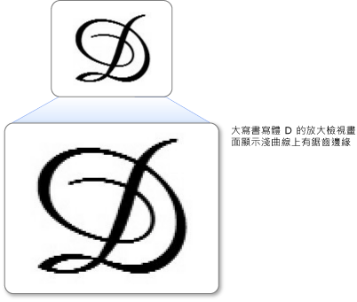
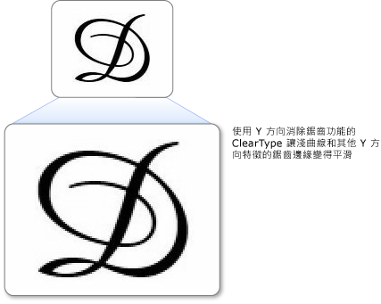

# ClearType 概觀
本主題概述了 中的 Microsoft ClearType 技術[!INCLUDE[TLA#tla_winclient](../../../../includes/tlasharptla-winclient-md.md)]。  

## 技術概觀  
 ClearType 是 Microsoft 開發的一種軟體技術，可提高現有 LCD（液晶顯示器）文本的可讀性，例如筆記本電腦螢幕、袖珍 PC 螢幕和平板顯示器。  ClearType 的工作原理是訪問 LCD 螢幕每個圖元中的單個垂直顏色條紋元素。 在 ClearType 之前，電腦可以顯示的最小詳細級別是單個圖元，但隨著 ClearType 在 LCD 監視器上運行，我們現在可以顯示文本的寬度小到一小部分的文本特徵。 額外的解析度可提高文字顯示細節的解析度，即使經過長時間也很容易閱讀。  
  
 中[!INCLUDE[TLA#tla_winclient](../../../../includes/tlasharptla-winclient-md.md)]提供的 ClearType 是最新一代的 ClearType，與 Microsoft Windows 圖形裝置介面 （GDI） 中的版本有若干改進。  
  

## 子像素定位  
 與早期版本的 ClearType 相比，一個顯著改進是使用子圖元定位。 與 GDI 中的 ClearType 實現不同，中找到的[!INCLUDE[TLA#tla_winclient](../../../../includes/tlasharptla-winclient-md.md)]ClearType 允許字形在圖元內開始，而不僅僅是圖元的起始邊界。 因為定位字符有此額外的解析度，所以字符的間距和比例更精確且一致。  
  
 下列兩例示範使用子像素定位時，字符如何能在任何子像素界限上開始。 左側的示例使用早期版本的 ClearType 渲染器呈現，該版本不使用子圖元定位。 右側的示例使用新版本的 ClearType 渲染器使用子圖元定位進行呈現。 請注意右側映像中每個 **e** 和 **l** 的轉譯方式都略有不同，因為它們每一個都在不同的子像素上開始。 在螢幕上檢視正常大小的文字時，因為字符映像的高對比，所以這項差異不是很明顯。 這只有在 ClearType 中包含複雜的顏色濾波時才可能實現。  
  
   
以新舊版 ClearType 顯示的文字  
  
 以下兩個示例將早期 ClearType 渲染器的輸出與新版本的 ClearType 渲染器的輸出進行比較。 顯示在右側的子像素定位，可大幅提升畫面中的類型間距，尤其是子像素和完整像素在字符寬度有明顯比例差異的小尺寸狀況。 請注意，第二個映像中的字母間距更勻稱。 子圖元定位對文本螢幕整體外觀的累積效益大大提高，代表了ClearType技術的一個重大進步。  
  
   
以新舊版 ClearType 顯示的文字  
  

## Y 方向消除鋸齒  
 ClearType 的另[!INCLUDE[TLA#tla_winclient](../../../../includes/tlasharptla-winclient-md.md)]一個改進是 y 方向反鋸齒。 沒有 y 方向抗鋸齒的 GDI 中的 ClearType 可在 X 軸上提供更好的解析度，但不包括 y 軸。 微曲部分頂端和底端的鋸齒狀邊緣會降低其可讀性。  
  
 下例顯示不使用 Y 方向消除鋸齒的效果。 在此情況下，字母上方與下方的鋸齒狀邊緣很明顯。  
  
   
微曲部分產生鋸齒狀邊緣的文字  
  
 ClearType[!INCLUDE[TLA#tla_winclient](../../../../includes/tlasharptla-winclient-md.md)]在 y 方向級別提供抗鋸齒，以平滑任何鋸齒邊緣。 這對改善東亞語言的可讀性特別重要，因為表意字元的水平和垂直微曲部分比重幾乎相同。  
  
 下例顯示使用 Y 方向消除鋸齒的效果。 在此情況下，字母的上方與下方會顯示平滑的曲線。  
  
   
以 ClearType Y 方向消除鋸齒功能顯示的文字  
  

## 硬體加速  
 ClearType[!INCLUDE[TLA#tla_winclient](../../../../includes/tlasharptla-winclient-md.md)]可以利用硬體加速來提高性能，並降低 CPU 負載和系統記憶體要求。 通過使用圖形卡的圖元底片和視頻記憶體，ClearType 提供了更快的文本渲染速度，尤其是在使用動畫時。  
  
 清除類型[!INCLUDE[TLA#tla_winclient](../../../../includes/tlasharptla-winclient-md.md)]不會修改系統範圍的清除類型設置。 在 Windows 中禁用[!INCLUDE[TLA#tla_winclient](../../../../includes/tlasharptla-winclient-md.md)]ClearType 會將反鋸齒模式設置為灰度模式。 此外，ClearType 不會[!INCLUDE[TLA#tla_winclient](../../../../includes/tlasharptla-winclient-md.md)]修改[ClearType 調諧器 PowerToy 的](https://www.microsoft.com/typography/ClearTypePowerToy.mspx)設置。  
  
 [!INCLUDE[TLA#tla_winclient](../../../../includes/tlasharptla-winclient-md.md)] 架構設計決策之一，就是解析度獨立的版面配置能更有效地支援日益普及的高解析度 DPI 監視器。 這樣做的後果是 [!INCLUDE[TLA#tla_winclient](../../../../includes/tlasharptla-winclient-md.md)] 不支援別名文字轉譯或某些東亞文字字型的點陣圖，因為它們兩個都是解析度相依。  
  

## 詳細資訊  
 [ClearType 資訊](https://www.microsoft.com/typography/ClearTypeInfo.mspx)  
  
 [ClearType Tuner PowerToy](https://www.microsoft.com/typography/ClearTypePowerToy.mspx)  
  
## 另請參閱

- [ClearType 登錄設定](cleartype-registry-settings.md)
