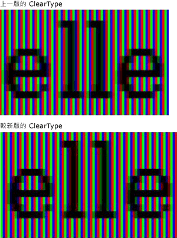

# ClearType 概觀
本主題提供於 [!INCLUDE[TLA#tla_winclient](../../../../includes/tlasharptla-winclient-md.md)] 中找到之 [!INCLUDE[TLA#tla_ct](../../../../includes/tlasharptla-ct-md.md)] 技術的概觀。  

   
## 技術概觀  
 ClearType 是由[!INCLUDE[TLA#tla_ms](../../../../includes/tlasharptla-ms-md.md)]所開發的軟體技術, 可改善現有 lcd (液晶顯示器) 的文字可讀性, 例如膝上型電腦螢幕、Pocket PC 螢幕和平面監視器。  ClearType 的運作方式是存取 LCD 螢幕每個圖元內的個別垂直色彩 stripe 元素。 在 ClearType 之前, 電腦可以顯示的最小詳細資料層級是單一圖元, 但在 LCD 監視器上執行 ClearType 時, 我們現在可以將文字的功能顯示為寬度圖元的小部分。 額外的解析度可提高文字顯示細節的解析度，即使經過長時間也很容易閱讀。  
  
 中[!INCLUDE[TLA#tla_winclient](../../../../includes/tlasharptla-winclient-md.md)]提供的 cleartype 是最新一代的 cleartype, 其在中[!INCLUDE[TLA#tla_gdi](../../../../includes/tlasharptla-gdi-md.md)]找到的版本有數項改善。  
  
   
## 子像素定位  
 先前版本的 ClearType 有一項顯著的改進, 就是使用子圖元定位。 不同于中[!INCLUDE[TLA2#tla_gdi](../../../../includes/tla2sharptla-gdi-md.md)]找到的 cleartype 實作為, 中[!INCLUDE[TLA#tla_winclient](../../../../includes/tlasharptla-winclient-md.md)]找到的 cleartype 允許在圖元內啟動圖像, 而不只是圖元的開始界限。 因為定位字符有此額外的解析度，所以字符的間距和比例更精確且一致。  
  
 下列兩例示範使用子像素定位時，字符如何能在任何子像素界限上開始。 左側的範例是使用較早版本的 ClearType 轉譯器來轉譯, 而此轉譯器不會採用子圖元定位。 右側的範例是使用新版本的 ClearType 轉譯器 (使用子圖元定位) 來呈現。 請注意右側映像中每個 **e** 和 **l** 的轉譯方式都略有不同，因為它們每一個都在不同的子像素上開始。 在螢幕上檢視正常大小的文字時，因為字符映像的高對比，所以這項差異不是很明顯。 這只有在 ClearType 中納入複雜的色彩篩選時才可行。  
  
   
以新舊版 ClearType 顯示的文字  
  
 下列兩個範例會比較舊版 ClearType 轉譯器與新版本的 ClearType 轉譯器的輸出。 顯示在右側的子像素定位，可大幅提升畫面中的類型間距，尤其是子像素和完整像素在字符寬度有明顯比例差異的小尺寸狀況。 請注意，第二個映像中的字母間距更勻稱。 文字螢幕整體外觀的子圖元定位的累計優點會大幅增加, 並代表 ClearType 技術的重大進化。  
  
   
以新舊版 ClearType 顯示的文字  
  
   
## Y 方向消除鋸齒  
 中[!INCLUDE[TLA#tla_winclient](../../../../includes/tlasharptla-winclient-md.md)] ClearType 的另一項改進是 y 方向消除鋸齒。 [!INCLUDE[TLA2#tla_gdi](../../../../includes/tla2sharptla-gdi-md.md)]不具有 y 方向消除鋸齒的 ClearType 會在 X 軸上提供更好的解析度, 而不是 y 軸。 微曲部分頂端和底端的鋸齒狀邊緣會降低其可讀性。  
  
 下例顯示不使用 Y 方向消除鋸齒的效果。 在此情況下，字母上方與下方的鋸齒狀邊緣很明顯。  
  
   
微曲部分產生鋸齒狀邊緣的文字  
  
 中[!INCLUDE[TLA#tla_winclient](../../../../includes/tlasharptla-winclient-md.md)]的 ClearType 提供 y 方向層級的消除鋸齒功能, 以平滑所有不規則邊緣。 這對改善東亞語言的可讀性特別重要，因為表意字元的水平和垂直微曲部分比重幾乎相同。  
  
 下例顯示使用 Y 方向消除鋸齒的效果。 在此情況下，字母的上方與下方會顯示平滑的曲線。  
  
   
以 ClearType Y 方向消除鋸齒功能顯示的文字  
  
   
## 硬體加速  
 中[!INCLUDE[TLA#tla_winclient](../../../../includes/tlasharptla-winclient-md.md)]的 ClearType 可以利用硬體加速以獲得更好的效能, 並減少 CPU 負載和系統記憶體需求。 透過使用圖形配接器的圖元著色器和視訊記憶體, ClearType 可提供更快速的文字呈現, 特別是使用動畫時。  
  
 中[!INCLUDE[TLA#tla_winclient](../../../../includes/tlasharptla-winclient-md.md)]的 cleartype 不會修改全系統的 ClearType 設定。 停用中[!INCLUDE[TLA#tla_mswin](../../../../includes/tlasharptla-mswin-md.md)]的[!INCLUDE[TLA#tla_winclient](../../../../includes/tlasharptla-winclient-md.md)] ClearType 會將消除鋸齒設定為灰階模式。 此外, 中[!INCLUDE[TLA#tla_winclient](../../../../includes/tlasharptla-winclient-md.md)]的 cleartype 不會修改[cleartype 調諧器 PowerToy](https://www.microsoft.com/typography/ClearTypePowerToy.mspx)的設定。  
  
 [!INCLUDE[TLA#tla_winclient](../../../../includes/tlasharptla-winclient-md.md)] 架構設計決策之一，就是解析度獨立的版面配置能更有效地支援日益普及的高解析度 DPI 監視器。 這樣做的後果是 [!INCLUDE[TLA#tla_winclient](../../../../includes/tlasharptla-winclient-md.md)] 不支援別名文字轉譯或某些東亞文字字型的點陣圖，因為它們兩個都是解析度相依。  
  
   
## 詳細資訊  
 [ClearType 資訊](https://www.microsoft.com/typography/ClearTypeInfo.mspx)  
  
 [ClearType Tuner PowerToy](https://www.microsoft.com/typography/ClearTypePowerToy.mspx)  
  
## 另請參閱

- [ClearType 登錄設定](cleartype-registry-settings.md)
