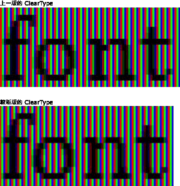

# ClearType 概觀
本主題提供於 [!INCLUDE[TLA#tla_winclient](../../../../includes/tlasharptla-winclient-md.md)] 中找到之 [!INCLUDE[TLA#tla_ct](../../../../includes/tlasharptla-ct-md.md)] 技術的概觀。  
  
  
   
## 技術概觀  
 [!INCLUDE[TLA2#tla_ct](../../../../includes/tla2sharptla-ct-md.md)] 軟體技術是由 [!INCLUDE[TLA#tla_ms](../../../../includes/tlasharptla-ms-md.md)] 所開發，後者改善了現有 LCD (液晶顯示器) 的文字可讀性，例如膝上型電腦螢幕、Pocket PC 螢幕和平面監視器。  [!INCLUDE[TLA2#tla_ct](../../../../includes/tla2sharptla-ct-md.md)] 的運作方式是存取 LCD 螢幕中每個像素的個別垂直色帶項目。 在 [!INCLUDE[TLA2#tla_ct](../../../../includes/tla2sharptla-ct-md.md)] 之前，電腦能夠顯示的詳細資料最小層級是單一像素，但在 LCD 監視器上執行 [!INCLUDE[TLA2#tla_ct](../../../../includes/tla2sharptla-ct-md.md)] 之後，顯示的文字特性可以小到像素寬度的幾分之一。 額外的解析度可提高文字顯示細節的銳度，即使經過長時間也容易閱讀。  
  
 [!INCLUDE[TLA#tla_winclient](../../../../includes/tlasharptla-winclient-md.md)] 提供的 [!INCLUDE[TLA2#tla_ct](../../../../includes/tla2sharptla-ct-md.md)] 是最新一代的 [!INCLUDE[TLA2#tla_ct](../../../../includes/tla2sharptla-ct-md.md)]，其具有 [!INCLUDE[TLA#tla_gdi](../../../../includes/tlasharptla-gdi-md.md)] 中之版本的多項改進。  
  
   
## 子像素定位  
 前一版 [!INCLUDE[TLA2#tla_ct](../../../../includes/tla2sharptla-ct-md.md)] 的重大改進就是使用子像素定位。 不同於 [!INCLUDE[TLA2#tla_gdi](../../../../includes/tla2sharptla-gdi-md.md)] 中的 [!INCLUDE[TLA2#tla_ct](../../../../includes/tla2sharptla-ct-md.md)] 實作，[!INCLUDE[TLA#tla_winclient](../../../../includes/tlasharptla-winclient-md.md)] 中的 [!INCLUDE[TLA2#tla_ct](../../../../includes/tla2sharptla-ct-md.md)] 允許字符在像素內開始，不是只能在像素界限上開始。 因為定位字符有此額外的解析度，所以字符的間距和比例更精確且一致。  
  
 下列兩例示範使用子像素定位時，字符如何能在任何子像素界限上開始。 左邊的範例使用舊版 [!INCLUDE[TLA2#tla_ct](../../../../includes/tla2sharptla-ct-md.md)] 轉譯器轉譯，未採用子像素定位。 右邊的範例使用新版 [!INCLUDE[TLA2#tla_ct](../../../../includes/tla2sharptla-ct-md.md)] 轉譯器轉譯，採用子像素定位。 請注意右側映像中每個 **e** 和 **l** 的轉譯方式都略有不同，因為它們每一個都在不同的子像素上開始。 在螢幕上檢視正常大小的文字時，因為字符映像的高對比，所以這項差異不是很明顯。 這可能只是因為 [!INCLUDE[TLA2#tla_ct](../../../../includes/tla2sharptla-ct-md.md)] 納入的複雜色彩篩選。  
  
   
以新舊版 ClearType 顯示的文字  
  
 下列兩例比較舊版 [!INCLUDE[TLA2#tla_ct](../../../../includes/tla2sharptla-ct-md.md)] 轉譯器和新版 [!INCLUDE[TLA2#tla_ct](../../../../includes/tla2sharptla-ct-md.md)] 轉譯器的輸出。 顯示在右側的子像素定位，可大幅提升畫面中的類型間距，尤其是子像素和完整像素在字符寬度有明顯比例差異的小尺寸狀況。 請注意，第二個映像中的字母間距更勻稱。 文字畫面整體外觀的子像素定位累積優勢會大幅增加，並以 [!INCLUDE[TLA2#tla_ct](../../../../includes/tla2sharptla-ct-md.md)] 技術表現顯著的演進。  
  
   
以新舊版 ClearType 顯示的文字  
  
   
## Y 方向消除鋸齒  
 [!INCLUDE[TLA#tla_winclient](../../../../includes/tlasharptla-winclient-md.md)] 中 [!INCLUDE[TLA2#tla_ct](../../../../includes/tla2sharptla-ct-md.md)] 的另一項改進是 Y 方向消除鋸齒功能。 [!INCLUDE[TLA2#tla_gdi](../../../../includes/tla2sharptla-gdi-md.md)] 中的 [!INCLUDE[TLA2#tla_ct](../../../../includes/tla2sharptla-ct-md.md)] 沒有 Y 方向消除鋸齒功能，能在 X 軸提供更好的解析度，Y 軸則否。 微曲部分頂端和底端的鋸齒狀邊緣會降低其可讀性。  
  
 下例顯示不使用 Y 方向消除鋸齒的效果。 在此情況下，字母上方與下方的鋸齒狀邊緣很明顯。  
  
   
微曲部分產生鋸齒狀邊緣的文字  
  
 [!INCLUDE[TLA#tla_winclient](../../../../includes/tlasharptla-winclient-md.md)] 中的 [!INCLUDE[TLA2#tla_ct](../../../../includes/tla2sharptla-ct-md.md)] 在 Y 方向層級上提供消除鋸齒功能，平滑所有的鋸齒狀邊緣。 這對改善東亞語言的可讀性特別重要，因為表意字元的水平和垂直微曲部分比重幾乎相同。  
  
 下例顯示使用 Y 方向消除鋸齒的效果。 在此情況下，字母的上方與下方會顯示平滑的曲線。  
  
   
以 ClearType Y 方向消除鋸齒功能顯示的文字  
  
   
## 硬體加速  
 [!INCLUDE[TLA#tla_winclient](../../../../includes/tlasharptla-winclient-md.md)] 中的 [!INCLUDE[TLA2#tla_ct](../../../../includes/tla2sharptla-ct-md.md)] 可以利用硬體加速提升效能，並降低 CPU 負載和系統記憶體需求。 使用圖形卡的像素著色器和視訊記憶體，[!INCLUDE[TLA2#tla_ct](../../../../includes/tla2sharptla-ct-md.md)] 可以更快速轉譯文字，特別是使用動畫時。  
  
 [!INCLUDE[TLA#tla_winclient](../../../../includes/tlasharptla-winclient-md.md)] 中的 [!INCLUDE[TLA2#tla_ct](../../../../includes/tla2sharptla-ct-md.md)] 不會修改整個系統的 [!INCLUDE[TLA2#tla_ct](../../../../includes/tla2sharptla-ct-md.md)] 設定。 停用 [!INCLUDE[TLA#tla_mswin](../../../../includes/tlasharptla-mswin-md.md)] 中的 [!INCLUDE[TLA2#tla_ct](../../../../includes/tla2sharptla-ct-md.md)] 會將 [!INCLUDE[TLA#tla_winclient](../../../../includes/tlasharptla-winclient-md.md)] 消除鋸齒設成灰階模式。 此外，[!INCLUDE[TLA#tla_winclient](../../../../includes/tlasharptla-winclient-md.md)] 中的 [!INCLUDE[TLA2#tla_ct](../../../../includes/tla2sharptla-ct-md.md)] 不會修改 [ClearType Tuner PowerToy](http://www.microsoft.com/typography/ClearTypePowerToy.mspx) 的設定。  
  
 [!INCLUDE[TLA#tla_winclient](../../../../includes/tlasharptla-winclient-md.md)] 架構設計決策之一，就是解析度獨立的版面配置能更有效地支援日益普及的高解析度 DPI 監視器。 這樣做的後果是 [!INCLUDE[TLA#tla_winclient](../../../../includes/tlasharptla-winclient-md.md)] 不支援別名文字轉譯或某些東亞文字字型的點陣圖，因為它們兩個都是解析度相依。  
  
   
## 詳細資訊  
 [ClearType 資訊](http://www.microsoft.com/typography/ClearTypeInfo.mspx)  
  
 [ClearType Tuner PowerToy](http://www.microsoft.com/typography/ClearTypePowerToy.mspx)  
  
## 另請參閱  
 [ClearType 登錄設定](../../../../docs/framework/wpf/advanced/cleartype-registry-settings.md)
