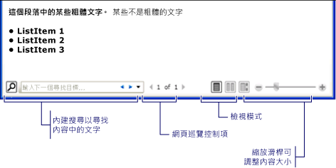

# 非固定格式文件概觀
非固定格式文件的設計是為最佳化檢視和可讀性。 非固定格式文件並不會設為某種預先定義的配置，而是會根據執行階段變數 (例如視窗大小、裝置解析度和選擇性的使用者喜好設定)，動態調整及自動重排其內容。 此外，非固定格式文件提供進階文件功能，例如編頁和資料行。 本主題提供非固定格式文件和建立方式的概觀。  

   
## 什麼是非固定格式文件  
 非固定格式文件的設計是會根據視窗大小、裝置解析度及其他環境變數來「自動重排內容」。 此外，非固定格式文件具備許多內建功能，包括搜尋、將可讀性最佳化的檢視模式，以及變更字型大小與外觀的能力。 當可讀性是使用文件的主要考量時，最好使用非固定格式文件。 相反地，固定格式文件的設計是靜態展示。 當來源內容的精確度很重要時，固定格式文件很有用。 請參閱[WPF 中的文件](documents-in-wpf.md)如需有關不同類型的文件。  
  
 下圖顯示在數個不同大小的視窗中檢視非固定格式文件範例。 當顯示區域變更時，內容就會自動重排以充分利用可用的空間。  
  
   
  
 如上圖所示，非固定格式內容可以包含許多元件，包括段落、清單、映像等等。 這些元件會對應至程序性程式碼中標記和物件的項目。 我們將在稍後介紹這些類別詳細[非固定格式相關的類別](#flow_related_classes)本概觀一節。 現在，以下是簡單的程式碼範例會建立一些粗體文字與清單的段落的非固定格式文件。
  
 [!code-xaml[FlowOvwSnippets_snip#SimpleFlowExampleWholePage](~/samples/snippets/csharp/VS_Snippets_Wpf/FlowOvwSnippets_snip/CS/SimpleFlowExample.xaml#simpleflowexamplewholepage)]  
  
 [!code-csharp[FlowOvwSnippets_procedural_snip#SimpleFlowCodeOnlyExampleWholePage](~/samples/snippets/csharp/VS_Snippets_Wpf/FlowOvwSnippets_procedural_snip/CSharp/SimpleFlowExample.cs#simpleflowcodeonlyexamplewholepage)]
 [!code-vb[FlowOvwSnippets_procedural_snip#SimpleFlowCodeOnlyExampleWholePage](~/samples/snippets/visualbasic/VS_Snippets_Wpf/FlowOvwSnippets_procedural_snip/VisualBasic/SimpleFlowExample.vb#simpleflowcodeonlyexamplewholepage)]  
  
 下圖顯示此程式碼片段的外觀。  
  
   
  
 在此範例中，<xref:System.Windows.Controls.FlowDocumentReader>控制項用來裝載非固定格式內容。 請參閱[非固定格式文件類型](#flow_document_types)如需有關非固定格式內容裝載控制項。 <xref:System.Windows.Documents.Paragraph><xref:System.Windows.Documents.List>， <xref:System.Windows.Documents.ListItem>，和<xref:System.Windows.Documents.Bold>元素用來控制內容的格式，根據在標記中的順序。 比方說，<xref:System.Windows.Documents.Bold>項目僅跨越部分的段落中的文字，如此一來，只有該部分的文字是粗體。 如果您使用過 HTML，會覺得很熟悉。  
  
 上圖中反白顯示，有數個內建固定格式文件的功能：
  
- 搜尋: 可讓使用者執行全文檢索搜尋的整份文件。  
  
- 檢視模式：使用者可以選取其慣用的檢視模式，包括單一頁面 （頁面-一次） 檢視模式中，兩個-頁面-一次 （書本閱讀格式） 檢視模式，以及連續捲動 （無底邊） 檢視模式。  如需這些檢視模式的詳細資訊，請參閱<xref:System.Windows.Controls.FlowDocumentReaderViewingMode>。  
  
- 頁面導覽控制項︰如果文件的檢視模式使用頁面，頁面導覽控制項包括按鈕以移至下一頁 （向下箭號） 或上一頁 （向上箭頭），以及目前的頁碼和總頁數的指示器。 使用鍵盤方向鍵也可以翻頁。  
  
- 縮放:縮放控制項可讓使用者以增加或減少的縮放層級，按一下加號或減號按鈕，分別。 縮放控制項也包括調整縮放層級的滑桿。 如需詳細資訊，請參閱 <xref:System.Windows.Controls.FlowDocumentReader.Zoom%2A>。  
  
 您可以根據裝載非固定格式內容所用的控制項來修改這些功能。 下一節說明不同的控制項。  
  
   
## 非固定格式文件類型  
 非固定格式文件內容的外觀和顯示方式，取決於裝載非固定格式內容的物件。 有四個控制項支援的非固定格式內容的檢視： <xref:System.Windows.Controls.FlowDocumentReader>， <xref:System.Windows.Controls.FlowDocumentPageViewer>， <xref:System.Windows.Controls.RichTextBox>，和<xref:System.Windows.Controls.FlowDocumentScrollViewer>。 以下簡短說明這些控制項。  
  
 **注意︰** <xref:System.Windows.Documents.FlowDocument>才可直接裝載非固定格式內容，因此所有的這些檢視控制項耗用<xref:System.Windows.Documents.FlowDocument>來啟用非固定格式內容裝載。
  
### FlowDocumentReader  
 <xref:System.Windows.Controls.FlowDocumentReader> 包含可讓使用者動態選擇各種檢視模式，包括單一頁面 （頁面-一次） 檢視模式中，兩個-頁面-一次 （書本閱讀格式） 檢視模式，以及連續捲動 （無底邊） 檢視模式的功能。 如需這些檢視模式的詳細資訊，請參閱<xref:System.Windows.Controls.FlowDocumentReaderViewingMode>。 如果您不需要動態切換不同檢視模式的能力<xref:System.Windows.Controls.FlowDocumentPageViewer>和<xref:System.Windows.Controls.FlowDocumentScrollViewer>特定檢視模式固定的內容檢視器提供輕量型非固定格式。  
  
### FlowDocumentPageViewer 和 FlowDocumentScrollViewer  
 <xref:System.Windows.Controls.FlowDocumentPageViewer> 顯示內容頁-一次檢視模式，而<xref:System.Windows.Controls.FlowDocumentScrollViewer>會以連續捲動模式顯示內容。 兩者<xref:System.Windows.Controls.FlowDocumentPageViewer>和<xref:System.Windows.Controls.FlowDocumentScrollViewer>都有固定的特定檢視模式。 比較<xref:System.Windows.Controls.FlowDocumentReader>，包含的功能可讓使用者動態選擇各種檢視模式 (藉由提供<xref:System.Windows.Controls.FlowDocumentReaderViewingMode>列舉型別)，但代價是更多的資源量<xref:System.Windows.Controls.FlowDocumentPageViewer>或<xref:System.Windows.Controls.FlowDocumentScrollViewer>。  
  
 預設一定會顯示垂直捲軸，而水平捲動則會視需要顯示。 預設值適用於 UI<xref:System.Windows.Controls.FlowDocumentScrollViewer>不包含工具列; 不過，<xref:System.Windows.Controls.FlowDocumentScrollViewer.IsToolBarVisible%2A>屬性可用來啟用內建工具列。  
  
### RichTextBox  
 您使用<xref:System.Windows.Controls.RichTextBox>當您想要允許使用者編輯非固定格式內容。 比方說，如果您想要允許使用者操作的編輯器中建立項目像是資料表、 斜體和粗體格式設定等，您會使用<xref:System.Windows.Controls.RichTextBox>。 請參閱[RichTextBox 概觀](../controls/richtextbox-overview.md)如需詳細資訊。  
  
 **注意：** 非固定格式內容內<xref:System.Windows.Controls.RichTextBox>完全和其他控制項中所包含的非固定格式內容行為不。 例如，沒有資料行中的<xref:System.Windows.Controls.RichTextBox>和因此沒有自動調整大小行為。 此外，通常內建的功能，例如搜尋、 檢視模式、 頁面導覽及縮放的非固定格式內容內也不提供<xref:System.Windows.Controls.RichTextBox>。  
  
   
## 建立非固定格式內容  
 非固定格式內容可以是複雜，其中包含各種項目，包括文字、 影像、 表格、 甚至<xref:System.Windows.UIElement>衍生類別，如控制項。 若要了解如何建立複雜的非固定格式內容，下列幾點很重要︰  
  
- **非固定格式相關的類別**:非固定格式內容中使用的每個類別都有特定用途。 此外，非固定格式類別之間的階層式關聯性可協助您了解如何使用它們。 例如，衍生自<xref:System.Windows.Documents.Block>類別來包含其他物件，而類別衍生自<xref:System.Windows.Documents.Inline>包含顯示的物件。  
  
- **內容結構描述**:非固定格式文件可能需要大量的巢狀項目。 內容結構描述指定項目之間可能的父/子關聯性。  
  
 下列各節會一一詳細介紹這些區域。  
  
   
## 非固定格式相關的類別  
 下圖顯示非固定格式內容中最常使用的物件︰  
  
   
  
 針對非固定格式內容的目的，有兩個重要分類︰  
  
1. **區塊衍生類別**:也稱為 「 區塊內容的項目 」 或簡稱 「 區塊項目 」。 繼承自項目<xref:System.Windows.Documents.Block>可用來分組同一個父系下的項目，或將通用屬性套用至群組。  
  
2. **內嵌衍生類別**:也稱為 「 內嵌內容項目 」 或簡稱 「 內嵌項目 」。 繼承自項目<xref:System.Windows.Documents.Inline>都是包含在區塊項目或另一個內嵌項目。 內嵌項目通常用為轉譯到螢幕之內容的直接容器。 例如， <xref:System.Windows.Documents.Paragraph> （區塊項目） 可以包含<xref:System.Windows.Documents.Run>（內嵌項目），但<xref:System.Windows.Documents.Run>實際包含在螢幕呈現的文字。  
  
 以下簡短描述這兩種分類中的每個類別。  
  
### 區塊衍生類別  
 **段落**  
  
 <xref:System.Windows.Documents.Paragraph> 通常用來將內容分組到段落。 段落最簡單且最常見的用法是建立一段文字。  
  
 [!code-xaml[FlowOvwSnippets_snip#ParagraphExampleWholePage](~/samples/snippets/csharp/VS_Snippets_Wpf/FlowOvwSnippets_snip/CS/ParagraphExample.xaml#paragraphexamplewholepage)]  
  
 [!code-csharp[FlowOvwSnippets_procedural_snip#ParagraphCodeOnlyExampleWholePage](~/samples/snippets/csharp/VS_Snippets_Wpf/FlowOvwSnippets_procedural_snip/CSharp/ParagraphExample.cs#paragraphcodeonlyexamplewholepage)]
 [!code-vb[FlowOvwSnippets_procedural_snip#ParagraphCodeOnlyExampleWholePage](~/samples/snippets/visualbasic/VS_Snippets_Wpf/FlowOvwSnippets_procedural_snip/VisualBasic/ParagraphExample.vb#paragraphcodeonlyexamplewholepage)]  
  
 不過，您也可以包含其他內嵌衍生項目，您將會看到如下。 
  
 **區段**  
  
 <xref:System.Windows.Documents.Section> 只用來包含其他<xref:System.Windows.Documents.Block>-衍生項目。 它不會將任何預設的格式設定套用到其所包含的項目。 不過，任何屬性值組<xref:System.Windows.Documents.Section>套用至其子項目。 區段也可讓您以程式設計的方式逐一查看其子集合。 <xref:System.Windows.Documents.Section> 使用以類似方式\<d i v > 以 HTML 標記。  
  
 在下列範例中，在下一個定義三個段落<xref:System.Windows.Documents.Section>。 區段有<xref:System.Windows.Documents.TextElement.Background%2A>屬性值為紅色，因此段落的背景色彩也是紅色。  
  
 [!code-xaml[FlowOvwSnippets_snip#SectionExampleWholePage](~/samples/snippets/csharp/VS_Snippets_Wpf/FlowOvwSnippets_snip/CS/SectionExample.xaml#sectionexamplewholepage)]  
  
 [!code-csharp[FlowOvwSnippets_procedural_snip#SectionCodeOnlyExampleWholePage](~/samples/snippets/csharp/VS_Snippets_Wpf/FlowOvwSnippets_procedural_snip/CSharp/SectionExample.cs#sectioncodeonlyexamplewholepage)]
 [!code-vb[FlowOvwSnippets_procedural_snip#SectionCodeOnlyExampleWholePage](~/samples/snippets/visualbasic/VS_Snippets_Wpf/FlowOvwSnippets_procedural_snip/VisualBasic/SectionExample.vb#sectioncodeonlyexamplewholepage)]  
  
 **BlockUIContainer**  
  
 <xref:System.Windows.Documents.BlockUIContainer> 可讓<xref:System.Windows.UIElement>項目 (也就是<xref:System.Windows.Controls.Button>) 內嵌在區塊衍生的非固定格式內容。 <xref:System.Windows.Documents.InlineUIContainer> （如下所示） 用來內嵌<xref:System.Windows.UIElement>中內嵌衍生的非固定格式內容項目。 <xref:System.Windows.Documents.BlockUIContainer> 並<xref:System.Windows.Documents.InlineUIContainer>很重要，因為不沒有使用任何其他方法<xref:System.Windows.UIElement>在非固定格式內容，除非它包含這兩個元素的其中一個內。  
  
 下列範例示範如何使用<xref:System.Windows.Documents.BlockUIContainer>項目來裝載<xref:System.Windows.UIElement>非固定格式內容中的物件。  
  
 [!code-xaml[SpanSnippets#_BlockUIXAML](~/samples/snippets/csharp/VS_Snippets_Wpf/SpanSnippets/CSharp/Window1.xaml#_blockuixaml)]  
  
 下圖顯示此範例的轉譯方式：  
  
   
  
 **清單**  
  
 <xref:System.Windows.Documents.List> 用來建立項目符號或數字清單。 設定<xref:System.Windows.Documents.List.MarkerStyle%2A>屬性設<xref:System.Windows.TextMarkerStyle>來決定清單樣式的列舉值。 下例示範如何建立簡單的清單。  
  
 [!code-xaml[FlowOvwSnippets_snip#ListExampleWholePage](~/samples/snippets/csharp/VS_Snippets_Wpf/FlowOvwSnippets_snip/CS/ListExample.xaml#listexamplewholepage)]  
  
 [!code-csharp[FlowOvwSnippets_procedural_snip#ListCodeOnlyExampleWholePage](~/samples/snippets/csharp/VS_Snippets_Wpf/FlowOvwSnippets_procedural_snip/CSharp/ListExample.cs#listcodeonlyexamplewholepage)]
 [!code-vb[FlowOvwSnippets_procedural_snip#ListCodeOnlyExampleWholePage](~/samples/snippets/visualbasic/VS_Snippets_Wpf/FlowOvwSnippets_procedural_snip/VisualBasic/ListExample.vb#listcodeonlyexamplewholepage)]  
  
 **注意︰** <xref:System.Windows.Documents.List>是唯一的非固定格式項目使用<xref:System.Windows.Documents.ListItemCollection>來管理子項目。  
  
 **資料表**  
  
 <xref:System.Windows.Documents.Table> 用來建立資料表。 <xref:System.Windows.Documents.Table> 類似於<xref:System.Windows.Controls.Grid>項目，但它有更多的功能，因此，需要更高的資源負荷。 因為<xref:System.Windows.Controls.Grid>已<xref:System.Windows.UIElement>，它不能在非固定格式內容除非它包含在<xref:System.Windows.Documents.BlockUIContainer>或<xref:System.Windows.Documents.InlineUIContainer>。 如需詳細資訊<xref:System.Windows.Documents.Table>，請參閱 <<c2> [ 表格概觀](table-overview.md)。  
  
### 內嵌衍生類別  
 **執行**  
  
 <xref:System.Windows.Documents.Run> 用來包含未格式化的文字。 您所料<xref:System.Windows.Documents.Run>物件能廣泛用於非固定格式內容。 不過，在標記中，<xref:System.Windows.Documents.Run>項目並不需要明確使用。 <xref:System.Windows.Documents.Run> 需要建立或使用程式碼管理非固定格式文件時使用。 例如，在下列第一個標記<xref:System.Windows.Documents.Paragraph>指定<xref:System.Windows.Documents.Run>明確時，第二個項目則否。 這兩個段落會產生相同的輸出。  
  
 [!code-xaml[FlowOvwSnippets_snip#RunExample1](~/samples/snippets/csharp/VS_Snippets_Wpf/FlowOvwSnippets_snip/CS/RunSnippetsExample.xaml#runexample1)]  
  
 **注意：** 在.NET Framework 4 中，啟動<xref:System.Windows.Documents.Run.Text%2A>屬性<xref:System.Windows.Documents.Run>物件是相依性屬性。 您可以繫結<xref:System.Windows.Documents.Run.Text%2A>屬性到資料來源，例如<xref:System.Windows.Controls.TextBlock>。 <xref:System.Windows.Documents.Run.Text%2A>屬性完全支援單向繫結。 <xref:System.Windows.Documents.Run.Text%2A>屬性也支援雙向繫結，除了<xref:System.Windows.Controls.RichTextBox>。 如需範例，請參閱 <xref:System.Windows.Documents.Run.Text%2A?displayProperty=nameWithType>。  
  
 **Span**  
  
 <xref:System.Windows.Documents.Span> 一起分組其他內嵌內容項目。 內的內容套用任何固有的轉譯<xref:System.Windows.Documents.Span>項目。 不過，項目繼承自<xref:System.Windows.Documents.Span>包括<xref:System.Windows.Documents.Hyperlink>， <xref:System.Windows.Documents.Bold>，<xref:System.Windows.Documents.Italic>和<xref:System.Windows.Documents.Underline>不要將格式套用至文字。  
  
 以下是範例<xref:System.Windows.Documents.Span>用於包含內嵌內容，包括文字、<xref:System.Windows.Documents.Bold>項目，和<xref:System.Windows.Controls.Button>。  
  
 [!code-xaml[FlowOvwSnippets_snip#SpanExampleWholePage](~/samples/snippets/csharp/VS_Snippets_Wpf/FlowOvwSnippets_snip/CS/SpanExample.xaml#spanexamplewholepage)]  
  
 以下的螢幕擷取畫面顯示此範例的轉譯方式。  
  
   
  
 **InlineUIContainer**  
  
 <xref:System.Windows.Documents.InlineUIContainer> 可讓<xref:System.Windows.UIElement>項目 (也就是控制項喜歡<xref:System.Windows.Controls.Button>) 內嵌在<xref:System.Windows.Documents.Inline>內容項目。 這個項目是相當於內嵌<xref:System.Windows.Documents.BlockUIContainer>上面所述。 以下是範例會使用<xref:System.Windows.Documents.InlineUIContainer>插入<xref:System.Windows.Controls.Button>中的內嵌<xref:System.Windows.Documents.Paragraph>。  
  
 [!code-xaml[FlowOvwSnippets_snip#InlineUIContainerExampleWholePage](~/samples/snippets/csharp/VS_Snippets_Wpf/FlowOvwSnippets_snip/CS/InlineUIContainerExample.xaml#inlineuicontainerexamplewholepage)]  
  
 [!code-csharp[FlowOvwSnippets_procedural_snip#InlineUIContainerCodeOnlyExampleWholePage](~/samples/snippets/csharp/VS_Snippets_Wpf/FlowOvwSnippets_procedural_snip/CSharp/InlineUIContainerExample.cs#inlineuicontainercodeonlyexamplewholepage)]
 [!code-vb[FlowOvwSnippets_procedural_snip#InlineUIContainerCodeOnlyExampleWholePage](~/samples/snippets/visualbasic/VS_Snippets_Wpf/FlowOvwSnippets_procedural_snip/VisualBasic/InlineUIContainerExample.vb#inlineuicontainercodeonlyexamplewholepage)]  
  
 **注意︰** <xref:System.Windows.Documents.InlineUIContainer>不需要明確使用標記中。 如果您省略它，<xref:System.Windows.Documents.InlineUIContainer>還是會建立編譯的程式碼。  
  
 **圖表和 Floater**  
  
 <xref:System.Windows.Documents.Figure> 和<xref:System.Windows.Documents.Floater>可用來在非固定格式文件中內嵌內容，可以獨立於主要內容流程自訂放置屬性。 <xref:System.Windows.Documents.Figure> 或<xref:System.Windows.Documents.Floater>項目通常用來反白顯示或強調部分內容，以支援映像或其他內容的主要內容流程內的主機或鬆散插入相關內容，例如廣告。  
  
 下列範例示範如何內嵌<xref:System.Windows.Documents.Figure>到段落的文字。  
  
 [!code-xaml[FlowOvwSnippets_snip#FigureExampleWholePage](~/samples/snippets/csharp/VS_Snippets_Wpf/FlowOvwSnippets_snip/CS/FigureExample.xaml#figureexamplewholepage)]  
  
 [!code-csharp[FlowOvwSnippets_procedural_snip#FigureCodeOnlyExampleWholePage](~/samples/snippets/csharp/VS_Snippets_Wpf/FlowOvwSnippets_procedural_snip/CSharp/FigureExample.cs#figurecodeonlyexamplewholepage)]
 [!code-vb[FlowOvwSnippets_procedural_snip#FigureCodeOnlyExampleWholePage](~/samples/snippets/visualbasic/VS_Snippets_Wpf/FlowOvwSnippets_procedural_snip/VisualBasic/FigureExample.vb#figurecodeonlyexamplewholepage)]  
  
 下圖顯示此範例的轉譯方式。  
  
   
  
 <xref:System.Windows.Documents.Figure> 和<xref:System.Windows.Documents.Floater>數種方式不同，並且用於不同的案例。  
  
 **圖表：**  
  
- 可以位於：您可以設定其水平和垂直錨點上，以將它固定相對於頁面、 內容、 資料行或段落。 您也可以使用其<xref:System.Windows.Documents.Figure.HorizontalOffset%2A>和<xref:System.Windows.Documents.Figure.VerticalOffset%2A>屬性來指定任意位移。  
  
- 可調整為多個資料行項目：您可以設定<xref:System.Windows.Documents.Figure>高度和寬度的頁面、 內容或資料行的高度或寬度的倍數。 請注意，如果是頁面及內容，倍數不能大於 1。 例如，您可以在這裡設定的寬度<xref:System.Windows.Documents.Figure>是 「 0.5 倍頁面 」 或 「 0.25 倍內容 」 或 「 2 個資料行 」。 您也可以將高度和寬度設為絕對像素值。  
  
- 不分頁︰如果內的內容<xref:System.Windows.Documents.Figure>未符合內部<xref:System.Windows.Documents.Figure>，它會轉譯任何符合最適大小，其餘的內容會遺失  
  
 **Floater：**  
  
- 無法定位，但會轉譯任何可用的空間。 您不能設定位移或錨點<xref:System.Windows.Documents.Floater>。  
  
- 無法調整為多個資料行：根據預設，<xref:System.Windows.Documents.Floater>為一個資料行的大小。 它有<xref:System.Windows.Documents.Floater.Width%2A>屬性可以設定為絕對像素值，但此值是否大於一個資料行寬度，則會忽略它，且 floater 大小為一個資料行。 大小不超過一個資料行藉由設定正確的像素寬度，但調整大小不是資料行相關，所以 「 0.5 個"不是有效的運算式<xref:System.Windows.Documents.Floater>寬度。 <xref:System.Windows.Documents.Floater> 沒有高度屬性，而且無法設定高度，其高度取決於內容  
  
- <xref:System.Windows.Documents.Floater> 編頁：如果指定寬度的內容延伸到 1 個以上的資料行高度，floater 會中斷並分頁至下一個資料行的下一個頁面上，依此類推。  
  
 <xref:System.Windows.Documents.Figure> 是您想要用來控制大小的好地方放置獨立內容位置，並確定內容可納入指定的大小。 <xref:System.Windows.Documents.Floater> 是放置自由的更多內容，類似於主頁面內容，但會分開的好地方。  
  
 **LineBreak**  
  
 <xref:System.Windows.Documents.LineBreak> 會導致在非固定格式內容發生分行。 下列範例示範 <xref:System.Windows.Documents.LineBreak> 的用法。  
  
 [!code-xaml[FlowOvwSnippets_snip#LineBreakExampleWholePage](~/samples/snippets/csharp/VS_Snippets_Wpf/FlowOvwSnippets_snip/CS/LineBreakExample.xaml#linebreakexamplewholepage)]  
  
 以下的螢幕擷取畫面顯示此範例的轉譯方式。  
  
   
  
### 流程集合項目  
 上述範例中的許多<xref:System.Windows.Documents.BlockCollection>和<xref:System.Windows.Documents.InlineCollection>用來以程式設計方式建構非固定格式內容。 例如，若要加入項目來<xref:System.Windows.Documents.Paragraph>，您可以使用語法：  
  
 `…`  
  
 `myParagraph.Inlines.Add(new Run("Some text"));`  
  
 `…`  
  
 這會新增<xref:System.Windows.Documents.Run>要<xref:System.Windows.Documents.InlineCollection>的<xref:System.Windows.Documents.Paragraph>。  這是相同的隱含<xref:System.Windows.Documents.Run>內找到<xref:System.Windows.Documents.Paragraph>標記中：  
  
 `…`  
  
 `<Paragraph>`  
  
 `Some Text`  
  
 `</Paragraph>`  
  
 `…`  
  
 作為範例，使用<xref:System.Windows.Documents.BlockCollection>，下列範例會建立新<xref:System.Windows.Documents.Section>，然後使用**新增**方法，以加入新<xref:System.Windows.Documents.Paragraph>至<xref:System.Windows.Documents.Section>內容。  
  
 [!code-csharp[FlowDocumentSnippets#_SectionBlocksAdd](~/samples/snippets/csharp/VS_Snippets_Wpf/FlowDocumentSnippets/CSharp/Window1.xaml.cs#_sectionblocksadd)]
 [!code-vb[FlowDocumentSnippets#_SectionBlocksAdd](~/samples/snippets/visualbasic/VS_Snippets_Wpf/FlowDocumentSnippets/visualbasic/window1.xaml.vb#_sectionblocksadd)]  
  
 除了將項目新增至流程集合，您也可以移除項目。  下列範例會刪除最後一個<xref:System.Windows.Documents.Inline>中的項目<xref:System.Windows.Documents.Span>。  
  
 [!code-csharp[SpanSnippets#_SpanInlinesRemoveLast](~/samples/snippets/csharp/VS_Snippets_Wpf/SpanSnippets/CSharp/Window1.xaml.cs#_spaninlinesremovelast)]
 [!code-vb[SpanSnippets#_SpanInlinesRemoveLast](~/samples/snippets/visualbasic/VS_Snippets_Wpf/SpanSnippets/visualbasic/window1.xaml.vb#_spaninlinesremovelast)]  
  
 下列範例會清除所有內容 (<xref:System.Windows.Documents.Inline>項目) 從<xref:System.Windows.Documents.Span>。  
  
 [!code-csharp[SpanSnippets#_SpanInlinesClear](~/samples/snippets/csharp/VS_Snippets_Wpf/SpanSnippets/CSharp/Window1.xaml.cs#_spaninlinesclear)]
 [!code-vb[SpanSnippets#_SpanInlinesClear](~/samples/snippets/visualbasic/VS_Snippets_Wpf/SpanSnippets/visualbasic/window1.xaml.vb#_spaninlinesclear)]  
  
 以程式設計方式處理非固定格式內容時，您可能也會廣泛使用這些集合。  
  
 是否使用非固定格式項目<xref:System.Windows.Documents.InlineCollection>（內嵌） 或<xref:System.Windows.Documents.BlockCollection>（區塊） 來包含其子項目取決於何種項目子系 (<xref:System.Windows.Documents.Block>或<xref:System.Windows.Documents.Inline>) 可以在父元素所包含。 下一節的＜內容結構描述＞會摘要說明非固定格式內容項目的內含項目規則。  
  
 **注意：** 沒有集合，用於非固定格式內容的第三種<xref:System.Windows.Documents.ListItemCollection>，但是此集合僅適用於<xref:System.Windows.Documents.List>。 此外，還有數個集合搭配使用<xref:System.Windows.Documents.Table>。 請參閱[資料表概觀](table-overview.md)如需詳細資訊。  
  
   
## 內容結構描述  
 假設有多種不同的非固定格式內容項目，追蹤項目可以包含哪些子項目類型可能很累人。 下圖摘要說明流程項目的內含項目規則。 箭號代表可能的父/子關聯性。  
  
   
  
 上圖中可以看出，允許的項目子系不一定取決於它是否<xref:System.Windows.Documents.Block>項目或<xref:System.Windows.Documents.Inline>項目。 例如， <xref:System.Windows.Documents.Span> (<xref:System.Windows.Documents.Inline>項目) 只能有<xref:System.Windows.Documents.Inline>子項目，同時<xref:System.Windows.Documents.Figure>(也<xref:System.Windows.Documents.Inline>項目) 只能有<xref:System.Windows.Documents.Block>子項目。 因此，可快速判斷哪個元素可包含於其他元素中的圖表就很有用。 例如，讓我們使用圖表 」 來決定如何建構非固定格式內容的<xref:System.Windows.Controls.RichTextBox>。  
  
 **1.** A<xref:System.Windows.Controls.RichTextBox>必須包含<xref:System.Windows.Documents.FlowDocument>因此必須包含<xref:System.Windows.Documents.Block>-衍生物件。 以下是來自上圖的對應區段。  
  
   
  
 這是標記目前可能的樣子。  
  
 [!code-xaml[FlowOvwSnippets_snip#SchemaWalkThrough1](~/samples/snippets/csharp/VS_Snippets_Wpf/FlowOvwSnippets_snip/CS/MiscSnippets.xaml#schemawalkthrough1)]  
  
 **2.** 根據圖表中，有幾個<xref:System.Windows.Documents.Block>選擇，包括的項目<xref:System.Windows.Documents.Paragraph>， <xref:System.Windows.Documents.Section>， <xref:System.Windows.Documents.Table>， <xref:System.Windows.Documents.List>，和<xref:System.Windows.Documents.BlockUIContainer>（請參閱上述的 區塊衍生類別）。 假設我們想<xref:System.Windows.Documents.Table>。 上圖，根據<xref:System.Windows.Documents.Table>包含<xref:System.Windows.Documents.TableRowGroup>包含<xref:System.Windows.Documents.TableRow>項目，其中包含<xref:System.Windows.Documents.TableCell>包含的項目<xref:System.Windows.Documents.Block>-衍生物件。 以下是對應的區段，如<xref:System.Windows.Documents.Table>取自上圖。  
  
   
  
 以下是對應的標記。  
  
 [!code-xaml[FlowOvwSnippets_snip#SchemaWalkThrough2](~/samples/snippets/csharp/VS_Snippets_Wpf/FlowOvwSnippets_snip/CS/MiscSnippets.xaml#schemawalkthrough2)]  
  
 **3.** 同樣地，一或多個<xref:System.Windows.Documents.Block>項目下方需要<xref:System.Windows.Documents.TableCell>。 為求簡便，我們在儲存格中放入一些文字。 我們可以使用執行此<xref:System.Windows.Documents.Paragraph>與<xref:System.Windows.Documents.Run>項目。 以下是顯示圖表的對應區段<xref:System.Windows.Documents.Paragraph>花費<xref:System.Windows.Documents.Inline>項目、 且<xref:System.Windows.Documents.Run>(<xref:System.Windows.Documents.Inline>項目) 只能接受純文字。  
  
   
  
   
  
 以下是標記的完整範例。  
  
 [!code-xaml[FlowOvwSnippets_snip#SchemaExampleWholePage](~/samples/snippets/csharp/VS_Snippets_Wpf/FlowOvwSnippets_snip/CS/SchemaExample.xaml#schemaexamplewholepage)]  
  
   
## 自訂文字  
 文字通常是非固定格式文件中最普遍的內容類型。 雖然您可以使用前文介紹的物件控制大部分的文字轉譯方式，但有一些其他方法可處理本節討論的自訂文字。  
  
### 文字裝飾  
 文字裝飾讓您對文字套用底線、頂線、基準線及刪除線效果 (請參閱下圖)。 使用新增這些裝飾<xref:System.Windows.Documents.Inline.TextDecorations%2A>由數個包含的物件所公開的屬性<xref:System.Windows.Documents.Inline>， <xref:System.Windows.Documents.Paragraph>， <xref:System.Windows.Controls.TextBlock>，和<xref:System.Windows.Controls.TextBox>。  
  
 下列範例將示範如何設定 <xref:System.Windows.Documents.Paragraph.TextDecorations%2A> 的<xref:System.Windows.Documents.Paragraph> 屬性。  
  
 [!code-xaml[InlineSnippets#_Paragraph_TextDecXAML](~/samples/snippets/csharp/VS_Snippets_Wpf/InlineSnippets/CSharp/Window1.xaml#_paragraph_textdecxaml)]  
  
 [!code-csharp[InlineSnippets#_Paragraph_TextDec](~/samples/snippets/csharp/VS_Snippets_Wpf/InlineSnippets/CSharp/Window1.xaml.cs#_paragraph_textdec)]
 [!code-vb[InlineSnippets#_Paragraph_TextDec](~/samples/snippets/visualbasic/VS_Snippets_Wpf/InlineSnippets/visualbasic/window1.xaml.vb#_paragraph_textdec)]  
  
 下圖顯示此範例的轉譯方式。  
  
   
  
 下圖顯示如何**頂線**，**基準**，並**底線**分別裝飾呈現。  
  
   
  
   
  
   
  
### 印刷樣式  
 <xref:System.Windows.Documents.TextElement.Typography%2A>屬性由大多數流量相關內容包括<xref:System.Windows.Documents.TextElement>， <xref:System.Windows.Documents.FlowDocument>， <xref:System.Windows.Controls.TextBlock>，和<xref:System.Windows.Controls.TextBox>。 這個屬性是用來控制文字的印刷特性/變化 (即小型或大型大寫字、上標和下標等等)。  
  
 下列範例示範如何設定<xref:System.Windows.Documents.TextElement.Typography%2A>屬性，使用<xref:System.Windows.Documents.Paragraph>做為範例項目。  
  
 [!code-xaml[TextElementSnippets#_TextElement_TypogXAML](~/samples/snippets/csharp/VS_Snippets_Wpf/TextElementSnippets/CSharp/Window1.xaml#_textelement_typogxaml)]  
  
 下圖顯示此範例的轉譯方式。  
  
   
  
 相反地，下圖顯示如何轉譯套用預設印刷樣式屬性的類似範例。  
  
   
  
 下列範例示範如何設定<xref:System.Windows.Controls.TextBox.Typography%2A>屬性以程式設計的方式。  
  
 [!code-csharp[TextElementSnippets#_TextElement_Typog](~/samples/snippets/csharp/VS_Snippets_Wpf/TextElementSnippets/CSharp/Window1.xaml.cs#_textelement_typog)]
 [!code-vb[TextElementSnippets#_TextElement_Typog](~/samples/snippets/visualbasic/VS_Snippets_Wpf/TextElementSnippets/visualbasic/window1.xaml.vb#_textelement_typog)]  
  
 請參閱[WPF 中的印刷樣式](typography-in-wpf.md)如需印刷樣式的詳細資訊。  
  
## 另請參閱

- [Text](optimizing-performance-text.md)
- [WPF 中的印刷樣式](typography-in-wpf.md)
- [HOW-TO 主題](flow-content-elements-how-to-topics.md)
- [TextElement 內容模型概觀](textelement-content-model-overview.md)
- [RichTextBox 概觀](../controls/richtextbox-overview.md)
- [WPF 中的文件](documents-in-wpf.md)
- [資料表概觀](table-overview.md)
- [註釋概觀](annotations-overview.md)
