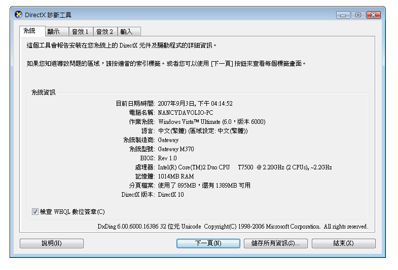

# 圖形轉譯層
轉譯層會定義執行 [!INCLUDE[TLA2#tla_winclient](../../../../includes/tla2sharptla-winclient-md.md)] 應用程式的裝置所能達到的圖形硬體能力和效能等級。  
  
 [!INCLUDE[autoOutline](../Token/autoOutline_md.md)]  
  
   
## 圖形硬體  
 在圖形硬體中，對轉譯層等級影響最大的功能如下：  
  
-   **視訊 RAM**：圖形硬體上的視訊記憶體數量決定可用於複合圖形的緩衝區大小和數目。  
  
-   **像素著色引擎**：像素著色引擎 \(Pixel Shader\) 是以每像素為單位計算效果的圖形處理功能。  根據所顯示圖形的解析度而定，每個顯示框架 \(Frame\) 可能需要處理達數百萬個像素。  
  
-   **頂點著色引擎**：頂點著色引擎 \(Vertex Shader\) 是會對物件之頂點資料執行數學運算的圖形處理功能。  
  
-   **多重紋理支援**：多重紋理 \(Multitexture\) 支援是指能夠在 3D 圖形物件的混色階段，套用兩個以上不同紋理的能力。  多重紋理的程度取決於圖形硬體上的多重紋理單元數目。  
  
   
## 轉譯層定義  
 圖形硬體的功能決定 [!INCLUDE[TLA2#tla_winclient](../../../../includes/tla2sharptla-winclient-md.md)] 應用程式的轉譯功能。  [!INCLUDE[TLA2#tla_winclient](../../../../includes/tla2sharptla-winclient-md.md)] 系統定義三個轉譯層：  
  
-   **轉譯層 0**：沒有圖形硬體加速。  所有圖形功能都會使用軟體加速。  [!INCLUDE[TLA2#tla_dx](../../../../includes/tla2sharptla-dx-md.md)] 版本等級小於 9.0 版。  
  
-   **轉譯層 1**：部分圖形功能會使用圖形硬體加速。  [!INCLUDE[TLA2#tla_dx](../../../../includes/tla2sharptla-dx-md.md)] 版本等級大於或等於 9.0 版。  
  
-   **轉譯層 2**：大部分圖形功能會使用圖形硬體加速。  [!INCLUDE[TLA2#tla_dx](../../../../includes/tla2sharptla-dx-md.md)] 版本等級大於或等於 9.0 版。  
  
 <xref:System.Windows.Media.RenderCapability.Tier%2A?displayProperty=fullName> 屬性可讓您在應用程式執行階段擷取轉譯層。  您可以使用轉譯層來判斷裝置是否支援特定的硬體加速圖形功能。  然後，應用程式可以根據裝置支援的轉譯層，在執行階段採用不同的程式碼路徑。  
  
### 轉譯層 0  
 轉譯層值為 0，表示沒有任何圖形硬體加速適用於裝置上的應用程式。  在這個轉譯等級，您應該假設所有的圖形都是透過沒有硬體加速的軟體進行轉譯。  這層的功能相當於小於 9.0 的 [!INCLUDE[TLA2#tla_dx](../../../../includes/tla2sharptla-dx-md.md)] 版本。  
  
### 轉譯層 1 和轉譯層 2  
  
> [!NOTE]
>  從 .NET Framework 4 開始，轉譯層 1 已重新定義為只包括支援 [!INCLUDE[TLA2#tla_dx](../../../../includes/tla2sharptla-dx-md.md)] 9.0 \(含\) 以上版本的圖形硬體。  支援 [!INCLUDE[TLA2#tla_dx](../../../../includes/tla2sharptla-dx-md.md)] 7 或 8 的圖形硬體現在已定義為轉譯層 0。  
  
 轉譯層值 1 或 2 表示，只要所需的系統資源存在且尚未耗盡，[!INCLUDE[TLA2#tla_winclient](../../../../includes/tla2sharptla-winclient-md.md)] 大部分的圖形功能就會使用硬體加速。  這個值對應至 9.0 \(含\) 以上的 [!INCLUDE[TLA2#tla_dx](../../../../includes/tla2sharptla-dx-md.md)] 版本。  
  
 下表顯示轉譯層 1 和轉譯層 2 的圖形硬體需求差異：  
  
|功能|轉譯層 1|轉譯層 2|  
|--------|-----------|-----------|  
|[!INCLUDE[TLA2#tla_dx](../../../../includes/tla2sharptla-dx-md.md)] 版本|必須大於或等於 9.0。|必須大於或等於 9.0。|  
|視訊 RAM|必須大於或等於 60MB。|必須大於或等於 120 MB。|  
|像素著色器|版本等級必須大於或等於 2.0。|版本等級必須大於或等於 2.0。|  
|頂點著色器|沒有需求。|版本等級必須大於或等於 2.0。|  
|多重紋理單元|沒有需求。|單元數必須大於或等於 4。|  
  
 以下是轉譯層 1 和轉譯層 2 會採用硬體加速的功能：  
  
|功能|備註|  
|--------|--------|  
|2D 轉譯|支援大部分的 2D 轉譯。|  
|3D 點陣化|支援大部分的 3D 點陣化。|  
|3D 非等向性篩選|在轉譯 3D 內容時，[!INCLUDE[TLA2#tla_winclient](../../../../includes/tla2sharptla-winclient-md.md)] 會嘗試使用非等向性篩選。  非等向性篩選指的是針對離鏡頭最遠且角度最陡的介面，增強該介面上紋理的影像品質。|  
|3D MIP 對應|在轉譯 3D 內容時，[!INCLUDE[TLA2#tla_winclient](../../../../includes/tla2sharptla-winclient-md.md)] 會嘗試使用 MIP 對應。當紋理佔用 <xref:System.Windows.Controls.Viewport3D> 中的較小視野時，MIP 對應可改善紋理轉譯品質。|  
|放射狀漸層|支援時，請避免在大型物件上使用 <xref:System.Windows.Media.RadialGradientBrush>。|  
|3D 光源計算|[!INCLUDE[TLA2#tla_winclient](../../../../includes/tla2sharptla-winclient-md.md)] 會執行每個頂點的光源，這表示必須計算套用至網狀結構之每個材質的每個頂點的亮度。|  
|文字轉譯|子像素字型轉譯會使用圖形硬體上的可用像素著色器。|  
  
 以下是只有轉譯層 2 會採用硬體加速的功能：  
  
|功能|備註|  
|--------|--------|  
|3D 消除鋸齒|只有在支援 Windows 顯示驅動程式模型 \(Windows Display Driver Model，WDDM\) 的作業系統上，例如 [!INCLUDE[TLA2#tla_winvista](../../../../includes/tla2sharptla-winvista-md.md)] 和 [!INCLUDE[win7](../../../../includes/win7-md.md)]，才支援 3D 消除鋸齒功能。|  
  
 以下是**不會**採用硬體加速的功能：  
  
|功能|備註|  
|--------|--------|  
|列印內容|所有列印內容都是使用 [!INCLUDE[TLA2#tla_winclient](../../../../includes/tla2sharptla-winclient-md.md)] 軟體管線進行轉譯。|  
|使用 <xref:System.Windows.Media.Imaging.RenderTargetBitmap> 的光柵化內容|使用 <xref:System.Windows.Media.Imaging.RenderTargetBitmap> 之 <xref:System.Windows.Media.Imaging.RenderTargetBitmap.Render%2A> 方法轉譯的所有內容。|  
|使用 <xref:System.Windows.Media.TileBrush> 的並排顯示內容|<xref:System.Windows.Media.TileBrush> 的 <xref:System.Windows.Media.TileBrush.TileMode%2A> 屬性設為 <xref:System.Windows.Media.TileMode> 的所有並排顯示內容。|  
|超出圖形硬體之最大紋理大小的介面|大部分圖形硬體的大型介面大小為 2048x2048 或 4096x4096 像素。|  
|視訊 RAM 需求超出圖形硬體記憶體的任何作業|您可以使用 Windows SDK 的 [WPF 效能套件](../Topic/WPF%20Performance%20Suite.md)所包含的 Perforator 工具，監視應用程式視訊 RAM 的使用情形。|  
|層次視窗|層次視窗允許 [!INCLUDE[TLA2#tla_winclient](../../../../includes/tla2sharptla-winclient-md.md)] 應用程式將內容轉譯至非矩形視窗中的螢幕。  在支援 Windows 顯示驅動程式模型 \(WDDM\) 的作業系統上，例如 [!INCLUDE[TLA2#tla_winvista](../../../../includes/tla2sharptla-winvista-md.md)] 和 [!INCLUDE[win7](../../../../includes/win7-md.md)]，分層視窗會採用硬體加速。  而在其他系統上 \(如 [!INCLUDE[winxp](../../../../includes/winxp-md.md)]\)，層次視窗是透過沒有硬體加速的軟體進行轉譯。   設定下列 <xref:System.Windows.Window> 屬性，就可以在 [!INCLUDE[TLA2#tla_winclient](../../../../includes/tla2sharptla-winclient-md.md)] 中啟用層次視窗：   -   <xref:System.Windows.Window.WindowStyle%2A> \= <xref:System.Windows.WindowStyle> -   <xref:System.Windows.Window.AllowsTransparency%2A> \= `true` -   <xref:System.Windows.Controls.Control.Background%2A> \= <xref:System.Windows.Media.Brushes.Transparent%2A>|  
  
   
## 其他資源  
 下列資源可協助您分析 [!INCLUDE[TLA2#tla_winclient](../../../../includes/tla2sharptla-winclient-md.md)] 應用程式的效能特性。  
  
### 圖形轉譯登錄設定  
 [!INCLUDE[TLA2#tla_winclient](../../../../includes/tla2sharptla-winclient-md.md)] 提供四種控制 [!INCLUDE[TLA2#tla_winclient](../../../../includes/tla2sharptla-winclient-md.md)] 轉譯的登錄設定：  
  
|設定|描述|  
|--------|--------|  
|**停用硬體加速選項**|指定是否應該啟用硬體加速。|  
|**最大多重取樣值**|指定消除[!INCLUDE[TLA2#tla_3d](../../../../includes/tla2sharptla-3d-md.md)]內容鋸齒的多重取樣程度。|  
|**必要的視訊驅動程式日期設定**|指定系統是否停用在 2004 年 11 月之前發行之驅動程式的硬體加速。|  
|**使用參考光柵處理器選項**|指定 [!INCLUDE[TLA2#tla_winclient](../../../../includes/tla2sharptla-winclient-md.md)] 是否應該使用參考光柵處理器。|  
  
 所有知道如何參考 [!INCLUDE[TLA2#tla_winclient](../../../../includes/tla2sharptla-winclient-md.md)] 登錄設定的外部組態公用程式，都可以存取這些設定。  使用 [!INCLUDE[TLA#tla_mswin](../../../../includes/tlasharptla-mswin-md.md)] 登錄編輯程式器直接存取值，也可以建立或修改這些設定。  如需詳細資訊，請參閱[圖形轉譯登錄設定](../../../../docs/framework/wpf/graphics-multimedia/graphics-rendering-registry-settings.md)。  
  
### WPF 效能分析工具  
 [!INCLUDE[TLA2#tla_winclient](../../../../includes/tla2sharptla-winclient-md.md)] 提供了一套效能分析工具，可讓您分析應用程式的執行階段行為，並判斷可套用的效能最佳化類型。  下表列出 [!INCLUDE[TLA2#tla_lhsdk](../../../../includes/tla2sharptla-lhsdk-md.md)] 工具「WPF 效能套件」中包含的效能分析工具：  
  
|工具|描述|  
|--------|--------|  
|Perforator|用於分析轉譯行為。|  
|Visual Profiler|用於透過視覺化樹狀結構中的項目，分析 [!INCLUDE[TLA2#tla_winclient](../../../../includes/tla2sharptla-winclient-md.md)] 服務的使用狀況 \(例如配置和事件處理\)。|  
  
 「WPF 效能套件」提供效能資料的豐富圖形視圖。  如需 WPF 效能工具的詳細資訊，請參閱 [WPF 效能套件](../Topic/WPF%20Performance%20Suite.md)。  
  
### DirectX 診斷工具  
 [!INCLUDE[TLA2#tla_dx](../../../../includes/tla2sharptla-dx-md.md)] 診斷工具 Dxdiag.exe 的設計是要協助您疑難排解 [!INCLUDE[TLA2#tla_dx](../../../../includes/tla2sharptla-dx-md.md)] 相關問題。  [!INCLUDE[TLA2#tla_dx](../../../../includes/tla2sharptla-dx-md.md)] 診斷工具的預設安裝資料夾是：  
  
 `~\Windows\System32`  
  
 當您執行 [!INCLUDE[TLA2#tla_dx](../../../../includes/tla2sharptla-dx-md.md)] 診斷工具時，主視窗包含的一組索引標籤可讓您顯示並診斷 [!INCLUDE[TLA2#tla_dx](../../../../includes/tla2sharptla-dx-md.md)] 相關資訊。  例如，\[**系統**\] 索引標籤提供電腦的系統資訊，以及指定電腦上安裝的 [!INCLUDE[TLA2#tla_dx](../../../../includes/tla2sharptla-dx-md.md)] 版本。  
  
   
DirectX 診斷工具主視窗  
  
## 請參閱  
 <xref:System.Windows.Media.RenderCapability>   
 <xref:System.Windows.Media.RenderOptions>   
 [最佳化 WPF 應用程式效能](../../../../docs/framework/wpf/advanced/optimizing-wpf-application-performance.md)   
 [WPF 效能套件](../Topic/WPF%20Performance%20Suite.md)   
 [圖形轉譯登錄設定](../../../../docs/framework/wpf/graphics-multimedia/graphics-rendering-registry-settings.md)   
 [動畫秘訣和訣竅](../../../../docs/framework/wpf/graphics-multimedia/animation-tips-and-tricks.md)