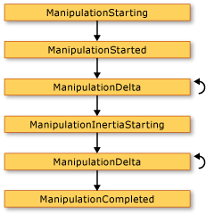

# 輸入概觀
[!INCLUDE[TLA#tla_winclient](../../../../includes/tlasharptla-winclient-md.md)]子系統提供強大的 API, 可讓您從各種裝置 (包括滑鼠、鍵盤、觸控和手寫筆) 取得輸入。 本主題描述 [!INCLUDE[TLA2#tla_winclient](../../../../includes/tla2sharptla-winclient-md.md)] 所提供的服務，以及說明輸入系統的架構。

## 輸入 API
 主要的輸入 API 暴露于基底元素類別<xref:System.Windows.UIElement>:、 <xref:System.Windows.ContentElement>、 <xref:System.Windows.FrameworkElement>和<xref:System.Windows.FrameworkContentElement>。  如需基底項目的詳細資訊，請參閱[基底項目概觀](base-elements-overview.md)。  這些類別提供按鍵動作、滑鼠按鈕、滑鼠滾輪、滑鼠移動、焦點管理和滑鼠捕捉等相關輸入事件的功能。 藉由將輸入 API 放在基底專案上, 而不是將所有輸入事件視為服務, 輸入架構可讓輸入事件成為 UI 中特定物件的來源, 並支援一個以上專案具有商機的事件路由配置。用來處理輸入事件的 ortunity。 許多輸入事件都有一組與其建立關聯的事件。  例如, 「按鍵關閉」事件會與<xref:System.Windows.Input.Keyboard.KeyDown>和<xref:System.Windows.Input.Keyboard.PreviewKeyDown>事件相關聯。  這些事件的差異在於如何將它們路由傳送至目標項目。  預覽事件會從根項目到目標項目往下瀏覽通道項目樹狀結構。  事件反昇事件會從目標項目往上反昇到根項目。  這個概觀和[路由事件概觀](routed-events-overview.md)稍後會更詳細討論 [!INCLUDE[TLA2#tla_winclient](../../../../includes/tla2sharptla-winclient-md.md)] 中的事件路由。

### 鍵盤和滑鼠類別
 除了基底元素類別上的輸入 API 之外, <xref:System.Windows.Input.Keyboard>類別和<xref:System.Windows.Input.Mouse>類別還提供額外的 api 來使用鍵盤和滑鼠輸入。

 <xref:System.Windows.Input.Keyboard>類別上的輸入 API 範例<xref:System.Windows.Input.Keyboard.Modifiers%2A>是屬性, 它會傳回目前所<xref:System.Windows.Input.ModifierKeys>按下的, 以及<xref:System.Windows.Input.Keyboard.IsKeyDown%2A>方法, 以判斷是否按下指定的按鍵。

 下列範例<xref:System.Windows.Input.Keyboard.GetKeyStates%2A> <xref:System.Windows.Input.Key>會使用方法來判斷是否處於關閉狀態。

 [!code-csharp[keyargssnippetsample#KeyEventArgsKeyBoardGetKeyStates](~/samples/snippets/csharp/VS_Snippets_Wpf/KeyArgsSnippetSample/CSharp/Window1.xaml.cs#keyeventargskeyboardgetkeystates)]
 [!code-vb[keyargssnippetsample#KeyEventArgsKeyBoardGetKeyStates](~/samples/snippets/visualbasic/VS_Snippets_Wpf/KeyArgsSnippetSample/visualbasic/window1.xaml.vb#keyeventargskeyboardgetkeystates)]

 <xref:System.Windows.Input.Mouse>類別上的輸入 API 範例是, <xref:System.Windows.Input.Mouse.MiddleButton%2A>它會取得中間滑鼠按鍵的狀態, 而<xref:System.Windows.Input.Mouse.DirectlyOver%2A>則會取得滑鼠指標目前所在的元素。

 下列範例會<xref:System.Windows.Input.MouseButtonState.Pressed>判斷滑鼠上<xref:System.Windows.Input.Mouse.LeftButton%2A>的是否處於狀態。

 [!code-csharp[mouserelatedsnippets#MouseRelatedSnippetsGetLeftButtonMouse](~/samples/snippets/csharp/VS_Snippets_Wpf/MouseRelatedSnippets/CSharp/Window1.xaml.cs#mouserelatedsnippetsgetleftbuttonmouse)]
 [!code-vb[mouserelatedsnippets#MouseRelatedSnippetsGetLeftButtonMouse](~/samples/snippets/visualbasic/VS_Snippets_Wpf/MouseRelatedSnippets/visualbasic/window1.xaml.vb#mouserelatedsnippetsgetleftbuttonmouse)]

 在此<xref:System.Windows.Input.Keyboard>總覽中, 會更詳細地涵蓋和類別。<xref:System.Windows.Input.Mouse>

### 手寫筆輸入
 [!INCLUDE[TLA2#tla_winclient](../../../../includes/tla2sharptla-winclient-md.md)]具有的<xref:System.Windows.Input.Stylus>整合支援。  是由受歡迎的手寫筆輸入。 [!INCLUDE[TLA#tla_tpc](../../../../includes/tlasharptla-tpc-md.md)] <xref:System.Windows.Input.Stylus>  [!INCLUDE[TLA2#tla_winclient](../../../../includes/tla2sharptla-winclient-md.md)]應用程式可以使用滑鼠 API 將手寫筆視為滑鼠, 但[!INCLUDE[TLA2#tla_winclient](../../../../includes/tla2sharptla-winclient-md.md)]也會公開使用類似鍵盤和滑鼠之模型的手寫筆裝置抽象概念。  所有手寫筆相關的 Api 都包含「手寫筆」一詞。

 因為手寫筆可以當作滑鼠，所以只支援滑鼠輸入的應用程式仍然可以自動取得某種程度的手寫筆支援。 以這種方式使用手寫筆時，應用程式可以處理適當的手寫筆事件，然後處理對應的滑鼠事件。 此外，還可以透過手寫筆裝置抽象概念來取得筆跡輸入這類較高階服務。  如需將筆跡作為輸入的詳細資訊，請參閱[筆跡入門](getting-started-with-ink.md)。

## 事件路由
 <xref:System.Windows.FrameworkElement>可以包含其他專案做為其內容模型中的子專案, 形成元素的樹狀結構。  在 [!INCLUDE[TLA2#tla_winclient](../../../../includes/tla2sharptla-winclient-md.md)] 中，父項目可以透過處理事件，來參與導向至其子項目或其他子系的輸入。 這特別適用於透過較小的控制項來建置控制項，即稱為「控制項組合」或「組合」的程序。 如需項目樹狀結構以及項目樹狀結構與事件路由間之關聯性的詳細資訊，請參閱 [WPF 中的樹狀結構](trees-in-wpf.md)。

 事件路由是將事件轉遞至多個項目的程序，因此，沿著路由的特定物件或項目可以選擇將重大回應提供給不同項目可能設為來源的事件 (透過處理)。  路由事件使用三種路由機制中的其中一種︰直接、事件反昇和通道。  在直接路由中，來源項目是唯一收到通知的項目，而且不會將事件路由傳送至任何其他項目。 不過, 直接路由事件仍會提供一些額外的功能, 只對路由事件顯示, 而非標準 CLR 事件。 事件反昇處理項目樹狀結構的方式是先通知將事件設為來源的項目，接著通知父項目，依此類推。  通道會從項目樹狀結構的根項目開始，然後往下進行，並結束於原始來源項目。  如需路由事件的詳細資訊，請參閱[路由事件概觀](routed-events-overview.md)。

 [!INCLUDE[TLA2#tla_winclient](../../../../includes/tla2sharptla-winclient-md.md)] 輸入事件一般會成對出現，而此配對包含通道事件和事件反昇事件。  通道事件與事件反昇事件的區別在於 "Preview" 前置詞。  例如, <xref:System.Windows.Input.Mouse.PreviewMouseMove>是滑鼠移動事件的通道版本, 而且<xref:System.Windows.Input.Mouse.MouseMove>是此事件的反升版本。 事件配對是一項在項目層級實作的慣例，而不是 [!INCLUDE[TLA2#tla_winclient](../../../../includes/tla2sharptla-winclient-md.md)] 事件系統的一項固有功能。 如需詳細資訊，請參閱[路由事件概觀](routed-events-overview.md)中的＜WPF 輸入事件＞一節。

## 處理輸入事件
 若要接收項目的輸入，事件處理常式必須與該特定事件建立關聯。  在 [!INCLUDE[TLA2#tla_xaml](../../../../includes/tla2sharptla-xaml-md.md)] 中，這相當簡單︰您可以參考事件名稱作為將接聽此事件之項目的屬性。  然後，您可以根據委派，將屬性的值設定為您所定義之事件處理常式的名稱。  事件處理常式必須以程式碼 (例如) C#撰寫, 而且可以包含在程式碼後置檔案中。

 作業系統報告在鍵盤焦點位於項目時所發生的按鍵動作時，會發生鍵盤事件。 滑鼠和手寫筆事件各分為兩個分類︰報告相對於項目之指標位置變更的事件，以及報告裝置按鈕狀態變更的事件。

### 鍵盤輸入事件範例
 下列範例會接聽按下向左鍵作業。  <xref:System.Windows.Controls.StackPanel>建立具有<xref:System.Windows.Controls.Button>的。  用來接聽向左箭號按鍵的事件處理常式會附加至<xref:System.Windows.Controls.Button>實例。

 範例的第一個區段會建立<xref:System.Windows.Controls.StackPanel> <xref:System.Windows.Controls.Button>和, 並附加的事件處理常式<xref:System.Windows.UIElement.KeyDown>。

 [!code-xaml[InputOvw#Input_OvwKeyboardExampleXAML](~/samples/snippets/csharp/VS_Snippets_Wpf/InputOvw/CSharp/Page1.xaml#input_ovwkeyboardexamplexaml)]

 [!code-csharp[InputOvw#Input_OvwKeyboardExampleUICodeBehind](~/samples/snippets/csharp/VS_Snippets_Wpf/InputOvw/CSharp/Page1.xaml.cs#input_ovwkeyboardexampleuicodebehind)]
 [!code-vb[InputOvw#Input_OvwKeyboardExampleUICodeBehind](~/samples/snippets/visualbasic/VS_Snippets_Wpf/InputOvw/VisualBasic/Page1.xaml.vb#input_ovwkeyboardexampleuicodebehind)]

 第二個區段是使用程式碼所撰寫，並定義事件處理常式。  當按下向左鍵並<xref:System.Windows.Controls.Button>具有鍵盤焦點時, <xref:System.Windows.Controls.Button>就會執行處理常式<xref:System.Windows.Controls.Control.Background%2A> , 並變更的色彩。  如果按下按鍵, 但它不是向左鍵, <xref:System.Windows.Controls.Control.Background%2A>則的色彩<xref:System.Windows.Controls.Button>會變更回其開始色彩。

 [!code-csharp[InputOvw#Input_OvwKeyboardExampleHandlerCodeBehind](~/samples/snippets/csharp/VS_Snippets_Wpf/InputOvw/CSharp/Page1.xaml.cs#input_ovwkeyboardexamplehandlercodebehind)]
 [!code-vb[InputOvw#Input_OvwKeyboardExampleHandlerCodeBehind](~/samples/snippets/visualbasic/VS_Snippets_Wpf/InputOvw/VisualBasic/Page1.xaml.vb#input_ovwkeyboardexamplehandlercodebehind)]

### 滑鼠輸入事件範例
 在下列範例中, 當<xref:System.Windows.Controls.Control.Background%2A>滑鼠指標進入<xref:System.Windows.Controls.Button> <xref:System.Windows.Controls.Button>時, 的色彩會變更。  當<xref:System.Windows.Controls.Control.Background%2A> 滑鼠<xref:System.Windows.Controls.Button>離開時, 會還原色彩。

 範例的第一個區段<xref:System.Windows.Controls.StackPanel>會建立<xref:System.Windows.Controls.Button>和控制項, 並將<xref:System.Windows.UIElement.MouseEnter>和<xref:System.Windows.UIElement.MouseLeave>事件的事件處理常式附加至<xref:System.Windows.Controls.Button>。

 [!code-xaml[InputOvw#Input_OvwMouseExampleXAML](~/samples/snippets/csharp/VS_Snippets_Wpf/InputOvw/CSharp/Page1.xaml#input_ovwmouseexamplexaml)]

 [!code-csharp[InputOvw#Input_OvwMouseExampleUICodeBehind](~/samples/snippets/csharp/VS_Snippets_Wpf/InputOvw/CSharp/Page1.xaml.cs#input_ovwmouseexampleuicodebehind)]
 [!code-vb[InputOvw#Input_OvwMouseExampleUICodeBehind](~/samples/snippets/visualbasic/VS_Snippets_Wpf/InputOvw/VisualBasic/Page1.xaml.vb#input_ovwmouseexampleuicodebehind)]

 此範例的第二個區段是使用程式碼所撰寫，並定義事件處理常式。  當滑鼠進入<xref:System.Windows.Controls.Button>時<xref:System.Windows.Controls.Control.Background%2A> , 的色彩<xref:System.Windows.Controls.Button>會變更為<xref:System.Windows.Media.Brushes.SlateGray%2A>。  當滑鼠離開<xref:System.Windows.Controls.Button>時<xref:System.Windows.Controls.Control.Background%2A> , 的色彩<xref:System.Windows.Controls.Button>會變更回<xref:System.Windows.Media.Brushes.AliceBlue%2A>。

 [!code-csharp[InputOvw#Input_OvwMouseExampleEneterHandler](~/samples/snippets/csharp/VS_Snippets_Wpf/InputOvw/CSharp/Page1.xaml.cs#input_ovwmouseexampleeneterhandler)]
 [!code-vb[InputOvw#Input_OvwMouseExampleEneterHandler](~/samples/snippets/visualbasic/VS_Snippets_Wpf/InputOvw/VisualBasic/Page1.xaml.vb#input_ovwmouseexampleeneterhandler)]

 [!code-csharp[InputOvw#Input_OvwMouseExampleLeaveHandler](~/samples/snippets/csharp/VS_Snippets_Wpf/InputOvw/CSharp/Page1.xaml.cs#input_ovwmouseexampleleavehandler)]
 [!code-vb[InputOvw#Input_OvwMouseExampleLeaveHandler](~/samples/snippets/visualbasic/VS_Snippets_Wpf/InputOvw/VisualBasic/Page1.xaml.vb#input_ovwmouseexampleleavehandler)]

## 文字輸入
 <xref:System.Windows.ContentElement.TextInput>事件可讓您以與裝置無關的方式來接聽文字輸入。 鍵盤是文字輸入的主要方法，但是語音、手寫和其他輸入裝置也可以產生文字輸入。

 針對鍵盤輸入, [!INCLUDE[TLA2#tla_winclient](../../../../includes/tla2sharptla-winclient-md.md)]會先傳送適當<xref:System.Windows.ContentElement.KeyDown> / <xref:System.Windows.ContentElement.KeyUp>的事件。 如果未處理這些事件, 而且索引鍵是文字 (而不是方向箭號或功能鍵之類的控制鍵), <xref:System.Windows.ContentElement.TextInput>則會引發事件。  <xref:System.Windows.ContentElement.KeyDown> /和事件之間<xref:System.Windows.ContentElement.KeyUp>不一定有簡單的一對一對應, 因為多個擊鍵可以產生單一字元的文字輸入, 而單鍵按鍵可以產生多個字元<xref:System.Windows.ContentElement.TextInput>strings.  這特別適用于中文、日文和韓文等語言, 其使用輸入法 (Ime) 在其對應的字母中產生數以千計的可能字元。

 [!INCLUDE[TLA2#tla_winclient](../../../../includes/tla2sharptla-winclient-md.md)] <xref:System.Windows.ContentElement.TextInput> <xref:System.Windows.Input.Key.System?displayProperty=nameWithType> <xref:System.Windows.Input.KeyEventArgs.Key%2A>當傳送事件時,如果按鍵可能成為事件的一部分(例如,按下ALT+S),會設定為。<xref:System.Windows.ContentElement.KeyDown> <xref:System.Windows.ContentElement.KeyUp> / 這可讓<xref:System.Windows.ContentElement.KeyDown>事件處理常式中的程式碼<xref:System.Windows.Input.Key.System?displayProperty=nameWithType>檢查和 (如果找到的話), 為後續引發<xref:System.Windows.ContentElement.TextInput>事件的處理常式保留處理。 在這些情況下, 可以使用<xref:System.Windows.Input.TextCompositionEventArgs>引數的各種屬性來判斷原始按鍵。 同樣地, 如果[!INCLUDE[TLA2#tla_ime](../../../../includes/tla2sharptla-ime-md.md)]為使用中<xref:System.Windows.Input.Key> , 則具有的<xref:System.Windows.Input.Key.ImeProcessed?displayProperty=nameWithType>值, <xref:System.Windows.Input.KeyEventArgs.ImeProcessedKey%2A>並提供原始按鍵或按鍵。

 下列範例會定義<xref:System.Windows.Controls.Primitives.ButtonBase.Click>事件的處理常式和<xref:System.Windows.UIElement.KeyDown>事件的處理常式。

 程式碼或標記的第一個區段會建立使用者介面。

 [!code-xaml[InputOvw#Input_OvwTextInputXAML](~/samples/snippets/csharp/VS_Snippets_Wpf/InputOvw/CSharp/Page1.xaml#input_ovwtextinputxaml)]

 [!code-csharp[InputOvw#Input_OvwTextInputUICodeBehind](~/samples/snippets/csharp/VS_Snippets_Wpf/InputOvw/CSharp/Page1.xaml.cs#input_ovwtextinputuicodebehind)]
 [!code-vb[InputOvw#Input_OvwTextInputUICodeBehind](~/samples/snippets/visualbasic/VS_Snippets_Wpf/InputOvw/VisualBasic/Page1.xaml.vb#input_ovwtextinputuicodebehind)]

 程式碼的第二個區段包含事件處理常式。

 [!code-csharp[InputOvw#Input_OvwTextInputHandlersCodeBehind](~/samples/snippets/csharp/VS_Snippets_Wpf/InputOvw/CSharp/Page1.xaml.cs#input_ovwtextinputhandlerscodebehind)]
 [!code-vb[InputOvw#Input_OvwTextInputHandlersCodeBehind](~/samples/snippets/visualbasic/VS_Snippets_Wpf/InputOvw/VisualBasic/Page1.xaml.vb#input_ovwtextinputhandlerscodebehind)]

 因為輸入事件會向上反升事件路由, <xref:System.Windows.Controls.StackPanel>所以會接收輸入, 而不論哪個元素具有鍵盤焦點。 系統會先通知`OnTextInputKeyDown` <xref:System.Windows.Controls.TextBox>控制項, 而且只有在未處理輸入時, 才會呼叫處理常式。 <xref:System.Windows.Controls.TextBox> 如果使用<xref:System.Windows.UIElement.KeyDown>事件而不是事件, 則`OnTextInputKeyDown`會先呼叫處理常式。 <xref:System.Windows.UIElement.PreviewKeyDown>

 在此範例中，處理邏輯會撰寫兩次：一次針對 CTRL+O，一次則是針對按鈕的 Click 事件。 這可以使用命令進行簡化，而不是直接處理輸入事件。  這個概觀和[命令概觀](commanding-overview.md)討論命令。

## 觸控和操作
 Windows 7 作業系統中的新硬體和 API 讓應用程式可以同時接收來自多個觸控的輸入。 [!INCLUDE[TLA2#tla_winclient](../../../../includes/tla2sharptla-winclient-md.md)] 可讓應用程式在發生觸控時引發事件，以透過回應其他輸入 (例如滑鼠或鍵盤) 的類似方式來偵測和回應觸控。

 [!INCLUDE[TLA2#tla_winclient](../../../../includes/tla2sharptla-winclient-md.md)] 會在觸控發生時公開兩種類型的事件︰觸控事件和操作事件。 觸控事件提供觸控式螢幕上每根手指的未經處理資料和其移動。 操作事件會將輸入解譯成特定動作。 本節討論這兩種類型的事件。

### 必要條件
 您需要下列元件，才能開發回應觸控的應用程式。

- Visual Studio 2010。

- Windows 7。

- 支援 Windows Touch 的觸控式螢幕這類裝置。

### 用語
 討論觸控時，會使用下列詞彙。

- **觸控**是 Windows 7 可辨識的一種使用者輸入類型。 通常，將手指放在觸控式螢幕上，就會起始觸控。 請注意，如果裝置只會將手指的位置和移動轉換為滑鼠輸入，則膝上型電腦上常見的觸控板這類裝置不支援觸控。

- **多點觸控**是同時從多點發生的觸控。 Windows 7 和 [!INCLUDE[TLA2#tla_winclient](../../../../includes/tla2sharptla-winclient-md.md)] 支援多點觸控。 只要 [!INCLUDE[TLA2#tla_winclient](../../../../includes/tla2sharptla-winclient-md.md)] 文件討論觸控，這些概念就適用於多點觸控。

- 將觸控解譯為套用至物件的實體動作時，會發生**操作**。 在 [!INCLUDE[TLA2#tla_winclient](../../../../includes/tla2sharptla-winclient-md.md)] 中，操作事件會將輸入解譯為平移、擴充或旋轉操作。

- `touch device` 所代表的裝置會產生觸控式螢幕上的一根手指這類觸控輸入。

### 回應觸控的控制項
 如果控制項具有可捲動到檢視外部的內容，則將手指拖曳過該控制項即可捲動下列控制項。

- <xref:System.Windows.Controls.ComboBox>

- <xref:System.Windows.Controls.ContextMenu>

- <xref:System.Windows.Controls.DataGrid>

- <xref:System.Windows.Controls.ListBox>

- <xref:System.Windows.Controls.ListView>

- <xref:System.Windows.Controls.MenuItem>

- <xref:System.Windows.Controls.TextBox>

- <xref:System.Windows.Controls.ToolBar>

- <xref:System.Windows.Controls.TreeView>

 <xref:System.Windows.Controls.ScrollViewer> 定義附加屬性,可讓您指定是否要以水準、垂直、兩者或兩者皆<xref:System.Windows.Controls.ScrollViewer.PanningMode%2A?displayProperty=nameWithType>啟用觸控式移動。 <xref:System.Windows.Controls.ScrollViewer.PanningDeceleration%2A?displayProperty=nameWithType>屬性會指定當使用者從觸控觸控中提起手指時, 滾動的速度會變慢。 <xref:System.Windows.Controls.ScrollViewer.PanningRatio%2A?displayProperty=nameWithType>附加屬性會指定滾動位移轉換操作位移的比率。

### 觸控事件
 基類、 <xref:System.Windows.UIElement> <xref:System.Windows.UIElement3D>、和<xref:System.Windows.ContentElement>會定義您可以訂閱的事件, 讓您的應用程式能夠回應觸控。 您的應用程式將觸控解譯為非操作物件的動作時，觸控事件十分有用。 例如，可讓使用者使用一或多根手指繪製的應用程式訂閱觸控事件。

 不論定義類別為何，所有這三個類別都會定義下列行為類似的事件。

- <xref:System.Windows.UIElement.TouchDown>

- <xref:System.Windows.UIElement.TouchMove>

- <xref:System.Windows.UIElement.TouchUp>

- <xref:System.Windows.UIElement.TouchEnter>

- <xref:System.Windows.UIElement.TouchLeave>

- <xref:System.Windows.UIElement.PreviewTouchDown>

- <xref:System.Windows.UIElement.PreviewTouchMove>

- <xref:System.Windows.UIElement.PreviewTouchUp>

- <xref:System.Windows.UIElement.GotTouchCapture>

- <xref:System.Windows.UIElement.LostTouchCapture>

 與鍵盤和滑鼠事件類似，觸控事件都是路由事件。 開頭為 `Preview` 的事件是通道事件，而開頭為 `Touch` 的事件是事件反昇事件。 如需路由事件的詳細資訊，請參閱[路由事件概觀](routed-events-overview.md)。 當您處理這些事件時, 您可以藉由呼叫<xref:System.Windows.Input.TouchEventArgs.GetTouchPoint%2A>或<xref:System.Windows.Input.TouchEventArgs.GetIntermediateTouchPoints%2A>方法來取得輸入的位置 (相對於任何專案)。

 若要了解觸控事件之間的互動，請考慮在使用者將一根手指放在項目上，並將手指移至項目中，然後將手指移開項目。 下圖顯示事件反昇事件的執行 (為求簡化，會省略通道事件)。

 觸控事件

 下列清單描述上圖中的事件順序。

1. 當<xref:System.Windows.UIElement.TouchEnter>使用者在元素上放置手指時, 就會發生此事件一次。

2. <xref:System.Windows.UIElement.TouchDown>事件會發生一次。

3. 當<xref:System.Windows.UIElement.TouchMove>使用者在專案內移動手指時, 事件會多次發生。

4. 當<xref:System.Windows.UIElement.TouchUp>使用者從專案中提起手指時, 就會發生此事件一次。

5. <xref:System.Windows.UIElement.TouchLeave>事件會發生一次。

 使用兩根以上的手指時，每根手指都會發生這些事件。

### 操作事件
 在應用程式可讓使用者操作物件的情況下, <xref:System.Windows.UIElement>類別會定義操作事件。 與只會報告觸控位置的觸控事件不同，操作事件會報告輸入解譯方式。 操作有三種類型：平移、擴充和旋轉。 下列清單描述如何叫用這三種類型的操作。

- 將手指放在物件上，然後將手指移過觸控式螢幕，以叫用轉譯操作。 這通常會移動物件。

- 將兩根手指放在物件上，然後拉近兩根手指或分開兩根手指，以叫用擴充操作。 這通常會調整物件大小。

- 將兩根手指放在物件上，然後旋轉這兩根手指，以叫用旋轉操作。 這通常會旋轉物件。

 可以同時進行多種類型的操作。

 當您讓物件回應操作時，可以讓物件看起來像有慣性。 這可讓您的物件模擬真實世界。 例如，當您在桌上推動書本時，如果推得夠用力，則在放開書本之後，書本還會繼續移動。 [!INCLUDE[TLA2#tla_winclient](../../../../includes/tla2sharptla-winclient-md.md)] 可讓您透過在使用者的手指放開物件之後引發操作事件，來模擬此行為。

 如需如何建立可讓使用者移動、調整大小和旋轉物件的應用程式的相關資訊, 請[參閱逐步解說:建立您的第一個](walkthrough-creating-your-first-touch-application.md)觸控應用程式。

 會<xref:System.Windows.UIElement>定義下列操作事件。

- <xref:System.Windows.UIElement.ManipulationStarting>

- <xref:System.Windows.UIElement.ManipulationStarted>

- <xref:System.Windows.UIElement.ManipulationDelta>

- <xref:System.Windows.UIElement.ManipulationInertiaStarting>

- <xref:System.Windows.UIElement.ManipulationCompleted>

- <xref:System.Windows.UIElement.ManipulationBoundaryFeedback>

 根據預設, <xref:System.Windows.UIElement>不會接收這些操作事件。 若要在上<xref:System.Windows.UIElement>接收操作事件, 請將設定<xref:System.Windows.UIElement.IsManipulationEnabled%2A?displayProperty=nameWithType>為`true`。

#### 操作事件的執行路徑
 請考慮使用者「擲回」物件的情況。 使用者將手指放在物件上，並將手指移過觸控式螢幕的一小段距離，然後在移動時移開手指。 這樣的結果是會移動使用者手指下方的物件，並在使用者移開手指之後繼續移動。

 下圖顯示操作事件的執行路徑以及每個事件的重要資訊。

 操作事件

 下列清單描述上圖中的事件順序。

1. 當<xref:System.Windows.UIElement.ManipulationStarting>使用者將手指放在物件上時, 就會發生此事件。 此外, 此事件可讓您設定<xref:System.Windows.Input.ManipulationStartingEventArgs.ManipulationContainer%2A>屬性。 在後續事件中, 操作的位置會相對<xref:System.Windows.Input.ManipulationStartingEventArgs.ManipulationContainer%2A>于。 在以外的事件<xref:System.Windows.UIElement.ManipulationStarting>中, 這個屬性是唯讀的, <xref:System.Windows.UIElement.ManipulationStarting>因此事件是您唯一可以設定此屬性的時間。

2. 接<xref:System.Windows.UIElement.ManipulationStarted>下來會發生此事件。 此事件會報告操作的原點。

3. 當<xref:System.Windows.UIElement.ManipulationDelta>使用者在觸控螢幕上移動時, 會多次發生此事件。 <xref:System.Windows.Input.ManipulationDeltaEventArgs>類別<xref:System.Windows.Input.ManipulationDeltaEventArgs.DeltaManipulation%2A>的屬性會報告操作是否會被視為移動、展開或轉譯。 這是您執行大部分物件操作工作的位置。

4. 當<xref:System.Windows.UIElement.ManipulationInertiaStarting>使用者的手指失去與物件的聯繫時, 就會發生此事件。 此事件可讓您指定慣性期間的操作減速。 因此，如果選擇的話，您的物件可以模擬不同的實體空間或屬性。 例如，假設應用程式有兩個物件代表真實世界中的項目，而且其中一個比另一個重。 您可以將較重的物件減速，使其比較輕的物件更快。

5. 發生<xref:System.Windows.UIElement.ManipulationDelta>慣性時, 事件會多次發生。 請注意，使用者手指移過觸控式螢幕時，以及 [!INCLUDE[TLA2#tla_winclient](../../../../includes/tla2sharptla-winclient-md.md)] 模擬慣性時，都會發生此事件。 換句話說, <xref:System.Windows.UIElement.ManipulationDelta>是在<xref:System.Windows.UIElement.ManipulationInertiaStarting>事件之前和之後發生。 屬性會報告<xref:System.Windows.UIElement.ManipulationDelta>事件是否發生在慣性期間, 因此您可以檢查該屬性, 並執行不同的動作 (視其值而定)。 <xref:System.Windows.Input.ManipulationDeltaEventArgs.IsInertial%2A?displayProperty=nameWithType>

6. 當<xref:System.Windows.UIElement.ManipulationCompleted>操作和任何慣性結束時, 就會發生此事件。 也就是說, 發生所有<xref:System.Windows.UIElement.ManipulationDelta>事件之後<xref:System.Windows.UIElement.ManipulationCompleted> , 就會發生事件, 以表示操作已完成。

 <xref:System.Windows.UIElement>也會<xref:System.Windows.UIElement.ManipulationBoundaryFeedback>定義事件。 當<xref:System.Windows.Input.ManipulationDeltaEventArgs.ReportBoundaryFeedback%2A> 事件<xref:System.Windows.UIElement.ManipulationDelta>中呼叫方法時, 就會發生這個事件。 <xref:System.Windows.UIElement.ManipulationBoundaryFeedback>事件可讓應用程式或元件在物件到達界限時提供視覺化的意見反應。 例如, <xref:System.Windows.Window>類別會<xref:System.Windows.UIElement.ManipulationBoundaryFeedback>處理事件, 以便在遇到邊緣時讓視窗稍微移動。

 您可以在事件以外<xref:System.Windows.Input.ManipulationStartingEventArgs.Cancel%2A> <xref:System.Windows.UIElement.ManipulationBoundaryFeedback>的任何操作事件中呼叫事件引數上的方法, 以取消操作。 當您呼叫<xref:System.Windows.Input.ManipulationStartingEventArgs.Cancel%2A>時, 不會再引發操作事件, 也不會發生滑鼠事件以供觸控。 下表描述操作取消時間與所發生的滑鼠事件之間的關聯性。

|其中呼叫 Cancel 的事件|針對已發生之輸入所發生的滑鼠事件|
|----------------------------------------|-----------------------------------------------------------------|
|<xref:System.Windows.UIElement.ManipulationStarting> 和 <xref:System.Windows.UIElement.ManipulationStarted>|滑鼠向下事件。|
|<xref:System.Windows.UIElement.ManipulationDelta>|滑鼠向下和滑鼠移動事件。|
|<xref:System.Windows.UIElement.ManipulationInertiaStarting> 和 <xref:System.Windows.UIElement.ManipulationCompleted>|滑鼠向下、滑鼠移動和滑鼠向上事件。|

 請注意, 如果您<xref:System.Windows.Input.ManipulationStartingEventArgs.Cancel%2A>在操作處於慣性時呼叫, 則`false`方法會傳回, 而輸入不會引發滑鼠事件。

### 觸控與操作事件之間的關聯性
 一律<xref:System.Windows.UIElement>可以接收觸控事件。 當屬性設定為`true`時, <xref:System.Windows.UIElement>可以同時接收觸控和操作事件。 <xref:System.Windows.UIElement.IsManipulationEnabled%2A>  如果未處理<xref:System.Windows.RoutedEventArgs.Handled%2A> `false`事件 (也就是屬性為), 則操作邏輯會將觸控捕捉至專案, 並產生操作事件。 <xref:System.Windows.UIElement.TouchDown> 如果<xref:System.Windows.RoutedEventArgs.Handled%2A> 事件<xref:System.Windows.UIElement.TouchDown>中的屬性設定`true`為, 則操作邏輯不會產生操作事件。 下圖示範觸控事件與操作事件之間的關聯性。

 ![觸控與操作事件之間的關聯]性(./media/ndp-touchmanipulateevents.png "NDP_TouchManipulateEvents")觸控和操作事件

 下列清單描述上圖中所顯示之觸控事件與操作事件間的關聯性。

- 當第<xref:System.Windows.UIElement.TouchDown>一個觸控裝置在<xref:System.Windows.UIElement>上產生事件時, 操作邏輯會呼叫<xref:System.Windows.UIElement.CaptureTouch%2A>方法, 以產生<xref:System.Windows.UIElement.GotTouchCapture>事件。

- 當發生時, 操作邏輯會<xref:System.Windows.Input.Manipulation.AddManipulator%2A?displayProperty=nameWithType>呼叫<xref:System.Windows.UIElement.ManipulationStarting>方法, 以產生事件。 <xref:System.Windows.UIElement.GotTouchCapture>

- 當事件發生時, 操作邏輯會<xref:System.Windows.UIElement.ManipulationDelta>產生<xref:System.Windows.UIElement.ManipulationInertiaStarting>事件之前發生的事件。 <xref:System.Windows.UIElement.TouchMove>

- 當元素上的最後一個觸控裝置引發<xref:System.Windows.UIElement.TouchUp>事件時, 操作邏輯會<xref:System.Windows.UIElement.ManipulationInertiaStarting>產生事件。

## 焦點
 [!INCLUDE[TLA2#tla_winclient](../../../../includes/tla2sharptla-winclient-md.md)] 中有兩個關於焦點的主要概念︰鍵盤焦點和邏輯焦點。

### 鍵盤焦點
 鍵盤焦點是指接收鍵盤輸入的項目。  整個桌面只能有一個項目有鍵盤焦點。  在[!INCLUDE[TLA2#tla_winclient](../../../../includes/tla2sharptla-winclient-md.md)]中, 具有鍵盤焦點的元素<xref:System.Windows.IInputElement.IsKeyboardFocused%2A>會將設定為`true`。  靜態<xref:System.Windows.Input.Keyboard> 方法<xref:System.Windows.Input.Keyboard.FocusedElement%2A>會傳回目前具有鍵盤焦點的元素。

 若要取得鍵盤焦點, 請將 tab 鍵移至元素, 或按一下特定專案上的滑鼠 ( <xref:System.Windows.Controls.TextBox>例如)。  您也可以在<xref:System.Windows.Input.Keyboard.Focus%2A> <xref:System.Windows.Input.Keyboard>類別上使用方法, 以程式設計方式取得鍵盤焦點。  <xref:System.Windows.Input.Keyboard.Focus%2A>嘗試提供指定的元素鍵盤焦點。  所傳回<xref:System.Windows.Input.Keyboard.Focus%2A>的專案是目前具有鍵盤焦點的元素。

 為了讓元素取得鍵盤焦點<xref:System.Windows.UIElement.Focusable%2A> , 屬性<xref:System.Windows.UIElement.IsVisible%2A>和屬性必須設定為**true**。  <xref:System.Windows.Controls.Panel>某些類別 (例如<xref:System.Windows.UIElement.Focusable%2A> ) 預設會設定為`false` , 因此, 如果您希望該專案能夠取得焦點, 則`true`可能必須將此屬性設定為。

 下列範例會使用<xref:System.Windows.Input.Keyboard.Focus%2A> , <xref:System.Windows.Controls.Button>在上設定鍵盤焦點。  在應用程式中設定初始焦點的建議位置是在<xref:System.Windows.FrameworkElement.Loaded>事件處理常式中。

 [!code-csharp[focussample#FocusSampleSetFocus](~/samples/snippets/csharp/VS_Snippets_Wpf/FocusSample/CSharp/Window1.xaml.cs#focussamplesetfocus)]
 [!code-vb[focussample#FocusSampleSetFocus](~/samples/snippets/visualbasic/VS_Snippets_Wpf/FocusSample/visualbasic/window1.xaml.vb#focussamplesetfocus)]

 如需鍵盤焦點的詳細資訊，請參閱[焦點概觀](focus-overview.md)。

### 邏輯焦點
 邏輯焦點是指焦點<xref:System.Windows.Input.FocusManager.FocusedElement%2A?displayProperty=nameWithType>範圍中的。  應用程式中可以有多個具有邏輯焦點的項目，但特定的焦點範圍中只能有一個有邏輯焦點的項目。

 焦點範圍是一個容器元素, 可在其範圍<xref:System.Windows.Input.FocusManager.FocusedElement%2A>內持續追蹤。  當焦點離開焦點範圍時，焦點項目就會失去鍵盤焦點，但卻仍然保有邏輯焦點。  當焦點回到焦點範圍時，焦點項目就會取得鍵盤焦點。  這讓鍵盤焦點能在多個焦點範圍間變更，但確保焦點範圍內的焦點項目仍是焦點返回時的焦點項目。

 藉[!INCLUDE[TLA#tla_xaml](../../../../includes/tlasharptla-xaml-md.md)]由將<xref:System.Windows.Input.FocusManager>附加屬性<xref:System.Windows.Input.FocusManager.IsFocusScope%2A>設定為`true`, <xref:System.Windows.Input.FocusManager.SetIsFocusScope%2A>或在程式碼中使用方法設定附加屬性, 即可將專案轉換成的焦點範圍。

 下列範例會藉由<xref:System.Windows.Controls.StackPanel> <xref:System.Windows.Input.FocusManager.IsFocusScope%2A>設定附加屬性, 使成為焦點範圍。

 [!code-xaml[MarkupSnippets#MarkupIsFocusScopeXAML](~/samples/snippets/csharp/VS_Snippets_Wpf/MarkupSnippets/CSharp/Window1.xaml#markupisfocusscopexaml)]

 [!code-csharp[FocusSnippets#FocusSetIsFocusScope](~/samples/snippets/csharp/VS_Snippets_Wpf/FocusSnippets/CSharp/Window1.xaml.cs#focussetisfocusscope)]
 [!code-vb[FocusSnippets#FocusSetIsFocusScope](~/samples/snippets/visualbasic/VS_Snippets_Wpf/FocusSnippets/visualbasic/window1.xaml.vb#focussetisfocusscope)]

 <xref:System.Windows.Controls.Menu> <xref:System.Windows.Window> <xref:System.Windows.Controls.ContextMenu> <xref:System.Windows.Controls.ToolBar>預設為焦點範圍的類別為、、和。 [!INCLUDE[TLA2#tla_winclient](../../../../includes/tla2sharptla-winclient-md.md)]

 具有鍵盤焦點的元素也會有其所屬焦點範圍的邏輯焦點;因此, 在<xref:System.Windows.Input.Keyboard>類別或基底專案類別<xref:System.Windows.Input.Keyboard.Focus%2A>上使用方法將焦點設定在元素上, 將會嘗試提供元素鍵盤焦點和邏輯焦點。

 若要判斷焦點範圍中的焦點元素, 請<xref:System.Windows.Input.FocusManager.GetFocusedElement%2A>使用。 若要變更焦點範圍的聚焦元素, 請使用<xref:System.Windows.Input.FocusManager.SetFocusedElement%2A>。

 如需邏輯焦點的詳細資訊，請參閱[焦點概觀](focus-overview.md)。

## 滑鼠位置
 [!INCLUDE[TLA2#tla_winclient](../../../../includes/tla2sharptla-winclient-md.md)]輸入 API 會提供關於座標空間的實用資訊。  例如，座標 `(0,0)` 是左上角的座標，但樹狀結構中的項目左上方為何？ 為輸入目標的項目？ 附加事件處理常式的項目？ 或其他事項？ 為了避免混淆, 當[!INCLUDE[TLA2#tla_winclient](../../../../includes/tla2sharptla-winclient-md.md)]您使用透過滑鼠取得的座標時, 輸入 API 會要求您指定參考框架。 <xref:System.Windows.Input.Mouse.GetPosition%2A>方法會傳回相對於指定元素的滑鼠指標座標。

## 滑鼠捕捉
 滑鼠裝置專門保留稱為滑鼠捕捉的強制回應特性。 滑鼠捕捉是用來維護啟動拖放作業後的轉換輸入狀態；因此，不一定會發生涉及滑鼠指標之額定螢幕位置的其他作業。 拖曳期間，使用者按一下就會中止拖放，這樣會在拖曳原點持有滑鼠捕捉時，讓大部分的 mouseover 提示為不適當。 輸入系統會公開可判斷滑鼠捕捉狀態的 Api, 以及可以強制滑鼠捕捉至特定元素或清除滑鼠捕捉狀態的 Api。 如需拖放作業的詳細資訊，請參閱[拖放概觀](drag-and-drop-overview.md)。

## 命令
 命令比裝置輸入更接近語意層級的輸入處理。  命令是簡單指示詞，例如 `Cut`、`Copy`、`Paste` 或 `Open`。  命令適用於將命令邏輯集中。  您可以從<xref:System.Windows.Controls.Menu>、 <xref:System.Windows.Controls.ToolBar>在上或透過鍵盤快速鍵來存取相同的命令。 命令也提供一種機制，可在命令變成無法使用時停用控制項。

 <xref:System.Windows.Input.RoutedCommand>是的[!INCLUDE[TLA2#tla_winclient](../../../../includes/tla2sharptla-winclient-md.md)] <xref:System.Windows.Input.ICommand>實作為。  執行時, 會在命令目標上<xref:System.Windows.Input.CommandManager.Executed>引發和事件,這會透過專案樹狀結構(如其他輸入)來進行通道和冒泡。<xref:System.Windows.Input.CommandManager.PreviewExecuted> <xref:System.Windows.Input.RoutedCommand>  如果未設定命令目標，則具有鍵盤焦點的項目就是命令目標。  執行命令的邏輯會附加至<xref:System.Windows.Input.CommandBinding>。  當事件到達<xref:System.Windows.Input.CommandBinding>該特定命令的時,會呼叫上的。<xref:System.Windows.Input.CommandBinding> <xref:System.Windows.Input.ExecutedRoutedEventHandler> <xref:System.Windows.Input.CommandManager.Executed>  此處理常式會執行命令的動作。

 如需命令的詳細資訊，請參閱[命令概觀](commanding-overview.md)。

 [!INCLUDE[TLA2#tla_winclient](../../../../includes/tla2sharptla-winclient-md.md)]提供常用命令的程式庫, 其中包含<xref:System.Windows.Input.ApplicationCommands>、 <xref:System.Windows.Input.MediaCommands>、 <xref:System.Windows.Input.ComponentCommands>、 <xref:System.Windows.Input.NavigationCommands>和<xref:System.Windows.Documents.EditingCommands>, 您也可以自行定義。

 下列範例會示範如何設定, 以便在<xref:System.Windows.Controls.MenuItem>按下該按鈕<xref:System.Windows.Input.ApplicationCommands.Paste%2A>時<xref:System.Windows.Controls.TextBox>, <xref:System.Windows.Controls.TextBox>在上叫用命令, 假設具有鍵盤焦點。

 [!code-xaml[CommandingOverviewSnippets#CommandingOverviewSimpleCommand](~/samples/snippets/csharp/VS_Snippets_Wpf/CommandingOverviewSnippets/CSharp/Window1.xaml#commandingoverviewsimplecommand)]

 [!code-csharp[CommandingOverviewSnippets#CommandingOverviewCommandTargetCodeBehind](~/samples/snippets/csharp/VS_Snippets_Wpf/CommandingOverviewSnippets/CSharp/Window1.xaml.cs#commandingoverviewcommandtargetcodebehind)]
 [!code-vb[CommandingOverviewSnippets#CommandingOverviewCommandTargetCodeBehind](~/samples/snippets/visualbasic/VS_Snippets_Wpf/CommandingOverviewSnippets/visualbasic/window1.xaml.vb#commandingoverviewcommandtargetcodebehind)]

 如需 [!INCLUDE[TLA2#tla_winclient](../../../../includes/tla2sharptla-winclient-md.md)] 中命令的詳細資訊，請參閱[命令概觀](commanding-overview.md)。

## 輸入系統和基底項目
 輸入事件 (例如<xref:System.Windows.Input.Mouse>、和<xref:System.Windows.Input.Stylus>類別所定義的附加<xref:System.Windows.Input.Keyboard>事件) 會由輸入系統引發, 並根據在執行時間測試視覺化樹狀結構的方式, 插入物件模型中的特定位置。

 <xref:System.Windows.Input.Mouse> <xref:System.Windows.UIElement> <xref:System.Windows.ContentElement> 、和<xref:System.Windows.Input.Keyboard>定義為附加事件的每個事件也會由基底元素類別和新的<xref:System.Windows.Input.Stylus>路由事件重新公開。 可處理原始附加事件並重複使用事件資料的類別會產生基底項目路由事件。

 輸入事件透過其基底項目輸入事件實作與特定來源項目建立關聯時，可以透過事件路由的其餘部分進行路由傳送，而其乃根據邏輯和視覺化樹狀結構物件的組合，並透過應用程式碼進行處理。  一般來說, 使用和<xref:System.Windows.UIElement> <xref:System.Windows.ContentElement>上的路由事件處理這些裝置相關的輸入事件會更方便, 因為您可以在程式碼中[!INCLUDE[TLA2#tla_xaml](../../../../includes/tla2sharptla-xaml-md.md)]使用和中的更直覺性事件處理常式語法。 您可以選擇改為處理已初始程序的附加事件，但會遇到幾個問題︰基底項目類別處理可能會將附加事件標記為已處理，而且您需要使用存取子方法，而不是真正事件語法，才能附加所附加事件的處理常式。

## 後續步驟
 您現在有數種方式可處理 [!INCLUDE[TLA2#tla_winclient](../../../../includes/tla2sharptla-winclient-md.md)] 中的輸入。  您也應該進一步了解各種類型的輸入事件以及 [!INCLUDE[TLA2#tla_winclient](../../../../includes/tla2sharptla-winclient-md.md)] 所使用的路由事件機制。

 具有其他資源可詳細說明 [!INCLUDE[TLA2#tla_winclient](../../../../includes/tla2sharptla-winclient-md.md)] 架構項目和事件路由。 如需詳細資訊，請參閱下列概觀：[命令概觀](commanding-overview.md)、[焦點概觀](focus-overview.md)、[基底項目概觀](base-elements-overview.md)、[WPF 中的樹狀結構](trees-in-wpf.md)和[路由事件概觀](routed-events-overview.md)。

## 另請參閱

- [焦點概觀](focus-overview.md)
- [命令概觀](commanding-overview.md)
- [路由事件概觀](routed-events-overview.md)
- [基底項目概觀](base-elements-overview.md)
- [屬性](properties-wpf.md)
