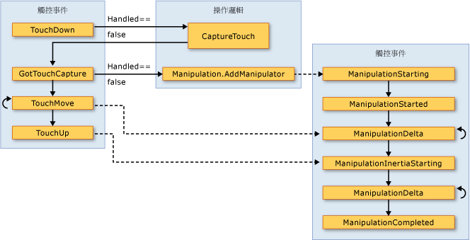

# 輸入概觀
 [!INCLUDE[TLA#tla_winclient](../../../../includes/tlasharptla-winclient-md.md)]子系統提供一個功能強大[!INCLUDE[TLA#tla_api](../../../../includes/tlasharptla-api-md.md)]各式各樣的裝置取得輸入，包括滑鼠、 鍵盤、 觸控及手寫筆。 本主題描述 [!INCLUDE[TLA2#tla_winclient](../../../../includes/tla2sharptla-winclient-md.md)] 所提供的服務，以及說明輸入系統的架構。

## 輸入 API
 主要輸入 API 公開位於基底類別： <xref:System.Windows.UIElement>， <xref:System.Windows.ContentElement>， <xref:System.Windows.FrameworkElement>，和<xref:System.Windows.FrameworkContentElement>。  如需基底項目的詳細資訊，請參閱[基底項目概觀](base-elements-overview.md)。  這些類別提供按鍵動作、滑鼠按鈕、滑鼠滾輪、滑鼠移動、焦點管理和滑鼠捕捉等相關輸入事件的功能。 藉由基底的項目，在放置輸入 API，而不是所有的輸入的事件視為一項服務，輸入的架構可讓輸入的事件來源的特定物件，在 UI 中，並支援事件路由配置，藉此讓一個以上的項目具有 opp若要處理輸入的事件 ortunity。 許多輸入事件都有一組與其建立關聯的事件。  例如，按鍵事件相關聯<xref:System.Windows.Input.Keyboard.KeyDown>和<xref:System.Windows.Input.Keyboard.PreviewKeyDown>事件。  這些事件的差異在於如何將它們路由傳送至目標項目。  預覽事件會從根項目到目標項目往下瀏覽通道項目樹狀結構。  事件反昇事件會從目標項目往上反昇到根項目。  這個概觀和[路由事件概觀](routed-events-overview.md)稍後會更詳細討論 [!INCLUDE[TLA2#tla_winclient](../../../../includes/tla2sharptla-winclient-md.md)] 中的事件路由。

### 鍵盤和滑鼠類別
 輸入 API 基底的項目類別，除了<xref:System.Windows.Input.Keyboard>類別和<xref:System.Windows.Input.Mouse>類別提供用於處理鍵盤和滑鼠輸入的其他 API。

 輸入 API 的範例<xref:System.Windows.Input.Keyboard>類別<xref:System.Windows.Input.Keyboard.Modifiers%2A>屬性，會傳回<xref:System.Windows.Input.ModifierKeys>目前已按下和<xref:System.Windows.Input.Keyboard.IsKeyDown%2A>方法，可判斷指定的索引鍵是否按下。

 下列範例會使用<xref:System.Windows.Input.Keyboard.GetKeyStates%2A>方法，可判斷<xref:System.Windows.Input.Key>處於關閉狀態。

 [!code-csharp[keyargssnippetsample#KeyEventArgsKeyBoardGetKeyStates](~/samples/snippets/csharp/VS_Snippets_Wpf/KeyArgsSnippetSample/CSharp/Window1.xaml.cs#keyeventargskeyboardgetkeystates)]
 [!code-vb[keyargssnippetsample#KeyEventArgsKeyBoardGetKeyStates](~/samples/snippets/visualbasic/VS_Snippets_Wpf/KeyArgsSnippetSample/visualbasic/window1.xaml.vb#keyeventargskeyboardgetkeystates)]

 輸入 API 的範例<xref:System.Windows.Input.Mouse>類別<xref:System.Windows.Input.Mouse.MiddleButton%2A>，取得滑鼠中間按鈕的狀態和<xref:System.Windows.Input.Mouse.DirectlyOver%2A>，此 cmdlet 會取得之項目的滑鼠指標目前位於上方。

 下列範例會判斷是否<xref:System.Windows.Input.Mouse.LeftButton%2A>滑鼠位於<xref:System.Windows.Input.MouseButtonState.Pressed>狀態。

 [!code-csharp[mouserelatedsnippets#MouseRelatedSnippetsGetLeftButtonMouse](~/samples/snippets/csharp/VS_Snippets_Wpf/MouseRelatedSnippets/CSharp/Window1.xaml.cs#mouserelatedsnippetsgetleftbuttonmouse)]
 [!code-vb[mouserelatedsnippets#MouseRelatedSnippetsGetLeftButtonMouse](~/samples/snippets/visualbasic/VS_Snippets_Wpf/MouseRelatedSnippets/visualbasic/window1.xaml.vb#mouserelatedsnippetsgetleftbuttonmouse)]

 <xref:System.Windows.Input.Mouse>和<xref:System.Windows.Input.Keyboard>類別所述本概觀的所有詳細資料。

### 手寫筆輸入
 [!INCLUDE[TLA2#tla_winclient](../../../../includes/tla2sharptla-winclient-md.md)] 已經整合的支援<xref:System.Windows.Input.Stylus>。  <xref:System.Windows.Input.Stylus>是所產生的熱門手寫筆輸入[!INCLUDE[TLA#tla_tpc](../../../../includes/tlasharptla-tpc-md.md)]。  [!INCLUDE[TLA2#tla_winclient](../../../../includes/tla2sharptla-winclient-md.md)] 應用程式可以將手寫筆視為滑鼠使用滑鼠 API，但[!INCLUDE[TLA2#tla_winclient](../../../../includes/tla2sharptla-winclient-md.md)]也會公開使用的模型類似鍵盤和滑鼠手寫筆裝置抽象概念。  所有手寫筆相關的 [!INCLUDE[TLA2#tla_api#plural](../../../../includes/tla2sharptla-apisharpplural-md.md)] 都會包含 "Stylus" 這個單字。

 因為手寫筆可以當作滑鼠，所以只支援滑鼠輸入的應用程式仍然可以自動取得某種程度的手寫筆支援。 以這種方式使用手寫筆時，應用程式可以處理適當的手寫筆事件，然後處理對應的滑鼠事件。 此外，還可以透過手寫筆裝置抽象概念來取得筆跡輸入這類較高階服務。  如需將筆跡作為輸入的詳細資訊，請參閱[筆跡入門](getting-started-with-ink.md)。

## 事件路由
 A<xref:System.Windows.FrameworkElement>可以包含其他項目，為其內容模型中形成項目樹狀結構中的子項目。  在 [!INCLUDE[TLA2#tla_winclient](../../../../includes/tla2sharptla-winclient-md.md)] 中，父項目可以透過處理事件，來參與導向至其子項目或其他子系的輸入。 這特別適用於透過較小的控制項來建置控制項，即稱為「控制項組合」或「組合」的程序。 如需項目樹狀結構以及項目樹狀結構與事件路由間之關聯性的詳細資訊，請參閱 [WPF 中的樹狀結構](trees-in-wpf.md)。

 事件路由是將事件轉遞至多個項目的程序，因此，沿著路由的特定物件或項目可以選擇將重大回應提供給不同項目可能設為來源的事件 (透過處理)。  路由事件使用三種路由機制中的其中一種︰直接、事件反昇和通道。  在直接路由中，來源項目是唯一收到通知的項目，而且不會將事件路由傳送至任何其他項目。 不過，直接路由事件仍會提供只有路由事件才能使用的一些額外功能，而不是標準 [!INCLUDE[TLA2#tla_clr](../../../../includes/tla2sharptla-clr-md.md)] 事件。 事件反昇處理項目樹狀結構的方式是先通知將事件設為來源的項目，接著通知父項目，依此類推。  通道會從項目樹狀結構的根項目開始，然後往下進行，並結束於原始來源項目。  如需路由事件的詳細資訊，請參閱[路由事件概觀](routed-events-overview.md)。

 [!INCLUDE[TLA2#tla_winclient](../../../../includes/tla2sharptla-winclient-md.md)] 輸入事件一般會成對出現，而此配對包含通道事件和事件反昇事件。  通道事件與事件反昇事件的區別在於 "Preview" 前置詞。  比方說，<xref:System.Windows.Input.Mouse.PreviewMouseMove>是通道版本的滑鼠移動事件和<xref:System.Windows.Input.Mouse.MouseMove>是此事件的事件反昇版本。 事件配對是一項在項目層級實作的慣例，而不是 [!INCLUDE[TLA2#tla_winclient](../../../../includes/tla2sharptla-winclient-md.md)] 事件系統的一項固有功能。 如需詳細資訊，請參閱[路由事件概觀](routed-events-overview.md)中的＜WPF 輸入事件＞一節。

## 處理輸入事件
 若要接收項目的輸入，事件處理常式必須與該特定事件建立關聯。  在 [!INCLUDE[TLA2#tla_xaml](../../../../includes/tla2sharptla-xaml-md.md)] 中，這相當簡單︰您可以參考事件名稱作為將接聽此事件之項目的屬性。  然後，您可以根據委派，將屬性的值設定為您所定義之事件處理常式的名稱。  事件處理常式必須以 C# 之類的程式碼撰寫，而且可以包含在程式碼後置檔案中。

 作業系統報告在鍵盤焦點位於項目時所發生的按鍵動作時，會發生鍵盤事件。 滑鼠和手寫筆事件各分為兩個分類︰報告相對於項目之指標位置變更的事件，以及報告裝置按鈕狀態變更的事件。

### 鍵盤輸入事件範例
 下列範例會接聽按下向左鍵作業。  A<xref:System.Windows.Controls.StackPanel>會建立具有<xref:System.Windows.Controls.Button>。  事件處理常式來接聽按下向左鍵會附加至<xref:System.Windows.Controls.Button>執行個體。

 此範例的第一個區段會建立<xref:System.Windows.Controls.StackPanel>而<xref:System.Windows.Controls.Button>，並將附加事件處理常式，如<xref:System.Windows.UIElement.KeyDown>。

 [!code-xaml[InputOvw#Input_OvwKeyboardExampleXAML](~/samples/snippets/csharp/VS_Snippets_Wpf/InputOvw/CSharp/Page1.xaml#input_ovwkeyboardexamplexaml)]

 [!code-csharp[InputOvw#Input_OvwKeyboardExampleUICodeBehind](~/samples/snippets/csharp/VS_Snippets_Wpf/InputOvw/CSharp/Page1.xaml.cs#input_ovwkeyboardexampleuicodebehind)]
 [!code-vb[InputOvw#Input_OvwKeyboardExampleUICodeBehind](~/samples/snippets/visualbasic/VS_Snippets_Wpf/InputOvw/VisualBasic/Page1.xaml.vb#input_ovwkeyboardexampleuicodebehind)]

 第二個區段是使用程式碼所撰寫，並定義事件處理常式。  按下向的左鍵時，<xref:System.Windows.Controls.Button>具有鍵盤焦點，執行處理常式和<xref:System.Windows.Controls.Control.Background%2A>色彩<xref:System.Windows.Controls.Button>變更。  如果按鍵，但它不是向的左鍵<xref:System.Windows.Controls.Control.Background%2A>色彩<xref:System.Windows.Controls.Button>變回其開始色彩。

 [!code-csharp[InputOvw#Input_OvwKeyboardExampleHandlerCodeBehind](~/samples/snippets/csharp/VS_Snippets_Wpf/InputOvw/CSharp/Page1.xaml.cs#input_ovwkeyboardexamplehandlercodebehind)]
 [!code-vb[InputOvw#Input_OvwKeyboardExampleHandlerCodeBehind](~/samples/snippets/visualbasic/VS_Snippets_Wpf/InputOvw/VisualBasic/Page1.xaml.vb#input_ovwkeyboardexamplehandlercodebehind)]

### 滑鼠輸入事件範例
 在下列範例中，<xref:System.Windows.Controls.Control.Background%2A>色彩<xref:System.Windows.Controls.Button>已變更時，滑鼠指標進入<xref:System.Windows.Controls.Button>。  <xref:System.Windows.Controls.Control.Background%2A>色彩就會在滑鼠離開時還原<xref:System.Windows.Controls.Button>。

 此範例的第一個區段會建立<xref:System.Windows.Controls.StackPanel>和<xref:System.Windows.Controls.Button>控制，並將附加事件處理常式<xref:System.Windows.UIElement.MouseEnter>並<xref:System.Windows.UIElement.MouseLeave>事件<xref:System.Windows.Controls.Button>。

 [!code-xaml[InputOvw#Input_OvwMouseExampleXAML](~/samples/snippets/csharp/VS_Snippets_Wpf/InputOvw/CSharp/Page1.xaml#input_ovwmouseexamplexaml)]

 [!code-csharp[InputOvw#Input_OvwMouseExampleUICodeBehind](~/samples/snippets/csharp/VS_Snippets_Wpf/InputOvw/CSharp/Page1.xaml.cs#input_ovwmouseexampleuicodebehind)]
 [!code-vb[InputOvw#Input_OvwMouseExampleUICodeBehind](~/samples/snippets/visualbasic/VS_Snippets_Wpf/InputOvw/VisualBasic/Page1.xaml.vb#input_ovwmouseexampleuicodebehind)]

 此範例的第二個區段是使用程式碼所撰寫，並定義事件處理常式。  當滑鼠進入<xref:System.Windows.Controls.Button>，則<xref:System.Windows.Controls.Control.Background%2A>色彩<xref:System.Windows.Controls.Button>變更為<xref:System.Windows.Media.Brushes.SlateGray%2A>。  當滑鼠離開<xref:System.Windows.Controls.Button>，則<xref:System.Windows.Controls.Control.Background%2A>色彩<xref:System.Windows.Controls.Button>變回<xref:System.Windows.Media.Brushes.AliceBlue%2A>。

 [!code-csharp[InputOvw#Input_OvwMouseExampleEneterHandler](~/samples/snippets/csharp/VS_Snippets_Wpf/InputOvw/CSharp/Page1.xaml.cs#input_ovwmouseexampleeneterhandler)]
 [!code-vb[InputOvw#Input_OvwMouseExampleEneterHandler](~/samples/snippets/visualbasic/VS_Snippets_Wpf/InputOvw/VisualBasic/Page1.xaml.vb#input_ovwmouseexampleeneterhandler)]

 [!code-csharp[InputOvw#Input_OvwMouseExampleLeaveHandler](~/samples/snippets/csharp/VS_Snippets_Wpf/InputOvw/CSharp/Page1.xaml.cs#input_ovwmouseexampleleavehandler)]
 [!code-vb[InputOvw#Input_OvwMouseExampleLeaveHandler](~/samples/snippets/visualbasic/VS_Snippets_Wpf/InputOvw/VisualBasic/Page1.xaml.vb#input_ovwmouseexampleleavehandler)]

## 文字輸入
 <xref:System.Windows.ContentElement.TextInput>事件可讓您以與裝置無關的方式接聽文字輸入。 鍵盤是文字輸入的主要方法，但是語音、手寫和其他輸入裝置也可以產生文字輸入。

 針對鍵盤輸入[!INCLUDE[TLA2#tla_winclient](../../../../includes/tla2sharptla-winclient-md.md)]首先會傳送適當<xref:System.Windows.ContentElement.KeyDown> / <xref:System.Windows.ContentElement.KeyUp>事件。 如果未處理這些事件，而且按鍵是文字而不是 （例如方向性箭號控制鍵） 或功能鍵，則會顯示<xref:System.Windows.ContentElement.TextInput>就會引發事件。  不一定都之間的簡單一對一對應<xref:System.Windows.ContentElement.KeyDown> / <xref:System.Windows.ContentElement.KeyUp>和<xref:System.Windows.ContentElement.TextInput>事件因為多個按鍵輸入可以產生文字輸入單一字元，而單一按鍵輸入可以產生多字元字串。  這特別適用於中文、日文和韓文這類語言，而這類語言使用 [!INCLUDE[TLA#tla_ime#plural](../../../../includes/tlasharptla-imesharpplural-md.md)] 來產生其對應字母的數千個可能字元。

 當[!INCLUDE[TLA2#tla_winclient](../../../../includes/tla2sharptla-winclient-md.md)]傳送<xref:System.Windows.ContentElement.KeyUp> / <xref:System.Windows.ContentElement.KeyDown>事件，<xref:System.Windows.Input.KeyEventArgs.Key%2A>設為<xref:System.Windows.Input.Key.System?displayProperty=nameWithType>如果按鍵動作可能會變得一部分<xref:System.Windows.ContentElement.TextInput>（ALT + S 按下時，例如） 的事件。 這可讓程式碼中的<xref:System.Windows.ContentElement.KeyDown>若要檢查的事件處理常式<xref:System.Windows.Input.Key.System?displayProperty=nameWithType>而且，如果找到，之後引發的處理常式處理<xref:System.Windows.ContentElement.TextInput>事件。 在這些情況下的各種屬性<xref:System.Windows.Input.TextCompositionEventArgs>引數可以用來判斷原始按鍵輸入。 同樣地，如果[!INCLUDE[TLA2#tla_ime](../../../../includes/tla2sharptla-ime-md.md)]作用中<xref:System.Windows.Input.Key>的值為<xref:System.Windows.Input.Key.ImeProcessed?displayProperty=nameWithType>，和<xref:System.Windows.Input.KeyEventArgs.ImeProcessedKey%2A>提供原始的按鍵輸入。

 下列範例會定義的處理常式<xref:System.Windows.Controls.Primitives.ButtonBase.Click>事件和處理常式<xref:System.Windows.UIElement.KeyDown>事件。

 程式碼或標記的第一個區段會建立使用者介面。

 [!code-xaml[InputOvw#Input_OvwTextInputXAML](~/samples/snippets/csharp/VS_Snippets_Wpf/InputOvw/CSharp/Page1.xaml#input_ovwtextinputxaml)]

 [!code-csharp[InputOvw#Input_OvwTextInputUICodeBehind](~/samples/snippets/csharp/VS_Snippets_Wpf/InputOvw/CSharp/Page1.xaml.cs#input_ovwtextinputuicodebehind)]
 [!code-vb[InputOvw#Input_OvwTextInputUICodeBehind](~/samples/snippets/visualbasic/VS_Snippets_Wpf/InputOvw/VisualBasic/Page1.xaml.vb#input_ovwtextinputuicodebehind)]

 程式碼的第二個區段包含事件處理常式。

 [!code-csharp[InputOvw#Input_OvwTextInputHandlersCodeBehind](~/samples/snippets/csharp/VS_Snippets_Wpf/InputOvw/CSharp/Page1.xaml.cs#input_ovwtextinputhandlerscodebehind)]
 [!code-vb[InputOvw#Input_OvwTextInputHandlersCodeBehind](~/samples/snippets/visualbasic/VS_Snippets_Wpf/InputOvw/VisualBasic/Page1.xaml.vb#input_ovwtextinputhandlerscodebehind)]

 輸入的事件反昇事件路由，因為<xref:System.Windows.Controls.StackPanel>接收的輸入不論哪個項目具有鍵盤焦點。 <xref:System.Windows.Controls.TextBox>先收到通知控制項和`OnTextInputKeyDown`才會呼叫處理常式<xref:System.Windows.Controls.TextBox>沒有處理輸入。 如果<xref:System.Windows.UIElement.PreviewKeyDown>而不是使用事件<xref:System.Windows.UIElement.KeyDown>事件，`OnTextInputKeyDown`第一次呼叫處理常式。

 在此範例中，處理邏輯會撰寫兩次：一次針對 CTRL+O，一次則是針對按鈕的 Click 事件。 這可以使用命令進行簡化，而不是直接處理輸入事件。  這個概觀和[命令概觀](commanding-overview.md)討論命令。

## 觸控和操作
 Windows 7 作業系統中的新硬體和 API 讓應用程式可以同時接收來自多個觸控的輸入。 [!INCLUDE[TLA2#tla_winclient](../../../../includes/tla2sharptla-winclient-md.md)] 可讓應用程式在發生觸控時引發事件，以透過回應其他輸入 (例如滑鼠或鍵盤) 的類似方式來偵測和回應觸控。

 [!INCLUDE[TLA2#tla_winclient](../../../../includes/tla2sharptla-winclient-md.md)] 會在觸控發生時公開兩種類型的事件︰觸控事件和操作事件。 觸控事件提供觸控式螢幕上每根手指的未經處理資料和其移動。 操作事件會將輸入解譯成特定動作。 本節討論這兩種類型的事件。

### 必要條件
 您需要下列元件，才能開發回應觸控的應用程式。

- Visual Studio 2010。

- Windows 7。

- 支援 Windows Touch 的觸控式螢幕這類裝置。

### 用語
 討論觸控時，會使用下列詞彙。

- **觸控**是 Windows 7 可辨識的一種使用者輸入類型。 通常，將手指放在觸控式螢幕上，就會起始觸控。 請注意，如果裝置只會將手指的位置和移動轉換為滑鼠輸入，則膝上型電腦上常見的觸控板這類裝置不支援觸控。

- **多點觸控**是同時從多點發生的觸控。 Windows 7 和 [!INCLUDE[TLA2#tla_winclient](../../../../includes/tla2sharptla-winclient-md.md)] 支援多點觸控。 只要 [!INCLUDE[TLA2#tla_winclient](../../../../includes/tla2sharptla-winclient-md.md)] 文件討論觸控，這些概念就適用於多點觸控。

- 將觸控解譯為套用至物件的實體動作時，會發生**操作**。 在 [!INCLUDE[TLA2#tla_winclient](../../../../includes/tla2sharptla-winclient-md.md)] 中，操作事件會將輸入解譯為平移、擴充或旋轉操作。

- `touch device` 所代表的裝置會產生觸控式螢幕上的一根手指這類觸控輸入。

### 回應觸控的控制項
 如果控制項具有可捲動到檢視外部的內容，則將手指拖曳過該控制項即可捲動下列控制項。

- <xref:System.Windows.Controls.ComboBox>

- <xref:System.Windows.Controls.ContextMenu>

- <xref:System.Windows.Controls.DataGrid>

- <xref:System.Windows.Controls.ListBox>

- <xref:System.Windows.Controls.ListView>

- <xref:System.Windows.Controls.MenuItem>

- <xref:System.Windows.Controls.TextBox>

- <xref:System.Windows.Controls.ToolBar>

- <xref:System.Windows.Controls.TreeView>

 <xref:System.Windows.Controls.ScrollViewer>定義<xref:System.Windows.Controls.ScrollViewer.PanningMode%2A?displayProperty=nameWithType>附加屬性，可讓您指定的觸控式移動瀏覽是否已啟用的水平、 垂直、 兩者皆非。 <xref:System.Windows.Controls.ScrollViewer.PanningDeceleration%2A?displayProperty=nameWithType>屬性會指定如何快速捲動變慢時使用者將移開觸控螢幕手指。 <xref:System.Windows.Controls.ScrollViewer.PanningRatio%2A?displayProperty=nameWithType>附加的屬性指定捲動位移對轉譯操作位移的比例。

### 觸控事件
 基底類別中， <xref:System.Windows.UIElement>， <xref:System.Windows.UIElement3D>，和<xref:System.Windows.ContentElement>，定義您可以訂閱讓您的應用程式回應觸控的事件。 您的應用程式將觸控解譯為非操作物件的動作時，觸控事件十分有用。 例如，可讓使用者使用一或多根手指繪製的應用程式訂閱觸控事件。

 不論定義類別為何，所有這三個類別都會定義下列行為類似的事件。

- <xref:System.Windows.UIElement.TouchDown>

- <xref:System.Windows.UIElement.TouchMove>

- <xref:System.Windows.UIElement.TouchUp>

- <xref:System.Windows.UIElement.TouchEnter>

- <xref:System.Windows.UIElement.TouchLeave>

- <xref:System.Windows.UIElement.PreviewTouchDown>

- <xref:System.Windows.UIElement.PreviewTouchMove>

- <xref:System.Windows.UIElement.PreviewTouchUp>

- <xref:System.Windows.UIElement.GotTouchCapture>

- <xref:System.Windows.UIElement.LostTouchCapture>

 與鍵盤和滑鼠事件類似，觸控事件都是路由事件。 開頭為 `Preview` 的事件是通道事件，而開頭為 `Touch` 的事件是事件反昇事件。 如需路由事件的詳細資訊，請參閱[路由事件概觀](routed-events-overview.md)。 當您處理這些事件時，您可以取得位置的輸入，相對於任何項目，藉由呼叫<xref:System.Windows.Input.TouchEventArgs.GetTouchPoint%2A>或<xref:System.Windows.Input.TouchEventArgs.GetIntermediateTouchPoints%2A>方法。

 若要了解觸控事件之間的互動，請考慮在使用者將一根手指放在項目上，並將手指移至項目中，然後將手指移開項目。 下圖顯示事件反昇事件的執行 (為求簡化，會省略通道事件)。

 觸控事件

 下列清單描述上圖中的事件順序。

1. <xref:System.Windows.UIElement.TouchEnter>事件，就會發生一次，當使用者將手指放在項目。

2. <xref:System.Windows.UIElement.TouchDown>事件會發生一次。

3. <xref:System.Windows.UIElement.TouchMove>事件會發生多次，當使用者移動手指在項目。

4. <xref:System.Windows.UIElement.TouchUp>事件，就會發生一次，當使用者將手指從項目。

5. <xref:System.Windows.UIElement.TouchLeave>事件會發生一次。

 使用兩根以上的手指時，每根手指都會發生這些事件。

### 操作事件
 應用程式可讓使用者操作物件，其中的情況下<xref:System.Windows.UIElement>類別會定義操作事件。 與只會報告觸控位置的觸控事件不同，操作事件會報告輸入解譯方式。 操作有三種類型：平移、擴充和旋轉。 下列清單描述如何叫用這三種類型的操作。

- 將手指放在物件上，然後將手指移過觸控式螢幕，以叫用轉譯操作。 這通常會移動物件。

- 將兩根手指放在物件上，然後拉近兩根手指或分開兩根手指，以叫用擴充操作。 這通常會調整物件大小。

- 將兩根手指放在物件上，然後旋轉這兩根手指，以叫用旋轉操作。 這通常會旋轉物件。

 可以同時進行多種類型的操作。

 當您讓物件回應操作時，可以讓物件看起來像有慣性。 這可讓您的物件模擬真實世界。 例如，當您在桌上推動書本時，如果推得夠用力，則在放開書本之後，書本還會繼續移動。 [!INCLUDE[TLA2#tla_winclient](../../../../includes/tla2sharptla-winclient-md.md)] 可讓您透過在使用者的手指放開物件之後引發操作事件，來模擬此行為。

 如需有關如何建立應用程式，可讓使用者移動、 調整大小，以及旋轉物件的資訊，請參閱[逐步解說：建立您的第一個觸控應用程式](walkthrough-creating-your-first-touch-application.md)。

 <xref:System.Windows.UIElement>定義下列操作事件。

- <xref:System.Windows.UIElement.ManipulationStarting>

- <xref:System.Windows.UIElement.ManipulationStarted>

- <xref:System.Windows.UIElement.ManipulationDelta>

- <xref:System.Windows.UIElement.ManipulationInertiaStarting>

- <xref:System.Windows.UIElement.ManipulationCompleted>

- <xref:System.Windows.UIElement.ManipulationBoundaryFeedback>

 根據預設，<xref:System.Windows.UIElement>不會收到這些操作事件。 操作事件，即可<xref:System.Windows.UIElement>，將<xref:System.Windows.UIElement.IsManipulationEnabled%2A?displayProperty=nameWithType>至`true`。

#### 操作事件的執行路徑
 請考慮使用者「擲回」物件的情況。 使用者將手指放在物件上，並將手指移過觸控式螢幕的一小段距離，然後在移動時移開手指。 這樣的結果是會移動使用者手指下方的物件，並在使用者移開手指之後繼續移動。

 下圖顯示操作事件的執行路徑以及每個事件的重要資訊。

 操作事件

 下列清單描述上圖中的事件順序。

1. <xref:System.Windows.UIElement.ManipulationStarting>事件發生於使用者將手指放在物件上。 除此之外，此事件可讓您設定<xref:System.Windows.Input.ManipulationStartingEventArgs.ManipulationContainer%2A>屬性。 在後續事件中，操作位置會相對於<xref:System.Windows.Input.ManipulationStartingEventArgs.ManipulationContainer%2A>。 在事件以外<xref:System.Windows.UIElement.ManipulationStarting>，這個屬性是唯讀的因此<xref:System.Windows.UIElement.ManipulationStarting>事件是唯一的時候，您可以設定此屬性。

2. <xref:System.Windows.UIElement.ManipulationStarted>接下來發生的事件。 此事件會報告操作的原點。

3. <xref:System.Windows.UIElement.ManipulationDelta>事件會發生多次使用者手指移過觸控式螢幕上。 <xref:System.Windows.Input.ManipulationDeltaEventArgs.DeltaManipulation%2A>屬性<xref:System.Windows.Input.ManipulationDeltaEventArgs>類別會報告操作是否會解譯為移動、 擴充還是平移。 這是您執行大部分物件操作工作的位置。

4. <xref:System.Windows.UIElement.ManipulationInertiaStarting>使用者手指遺失接觸物件時，就會發生事件。 此事件可讓您指定慣性期間的操作減速。 因此，如果選擇的話，您的物件可以模擬不同的實體空間或屬性。 例如，假設應用程式有兩個物件代表真實世界中的項目，而且其中一個比另一個重。 您可以將較重的物件減速，使其比較輕的物件更快。

5. <xref:System.Windows.UIElement.ManipulationDelta>事件在慣性發生時，就會發生多次。 請注意，使用者手指移過觸控式螢幕時，以及 [!INCLUDE[TLA2#tla_winclient](../../../../includes/tla2sharptla-winclient-md.md)] 模擬慣性時，都會發生此事件。 亦即<xref:System.Windows.UIElement.ManipulationDelta>之前和之後，就會發生<xref:System.Windows.UIElement.ManipulationInertiaStarting>事件。 <xref:System.Windows.Input.ManipulationDeltaEventArgs.IsInertial%2A?displayProperty=nameWithType>屬性的報表是否<xref:System.Windows.UIElement.ManipulationDelta>事件發生期間慣性，因此您可以檢查該屬性，以及執行不同的動作，其值而定。

6. <xref:System.Windows.UIElement.ManipulationCompleted>就會發生事件的操作和任何慣性結束時。 也就是說，畢竟<xref:System.Windows.UIElement.ManipulationDelta>事件發生，<xref:System.Windows.UIElement.ManipulationCompleted>來表示已完成的操作就會發生事件。

 <xref:System.Windows.UIElement>也會定義<xref:System.Windows.UIElement.ManipulationBoundaryFeedback>事件。 這個事件發生時<xref:System.Windows.Input.ManipulationDeltaEventArgs.ReportBoundaryFeedback%2A>方法呼叫<xref:System.Windows.UIElement.ManipulationDelta>事件。 <xref:System.Windows.UIElement.ManipulationBoundaryFeedback>事件可讓應用程式或元件在物件到達界限時提供視覺化回饋。 例如，<xref:System.Windows.Window>類別控制代碼<xref:System.Windows.UIElement.ManipulationBoundaryFeedback>事件，讓視窗在遇到其邊緣時稍微移動。

 您可以藉由呼叫取消操作<xref:System.Windows.Input.ManipulationStartingEventArgs.Cancel%2A>以外的任何操作事件中的事件引數的方法<xref:System.Windows.UIElement.ManipulationBoundaryFeedback>事件。 當您呼叫<xref:System.Windows.Input.ManipulationStartingEventArgs.Cancel%2A>不會再引發操作事件，會發生觸控的滑鼠事件。 下表描述操作取消時間與所發生的滑鼠事件之間的關聯性。

|其中呼叫 Cancel 的事件|針對已發生之輸入所發生的滑鼠事件|
|----------------------------------------|-----------------------------------------------------------------|
|<xref:System.Windows.UIElement.ManipulationStarting> 和 <xref:System.Windows.UIElement.ManipulationStarted>|滑鼠向下事件。|
|<xref:System.Windows.UIElement.ManipulationDelta>|滑鼠向下和滑鼠移動事件。|
|<xref:System.Windows.UIElement.ManipulationInertiaStarting> 和 <xref:System.Windows.UIElement.ManipulationCompleted>|滑鼠向下、滑鼠移動和滑鼠向上事件。|

 請注意，如果您呼叫<xref:System.Windows.Input.ManipulationStartingEventArgs.Cancel%2A>時的操作處於慣性時，此方法會傳回`false`和輸入不會引發滑鼠事件。

### 觸控與操作事件之間的關聯性
 A<xref:System.Windows.UIElement>一律可以收到觸控事件。 當<xref:System.Windows.UIElement.IsManipulationEnabled%2A>屬性設定為`true`、<xref:System.Windows.UIElement>可以接收觸控和操作事件。  如果<xref:System.Windows.UIElement.TouchDown>未處理事件 (亦即<xref:System.Windows.RoutedEventArgs.Handled%2A>屬性是`false`)，操作邏輯會擷取項目的觸控，並產生操作事件。 如果<xref:System.Windows.RoutedEventArgs.Handled%2A>屬性設定為`true`在<xref:System.Windows.UIElement.TouchDown>事件，操作邏輯不會產生操作事件。 下圖示範觸控事件與操作事件之間的關聯性。

 觸控與操作事件

 下列清單描述上圖中所顯示之觸控事件與操作事件間的關聯性。

- 當第一個觸控裝置會產生<xref:System.Windows.UIElement.TouchDown>上的事件<xref:System.Windows.UIElement>，操作邏輯呼叫<xref:System.Windows.UIElement.CaptureTouch%2A>方法，以產生<xref:System.Windows.UIElement.GotTouchCapture>事件。

- 當<xref:System.Windows.UIElement.GotTouchCapture>發生時，操作邏輯呼叫<xref:System.Windows.Input.Manipulation.AddManipulator%2A?displayProperty=nameWithType>方法，以產生<xref:System.Windows.UIElement.ManipulationStarting>事件。

- 當<xref:System.Windows.UIElement.TouchMove>事件發生時，操作邏輯會產生<xref:System.Windows.UIElement.ManipulationDelta>之前發生的事件<xref:System.Windows.UIElement.ManipulationInertiaStarting>事件。

- 當最後一個觸控裝置的項目就會引發<xref:System.Windows.UIElement.TouchUp>事件，操作邏輯會產生<xref:System.Windows.UIElement.ManipulationInertiaStarting>事件。

## 焦點
 [!INCLUDE[TLA2#tla_winclient](../../../../includes/tla2sharptla-winclient-md.md)] 中有兩個關於焦點的主要概念︰鍵盤焦點和邏輯焦點。

### 鍵盤焦點
 鍵盤焦點是指接收鍵盤輸入的項目。  整個桌面只能有一個項目有鍵盤焦點。  在  [!INCLUDE[TLA2#tla_winclient](../../../../includes/tla2sharptla-winclient-md.md)]，具有鍵盤焦點的項目會有<xref:System.Windows.IInputElement.IsKeyboardFocused%2A>設定為`true`。  靜態<xref:System.Windows.Input.Keyboard>方法<xref:System.Windows.Input.Keyboard.FocusedElement%2A>傳回目前具有鍵盤焦點的項目。

 可以取得鍵盤焦點，按下 tab 鍵的項目，或按一下將滑鼠停在特定項目，例如<xref:System.Windows.Controls.TextBox>。  鍵盤焦點，還可以取得以程式設計方式使用<xref:System.Windows.Input.Keyboard.Focus%2A>方法<xref:System.Windows.Input.Keyboard>類別。  <xref:System.Windows.Input.Keyboard.Focus%2A> 嘗試將指定的項目鍵盤焦點。  所傳回的項目<xref:System.Windows.Input.Keyboard.Focus%2A>是目前具有鍵盤焦點的項目。

 為了讓項目取得鍵盤焦點<xref:System.Windows.UIElement.Focusable%2A>屬性和<xref:System.Windows.UIElement.IsVisible%2A>屬性必須設為 **，則為 true**。  部分類別，例如<xref:System.Windows.Controls.Panel>，具有<xref:System.Windows.UIElement.Focusable%2A>設為`false`的預設值; 因此，您可能要將此屬性設定為`true`如果您想要能夠取得焦點的項目。

 下列範例會使用<xref:System.Windows.Input.Keyboard.Focus%2A>上設定鍵盤焦點<xref:System.Windows.Controls.Button>。  應用程式中設定初始焦點的建議的位置是在<xref:System.Windows.FrameworkElement.Loaded>事件處理常式。

 [!code-csharp[focussample#FocusSampleSetFocus](~/samples/snippets/csharp/VS_Snippets_Wpf/FocusSample/CSharp/Window1.xaml.cs#focussamplesetfocus)]
 [!code-vb[focussample#FocusSampleSetFocus](~/samples/snippets/visualbasic/VS_Snippets_Wpf/FocusSample/visualbasic/window1.xaml.vb#focussamplesetfocus)]

 如需鍵盤焦點的詳細資訊，請參閱[焦點概觀](focus-overview.md)。

### 邏輯焦點
 邏輯焦點是指<xref:System.Windows.Input.FocusManager.FocusedElement%2A?displayProperty=nameWithType>焦點範圍中。  應用程式中可以有多個具有邏輯焦點的項目，但特定的焦點範圍中只能有一個有邏輯焦點的項目。

 焦點範圍是在容器項目追蹤<xref:System.Windows.Input.FocusManager.FocusedElement%2A>其範圍內。  當焦點離開焦點範圍時，焦點項目就會失去鍵盤焦點，但卻仍然保有邏輯焦點。  當焦點回到焦點範圍時，焦點項目就會取得鍵盤焦點。  這讓鍵盤焦點能在多個焦點範圍間變更，但確保焦點範圍內的焦點項目仍是焦點返回時的焦點項目。

 項目可以轉換成焦點範圍[!INCLUDE[TLA#tla_xaml](../../../../includes/tlasharptla-xaml-md.md)]藉由設定<xref:System.Windows.Input.FocusManager>附加屬性<xref:System.Windows.Input.FocusManager.IsFocusScope%2A>要`true`，或藉由設定附加的屬性使用的程式碼中<xref:System.Windows.Input.FocusManager.SetIsFocusScope%2A>方法。

 下列範例會使<xref:System.Windows.Controls.StackPanel>成焦點範圍，藉由設定<xref:System.Windows.Input.FocusManager.IsFocusScope%2A>附加屬性。

 [!code-xaml[MarkupSnippets#MarkupIsFocusScopeXAML](~/samples/snippets/csharp/VS_Snippets_Wpf/MarkupSnippets/CSharp/Window1.xaml#markupisfocusscopexaml)]

 [!code-csharp[FocusSnippets#FocusSetIsFocusScope](~/samples/snippets/csharp/VS_Snippets_Wpf/FocusSnippets/CSharp/Window1.xaml.cs#focussetisfocusscope)]
 [!code-vb[FocusSnippets#FocusSetIsFocusScope](~/samples/snippets/visualbasic/VS_Snippets_Wpf/FocusSnippets/visualbasic/window1.xaml.vb#focussetisfocusscope)]

 中的類別[!INCLUDE[TLA2#tla_winclient](../../../../includes/tla2sharptla-winclient-md.md)]是焦點範圍，預設為<xref:System.Windows.Window>， <xref:System.Windows.Controls.Menu>， <xref:System.Windows.Controls.ToolBar>，和<xref:System.Windows.Controls.ContextMenu>。

 具有鍵盤焦點的項目也會有邏輯焦點; 它所屬焦點範圍因此，在具有的項目上設定焦點<xref:System.Windows.Input.Keyboard.Focus%2A>方法<xref:System.Windows.Input.Keyboard>類別或基底類別會嘗試提供的項目鍵盤焦點和邏輯焦點。

 若要判斷焦點範圍中的焦點項目，請使用<xref:System.Windows.Input.FocusManager.GetFocusedElement%2A>。 若要變更焦點範圍的焦點項目，請使用<xref:System.Windows.Input.FocusManager.SetFocusedElement%2A>。

 如需邏輯焦點的詳細資訊，請參閱[焦點概觀](focus-overview.md)。

## 滑鼠位置
 [!INCLUDE[TLA2#tla_winclient](../../../../includes/tla2sharptla-winclient-md.md)]輸入 API 提供有關座標空間的有用資訊。  例如，座標 `(0,0)` 是左上角的座標，但樹狀結構中的項目左上方為何？ 為輸入目標的項目？ 附加事件處理常式的項目？ 或其他事項？ 為了避免混淆，[!INCLUDE[TLA2#tla_winclient](../../../../includes/tla2sharptla-winclient-md.md)]輸入 API 會要求您指定參考框架，當您使用透過滑鼠取得的座標。 <xref:System.Windows.Input.Mouse.GetPosition%2A>方法會傳回滑鼠指標相對於指定項目的座標。

## 滑鼠捕捉
 滑鼠裝置專門保留稱為滑鼠捕捉的強制回應特性。 滑鼠捕捉是用來維護啟動拖放作業後的轉換輸入狀態；因此，不一定會發生涉及滑鼠指標之額定螢幕位置的其他作業。 拖曳期間，使用者按一下就會中止拖放，這樣會在拖曳原點持有滑鼠捕捉時，讓大部分的 mouseover 提示為不適當。 輸入系統會公開可判斷滑鼠捕捉狀態的 [!INCLUDE[TLA2#tla_api#plural](../../../../includes/tla2sharptla-apisharpplural-md.md)]，以及可強制滑鼠捕捉到特定項目或清除滑鼠捕捉狀態的 [!INCLUDE[TLA2#tla_api#plural](../../../../includes/tla2sharptla-apisharpplural-md.md)]。 如需拖放作業的詳細資訊，請參閱[拖放概觀](drag-and-drop-overview.md)。

## 命令
 命令比裝置輸入更接近語意層級的輸入處理。  命令是簡單指示詞，例如 `Cut`、`Copy`、`Paste` 或 `Open`。  命令適用於將命令邏輯集中。  可能會存取相同的命令，從<xref:System.Windows.Controls.Menu>上<xref:System.Windows.Controls.ToolBar>，或透過鍵盤快速鍵。 命令也提供一種機制，可在命令變成無法使用時停用控制項。

 <xref:System.Windows.Input.RoutedCommand> 已[!INCLUDE[TLA2#tla_winclient](../../../../includes/tla2sharptla-winclient-md.md)]實作<xref:System.Windows.Input.ICommand>。  當<xref:System.Windows.Input.RoutedCommand>執行時，<xref:System.Windows.Input.CommandManager.PreviewExecuted>和<xref:System.Windows.Input.CommandManager.Executed>的通道和反昇到項目樹狀結構，例如其他輸入的命令目標上引發事件。  如果未設定命令目標，則具有鍵盤焦點的項目就是命令目標。  執行該命令的邏輯會附加至<xref:System.Windows.Input.CommandBinding>。  當<xref:System.Windows.Input.CommandManager.Executed>事件到達<xref:System.Windows.Input.CommandBinding>會針對該特定的命令<xref:System.Windows.Input.ExecutedRoutedEventHandler>上<xref:System.Windows.Input.CommandBinding>呼叫。  此處理常式會執行命令的動作。

 如需命令的詳細資訊，請參閱[命令概觀](commanding-overview.md)。

 [!INCLUDE[TLA2#tla_winclient](../../../../includes/tla2sharptla-winclient-md.md)] 提供常用的命令，其中包含程式庫<xref:System.Windows.Input.ApplicationCommands>， <xref:System.Windows.Input.MediaCommands>， <xref:System.Windows.Input.ComponentCommands>， <xref:System.Windows.Input.NavigationCommands>，和<xref:System.Windows.Documents.EditingCommands>，或者您也可以定義自己。

 下列範例示範如何設定<xref:System.Windows.Controls.MenuItem>以便在按一下時它會叫用<xref:System.Windows.Input.ApplicationCommands.Paste%2A>命令<xref:System.Windows.Controls.TextBox>，假設<xref:System.Windows.Controls.TextBox>具有鍵盤焦點。

 [!code-xaml[CommandingOverviewSnippets#CommandingOverviewSimpleCommand](~/samples/snippets/csharp/VS_Snippets_Wpf/CommandingOverviewSnippets/CSharp/Window1.xaml#commandingoverviewsimplecommand)]

 [!code-csharp[CommandingOverviewSnippets#CommandingOverviewCommandTargetCodeBehind](~/samples/snippets/csharp/VS_Snippets_Wpf/CommandingOverviewSnippets/CSharp/Window1.xaml.cs#commandingoverviewcommandtargetcodebehind)]
 [!code-vb[CommandingOverviewSnippets#CommandingOverviewCommandTargetCodeBehind](~/samples/snippets/visualbasic/VS_Snippets_Wpf/CommandingOverviewSnippets/visualbasic/window1.xaml.vb#commandingoverviewcommandtargetcodebehind)]

 如需 [!INCLUDE[TLA2#tla_winclient](../../../../includes/tla2sharptla-winclient-md.md)] 中命令的詳細資訊，請參閱[命令概觀](commanding-overview.md)。

## 輸入系統和基底項目
 輸入事件，例如所定義的附加事件<xref:System.Windows.Input.Mouse>， <xref:System.Windows.Input.Keyboard>，和<xref:System.Windows.Input.Stylus>類別已輸入的系統產生的並插入至點擊測試視覺化樹狀結構在執行階段為基礎的物件模型中的特定位置。

 每個事件， <xref:System.Windows.Input.Mouse>， <xref:System.Windows.Input.Keyboard>，並<xref:System.Windows.Input.Stylus>定義為附加的事件也會重新公開在基底類別所<xref:System.Windows.UIElement>和<xref:System.Windows.ContentElement>做為新的路由事件。 可處理原始附加事件並重複使用事件資料的類別會產生基底項目路由事件。

 輸入事件透過其基底項目輸入事件實作與特定來源項目建立關聯時，可以透過事件路由的其餘部分進行路由傳送，而其乃根據邏輯和視覺化樹狀結構物件的組合，並透過應用程式碼進行處理。  一般而言，是更方便地處理這些裝置相關輸入的事件上使用路由的事件<xref:System.Windows.UIElement>並<xref:System.Windows.ContentElement>，因為您可以使用更直覺式事件處理常式語法[!INCLUDE[TLA2#tla_xaml](../../../../includes/tla2sharptla-xaml-md.md)]和程式碼中。 您可以選擇改為處理已初始程序的附加事件，但會遇到幾個問題︰基底項目類別處理可能會將附加事件標記為已處理，而且您需要使用存取子方法，而不是真正事件語法，才能附加所附加事件的處理常式。

## 後續步驟
 您現在有數種方式可處理 [!INCLUDE[TLA2#tla_winclient](../../../../includes/tla2sharptla-winclient-md.md)] 中的輸入。  您也應該進一步了解各種類型的輸入事件以及 [!INCLUDE[TLA2#tla_winclient](../../../../includes/tla2sharptla-winclient-md.md)] 所使用的路由事件機制。

 具有其他資源可詳細說明 [!INCLUDE[TLA2#tla_winclient](../../../../includes/tla2sharptla-winclient-md.md)] 架構項目和事件路由。 如需詳細資訊，請參閱下列概觀：[命令概觀](commanding-overview.md)、[焦點概觀](focus-overview.md)、[基底項目概觀](base-elements-overview.md)、[WPF 中的樹狀結構](trees-in-wpf.md)和[路由事件概觀](routed-events-overview.md)。

## 另請參閱

- [焦點概觀](focus-overview.md)
- [命令概觀](commanding-overview.md)
- [路由事件概觀](routed-events-overview.md)
- [基底項目概觀](base-elements-overview.md)
- [屬性](properties-wpf.md)
