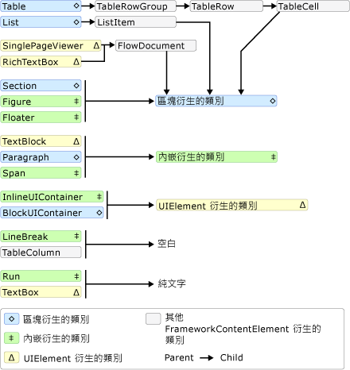

# TextElement 內容模型概觀
此內容模型概述描述 受 支援的內容<xref:System.Windows.Documents.TextElement>。 類<xref:System.Windows.Documents.Paragraph>是 一<xref:System.Windows.Documents.TextElement>種 類型。 內容模型描述哪些物件/元素可包含於其他物件/元素內。 此概述總結了用於派生從<xref:System.Windows.Documents.TextElement>的物件的內容模型。 有關詳細資訊，請參閱[流文檔概述](flow-document-overview.md)。  

## 內容模型圖表  
 下圖總結了派生自類<xref:System.Windows.Documents.TextElement>的內容模型以及其他非`TextElement`類如何適應此模型。  
  
   
  
 從上圖可以看出，允許元素的子級不一定由類派生自<xref:System.Windows.Documents.Block>類或<xref:System.Windows.Documents.Inline>類來決定。 例如，（<xref:System.Windows.Documents.Span>派生<xref:System.Windows.Documents.Inline>類）只能具有<xref:System.Windows.Documents.Inline>子項目，但 （<xref:System.Windows.Documents.Figure>也是<xref:System.Windows.Documents.Inline>派生類） 只能具有<xref:System.Windows.Documents.Block>子項目。 因此，可快速判斷哪個元素可包含於其他元素中的圖表就很有用。 例如，讓我們使用關係圖來確定如何構造 的流內容<xref:System.Windows.Controls.RichTextBox>。  
  
1. 必須<xref:System.Windows.Controls.RichTextBox>包含又必須<xref:System.Windows.Documents.FlowDocument>包含<xref:System.Windows.Documents.Block>派生物件的 。 以下是上圖的對應區段。  
  
       
  
     這是標記目前可能的樣子。  
  
     [!code-xaml[FlowOvwSnippets_snip#SchemaWalkThrough1](~/samples/snippets/csharp/VS_Snippets_Wpf/FlowOvwSnippets_snip/CS/MiscSnippets.xaml#schemawalkthrough1)]  
  
2. 根據該<xref:System.Windows.Documents.Block>圖，有幾個元素可供選擇，<xref:System.Windows.Documents.Paragraph><xref:System.Windows.Documents.Section>包括 、、<xref:System.Windows.Documents.Table>和<xref:System.Windows.Documents.List> <xref:System.Windows.Documents.BlockUIContainer> （請參閱上圖中的塊派生類）。 假設我們想要一個<xref:System.Windows.Documents.Table>。 根據上圖，<xref:System.Windows.Documents.Table>包含<xref:System.Windows.Documents.TableRowGroup><xref:System.Windows.Documents.TableRow>的元素包含元素，其中包含包含<xref:System.Windows.Documents.TableCell><xref:System.Windows.Documents.Block>派生物件的元素。 以下是從上圖<xref:System.Windows.Documents.Table>中獲取的相應段。  
  
       
  
     以下是對應的標記。  
  
     [!code-xaml[FlowOvwSnippets_snip#SchemaWalkThrough2](~/samples/snippets/csharp/VS_Snippets_Wpf/FlowOvwSnippets_snip/CS/MiscSnippets.xaml#schemawalkthrough2)]  
  
3. 同樣，在 下<xref:System.Windows.Documents.Block>需要一<xref:System.Windows.Documents.TableCell>個或多個元素。 為求簡便，我們在儲存格中放入一些文字。 我們可以使用 元素的<xref:System.Windows.Documents.Paragraph> <xref:System.Windows.Documents.Run> 下面是關係圖中的相應段，<xref:System.Windows.Documents.Paragraph>顯示 a 可以獲取<xref:System.Windows.Documents.Inline>元素，<xref:System.Windows.Documents.Run>並且 （元素<xref:System.Windows.Documents.Inline>） 只能採用純文字。  
  
       
  
       
  
 以下是標記的完整範例。  
  
 [!code-xaml[FlowOvwSnippets_snip#SchemaExampleWholePage](~/samples/snippets/csharp/VS_Snippets_Wpf/FlowOvwSnippets_snip/CS/SchemaExample.xaml#schemaexamplewholepage)]  
  

## 以程式設計方式使用 TextElement 內容  
 的內容<xref:System.Windows.Documents.TextElement>由集合組成，因此通過使用這些集合來以程式設計方式操作<xref:System.Windows.Documents.TextElement>物件的內容。 <xref:System.Windows.Documents.TextElement>派生類使用三種不同的集合：  
  
- <xref:System.Windows.Documents.InlineCollection>：表示元素的集合<xref:System.Windows.Documents.Inline>。 <xref:System.Windows.Documents.InlineCollection> 會定義 <xref:System.Windows.Documents.Paragraph>、<xref:System.Windows.Documents.Span> 和 <xref:System.Windows.Controls.TextBlock> 項目的可允許子內容。  
  
- <xref:System.Windows.Documents.BlockCollection>：表示元素的集合<xref:System.Windows.Documents.Block>。 <xref:System.Windows.Documents.BlockCollection> 會定義 <xref:System.Windows.Documents.FlowDocument>、<xref:System.Windows.Documents.Section>、<xref:System.Windows.Documents.ListItem>、<xref:System.Windows.Documents.TableCell>、<xref:System.Windows.Documents.Floater> 和 <xref:System.Windows.Documents.Figure> 項目的可允許子內容。  
  
- <xref:System.Windows.Documents.ListItemCollection>：表示有序或無序<xref:System.Windows.Documents.List>中的特定內容項的流內容元素。  
  
 您可以使用**內聯**、**塊**和**清單項**的相應屬性從這些集合中操作（添加或刪除項）。 以下示例演示如何使用**內線**屬性操作 Span 的內容。  
  
> [!NOTE]
> 表格會使用數個集合來管理它的內容，但不會在此處加以討論。 有關詳細資訊，請參閱[表概述](table-overview.md)。  
  
 下面的示例創建一個新<xref:System.Windows.Documents.Span>物件，然後使用 方法`Add`添加兩個文本運行作為 的內容<xref:System.Windows.Documents.Span>子級。  
  
 [!code-csharp[SpanSnippets#_SpanInlinesAdd](~/samples/snippets/csharp/VS_Snippets_Wpf/SpanSnippets/CSharp/Window1.xaml.cs#_spaninlinesadd)]
 [!code-vb[SpanSnippets#_SpanInlinesAdd](~/samples/snippets/visualbasic/VS_Snippets_Wpf/SpanSnippets/visualbasic/window1.xaml.vb#_spaninlinesadd)]  
  
 下面的示例創建一個新<xref:System.Windows.Documents.Run>元素，並在 的<xref:System.Windows.Documents.Span>開頭插入它。  
  
 [!code-csharp[SpanSnippets#_SpanInlinesInsert](~/samples/snippets/csharp/VS_Snippets_Wpf/SpanSnippets/CSharp/Window1.xaml.cs#_spaninlinesinsert)]
 [!code-vb[SpanSnippets#_SpanInlinesInsert](~/samples/snippets/visualbasic/VS_Snippets_Wpf/SpanSnippets/visualbasic/window1.xaml.vb#_spaninlinesinsert)]  
  
 以下示例刪除 中<xref:System.Windows.Documents.Inline><xref:System.Windows.Documents.Span>的最後一個元素。  
  
 [!code-csharp[SpanSnippets#_SpanInlinesRemoveLast](~/samples/snippets/csharp/VS_Snippets_Wpf/SpanSnippets/CSharp/Window1.xaml.cs#_spaninlinesremovelast)]
 [!code-vb[SpanSnippets#_SpanInlinesRemoveLast](~/samples/snippets/visualbasic/VS_Snippets_Wpf/SpanSnippets/visualbasic/window1.xaml.vb#_spaninlinesremovelast)]  
  
 下面的示例清除 中<xref:System.Windows.Documents.Inline><xref:System.Windows.Documents.Span>的所有內容（元素）。  
  
 [!code-csharp[SpanSnippets#_SpanInlinesClear](~/samples/snippets/csharp/VS_Snippets_Wpf/SpanSnippets/CSharp/Window1.xaml.cs#_spaninlinesclear)]
 [!code-vb[SpanSnippets#_SpanInlinesClear](~/samples/snippets/visualbasic/VS_Snippets_Wpf/SpanSnippets/visualbasic/window1.xaml.vb#_spaninlinesclear)]  
  

## 共用此內容模型的類型  
 以下類型從<xref:System.Windows.Documents.TextElement>類繼承，可用於顯示此概述中描述的內容。  
  
 <xref:System.Windows.Documents.Bold>, <xref:System.Windows.Documents.Figure>, <xref:System.Windows.Documents.Floater>, <xref:System.Windows.Documents.Hyperlink>, <xref:System.Windows.Documents.InlineUIContainer>, <xref:System.Windows.Documents.Italic>, <xref:System.Windows.Documents.LineBreak>, <xref:System.Windows.Documents.List>, <xref:System.Windows.Documents.ListItem>, <xref:System.Windows.Documents.Paragraph>, <xref:System.Windows.Documents.Run>, <xref:System.Windows.Documents.Section>, <xref:System.Windows.Documents.Span>, <xref:System.Windows.Documents.Table>, <xref:System.Windows.Documents.Underline>.  
  
 請注意，此清單僅包括與 Windows SDK 一起分發的非抽象類別型。 您可以使用繼承從<xref:System.Windows.Documents.TextElement>的其他類型的類型。  
  

## 可包含 TextElement 物件的類型  
 請參閱[WPF 內容模型](../controls/wpf-content-model.md)。  
  
## 另請參閱

- [透過 Blocks 屬性管理 FlowDocument](how-to-manipulate-a-flowdocument-through-the-blocks-property.md)
- [透過 Blocks 屬性管理動態內容項目](how-to-manipulate-flow-content-elements-through-the-blocks-property.md)
- [透過 Blocks 屬性管理 FlowDocument](how-to-manipulate-a-flowdocument-through-the-blocks-property.md)
- [透過 Columns 屬性管理資料表的資料行](how-to-manipulate-table-columns-through-the-columns-property.md)
- [透過 RowGroups 屬性管理資料表的資料列群組](how-to-manipulate-table-row-groups-through-the-rowgroups-property.md)
