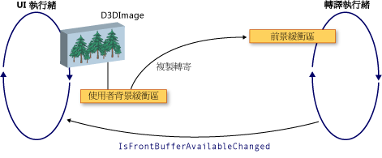

# WPF 和 Direct3D9 互通
您可以在 Windows Presentation Foundation (WPF) 應用程式中包含 Direct3D9 內容。 本主題描述如何建立 Direct3D9 內容，以便有效率地交互操作使用 WPF。  
  
> [!NOTE]
>  當使用 WPF 中的 Direct3D9 內容，您也需要思考的效能。 如需如何最佳化效能的詳細資訊，請參閱[Direct3D9 和 WPF 互通性的效能考量](performance-considerations-for-direct3d9-and-wpf-interoperability.md)。  
  
## 顯示緩衝區  
 <xref:System.Windows.Interop.D3DImage>類別會管理兩個顯示緩衝區，也就所謂*背景緩衝區*並*前景緩衝區*。 背景緩衝區是 Direct3D9 介面。 變更背景緩衝區會複製轉寄到前景緩衝區時呼叫<xref:System.Windows.Interop.D3DImage.Unlock%2A>方法。  
  
 下圖顯示背景緩衝區與前景緩衝區之間的關聯性。  
  
   
  
## 建立 Direct3D9 裝置  
 若要轉譯 Direct3D9 內容，您必須建立 Direct3D9 裝置。 有兩個 Direct3D9 物件可供您建立的裝置`IDirect3D9`和`IDirect3D9Ex`。 使用這些物件來建立`IDirect3DDevice9`和`IDirect3DDevice9Ex`裝置，分別。  
  
 藉由呼叫其中一種下列方法建立裝置。  
  
-   `IDirect3D9 * Direct3DCreate9(UINT SDKVersion);`  
  
-   `HRESULT Direct3DCreate9Ex(UINT SDKVersion, IDirect3D9Ex **ppD3D);`  
  
 在 Windows Vista 或更新版本的作業系統上，使用`Direct3DCreate9Ex`與顯示設定為使用 Windows 顯示驅動程式模型 (WDDM) 的方法。 使用`Direct3DCreate9`任何其他平台上的方法。  
  
### Direct3DCreate9Ex 方法的可用性  
 D3d9.dll 具有`Direct3DCreate9Ex`只在 Windows Vista 或更新版本的作業系統上的方法。 如果您直接連結的函式，在 Windows XP 上，您的應用程式就無法載入。 若要判斷是否`Direct3DCreate9Ex`支援方法，載入該 DLL 並尋找處理序的位址。 下列程式碼示範如何測試`Direct3DCreate9Ex`方法。 如需完整的程式碼範例，請參閱[逐步解說：建立裝載在 WPF 中的 Direct3D9 內容](walkthrough-creating-direct3d9-content-for-hosting-in-wpf.md)。  
  
 [!code-cpp[System.Windows.Interop.D3DImage#RendererManager_EnsureD3DObjects](~/samples/snippets/cpp/VS_Snippets_Wpf/System.Windows.Interop.D3DImage/cpp/renderermanager.cpp#renderermanager_ensured3dobjects)]  
  
### HWND 建立  
 建立裝置需要 HWND。 一般情況下，您會建立 Direct3D9 使用空的 HWND。 下列程式碼範例示範如何建立空的 HWND。  
  
 [!code-cpp[System.Windows.Interop.D3DImage#RendererManager_EnsureHWND](~/samples/snippets/cpp/VS_Snippets_Wpf/System.Windows.Interop.D3DImage/cpp/renderermanager.cpp#renderermanager_ensurehwnd)]  
  
### 存在的參數  
 建立裝置也需要`D3DPRESENT_PARAMETERS`結構，但只有幾個參數很重要。 這些參數會選擇記憶體使用量降到最低。  
  
 設定`BackBufferHeight`和`BackBufferWidth`欄位為 1。 將它們設定為 0 會導致它們設定為維度的 HWND。  
  
 一律設`D3DCREATE_MULTITHREADED`和`D3DCREATE_FPU_PRESERVE`旗標來防止損毀 Direct3D9 以及若要防止 Direct3D9 變更 FPU 設定使用的記憶體。  
  
 下列程式碼示範如何初始化`D3DPRESENT_PARAMETERS`結構。  
  
 [!code-cpp[System.Windows.Interop.D3DImage#Renderer_Init](~/samples/snippets/cpp/VS_Snippets_Wpf/System.Windows.Interop.D3DImage/cpp/renderer.cpp#renderer_init)]  
  
## 建立背景緩衝區的呈現目標  
 若要顯示中的 Direct3D9 內容<xref:System.Windows.Interop.D3DImage>，您建立 Direct3D9 介面，並將它指派藉由呼叫<xref:System.Windows.Interop.D3DImage.SetBackBuffer%2A>方法。  
  
### 驗證配接器支援  
 之前建立的介面，請確認所有的配接器支援您所需要的介面屬性。 即使您轉譯為只有一張介面卡，WPF 視窗可能會顯示任何介面卡上的系統中。 您應該一律撰寫處理多配接器組態的 Direct3D9 程式碼，您應該檢查支援的所有介面卡，因為 WPF 可能會移動可用的配接器之間的介面。  
  
 下列程式碼範例示範如何檢查 Direct3D9 的系統上的所有介面卡支援。  
  
 [!code-cpp[System.Windows.Interop.D3DImage#RendererManager_TestSurfaceSettings](~/samples/snippets/cpp/VS_Snippets_Wpf/System.Windows.Interop.D3DImage/cpp/renderermanager.cpp#renderermanager_testsurfacesettings)]  
  
### 建立介面  
 建立介面之前, 確認裝置的功能支援良好的效能目標作業系統上。 如需詳細資訊，請參閱 < [Direct3D9 和 WPF 互通性的效能考量](performance-considerations-for-direct3d9-and-wpf-interoperability.md)。  
  
 當您已驗證裝置的功能時，您可以建立介面。 下列程式碼範例示範如何建立呈現目標。  
  
 [!code-cpp[System.Windows.Interop.D3DImage#Renderer_CreateSurface](~/samples/snippets/cpp/VS_Snippets_Wpf/System.Windows.Interop.D3DImage/cpp/renderer.cpp#renderer_createsurface)]  
  
### WDDM  
 在 Windows Vista 和更新版本的作業系統，這會設定為使用 WDDM，可以建立呈現目標材質中，並傳遞的層級 0 介面<xref:System.Windows.Interop.D3DImage.SetBackBuffer%2A>方法。 這個方法不會建議在 Windows XP 上，因為您無法建立可鎖定的呈現目標紋理，而且會降低效能。  
  
## 處理裝置的狀態  
 <xref:System.Windows.Interop.D3DImage>類別會管理兩個顯示緩衝區，也就所謂*背景緩衝區*並*前景緩衝區*。 背景緩衝區是 Direct3D 介面。  變更背景緩衝區會複製轉寄到前景緩衝區時呼叫<xref:System.Windows.Interop.D3DImage.Unlock%2A>方法，它會顯示在硬體。 有時候，前景緩衝區變得無法使用。 缺乏此種可用性可能因螢幕鎖定、 全螢幕專屬 Direct3D 應用程式、 切換使用者，或其他系統活動。 當發生這種情況時，您的 WPF 應用程式會收到通知，藉由處理<xref:System.Windows.Interop.D3DImage.IsFrontBufferAvailableChanged>事件。  到前景緩衝區變得無法使用您的應用程式的回應方式，取決於是否啟用 WPF 回到軟體轉譯。 <xref:System.Windows.Interop.D3DImage.SetBackBuffer%2A>方法有多載接受參數，指定是否 WPF 就會回到軟體轉譯。  
  
 當您呼叫<xref:System.Windows.Interop.D3DImage.SetBackBuffer%28System.Windows.Interop.D3DResourceType%2CSystem.IntPtr%29>多載，或呼叫<xref:System.Windows.Interop.D3DImage.SetBackBuffer%28System.Windows.Interop.D3DResourceType%2CSystem.IntPtr%2CSystem.Boolean%29>多載`enableSoftwareFallback`參數設定為`false`，當前景緩衝區變得無法使用，並沒有呈現系統釋出其指向背景緩衝區的參考顯示此項目。 當前景緩衝區再次可用時，轉譯系統就會引發<xref:System.Windows.Interop.D3DImage.IsFrontBufferAvailableChanged>事件以通知您的 WPF 應用程式。  您可以建立的事件處理常式<xref:System.Windows.Interop.D3DImage.IsFrontBufferAvailableChanged>事件，以重新啟動一次使用有效的 Direct3D 介面的轉譯。 若要重新啟動轉譯，您必須呼叫<xref:System.Windows.Interop.D3DImage.SetBackBuffer%2A>。  
  
 當您呼叫<xref:System.Windows.Interop.D3DImage.SetBackBuffer%28System.Windows.Interop.D3DResourceType%2CSystem.IntPtr%2CSystem.Boolean%29>多載`enableSoftwareFallback`參數設為`true`，呈現系統會保留其指向背景緩衝區的參考，當前景緩衝區變成無法使用，這樣就不需要呼叫<xref:System.Windows.Interop.D3DImage.SetBackBuffer%2A>時前端緩衝區可供一次。  
  
 啟用軟體呈現時，可能是使用者的裝置無法使用，但是呈現系統保留的 Direct3D 介面的參考。 若要檢查 Direct3D9 裝置是否無法使用，請呼叫`TestCooperativeLevel`方法。 若要檢查 Direct3D9Ex 裝置呼叫`CheckDeviceState`方法，因為`TestCooperativeLevel`方法已被取代，一律會傳回成功。 如果使用者的裝置已變成無法使用，呼叫<xref:System.Windows.Interop.D3DImage.SetBackBuffer%2A>釋放背景緩衝區的 WPF 的參考。  如果您需要將裝置重設，呼叫<xref:System.Windows.Interop.D3DImage.SetBackBuffer%2A>具有`backBuffer`參數設為`null`，然後呼叫<xref:System.Windows.Interop.D3DImage.SetBackBuffer%2A>再`backBuffer`設為有效的 Direct3D 介面。  
  
 呼叫`Reset`復原從正確的裝置，只有當您實作多配接器支援的方法。 否則，釋放所有 Direct3D9 介面，並完全重新建立它們。 如果配接器配置已變更，不會更新變更前建立 Direct3D9 物件。  
  
## 處理調整大小  
 如果<xref:System.Windows.Interop.D3DImage>會顯示在其原生大小以外的解析度，它被放大根據目前<xref:System.Windows.Media.RenderOptions.BitmapScalingMode%2A>，差異在於<xref:System.Windows.Media.Effects.SamplingMode.Bilinear>用來替代<xref:System.Windows.Media.BitmapScalingMode.Fant>。  
  
 如果您需要更高的精確度時，您必須建立新介面時的容器<xref:System.Windows.Interop.D3DImage>變更大小。  
  
 有三種可能的方法，來處理調整大小。  
  
-   參與版面配置系統，並建立新的介面，大小變更時。 因為您可能會耗盡或分割的視訊記憶體，請不要建立太多的介面。  
  
-   請等候調整大小事件發生的一段固定時間來建立新的介面。  
  
-   建立<xref:System.Windows.Threading.DispatcherTimer>檢查每秒數次的容器大小。  
  
## 多重監視器最佳化  
 呈現系統移動時，會造成效能大幅降低<xref:System.Windows.Interop.D3DImage>到另一個監視器。  
  
 在 WDDM，只要監視位於相同的視訊卡，而且您使用`Direct3DCreate9Ex`，沒有任何效能降低。 如果監視位於個別的視訊卡時，會降低效能。 在 Windows XP 上一律會降低效能。  
  
 當<xref:System.Windows.Interop.D3DImage>移到另一個監視器，您可以建立新的介面對應的介面卡，若要還原良好的效能。  
  
 若要避免的效能負面影響，撰寫程式碼特別針對多重監視器案例。 下列清單顯示撰寫多重監視器的程式碼的方法之一。  
  
1.  找到的點<xref:System.Windows.Interop.D3DImage>中使用的螢幕空間`Visual.ProjectToScreen`方法。  
  
2.  使用`MonitorFromPoint`GDI 方法來尋找顯示端點監視。  
  
3.  使用`IDirect3D9::GetAdapterMonitor`尋找哪些 Direct3D9 配接器監視的方法是在上。  
  
4.  如果配接器不是具有背景緩衝區的配接器相同，新的監視器上建立新的背景緩衝區，並將它指派給<xref:System.Windows.Interop.D3DImage>背景緩衝區。  
  
> [!NOTE]
>  如果<xref:System.Windows.Interop.D3DImage>information officer 監視器，效能可能會變慢的除了在 WDDM 的情況下，`IDirect3D9Ex`相同的介面卡上。 沒有任何方法可以提升效能，在此情況下。  
  
 下列程式碼範例示範如何尋找目前的監視。  
  
 [!code-cpp[System.Windows.Interop.D3DImage#RendererManager_SetAdapter](~/samples/snippets/cpp/VS_Snippets_Wpf/System.Windows.Interop.D3DImage/cpp/renderermanager.cpp#renderermanager_setadapter)]  
  
 更新 「 監視器 」 時<xref:System.Windows.Interop.D3DImage>容器的大小或位置變更或更新使用監視器`DispatcherTimer`幾次每秒更新。  
  
## WPF 軟體呈現  
 WPF 會在下列情況中的軟體在 UI 執行緒上以同步方式呈現。  
  
-   列印  
  
-   <xref:System.Windows.Media.Effects.BitmapEffect>  
  
-   <xref:System.Windows.Media.Imaging.RenderTargetBitmap>  
  
 當其中一種情況發生時，會呈現系統呼叫<xref:System.Windows.Interop.D3DImage.CopyBackBuffer%2A>方法，以將硬體緩衝區複製到的軟體。 預設實作會呼叫`GetRenderTargetData`方法與您的介面。 因為這個呼叫發生鎖定/解除鎖定模式之外，它可能會失敗。 在此情況下，`CopyBackBuffer`方法會傳回`null`並不會顯示影像。  
  
 您可以覆寫<xref:System.Windows.Interop.D3DImage.CopyBackBuffer%2A>方法，呼叫基底實作，而且它會傳回`null`，您可以傳回預留位置<xref:System.Windows.Media.Imaging.BitmapSource>。  
  
 您也可以實作自己的軟體呈現，而不是呼叫基底實作。  
  
> [!NOTE]
>  如果在軟體中，完全呈現 WPF<xref:System.Windows.Interop.D3DImage>不會顯示因為 WPF 沒有前景緩衝區。  
  
## 另請參閱

- <xref:System.Windows.Interop.D3DImage>
- [Direct3D9 和 WPF 互通性的效能考量](performance-considerations-for-direct3d9-and-wpf-interoperability.md)
- [逐步解說：建立 Direct3D9 內容以裝載在 WPF 中](walkthrough-creating-direct3d9-content-for-hosting-in-wpf.md)
- [逐步解說：將 Direct3D9 內容裝載在 WPF 中](walkthrough-hosting-direct3d9-content-in-wpf.md)
