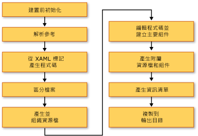

# 建置 WPF 應用程式 (WPF)
[!INCLUDE[TLA#tla_wpf](../../../../includes/tlasharptla-wpf-md.md)] 應用程式可以建置為 [!INCLUDE[dnprdnshort](../../../../includes/dnprdnshort-md.md)] 可執行檔 \(.exe\)、程式庫 \(.dll\) 或是這兩種類型組件的組合。  本主題介紹如何建置 [!INCLUDE[TLA2#tla_wpf](../../../../includes/tla2sharptla-wpf-md.md)] 應用程式，並描述建置過程中的重要步驟。  
  
 [!INCLUDE[autoOutline](../Token/autoOutline_md.md)]  
  
<a name="Building_a_WPF_Application_using_Command_Line"></a>   
## 建置 WPF 應用程式  
 您有下列方式可以編譯 WPF 應用程式：  
  
-   命令列。  應用程式必須僅包含程式碼 \(無 XAML\) 和一個應用程式定義檔案。  如需詳細資訊，請參閱[使用 csc.exe 建置命令列](../../../../ocs/csharp/language-reference/compiler-options/command-line-building-with-csc-exe.md)或[從命令列建置 \(Visual Basic\)](../Topic/Building%20from%20the%20Command%20Line%20\(Visual%20Basic\).md)。  
  
-   Microsoft Build Engine \(MSBuild\)。  除了程式碼和 XAML 檔案，應用程式還必須包含 MSBuild 專案檔。  如需詳細資訊，請參閱 [MSBuild](../Topic/MSBuild1.md)。  
  
-   Visual Studio。  Visual Studio 是整合式開發環境，可使用 MSBuild 編譯 WPF 應用程式並且包含用於建立 UI 的視覺化設計工具。  如需詳細資訊，請參閱 [Visual Studio 應用程式開發](http://msdn.microsoft.com/zh-tw/97490c1b-a247-41fb-8f2c-bc4c201eff68)和 [WPF Designer](http://msdn.microsoft.com/zh-tw/c6c65214-8411-4e16-b254-163ed4099c26)。  
  
<a name="The_Windows_Presentation_Foundation_Build_Pipeline"></a>   
## WPF 建置管線  
 建置 [!INCLUDE[TLA2#tla_wpf](../../../../includes/tla2sharptla-wpf-md.md)] 專案時，會同時叫用語言特定的和 [!INCLUDE[TLA2#tla_wpf](../../../../includes/tla2sharptla-wpf-md.md)] 特定的目標組合。  執行這些目標的過程稱為建置管線，下圖說明主要步驟。  
  
   
  
<a name="Pre_Build_Initializations"></a>   
### 建置前初始化  
 在建置前，[!INCLUDE[TLA2#tla_msbuild](../../../../includes/tla2sharptla-msbuild-md.md)] 會判斷重要工具和程式庫的位置，包括下列項目：  
  
-   [!INCLUDE[TLA2#tla_winfx](../../../../includes/tla2sharptla-winfx-md.md)]。  
  
-   [!INCLUDE[TLA2#tla_wcsdk](../../../../includes/tla2sharptla-wcsdk-md.md)] 目錄。  
  
-   [!INCLUDE[TLA2#tla_wpf](../../../../includes/tla2sharptla-wpf-md.md)] 參考組件的位置。  
  
-   組件搜尋路徑的屬性。  
  
 [!INCLUDE[TLA2#tla_msbuild](../../../../includes/tla2sharptla-msbuild-md.md)] 搜尋組件的第一個位置是參考組件目錄 \(%ProgramFiles%\\Reference Assemblies\\Microsoft\\Framework\\v3.0\\\)。  這個步驟期間，建置過程也會初始化各種屬性和項目群組並執行任何必要的清除工作。  
  
<a name="Resolving_references"></a>   
### 解析參考  
 建置過程會找出並繫結建置應用程式專案所必要的組件。  這個邏輯包含在 `ResolveAssemblyReference` 工作中。  在專案檔中描述為 `Reference` 的所有組件，會隨著搜尋路徑資訊和系統上已安裝組件的中繼資料，而一起提供給工作。  工作會查詢組件，並使用已安裝組件的中繼資料，以篩選出不需要顯示在輸出資訊清單中的那些核心 [!INCLUDE[TLA2#tla_wpf](../../../../includes/tla2sharptla-wpf-md.md)] 組件。  進行這項作業是避免在 ClickOnce 資訊清單中出現重複資訊。  舉例來說，因為 PresentationFramework.dll 可以視為是 [!INCLUDE[TLA2#tla_wpf](../../../../includes/tla2sharptla-wpf-md.md)] 的建置應用程式代表，此外，因為在每個安裝有 [!INCLUDE[TLA2#tla_winfx](../../../../includes/tla2sharptla-winfx-md.md)] 的電腦上，所有的 [!INCLUDE[TLA2#tla_wpf](../../../../includes/tla2sharptla-wpf-md.md)] 組件都存在於相同位置，所以沒有需要在資訊清單中的所有 [!INCLUDE[TLA2#tla_winfx](../../../../includes/tla2sharptla-winfx-md.md)] 參考組件上包含所有資訊。  
  
<a name="Markup_Compilation___Pass_1"></a>   
### 標記編譯 \- 第一階段  
 這個步驟會剖析並編譯 [!INCLUDE[TLA2#tla_xaml](../../../../includes/tla2sharptla-xaml-md.md)] 檔案，這樣執行階段就不需要花時間剖析 [!INCLUDE[TLA2#tla_xml](../../../../includes/tla2sharptla-xml-md.md)] 和驗證屬性值。  編譯過的 [!INCLUDE[TLA2#tla_xaml](../../../../includes/tla2sharptla-xaml-md.md)] 檔案會預先經過語彙基元化，這樣在執行階段的載入作業就比 [!INCLUDE[TLA2#tla_xaml](../../../../includes/tla2sharptla-xaml-md.md)] 檔案的載入時間快許多。  
  
 在這個步驟期間，對於屬於 `Page` 建置項目的每個 [!INCLUDE[TLA2#tla_xaml](../../../../includes/tla2sharptla-xaml-md.md)] 檔案，都會發生下列活動：  
  
1.  標記編譯器會剖析 [!INCLUDE[TLA2#tla_xaml](../../../../includes/tla2sharptla-xaml-md.md)] 檔案。  
  
2.  針對該 [!INCLUDE[TLA2#tla_xaml](../../../../includes/tla2sharptla-xaml-md.md)] 建立編譯好的表示，並複製到 obj\\Release 資料夾。  
  
3.  建立新部分類別的 CodeDOM 表示，並複製到 obj\\Release 資料夾。  
  
 此外，會針對每個 [!INCLUDE[TLA2#tla_xaml](../../../../includes/tla2sharptla-xaml-md.md)] 檔案產生語言特定的程式碼檔。舉例來說，對於 [!INCLUDE[TLA2#tla_visualb](../../../../includes/tla2sharptla-visualb-md.md)] 專案中的 Page1.xaml 頁面會產生 Page1.g.vb，而對於 [!INCLUDE[TLA2#tla_cshrp](../../../../includes/tla2sharptla-cshrp-md.md)] 專案中的 Page1.xaml 頁面會產生 Page1.g.cs。  檔名中的 ".g" 代表檔案是產生的程式碼，具有標記檔案最上層項目 \(例如 `Page` 或 `Window`\) 的部分類別定義。  在 [!INCLUDE[TLA2#tla_cshrp](../../../../includes/tla2sharptla-cshrp-md.md)] 中使用 `partial` 修飾詞 \([!INCLUDE[TLA2#tla_visualb](../../../../includes/tla2sharptla-visualb-md.md)] 中的 `Extends`\) 宣告的類別，表示在其他地方有另一個類別宣告，通常是在程式碼後置的檔案 Page1.xaml.cs 中。  
  
 部分類別是從適當的基底類別 \(例如頁面的 <xref:System.Windows.Controls.Page>\) 擴充的，並會實作 <xref:System.Windows.Markup.IComponentConnector?displayProperty=fullName> 介面。  <xref:System.Windows.Markup.IComponentConnector> 介面具有方法可以初始化元件，並在內容中連接項目的名稱和事件。  因此，產生的程式碼檔具有類似下列的方法實作：  
  
```csharp  
public void InitializeComponent() {  
    if (_contentLoaded) {  
        return;  
    }  
    _contentLoaded = true;  
    System.Uri resourceLocater =   
        new System.Uri(  
            "window1.xaml",   
            System.UriKind.RelativeOrAbsolute);  
    System.Windows.Application.LoadComponent(this, resourceLocater);  
}  
```  
  
```vb  
Public Sub InitializeComponent() _  
  
    If _contentLoaded Then  
        Return  
    End If  
  
    _contentLoaded = True  
    Dim resourceLocater As System.Uri = _  
        New System.Uri("mainwindow.xaml", System.UriKind.Relative)  
  
    System.Windows.Application.LoadComponent(Me, resourceLocater)  
  
End Sub  
```  
  
 根據預設，標記編譯所執行的 <xref:System.AppDomain> 與 [!INCLUDE[TLA2#tla_msbuild](../../../../includes/tla2sharptla-msbuild-md.md)] 引擎相同。  這會提供非常重要的效能好處。  這個行為可以使用 `AlwaysCompileMarkupFilesInSeparateDomain` 屬性進行切換。  好處在於可以藉由卸載個別的 <xref:System.AppDomain> 而卸載所有參考組件。  
  
<a name="Pass_2_of_Markup_Compilation"></a>   
### 標記編譯 \- 第二階段  
 並非所有 [!INCLUDE[TLA2#tla_xaml](../../../../includes/tla2sharptla-xaml-md.md)] 頁面都會在第 1 階段標記編譯時編譯。  具有區域定義的型別參考的 [!INCLUDE[TLA2#tla_xaml](../../../../includes/tla2sharptla-xaml-md.md)] 檔案 \(參考到相同專案中任何地方的程式碼所定義的型別\) 就不是在第一階段編譯。  這是因為這些區域定義的型別只存在於來源中，且尚未經過編譯。  為了判斷這個情況，剖析器會使用牽涉到尋找標記檔案中項目的啟發方式，例如 `x:Name`。  找到這樣的項目後，就會將標記檔案編譯延後到程式碼檔案編譯過後，在那之後，第二階段的標記編譯才會處理這些檔案。  
  
<a name="File_Classification"></a>   
### 檔案分類  
 建置程序會根據做為目標位置的應用程式組件，將輸出檔放入不同的資源群組。  在一般未當地語系化的應用程式中，所有標記為 `Resource` 的資料檔都會放入主要組件中 \(可執行檔或程式庫\)。  當專案中有設定 `UICulture` 時，所有編譯的 [!INCLUDE[TLA2#tla_xaml](../../../../includes/tla2sharptla-xaml-md.md)] 檔案和特別標為語言特定的那些資源，就會放入附屬資源組件中。  此外，所有非語言相關的資源會放入主要組件中。  在這個建置過程中即完成該判斷。  
  
 專案檔中的 `ApplicationDefinition`、`Page` 和 `Resource` 建置動作，可以搭配使用 `Localizable` 中繼資料 \(可接受值有 `true` 和 `false`\)，這是用來表示檔案是語言特定的還是非語言相關的。  
  
<a name="Core_Compilation"></a>   
### 核心編譯  
 核心編譯步驟牽涉到程式碼檔案的編譯。  這是由語言特定的目標檔 Microsoft.CSharp.targets 和 Microsoft.VisualBasic.targets 所安排的。  如果啟發方式判斷標記編譯器的單一階段即已足夠，則會產生主要組件。  然而，如果專案中一或多個 [!INCLUDE[TLA2#tla_xaml](../../../../includes/tla2sharptla-xaml-md.md)] 檔案具有區域定義型別的參考，則會產生暫時的 .dll 檔案，這樣最後的應用程式組件就可以在標記編譯第二階段完成後建立。  
  
<a name="Manifest_generation"></a>   
### 資訊清單產生  
 在建置過程的最後，所有應用程式組件和內容檔都就緒後，就會產生應用程式的 [!INCLUDE[TLA2#tla_clickonce](../../../../includes/tla2sharptla-clickonce-md.md)] 資訊清單。  
  
 部署資訊清單檔適用於描述部署模型：目前版本、更新行為，以及具有數位簽章的發行者識別。  這份資訊清單是要讓處理部署作業的系統管理員來撰寫的。  副檔名是 .xbap \(針對 [!INCLUDE[TLA#tla_xbap#plural](../../../../includes/tlasharptla-xbapsharpplural-md.md)]\)，以及 .application \(針對安裝應用程式\)。  前者是由 `HostInBrowser` 專案屬性指示的，因此資訊清單能將應用程式識別為瀏覽器裝載的。  
  
 應用程式資訊清單 \(.exe.manifest 檔案\) 會描述應用程式組件和相依程式庫，並列出應用程式所需的權限。  這個檔案是要讓應用程式開發人員來撰寫的。  為了啟動 [!INCLUDE[TLA2#tla_clickonce](../../../../includes/tla2sharptla-clickonce-md.md)] 應用程式，使用者會開啟應用程式的部署資訊清單檔。  
  
 對於 [!INCLUDE[TLA2#tla_xbap#plural](../../../../includes/tla2sharptla-xbapsharpplural-md.md)]，一定會建立這些資訊清單檔。  對於安裝應用程式，除非專案檔中的 `GenerateManifests` 屬性有以值 `true` 指定，否則就不會建立資訊清單檔。  
  
 相較於一般的網際網路區域應用程式，[!INCLUDE[TLA2#tla_xbap#plural](../../../../includes/tla2sharptla-xbapsharpplural-md.md)] 有額外的兩個權限：<xref:System.Security.Permissions.WebBrowserPermission> 和 <xref:System.Security.Permissions.MediaPermission>。  [!INCLUDE[TLA2#tla_wpf](../../../../includes/tla2sharptla-wpf-md.md)] 建置系統會在應用程式資訊清單中宣告這些權限。  
  
<a name="Incremental_Build_Support"></a>   
## 累加建置支援  
 [!INCLUDE[TLA2#tla_wpf](../../../../includes/tla2sharptla-wpf-md.md)] 建置系統提供對累加建置的支援。  這個系統在偵測標記或程式碼的變更方面相當有智慧，並且只會編譯受到變更影響的那些成品。  累加建置機制使用下列檔案：  
  
-   $\(*AssemblyName*\)\_MarkupCompiler.Cache 檔案，用於維護目前編譯器狀態。  
  
-   $\(*AssemblyName*\)\_MarkupCompiler.lref 檔案，用於快取具有區域定義型別參考的 [!INCLUDE[TLA2#tla_xaml](../../../../includes/tla2sharptla-xaml-md.md)] 檔案。  
  
 下列是控管累加建置的規則集：  
  
-   檔案是建置系統偵測變更的最小單位。  因此對於程式碼檔，建置系統無法得知型別是否變更或是否有加入程式碼。  同樣的情況也適用於專案檔。  
  
-   累加建置機制必須認定 [!INCLUDE[TLA2#tla_xaml](../../../../includes/tla2sharptla-xaml-md.md)] 頁面有定義類別或是使用其他類別。  
  
-   如果 `Reference` 項目有變更，則會重新編譯所有頁面。  
  
-   如果程式碼檔有變更，則會重新編譯具有區域定義型別參考的所有頁面。  
  
-   如果 [!INCLUDE[TLA2#tla_xaml](../../../../includes/tla2sharptla-xaml-md.md)] 檔案有變更：  
  
    -   如果 [!INCLUDE[TLA2#tla_xaml](../../../../includes/tla2sharptla-xaml-md.md)] 在專案中是宣告為 `Page`：如果 [!INCLUDE[TLA2#tla_xaml](../../../../includes/tla2sharptla-xaml-md.md)] 沒有區域定義的型別參考，則重新編譯該 [!INCLUDE[TLA2#tla_xaml](../../../../includes/tla2sharptla-xaml-md.md)]，再加上具有區域參考的所有 [!INCLUDE[TLA2#tla_xaml](../../../../includes/tla2sharptla-xaml-md.md)] 頁面。如果 [!INCLUDE[TLA2#tla_xaml](../../../../includes/tla2sharptla-xaml-md.md)] 有區域參考，則重新編譯具有區域參考的所有 [!INCLUDE[TLA2#tla_xaml](../../../../includes/tla2sharptla-xaml-md.md)] 頁面。  
  
    -   如果 [!INCLUDE[TLA2#tla_xaml](../../../../includes/tla2sharptla-xaml-md.md)] 在專案中是宣告為 `ApplicationDefinition`：重新編譯所有 [!INCLUDE[TLA2#tla_xaml](../../../../includes/tla2sharptla-xaml-md.md)] 頁面 \(原因：每個 [!INCLUDE[TLA2#tla_xaml](../../../../includes/tla2sharptla-xaml-md.md)] 都具有可能已經變更的 <xref:System.Windows.Application> 型別參考\)。  
  
-   如果專案檔是將程式碼檔宣告為應用程式定義，而非 [!INCLUDE[TLA2#tla_xaml](../../../../includes/tla2sharptla-xaml-md.md)] 檔案：  
  
    -   檢查專案檔中的 `ApplicationClassName` 值是否變更 \(是否有新的應用程式類型\)。  如果有變更，重新編譯整個應用程式。  
  
    -   否則，重新編譯具有區域參考的所有 [!INCLUDE[TLA2#tla_xaml](../../../../includes/tla2sharptla-xaml-md.md)] 頁面。  
  
-   如果專案檔有變更：套用所有前述規則，並查看哪些項目需要重新編譯。  對下列屬性的變更會觸發完整的重新編譯：`AssemblyName`、`IntermediateOutputPath`、`RootNamespace` 和 `HostInBrowser`。  
  
 有可能會發生下列的重新編譯案例：  
  
-   重新編譯整個應用程式。  
  
-   只會重新編譯具有區域定義型別參考的那些 [!INCLUDE[TLA2#tla_xaml](../../../../includes/tla2sharptla-xaml-md.md)] 檔案。  
  
-   不會重新編譯任何項目 \(當專案中沒有任何變更時\)。  
  
## 請參閱  
 [部署 WPF 應用程式](../../../../docs/framework/wpf/app-development/deploying-a-wpf-application-wpf.md)   
 [WPF MSBuild 參考](../Topic/WPF%20MSBuild%20Reference.md)   
 [WPF 中的 Pack URI](../../../../docs/framework/wpf/app-development/pack-uris-in-wpf.md)   
 [WPF 應用程式資源、內容和資料檔案](../../../../docs/framework/wpf/app-development/wpf-application-resource-content-and-data-files.md)