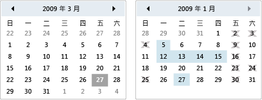

# 行事曆
行事曆可讓使用者使用視覺化月曆顯示來選取日期。  
  
 A<xref:System.Windows.Controls.Calendar>控制項可以使用其本身，或做為下拉式清單一部分<xref:System.Windows.Controls.DatePicker>控制項。 如需詳細資訊，請參閱<xref:System.Windows.Controls.DatePicker>。  
  
 下圖顯示兩個<xref:System.Windows.Controls.Calendar>控制項，一個具有項目，並停止日期，另一個則沒有。  
  
   
Calendar 控制項  
  
 下表提供工作通常與相關聯的相關資訊<xref:System.Windows.Controls.Calendar>。  
  
|工作|實作|  
|----------|--------------------|  
|指定的日期無法選取。|請使用 <xref:System.Windows.Controls.Calendar.BlackoutDates%2A> 屬性。|  
|具有<xref:System.Windows.Controls.Calendar>顯示每個月、 年或十年以上。|設定<xref:System.Windows.Controls.Calendar.DisplayMode%2A>月份、 年份或十的屬性。|  
|指定使用者是否可以選取日期的日期範圍或多個範圍的日期。|使用<xref:System.Windows.Controls.Calendar.SelectionMode%2A>。|  
|指定的日期範圍，<xref:System.Windows.Controls.Calendar>顯示。|使用<xref:System.Windows.Controls.Calendar.DisplayDateStart%2A>和<xref:System.Windows.Controls.Calendar.DisplayDateEnd%2A>屬性。|  
|指定目前的日期會反白顯示。|請使用 <xref:System.Windows.Controls.Calendar.IsTodayHighlighted%2A> 屬性。 根據預設，<xref:System.Windows.Controls.Calendar.IsTodayHighlighted%2A>是`true`。|  
|變更大小<xref:System.Windows.Controls.Calendar>。|使用<xref:System.Windows.Controls.Viewbox>或設定<xref:System.Windows.FrameworkElement.LayoutTransform%2A>屬性<xref:System.Windows.Media.ScaleTransform>。 請注意，如果您設定<xref:System.Windows.FrameworkElement.Width%2A>和<xref:System.Windows.FrameworkElement.Height%2A>屬性<xref:System.Windows.Controls.Calendar>，實際的行事曆不會變更其大小。|  
  
 <xref:System.Windows.Controls.Calendar>控制項提供使用滑鼠或鍵盤的基本巡覽。 下表摘要說明的鍵盤巡覽。  
  
|按鍵組合|<xref:System.Windows.Controls.Calendar.DisplayMode%2A>|動作|  
|---------------------|-----------------------------------------------------------------------------------------------------------------------------------------------------------|------------|  
|箭號|<xref:System.Windows.Controls.CalendarMode.Month>|變更<xref:System.Windows.Controls.Calendar.SelectedDate%2A>屬性如果<xref:System.Windows.Controls.Calendar.SelectionMode%2A>屬性未設定為<xref:System.Windows.Controls.CalendarSelectionMode.None>。|  
|箭號|<xref:System.Windows.Controls.CalendarMode.Year>|變更的月份<xref:System.Windows.Controls.Calendar.DisplayDate%2A>屬性。 請注意，<xref:System.Windows.Controls.Calendar.SelectedDate%2A>不會變更。|  
|箭號|<xref:System.Windows.Controls.CalendarMode.Decade>|變更的年份<xref:System.Windows.Controls.Calendar.DisplayDate%2A>。 請注意，<xref:System.Windows.Controls.Calendar.SelectedDate%2A>不會變更。|  
|SHIFT + 方向鍵|<xref:System.Windows.Controls.CalendarMode.Month>|如果<xref:System.Windows.Controls.Calendar.SelectionMode%2A>未設定為<xref:System.Windows.Controls.CalendarSelectionMode.SingleDate>或<xref:System.Windows.Controls.CalendarSelectionMode.None>，擴充選取的日期範圍。|  
|首頁|<xref:System.Windows.Controls.CalendarMode.Month>|變更<xref:System.Windows.Controls.Calendar.SelectedDate%2A>目前月份的第一天。|  
|首頁|<xref:System.Windows.Controls.CalendarMode.Year>|變更的月份<xref:System.Windows.Controls.Calendar.DisplayDate%2A>來年的第一個月。 <xref:System.Windows.Controls.Calendar.SelectedDate%2A>不會變更。|  
|首頁|<xref:System.Windows.Controls.CalendarMode.Decade>|變更的年份<xref:System.Windows.Controls.Calendar.DisplayDate%2A>至十年的第一年。 <xref:System.Windows.Controls.Calendar.SelectedDate%2A>不會變更。|  
|END|<xref:System.Windows.Controls.CalendarMode.Month>|變更<xref:System.Windows.Controls.Calendar.SelectedDate%2A>當月最後一天。|  
|END|<xref:System.Windows.Controls.CalendarMode.Year>|變更的月份<xref:System.Windows.Controls.Calendar.DisplayDate%2A>年度的上個月。 <xref:System.Windows.Controls.Calendar.SelectedDate%2A>不會變更。|  
|END|<xref:System.Windows.Controls.CalendarMode.Decade>|變更的年份<xref:System.Windows.Controls.Calendar.DisplayDate%2A>至十年的最後一年。 <xref:System.Windows.Controls.Calendar.SelectedDate%2A>不會變更。|  
|CTRL+向上鍵|任何|切換至下一個較大<xref:System.Windows.Controls.Calendar.DisplayMode%2A>。 如果<xref:System.Windows.Controls.Calendar.DisplayMode%2A>已經<xref:System.Windows.Controls.CalendarMode.Decade>，採取任何動作。|  
|CTRL+向下鍵|任何|切換至下一個較小<xref:System.Windows.Controls.Calendar.DisplayMode%2A>。 如果<xref:System.Windows.Controls.Calendar.DisplayMode%2A>已經<xref:System.Windows.Controls.CalendarMode.Month>，採取任何動作。|  
|空白鍵或 ENTER|<xref:System.Windows.Controls.CalendarMode.Year> 或 <xref:System.Windows.Controls.CalendarMode.Decade>|交換器<xref:System.Windows.Controls.Calendar.DisplayMode%2A>至<xref:System.Windows.Controls.CalendarMode.Month>或<xref:System.Windows.Controls.CalendarMode.Year>焦點的項目所表示。|  
  
## 另請參閱  
 [控制項](../../../../docs/framework/wpf/controls/index.md)  
 [樣式設定和範本化](../../../../docs/framework/wpf/controls/styling-and-templating.md)
