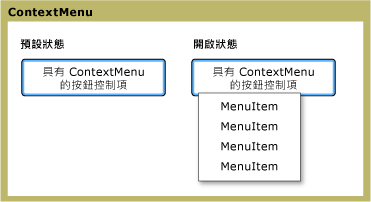

# ContextMenu
<xref:System.Windows.Controls.ContextMenu> 可讓控制項顯示與該控制項內容相關的 <xref:System.Windows.Controls.Menu>。  一般情況下，<xref:System.Windows.Controls.ContextMenu> 會透過滑鼠右鍵或鍵盤的功能表按鈕，公開 \(Expose\) 在[!INCLUDE[TLA#tla_ui](../../../../includes/tlasharptla-ui-md.md)] 中。  
  
 下圖顯示 <xref:System.Windows.Controls.ContextMenu> 處於兩種不同的狀態：預設狀態和開啟狀態。  在預設狀態中，控制項是摺疊起來的。  在功能表的父代 \(Parent\) 上按下滑鼠右鍵時，功能表便會展開並顯示功能表項目。  
  
   
在不同狀態下的 ContextMenu  
  
## 在本節中  
 [ContextMenu 概觀](../../../../docs/framework/wpf/controls/contextmenu-overview.md)  
  
## 參考  
 <xref:System.Windows.Controls.ContextMenu>  
  
## 相關章節