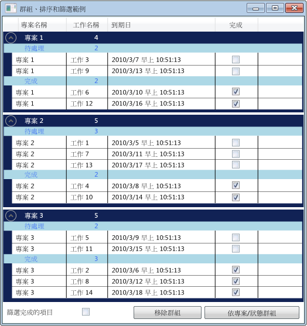

# 如何：在 DataGrid 控制項中分組、排序和篩選資料
在 <xref:System.Windows.Controls.DataGrid> 中以不同的方式分組、排序和篩選資料，對於檢視資料相當實用。  若要在 <xref:System.Windows.Controls.DataGrid> 中分組、排序和篩選資料，請將其繫結至支援這些功能的 <xref:System.Windows.Data.CollectionView>。  接著就可以在 <xref:System.Windows.Data.CollectionView> 中處理資料，而不會影響到基礎資料。  對集合檢視所做的變更會反映在 <xref:System.Windows.Controls.DataGrid> 使用者介面 \(UI\)。  
  
 <xref:System.Windows.Data.CollectionView> 類別提供分組和排序功能給實作 <xref:System.Collections.IEnumerable> 介面的資料來源。  <xref:System.Windows.Data.CollectionViewSource> 類別可讓您從 XAML 設定 <xref:System.Windows.Data.CollectionView> 的屬性。  
  
 在此範例中，`Task` 物件的集合會繫結至 <xref:System.Windows.Data.CollectionViewSource>。  <xref:System.Windows.Data.CollectionViewSource> 用來當做 <xref:System.Windows.Controls.DataGrid> 的 <xref:System.Windows.Controls.ItemsControl.ItemsSource%2A>。  分組、排序和篩選功能在 <xref:System.Windows.Data.CollectionViewSource> 上執行，並顯示於 <xref:System.Windows.Controls.DataGrid> 使用者介面。  
  
   
DataGrid 中分組後的資料  
  
## 使用 CollectionViewSource 做為 ItemsSource  
 若要在 <xref:System.Windows.Controls.DataGrid> 控制項中分組、排序和篩選資料，請將 <xref:System.Windows.Controls.DataGrid> 繫結至支援這些功能的 <xref:System.Windows.Data.CollectionView>。  在此範例中，<xref:System.Windows.Controls.DataGrid> 繫結至 <xref:System.Windows.Data.CollectionViewSource>，提供這些功能給 `Task` 物件的 <xref:System.Collections.Generic.List%601>。  
  
#### 若要將 DataGrid 繫結至 CollectionViewSource  
  
1.  建立實作 <xref:System.Collections.IEnumerable> 介面的資料集合。  
  
     如果您使用 <xref:System.Collections.Generic.List%601> 建立集合，應該建立一個繼承自 <xref:System.Collections.Generic.List%601> 的新類別，而非具現化 <xref:System.Collections.Generic.List%601> 的執行個體。  如此您就可以在 XAML 中將資料繫結至集合。  
  
    > [!NOTE]
    >  集合中的物件必須執行 <xref:System.ComponentModel.INotifyPropertyChanged> 已變更介面和 <xref:System.ComponentModel.IEditableObject> 介面，才能讓 <xref:System.Windows.Controls.DataGrid> 正確回應屬性的變更和編輯。  如需詳細資訊，請參閱 [實作屬性變更通知](../../../../docs/framework/wpf/data/how-to-implement-property-change-notification.md)。  
  
     [!code-csharp[DataGrid_GroupSortFilter#101](../../../../samples/snippets/csharp/VS_Snippets_Wpf/DataGrid_GroupSortFilter/CS/MainWindow.xaml.cs#101)]
     [!code-vb[DataGrid_GroupSortFilter#101](../../../../samples/snippets/visualbasic/VS_Snippets_Wpf/DataGrid_GroupSortFilter/VB/MainWindow.xaml.vb#101)]  
  
2.  在 XAML 中，建立集合類別的執行個體，並設定 [x:Key 指示詞](../../../../docs/framework/xaml-services/x-key-directive.md)。  
  
3.  在 XAML 中，建立 <xref:System.Windows.Data.CollectionViewSource> 類別的執行個體、設定 [x:Key 指示詞](../../../../docs/framework/xaml-services/x-key-directive.md)，並設定集合類別的執行個體做為 <xref:System.Windows.Data.CollectionViewSource.Source%2A>。  
  
     [!code-xml[DataGrid_GroupSortFilter#201](../../../../samples/snippets/csharp/VS_Snippets_Wpf/DataGrid_GroupSortFilter/CS/WindowSnips1.xaml#201)]  
  
4.  建立 <xref:System.Windows.Controls.DataGrid> 類別的執行個體，並將 <xref:System.Windows.Controls.ItemsControl.ItemsSource%2A> 屬性設定為 <xref:System.Windows.Data.CollectionViewSource>。  
  
     [!code-xml[DataGrid_GroupSortFilter#002](../../../../samples/snippets/csharp/VS_Snippets_Wpf/DataGrid_GroupSortFilter/CS/MainWindow.xaml#002)]  
  
5.  若要從程式碼中存取 <xref:System.Windows.Data.CollectionViewSource>，請使用 <xref:System.Windows.Data.CollectionViewSource.GetDefaultView%2A> 方法取得 <xref:System.Windows.Data.CollectionViewSource> 的參考。  
  
     [!code-csharp[DataGrid_GroupSortFilter#102](../../../../samples/snippets/csharp/VS_Snippets_Wpf/DataGrid_GroupSortFilter/CS/MainWindow.xaml.cs#102)]
     [!code-vb[DataGrid_GroupSortFilter#102](../../../../samples/snippets/visualbasic/VS_Snippets_Wpf/DataGrid_GroupSortFilter/VB/MainWindow.xaml.vb#102)]  
  
## 在 DataGrid 中分組項目  
 若要指定項目在 <xref:System.Windows.Controls.DataGrid> 中分組的方式，可以使用 <xref:System.Windows.Data.PropertyGroupDescription> 類型在來源檢視中分組項目。  
  
#### 若要使用 XAML 在 DataGrid 中分組項目  
  
1.  建立 <xref:System.Windows.Data.PropertyGroupDescription> 並讓其指定分組依據的屬性。  您可以在 XAML 或程式碼中指定這個屬性。  
  
    1.  在 XAML 中，將 <xref:System.Windows.Data.PropertyGroupDescription.PropertyName%2A> 設定為分組所依據屬性的名稱。  
  
    2.  在程式碼中，將分組所依據屬性的名稱傳遞至建構函式。  
  
2.  將 <xref:System.Windows.Data.PropertyGroupDescription> 新增至 <xref:System.Windows.Data.CollectionViewSource.GroupDescriptions%2A?displayProperty=fullName> 集合。  
  
3.  將 <xref:System.Windows.Data.PropertyGroupDescription> 的其他執行個體新增至 <xref:System.Windows.Data.CollectionViewSource.GroupDescriptions%2A> 集合，以新增更多的分組層級。  
  
     [!code-xml[DataGrid_GroupSortFilter#012](../../../../samples/snippets/csharp/VS_Snippets_Wpf/DataGrid_GroupSortFilter/CS/MainWindow.xaml#012)]  
  
     [!code-csharp[DataGrid_GroupSortFilter#112](../../../../samples/snippets/csharp/VS_Snippets_Wpf/DataGrid_GroupSortFilter/CS/MainWindow.xaml.cs#112)]
     [!code-vb[DataGrid_GroupSortFilter#112](../../../../samples/snippets/visualbasic/VS_Snippets_Wpf/DataGrid_GroupSortFilter/VB/MainWindow.xaml.vb#112)]  
  
4.  若要移除群組，請從 <xref:System.Windows.Data.CollectionViewSource.GroupDescriptions%2A> 集合中移除 <xref:System.Windows.Data.PropertyGroupDescription>。  
  
5.  若要移除所有群組，請呼叫 <xref:System.Windows.Data.CollectionViewSource.GroupDescriptions%2A> 集合的 <xref:System.Collections.ObjectModel.Collection%601.Clear%2A> 方法。  
  
     [!code-csharp[DataGrid_GroupSortFilter#114](../../../../samples/snippets/csharp/VS_Snippets_Wpf/DataGrid_GroupSortFilter/CS/MainWindow.xaml.cs#114)]
     [!code-vb[DataGrid_GroupSortFilter#114](../../../../samples/snippets/visualbasic/VS_Snippets_Wpf/DataGrid_GroupSortFilter/VB/MainWindow.xaml.vb#114)]  
  
 在 <xref:System.Windows.Controls.DataGrid> 中將項目分組時，您可以定義 <xref:System.Windows.Controls.GroupStyle> 來指定每個群組的外觀。  若要套用 <xref:System.Windows.Controls.GroupStyle>，您可以將它加入至 DataGrid 的 <xref:System.Windows.Controls.ItemsControl.GroupStyle%2A> 集合。  如果您有多個層級的方組，可在每個群組層級套用不同的樣式，  樣式以定義的順序套用。  例如，如果您定義兩個樣式，第一個將套用至最上層的資料列群組。  第二個樣式將套用至第二層及更低層級中的所有資料列群組。  <xref:System.Windows.Controls.GroupStyle> 的 <xref:System.Windows.FrameworkElement.DataContext%2A> 就是群組代表的 <xref:System.Windows.Data.CollectionViewGroup>。  
  
#### 若要變更資料列群組標題的外觀  
  
1.  建立 <xref:System.Windows.Controls.GroupStyle> 並讓其定義資料列群組的外觀。  
  
2.  將 <xref:System.Windows.Controls.GroupStyle> 放入 `<DataGrid.GroupStyle>` 標記內。  
  
     [!code-xml[DataGrid_GroupSortFilter#003](../../../../samples/snippets/csharp/VS_Snippets_Wpf/DataGrid_GroupSortFilter/CS/MainWindow.xaml#003)]  
  
## 在 DataGrid 中排序項目  
 若要指定項目在 <xref:System.Windows.Controls.DataGrid> 中排序的方式，可以使用 <xref:System.ComponentModel.SortDescription> 類型在來源檢視中排序項目。  
  
#### 若要在 DataGrid 中排序項目  
  
1.  建立 <xref:System.ComponentModel.SortDescription> 並讓其指定排序依據的屬性。  您可以在 XAML 或程式碼中指定這個屬性。  
  
    1.  在 XAML 中，將 <xref:System.ComponentModel.SortDescription.PropertyName%2A> 設定為排序所依據屬性的名稱。  
  
    2.  在程式碼中，將排序所依據屬性的名稱和 <xref:System.ComponentModel.ListSortDirection> 傳遞給建構函式。  
  
2.  將 <xref:System.ComponentModel.SortDescription> 加入至 <xref:System.Windows.Data.CollectionViewSource.SortDescriptions%2A?displayProperty=fullName> 集合。  
  
3.  將 <xref:System.ComponentModel.SortDescription> 的其他執行個體新增至 <xref:System.Windows.Data.CollectionViewSource.SortDescriptions%2A> 集合，以排序其他屬性。  
  
     [!code-xml[DataGrid_GroupSortFilter#011](../../../../samples/snippets/csharp/VS_Snippets_Wpf/DataGrid_GroupSortFilter/CS/MainWindow.xaml#011)]  
  
     [!code-csharp[DataGrid_GroupSortFilter#211](../../../../samples/snippets/csharp/VS_Snippets_Wpf/DataGrid_GroupSortFilter/CS/WindowSnips1.xaml.cs#211)]
     [!code-vb[DataGrid_GroupSortFilter#211](../../../../samples/snippets/visualbasic/VS_Snippets_Wpf/DataGrid_GroupSortFilter/VB/MainWindow.xaml.vb#211)]  
  
## 在 DataGrid 中篩選項目  
 若要使用 <xref:System.Windows.Data.CollectionViewSource> 在 <xref:System.Windows.Controls.DataGrid> 中篩選項目，請在 <xref:System.Windows.Data.CollectionViewSource.Filter?displayProperty=fullName> 事件的處理常式中提供篩選邏輯。  
  
#### 若要在 DataGrid 中篩選項目  
  
1.  加入 <xref:System.Windows.Data.CollectionViewSource.Filter?displayProperty=fullName> 事件的處理常式。  
  
2.  在 <xref:System.Windows.Data.CollectionViewSource.Filter> 事件處理常式中，定義篩選邏輯。  
  
     每次重新整理檢視時都會套用篩選條件。  
  
     [!code-xml[DataGrid_GroupSortFilter#013](../../../../samples/snippets/csharp/VS_Snippets_Wpf/DataGrid_GroupSortFilter/CS/MainWindow.xaml#013)]  
  
     [!code-csharp[DataGrid_GroupSortFilter#113](../../../../samples/snippets/csharp/VS_Snippets_Wpf/DataGrid_GroupSortFilter/CS/MainWindow.xaml.cs#113)]
     [!code-vb[DataGrid_GroupSortFilter#113](../../../../samples/snippets/visualbasic/VS_Snippets_Wpf/DataGrid_GroupSortFilter/VB/MainWindow.xaml.vb#113)]  
  
 或者，您也可以建立方法，在其中提供篩選邏輯並設定 <xref:System.Windows.Data.CollectionView.Filter%2A?displayProperty=fullName> 屬性來套用篩選條件，以在 <xref:System.Windows.Controls.DataGrid> 中篩選項目。  若要查看這個方法的範例，請參閱 [篩選檢視中的資料](../../../../docs/framework/wpf/data/how-to-filter-data-in-a-view.md)。  
  
## 範例  
 下列範例示範分組、排序和篩選 <xref:System.Windows.Data.CollectionViewSource> 中的 `Task` 資料，並在 <xref:System.Windows.Controls.DataGrid> 中顯示分組、排序和篩選的 `Task` 資料。  <xref:System.Windows.Data.CollectionViewSource> 用來當做 <xref:System.Windows.Controls.DataGrid> 的 <xref:System.Windows.Controls.ItemsControl.ItemsSource%2A>。  分組、排序和篩選功能在 <xref:System.Windows.Data.CollectionViewSource> 上執行，並顯示於 <xref:System.Windows.Controls.DataGrid> 使用者介面。  
  
 若要測試此範例，您需要調整 DGGroupSortFilterExample 名稱來符合您的專案名稱。  如果您使用 Visual Basic，則需要將 <xref:System.Windows.Window> 的類別名稱變更為下列名稱。  
  
 `<Window x:Class="MainWindow"`  
  
 [!code-xml[DataGrid_GroupSortFilter#000](../../../../samples/snippets/csharp/VS_Snippets_Wpf/DataGrid_GroupSortFilter/CS/MainWindow.xaml#000)]  
  
 [!code-csharp[DataGrid_GroupSortFilter#100](../../../../samples/snippets/csharp/VS_Snippets_Wpf/DataGrid_GroupSortFilter/CS/MainWindow.xaml.cs#100)]
 [!code-vb[DataGrid_GroupSortFilter#100](../../../../samples/snippets/visualbasic/VS_Snippets_Wpf/DataGrid_GroupSortFilter/VB/MainWindow.xaml.vb#100)]  
  
## 編譯程式碼  
  
## 穩固程式設計  
  
## .NET Framework 安全性  
  
## 請參閱  
 [資料繫結概觀](../../../../docs/framework/wpf/data/data-binding-overview.md)   
 [建立和繫結至 ObservableCollection](../../../../docs/framework/wpf/data/how-to-create-and-bind-to-an-observablecollection.md)   
 [篩選檢視中的資料](../../../../docs/framework/wpf/data/how-to-filter-data-in-a-view.md)   
 [排序檢視中的資料](../../../../docs/framework/wpf/data/how-to-sort-data-in-a-view.md)   
 [使用 XAML 排序和分組資料](../../../../docs/framework/wpf/data/how-to-sort-and-group-data-using-a-view-in-xaml.md)