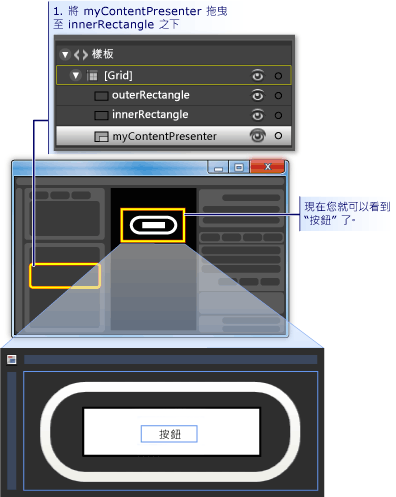
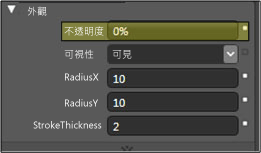
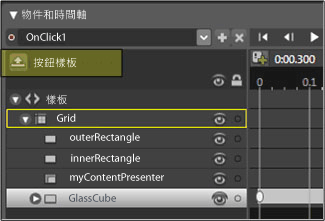

# 逐步解說：使用 Microsoft Expression Blend 建立按鈕
本逐步解說會逐步引導您使用 Microsoft Expression [!INCLUDE[TLA2#tla_wpf](../../../../includes/tla2sharptla-wpf-md.md)] Blend 來建立自訂按鈕。  
  
> [!IMPORTANT]
> Microsoft Expression Blend 的運作方式[!INCLUDE[TLA#tla_xaml](../../../../includes/tlasharptla-xaml-md.md)]是產生, 然後進行編譯, 以建立可執行檔程式。 如果您想[!INCLUDE[TLA#tla_xaml](../../../../includes/tlasharptla-xaml-md.md)]要直接使用, 還有另一個逐步解說, 會使用[!INCLUDE[TLA#tla_xaml](../../../../includes/tlasharptla-xaml-md.md)] with Visual Studio 而不是 Blend 來建立與此應用程式相同的應用程式。 如需詳細資訊, 請參閱[使用 XAML 建立按鈕](walkthrough-create-a-button-by-using-xaml.md)。  
  
 下圖顯示您將建立的自訂按鈕。  
  
   
  
## 將圖形轉換成按鈕  
 在本逐步解說的第一個部分中, 您會建立自訂的按鈕外觀。 若要這樣做, 您必須先將矩形轉換成按鈕。 接著, 您可以將其他圖形新增至按鈕的範本, 以建立更複雜的 [尋找] 按鈕。 為什麼無法以一般按鈕開始進行自訂？ 因為按鈕有您不需要的內建功能,針對自訂按鈕, 以矩形開頭較容易。  
  
#### 在 Expression Blend 中建立新的專案  
  
1. 開始運算式 Blend。 (按一下 [**開始**], 指向 [**所有程式**], 指向 [ **microsoft 運算式**], 然後按一下 [ **microsoft expression Blend**])。  
  
2. 視需要將應用程式最大化。  
  
3. 按一下 [檔案] 功能表上的 [新增專案]。  
  
4. 選取 **[標準應用程式 (.exe)** ]。  
  
5. 將專案`CustomButton`命名為, 然後按 **[確定]** 。  
  
 此時您會有一個空白[!INCLUDE[TLA2#tla_wpf](../../../../includes/tla2sharptla-wpf-md.md)]專案。 您可以按 F5 執行應用程式。 如您所預期, 應用程式只會包含一個空白視窗。 接下來, 您要建立一個圓角矩形, 並將它轉換成一個按鈕。  
  
#### 將矩形轉換成按鈕  
  
1. **將視窗背景屬性設定為黑色:** 選取 [] 視窗, 按一下 [**屬性]** 索引標籤<xref:System.Windows.Controls.Control.Background%2A> , 然後`Black`將屬性設定為。  
  
       
  
2. **在視窗上繪製大約按鈕大小的矩形:** 選取左側工具面板上的 [矩形] 工具, 然後將矩形拖曳至視窗。  
  
       
  
3. **進位矩形的角落:** 請拖曳矩形的控制點, 或直接設定<xref:System.Windows.Shapes.Rectangle.RadiusX%2A>和<xref:System.Windows.Shapes.Rectangle.RadiusY%2A>屬性。 將<xref:System.Windows.Shapes.Rectangle.RadiusX%2A> 和<xref:System.Windows.Shapes.Rectangle.RadiusY%2A>的值設定為20。  
  
       
  
4. **將矩形變更為按鈕:** 選取矩形。 在 [**工具**] 功能表上, 按一下 [**建立] 按鈕**。  
  
       
  
5. **指定樣式/範本的範圍:** 如下所示的對話方塊隨即出現。  
  
     ![[建立樣式資源] 對話方塊](./media/custom-button-blend-makebutton2.gif "custom_button_blend_MakeButton2")  
  
     針對 **[資源名稱 (金鑰)** ], 選取 [**全部**套用]。  這會使產生的樣式和按鈕範本適用于所有按鈕的物件。 針對 [**定義于] 中**, 選取 [**應用程式**]。 這會使產生的樣式和按鈕範本具有整個應用程式的範圍。 當您設定這兩個方塊中的值時, 按鈕樣式和範本會套用至整個應用程式內的所有按鈕, 而且您在應用程式中建立的任何按鈕預設都會使用此範本。  
  
## 編輯按鈕範本  
 您現在已有一個已變更為按鈕的矩形。 在本節中, 您將修改按鈕的範本, 並進一步自訂其外觀。  
  
#### 若要編輯按鈕範本以變更按鈕外觀  
  
1. **進入 [編輯範本] 視圖:** 若要進一步自訂按鈕的外觀, 我們需要編輯 [按鈕] 範本。 當我們將矩形轉換成按鈕時, 就會建立此範本。 若要編輯按鈕範本, 請以滑鼠右鍵按一下按鈕, 然後依序選取 [**編輯控制群組件 (範本)** ] 和 [**編輯範本**]。  
  
       
  
     在 [範本編輯器] 中, 請注意, 按鈕現在會分隔<xref:System.Windows.Shapes.Rectangle>成<xref:System.Windows.Controls.ContentPresenter>和。 <xref:System.Windows.Controls.ContentPresenter>是用來在按鈕內呈現內容 (例如, 字串 "button")。 矩形和<xref:System.Windows.Controls.ContentPresenter>都會配置於內部<xref:System.Windows.Controls.Grid>。  
  
       
  
2. **變更範本元件的名稱:** 以滑鼠右鍵按一下範本清查中的矩形, 將<xref:System.Windows.Shapes.Rectangle>名稱從 "[rectangle]" 變更為 "outerRectangle", 並將 "[ContentPresenter]" 變更為 "myContentPresenter"。  
  
       
  
3. **修改矩形, 使其在內部 (例如環圈圖) 為空白:** 選取 [ **outerRectangle** ] <xref:System.Windows.Shapes.Shape.Fill%2A> , 並將設定為<xref:System.Windows.Shapes.Shape.StrokeThickness%2A> [透明], 並設為 [5]。  
  
       
  
     然後將設定<xref:System.Windows.Shapes.Shape.Stroke%2A>為任何範本的色彩。 若要這麼做, 請按一下 [**筆觸**] 旁的小白色方塊, 選取 [ **CustomExpression**], 然後在對話方塊中輸入 "{TemplateBinding Background}"。  
  
       
  
4. **建立內部矩形:** 現在, 建立另一個矩形 (將其命名為 "innerRectangle"), 並將其在**outerRectangle**內對稱放置。 針對這種工作, 您可能會想要縮放, 使編輯區域中的按鈕變大。  
  
    > [!NOTE]
    > 您的矩形看起來可能與圖中的不同 (例如, 它可能有圓角)。  
  
       
  
5. **將 ContentPresenter 移至頂端:** 此時, 可能不會再顯示文字「按鈕」。 如果這樣做, 這是因為**innerRectangle**是在**myContentPresenter**的頂端。 若要修正此問題, 請將**myContentPresenter**拖曳到 [ **innerRectangle**] 下方。 重新置放矩形和**myContentPresenter** , 看起來如下所示。  
  
    > [!NOTE]
    > 或者, 您也可以用滑鼠右鍵按一下**myContentPresenter** , 然後按 [**向前傳送**], 將它放在最上層。  
  
       
  
6. **變更 innerRectangle 的外觀:** <xref:System.Windows.Shapes.Rectangle.RadiusX%2A>將、 <xref:System.Windows.Shapes.Rectangle.RadiusY%2A>和值設定為20。<xref:System.Windows.Shapes.Shape.StrokeThickness%2A> 此外, 使用自訂<xref:System.Windows.Shapes.Shape.Fill%2A>運算式 "{TemplateBinding background}" 將設定為範本的背景, 並將設定<xref:System.Windows.Shapes.Shape.Stroke%2A>為「透明」。 <xref:System.Windows.Shapes.Shape.Fill%2A>請注意, <xref:System.Windows.Shapes.Shape.Stroke%2A>和的**innerRectangle**與**outerRectangle**的設定相反。  
  
       
  
7. **在頂端新增玻璃層:** 自訂按鈕外觀的最後一項是在頂端新增玻璃圖層。 這個半透明層是由第三個矩形所組成。 因為玻璃會涵蓋整個按鈕, 所以半透明矩形在**outerRectangle**的維度中類似。 因此, 只要製作**outerRectangle**的複本, 即可建立矩形。 反白顯示**outerRectangle** , 並使用 Ctrl + C 和 Ctrl + V 建立複本。 將此新矩形命名為 "glassCube"。  
  
8. **視需要重新置放 glassCube:** 如果**glassCube**尚未定位, 使其涵蓋整個按鈕, 請將其拖曳至 [位置]。  
  
9. **提供 glassCube 的圖形與 outerRectangle 稍微不同:** 變更**glassCube**的屬性。 開始, 將<xref:System.Windows.Shapes.Rectangle.RadiusX%2A>和<xref:System.Windows.Shapes.Rectangle.RadiusY%2A>屬性變更為 10, 並將<xref:System.Windows.Shapes.Shape.StrokeThickness%2A>設為2。  
  
       
  
10. **讓 glassCube 看起來像玻璃:** 使用線性漸層 (75% 不透明) 將設定為glassy的外觀,並將色彩白色和透明的顏色替換成大約平均間距間隔。<xref:System.Windows.Shapes.Shape.Fill%2A> 這是要設定漸層停駐點的目標:  
  
    - 梯度停駐 1:具有 Alpha 值 75% 的白色  
  
    - 梯度停駐 2:透明  
  
    - 梯度停駐 3:具有 Alpha 值 75% 的白色  
  
    - 梯度停駐 4:透明  
  
    - 梯度停駐 5:具有 Alpha 值 75% 的白色  
  
    - 梯度停駐 6:透明  
  
     這會建立「波浪」玻璃外觀。  
  
       
  
11. **隱藏半透明層:** 現在您已看到 glassy 圖層的樣子, 請移至 [**屬性] 面板**的 [**外觀] 窗格**, 並將不透明度設定為 0% 以隱藏它。 在前面的章節中, 我們將使用屬性觸發程式和事件來顯示及操作半透明層。  
  
       
  
## 自訂按鈕行為  
 此時, 您已藉由編輯範本的方式來自訂按鈕的呈現, 但是按鈕不會回應使用者動作, 因為一般按鈕會發生 (例如, 變更滑鼠停留時的外觀、接收焦點, 然後按一下)。接下來的兩個程式示範如何在 [自訂] 按鈕中建立像這樣的行為。 我們會從簡單的屬性觸發程式開始, 然後新增事件觸發程式和動畫。  
  
#### 若要設定屬性觸發程式  
  
1. **建立新的屬性觸發程式:** 選取**glassCube**後, 按一下 [**觸發**程式] 面板中的 [ **+ 屬性**] (請參閱下一個步驟後面的圖表)。 這會建立具有預設屬性觸發程式的屬性觸發程式。  
  
2. **將 System.windows.uielement.ismouseover 設為觸發程式所使用的屬性:** 將屬性變更為<xref:System.Windows.UIElement.IsMouseOver%2A>。 當<xref:System.Windows.UIElement.IsMouseOver%2A>屬性為時, 這會讓屬性觸發`true`程式啟動 (當使用者指向具有滑鼠的按鈕時)。  
  
     ![如何在屬性上設定觸發]程式(./media/custom-button-blend-ismousedoverpropertytrigger.png "custom_button_blend_IsMousedOverPropertyTrigger")  
  
3. **System.windows.uielement.ismouseover 會觸發 glassCube 的 100% 不透明度:** 請注意,**觸發程式記錄是 on** (請參閱上圖)。 這表示當您在錄製時對**glassCube**的屬性值所做的任何變更, 都會變成當為<xref:System.Windows.UIElement.IsMouseOver%2A> `true`時所發生的動作。 錄製時, 請將<xref:System.Windows.UIElement.Opacity%2A> **glassCube**的變更為 100%。  
  
       
  
     您現在已建立您的第一個屬性觸發程式。 請注意, 編輯器的 [觸發程式]**面板**已<xref:System.Windows.UIElement.Opacity%2A>記錄變更為 100%。  
  
     ![[觸發程序] 面板](./media/custom-button-blend-propertytriggerinfo.png "custom_button_blend_PropertyTriggerInfo")  
  
     按 F5 鍵執行應用程式, 並將滑鼠指標移至按鈕上方或下方。 當您將滑鼠停留在按鈕上時, 您應該會看到玻璃層出現, 並在指標離開時消失。  
  
4. **System.windows.uielement.ismouseover 觸發程式筆觸值變更:** 讓我們將一些其他動作與<xref:System.Windows.UIElement.IsMouseOver%2A>觸發程式建立關聯。 錄製繼續時, 請將您的選取範圍從**glassCube**切換到**outerRectangle**。 然後將<xref:System.Windows.Shapes.Shape.Stroke%2A> **outerRectangle**的設定為 "{DynamicResource {x:Static SystemColors. HighlightBrushKey}}" 的自訂表格達式。 這會將<xref:System.Windows.Shapes.Shape.Stroke%2A>設定為按鈕所使用的一般醒目提示色彩。 按 F5 鍵可查看滑鼠停留在按鈕上的效果。  
  
       
  
5. **System.windows.uielement.ismouseover 會觸發模糊的文字:** 讓我們將另一個動作與<xref:System.Windows.UIElement.IsMouseOver%2A>屬性觸發程式產生關聯。 當玻璃出現在螢幕上時, 讓按鈕的內容看起來有點模糊。 若要這麼做, 我們可以對<xref:System.Windows.Media.Effects.BitmapEffect> <xref:System.Windows.Controls.ContentPresenter> (**myContentPresenter**) 套用模糊。  
  
       
  
    > [!NOTE]
    > 若要讓 [**屬性] 面板**回到搜尋<xref:System.Windows.Media.Effects.BitmapEffect>之前的內容, 請清除 [**搜尋**] 方塊中的文字。  
  
     此時, 我們使用了屬性觸發程式與數個相關聯的動作, 在滑鼠指標進入和離開按鈕區域時, 建立反白顯示的行為。 按鈕的另一個一般行為是反白顯示焦點 (如同按一下之後)。 我們可以加入<xref:System.Windows.UIElement.IsFocused%2A>屬性的另一個屬性觸發程式來新增這類行為。  
  
6. **建立 IsFocused 的屬性觸發程式:** 使用與相同的程式<xref:System.Windows.UIElement.IsMouseOver%2A> (請參閱本節的第一個步驟), 為<xref:System.Windows.UIElement.IsFocused%2A>屬性建立另一個屬性觸發程式。 當**觸發程式記錄為 on**時, 請將下列動作新增至觸發程式:  
  
    - **glassCube**取得<xref:System.Windows.UIElement.Opacity%2A> 100% 的。  
  
    - **outerRectangle**會取得<xref:System.Windows.Shapes.Shape.Stroke%2A> "{DynamicResource {x:Static SystemColors. HighlightBrushKey}}" 的自訂表格達式值。  
  
 在本逐步解說中的最後一個步驟中, 我們會將動畫新增至按鈕。 這些動畫會由事件觸發, 具體來說, <xref:System.Windows.UIElement.MouseEnter>就是和<xref:System.Windows.Controls.Primitives.ButtonBase.Click>事件。  
  
#### 使用事件觸發程式和動畫來新增互動性  
  
1. **建立 MouseEnter 事件觸發程式:** 加入新的事件觸發程式, <xref:System.Windows.UIElement.MouseEnter>並選取做為要在觸發程式中使用的事件。  
  
     ![如何建立 MouseEnter 事件觸發]程式(./media/custom-button-blend-mouseovereventtrigger.png "custom_button_blend_MouseOverEventTrigger")  
  
2. **建立動畫時間軸:** 接下來, 將動畫時間軸與<xref:System.Windows.UIElement.MouseEnter>事件產生關聯。  
  
       
  
     在您按下 **[確定]** 以建立新的時間軸之後, [**時間軸] 面板**會出現並顯示在設計面板中的 [時間軸錄製已開啟]。 這表示我們可以開始在時間軸中記錄屬性變更 (以動畫顯示內容變更)。  
  
    > [!NOTE]
    > 您可能需要調整視窗和/或面板的大小, 才能看到顯示畫面。  
  
       
  
3. **建立主要畫面格:** 若要建立動畫, 請選取您想要製作動畫的物件、在時間軸上建立兩個或更多的主要畫面格, 然後針對這些主要畫面格, 設定您想要讓動畫在其間插補的屬性值。 下圖會引導您完成建立主要畫面格。  
  
     ![如何建立]主要畫面格(./media/custom-button-blend-mouseovereventtrigger4.png "custom_button_blend_MouseOverEventTrigger4")  
  
4. **縮小此主要畫面格的 glassCube:** 選取第二個主要畫面格時, 請使用**大小轉換**, 將**glassCube**的大小縮減為 90% 的完整大小。  
  
       
  
     按 F5 執行應用程式。 將滑鼠指標移至按鈕上方。 請注意, 玻璃層會在按鈕上方縮小。  
  
5. **建立另一個事件觸發程式, 並將不同的動畫與它建立關聯:** 讓我們再加上一個動畫。 使用您用來建立先前事件觸發程式動畫的類似程式:  
  
    1. 使用<xref:System.Windows.Controls.Primitives.ButtonBase.Click>事件建立新的事件觸發程式。  
  
    2. 將新的時間軸與<xref:System.Windows.Controls.Primitives.ButtonBase.Click>事件產生關聯。  
  
       
  
    1. 針對此時間軸, 建立兩個主要畫面格, 一個在0.0 秒, 第二個是0.3 秒。  
  
    2. 在反白顯示0.3 秒的主要畫面格時, 將 [**旋轉轉換角度**] 設定為360度。  
  
       
  
    1. 按 F5 執行應用程式。 按一下按鈕。 請注意, 玻璃層會旋轉。  
  
## 結論  
 您已完成自訂按鈕。 您使用套用至應用程式中所有按鈕的按鈕範本來執行這項操作。 如果您離開範本編輯模式 (請參閱下圖) 並建立更多按鈕, 您會看到它們的外觀和行為類似于您的自訂按鈕, 而不像預設按鈕。  
  
   
  
   
  
 按 F5 執行應用程式。 按一下按鈕, 並留意其所有行為都相同。  
  
 請記住, 當您自訂範本時, 您會<xref:System.Windows.Shapes.Shape.Fill%2A> <xref:System.Windows.Shapes.Shape.Stroke%2A>將**innerRectangle**的屬性和屬性**outerRectangle**設定為範本背景 ({TemplateBinding background})。 因此, 當您設定個別按鈕的背景色彩時, 您設定的背景將會用於那些各自的屬性。 立即嘗試變更背景。 在下圖中, 會使用不同的漸層。 因此, 雖然範本適用于控制項 (例如按鈕) 的整體自訂, 但具有範本的控制項仍然可以進行修改, 使其看起來不同。  
  
   
  
 總之, 在自訂按鈕範本的過程中, 您已瞭解如何在 Microsoft Expression Blend 中執行下列動作:  
  
- 自訂控制項的外觀。  
  
- 設定屬性觸發程式。 屬性觸發程式非常有用, 因為它們可以用於大部分的物件, 而不只是控制項。  
  
- 設定事件觸發程式。 事件觸發程式非常有用, 因為它們可以用於大部分的物件, 而不只是控制項。  
  
- 建立動畫。  
  
- 其他: 建立漸層、加入 BitmapEffects、使用轉換和設定物件的基本屬性。  
  
## 另請參閱

- [使用 XAML 建立按鈕](walkthrough-create-a-button-by-using-xaml.md)
- [樣式設定和範本化](styling-and-templating.md)
- [動畫概觀](../graphics-multimedia/animation-overview.md)
- [使用純色和漸層繪製的概觀](../graphics-multimedia/painting-with-solid-colors-and-gradients-overview.md)
- [點陣圖效果概觀](../graphics-multimedia/bitmap-effects-overview.md)
