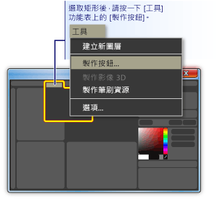

# 逐步解說：使用 Microsoft Expression Blend 建立按鈕
這個逐步解說會引導您建立的程序透過[!INCLUDE[TLA2#tla_wpf](../../../../includes/tla2sharptla-wpf-md.md)]自訂的按鈕，使用 Microsoft Expression Blend。  
  
> [!IMPORTANT]
>  Microsoft Expression Blend 的運作方式是產生[!INCLUDE[TLA#tla_xaml](../../../../includes/tlasharptla-xaml-md.md)]，再編譯為可執行程式。 如果您想使用[!INCLUDE[TLA#tla_xaml](../../../../includes/tlasharptla-xaml-md.md)]直接，會建立一個使用相同的應用程式的另一個逐步解說[!INCLUDE[TLA#tla_xaml](../../../../includes/tlasharptla-xaml-md.md)]與[!INCLUDE[vs_current_short](../../../../includes/vs-current-short-md.md)]而不是 Blend。 請參閱[建立使用 xaml 按鈕](../../../../docs/framework/wpf/controls/walkthrough-create-a-button-by-using-xaml.md)如需詳細資訊。  
  
 下圖將顯示您將建立的自訂的按鈕。  
  
   
  
## 將圖形轉換的按鈕  
 在本逐步解說的第一個部分，您會建立自訂的自訂按鈕外觀。 若要這樣做，您先將矩形轉換的按鈕。 然後您加入其他圖形按鈕的範本來建立更複雜的 [尋找] 按鈕。 為什麼不以一般按鈕開頭，並且自訂它嗎？ 因為在按鈕的內建功能，您不需要。自訂按鈕，很容易矩形的開頭。  
  
#### 在 Expression Blend 中建立新的專案  
  
1.  啟動 Expression Blend。 (按一下**啟動**，指向 **所有程式**，指向  **Microsoft Expression**，然後按一下  **Microsoft Expression Blend**。)  
  
2.  如有需要最大化應用程式。  
  
3.  按一下 [檔案] 功能表上的 [新增專案]。  
  
4.  選取**標準應用程式 (.exe)**。  
  
5.  將專案命名`CustomButton`按**確定**。  
  
 現在您有空白[!INCLUDE[TLA2#tla_wpf](../../../../includes/tla2sharptla-wpf-md.md)]專案。 您可以按 F5 執行應用程式。 如您所料，此應用程式包含空白視窗。 接下來，您會建立圓角的矩形，並將它轉換成按鈕。  
  
#### 若要將矩形轉換的按鈕  
  
1.  **視窗背景屬性設定為黑色：**選取的視窗中，按一下**屬性 索引標籤**，並設定<xref:System.Windows.Controls.Control.Background%2A>屬性`Black`。  
  
       
  
2.  **視窗上進行繪製的矩形大約按鈕的大小：**選取工具左側面板上的 [矩形] 工具，然後將矩形拖曳到視窗。  
  
       
  
3.  **圓形外框的角落：**拖曳矩形的控點，或直接設定<xref:System.Windows.Shapes.Rectangle.RadiusX%2A>和<xref:System.Windows.Shapes.Rectangle.RadiusY%2A>屬性。 設定的值<xref:System.Windows.Shapes.Rectangle.RadiusX%2A>和<xref:System.Windows.Shapes.Rectangle.RadiusY%2A>為 20。  
  
       
  
4.  **矩形，按鈕會變成：**選取矩形。 在**工具**功能表上，按一下 **製作按鈕**。  
  
       
  
5.  **指定的樣式範本範圍：**像下列項目出現的對話方塊。  
  
       
  
     如**資源名稱 （索引鍵）**，選取**全部套用**。  這會使得產生的樣式和 button 範本套用到幾個按鈕可用的所有物件。 如**中定義**，選取**應用程式**。 這會使得產生的樣式和按鈕範本的範圍涵蓋整個應用程式。 當您設定的值，這兩個方塊中，按鈕樣式和範本套用至整個應用程式內的所有按鈕，而且將任何您建立應用程式中的按鈕，依預設，使用此範本。  
  
## 編輯按鈕範本  
 您現在有一個已變更為按鈕的矩形。 在本節中，將修改的按鈕範本，並進一步自訂它的外觀。  
  
#### 若要編輯按鈕範本，若要變更按鈕的外觀  
  
1.  **切換至編輯範本檢視：**若要進一步自訂我們按鈕的外觀，我們需要編輯按鈕範本。 當我們將矩形轉換的按鈕時，已建立此範本。 若要編輯按鈕 範本，以滑鼠右鍵按一下按鈕，然後選取**編輯控制項組件 （範本）**然後**編輯範本**。  
  
       
  
     在範本的編輯器中，請注意，按鈕現在分成<xref:System.Windows.Shapes.Rectangle>和<xref:System.Windows.Controls.ContentPresenter>。 <xref:System.Windows.Controls.ContentPresenter>用來顯示按鈕 （例如，字串"Button"） 內的內容。 這兩個矩形和<xref:System.Windows.Controls.ContentPresenter>內配置<xref:System.Windows.Controls.Grid>。  
  
       
  
2.  **變更範本元件的名稱：**上按一下滑鼠右鍵在範本清單，變更矩形<xref:System.Windows.Shapes.Rectangle>"outerRectangle 」，以名稱"[矩形]"，並將"[ContentPresenter]"變更為"myContentPresenter"。  
  
       
  
3.  **Alter 矩形，使其空白內 （例如甜甜圈）：**選取**outerRectangle**並設定<xref:System.Windows.Shapes.Shape.Fill%2A>至 「 廣域網路 」 和<xref:System.Windows.Shapes.Shape.StrokeThickness%2A>為 5。  
  
       
  
     然後設定<xref:System.Windows.Shapes.Shape.Stroke%2A>的範本將可在任何色彩。 若要這樣做，請按一下小型的白色方塊旁的 **筆劃**，選取**CustomExpression**，並在對話方塊中輸入"{TemplateBinding 背景} 」。  
  
       
  
4.  **建立內部的矩形：**現在，建立另一個矩形 （其命名為"innerRectangle 」） 並將其放置對稱內部**outerRectangle** 。 這類的工作中，您可能要縮放至編輯區域中放大按鈕。  
  
    > [!NOTE]
    >  矩形看起來可能不同於在此圖中 （例如，它可能會有圓角）。  
  
       
  
5.  **移至頂端 ContentPresenter:**這個時候，它是文字"Button"將不會顯示不再。 如果情況如此，這是因為**innerRectangle**上**myContentPresenter**。 若要修正此問題，請將**myContentPresenter**下方**innerRectangle**。 重新定位矩形和**myContentPresenter**以類似底下所示。  
  
    > [!NOTE]
    >  或者，您也可以定位**myContentPresenter**在上面按一下滑鼠右鍵，然後按**移一層**。  
  
       
  
6.  **變更外觀 innerRectangle:**設定<xref:System.Windows.Shapes.Rectangle.RadiusX%2A>， <xref:System.Windows.Shapes.Rectangle.RadiusY%2A>，和<xref:System.Windows.Shapes.Shape.StrokeThickness%2A>到 20 的值。 此外，設定<xref:System.Windows.Shapes.Shape.Fill%2A>使用自訂運算式"{TemplateBinding 背景} 」 的範本的背景)，並設定<xref:System.Windows.Shapes.Shape.Stroke%2A>為 「 透明"。 請注意，設定<xref:System.Windows.Shapes.Shape.Fill%2A>和<xref:System.Windows.Shapes.Shape.Stroke%2A>的**innerRectangle**是相反的**outerRectangle**。  
  
       
  
7.  **在上面加入玻璃圖層：**自訂按鈕的外觀的最後一段會於最上方加入玻璃圖層。 這個玻璃層是由第三個矩形所組成。 因為玻璃會涵蓋整個按鈕，玻璃矩形會類似維度，以便在**outerRectangle**。 因此，只需產生一份建立矩形**outerRectangle**。 反白顯示**outerRectangle**並使用 CTRL + C 和 CTRL + V 鍵來進行複製。 這個新的矩形"glassCube 」 的名稱。  
  
8.  **如有必要，請重新定位 glassCube:**如果**glassCube**是尚未定位，使其涵蓋整個按鈕，將它拖曳到位置。  
  
9. **提供 glassCube outerRectangle 以稍有不同於：**變更的內容**glassCube**。 藉由變更開始<xref:System.Windows.Shapes.Rectangle.RadiusX%2A>和<xref:System.Windows.Shapes.Rectangle.RadiusY%2A>屬性為 10 而<xref:System.Windows.Shapes.Shape.StrokeThickness%2A>為 2。  
  
       
  
10. **請看起來像玻璃 glassCube:**設定<xref:System.Windows.Shapes.Shape.Fill%2A>光滑的外觀，使用線形漸層的 75%不透明和交替使用的色彩為白色和透明超過 6 大約平均間距的間隔。 這是要設定為漸層停駐的項目：  
  
    -   75%的 Alpha 值的漸層停駐 1： 空白  
  
    -   漸層停止 2： 透明  
  
    -   75%的 Alpha 值的漸層停駐 3： 空白  
  
    -   漸層停止 4： 透明  
  
    -   75%的 Alpha 值的漸層停駐 5： 空白  
  
    -   漸層停止 6： 透明  
  
     這會建立 「 波浪"玻璃外觀。  
  
       
  
11. **隱藏玻璃層：**現在，您會看到光滑層是什麼樣子，請移至**外觀窗格**的**屬性面板**和不透明度設定為 0%，以隱藏它。 在繼續進行的區段，我們將使用屬性觸發程序和事件來顯示和操作玻璃層。  
  
       
  
## 自訂按鈕行為  
 此時，您已自訂按鈕的呈現方式，藉由編輯範本，但是按鈕不會做出回應使用者動作一般按鈕執行 （例如變更滑鼠停留時的外觀，接收焦點，再按一下。）下面兩個程序示範如何建置到自訂按鈕類行為。 我們將開始簡單屬性觸發程序，並將事件觸發程序和動畫。  
  
#### 若要設定屬性觸發程序  
  
1.  **建立新的屬性觸發程序：**與**glassCube**選取，按一下**+ 屬性**中**觸發程序**面板 （請參閱圖所示的下一個步驟）。 這會建立預設屬性觸發程序屬性觸發程序。  
  
2.  **IsMouseOver 將屬性設為使用觸發程序：**變更屬性，以<xref:System.Windows.UIElement.IsMouseOver%2A>。 這可讓屬性觸發程序啟動時<xref:System.Windows.UIElement.IsMouseOver%2A>屬性是`true`（當使用者指向滑鼠按鈕）。  
  
       
  
3.  **IsMouseOver 觸發 glassCube 的 100%的不透明度：**注意**觸發程序記錄已開啟**（請參閱前面的圖中）。 這表示您對屬性值的任何變更**glassCube**在錄製時將會變成動作發生於當<xref:System.Windows.UIElement.IsMouseOver%2A>是`true`。 當錄製時，變更<xref:System.Windows.UIElement.Opacity%2A>的**glassCube**為 100%。  
  
       
  
     您現在已建立第一個屬性觸發程序。 請注意，**觸發程序面板**編輯器的已記錄<xref:System.Windows.UIElement.Opacity%2A>正要變更成 100%。  
  
     ![[觸發程序] 面板](../../../../docs/framework/wpf/controls/media/custom-button-blend-propertytriggerinfo.png "custom_button_blend_PropertyTriggerInfo")  
  
     按 F5 執行應用程式，並透過和關閉按鈕移動滑鼠指標。 您應該會看到玻璃圖層時，出現您滑鼠移過按鈕並消失時，指標離開。  
  
4.  **IsMouseOver 觸發程序繪製的值變更：**讓我們來建立關聯的某些其他動作<xref:System.Windows.UIElement.IsMouseOver%2A>觸發程序。 當持續錄製時，請切換您的選取項目從**glassCube**至**outerRectangle**。 然後設定<xref:System.Windows.Shapes.Shape.Stroke%2A>的**outerRectangle** "{DynamicResource {X:static SystemColors.HighlightBrushKey}}"的自訂運算式。 這會設定<xref:System.Windows.Shapes.Shape.Stroke%2A>一般來反白顯示的按鈕所使用的色彩。 若要查看效果，當您將滑鼠停留在按鈕的按 f5 鍵。  
  
       
  
5.  **IsMouseOver 觸發模糊的文字：**讓我們來關聯一個更多動作才能<xref:System.Windows.UIElement.IsMouseOver%2A>屬性觸發程序。 對內容按鈕的玻璃出現在它上面時出現有點模糊。 若要這樣做，我們可以套用模糊<xref:System.Windows.Media.Effects.BitmapEffect>至<xref:System.Windows.Controls.ContentPresenter>(**myContentPresenter**)。  
  
       
  
    > [!NOTE]
    >  傳回**屬性面板**回到決定其已先搜尋<xref:System.Windows.Media.Effects.BitmapEffect>，清除 從文字**搜尋方塊**。  
  
     此時，我們已與幾個相關聯的動作使用屬性觸發程序，當滑鼠指標進入及離開按鈕區域建立醒目提示行為。 另一個常見的問題，按鈕是以反白顯示取得焦點時 （如同之後按下時）。 我們可以加入另一個屬性觸發程序，以便將這類行為<xref:System.Windows.UIElement.IsFocused%2A>屬性。  
  
6.  **建立 IsFocused 屬性觸發程序：**使用相同的程序為<xref:System.Windows.UIElement.IsMouseOver%2A>（請參閱本節的第一個步驟），建立另一個屬性觸發程序<xref:System.Windows.UIElement.IsFocused%2A>屬性。 雖然**觸發程序記錄已開啟**，觸發程序中加入下列動作：  
  
    -   **glassCube**取得<xref:System.Windows.UIElement.Opacity%2A>100%。  
  
    -   **outerRectangle**取得<xref:System.Windows.Shapes.Shape.Stroke%2A>自訂運算式值的"{DynamicResource {X:static SystemColors.HighlightBrushKey}}"。  
  
 這個逐步解說中的最後一個步驟，我們會加入至按鈕的動畫。 事件會觸發這些動畫 — 尤其<xref:System.Windows.UIElement.MouseEnter>和<xref:System.Windows.Controls.Primitives.ButtonBase.Click>事件。  
  
#### 若要使用事件觸發程序和動畫加入互動功能  
  
1.  **建立 MouseEnter 事件觸發程序：**加入新的事件觸發程序，並選取<xref:System.Windows.UIElement.MouseEnter>為使用觸發程序事件。  
  
       
  
2.  **建立動畫時間軸：**接下來，將動畫時刻表<xref:System.Windows.UIElement.MouseEnter>事件。  
  
       
  
     您按下之後**確定**來建立新的時間軸，**時間軸 面板**出現和 「 時間軸記錄已開啟 」 會顯示在 設計 面板中。 這表示我們可以開始錄製時間表 （以動畫顯示屬性的變更） 中的屬性變更。  
  
    > [!NOTE]
    >  您可能需要調整大小的視窗和 （或） 以查看顯示的面板。  
  
       
  
3.  **建立主要畫面格：**若要建立動畫，選取您想要製作動畫時間軸，而且可用於這些主要畫面格建立兩個或多個主要畫面格、 設定您想要間進行插補的動畫的屬性值的物件。 下圖會引導您完成建立主要畫面格。  
  
       
  
4.  **壓縮在這個主要畫面格 glassCube:**選取第二個主要畫面格，以縮小大小**glassCube**設成使用其完整大小的 90%**大小轉換**。  
  
       
  
     按 F5 執行應用程式。 移動滑鼠指標停留在按鈕。 請注意，玻璃層壓縮頂端的按鈕。  
  
5.  **建立另一個事件觸發程序，並讓不同的動畫與其產生關聯：**讓我們加入一個詳細的動畫。 使用您用來建立前一個事件觸發程序動畫類似的程序：  
  
    1.  建立新的事件觸發程序使用<xref:System.Windows.Controls.Primitives.ButtonBase.Click>事件。  
  
    2.  將新的時間軸與<xref:System.Windows.Controls.Primitives.ButtonBase.Click>事件。  
  
       
  
    1.  這個時間軸，建立兩個主要畫面格，一個 0.0 秒時，第二個在 0.3 秒。  
  
    2.  在 0.3 秒反白顯示的主要畫面格，設定**旋轉轉換的角度**到 360 度。  
  
       
  
    1.  按 F5 執行應用程式。 按一下按鈕。 請注意，玻璃層會旋轉。  
  
## 結論  
 您已完成的自訂的按鈕。 您未使用已套用至應用程式中的所有按鈕的按鈕 範本。 如果您離開編輯模式範本 （請參閱下圖） 並建立更多按鈕，您會看見其外觀和行為就像您自訂的按鈕一樣，而不是像預設按鈕。  
  
   
  
   
  
 按 F5 執行應用程式。 按一下按鈕，注意它們的行為相同。  
  
 請記住，雖然您已自訂範本，您將<xref:System.Windows.Shapes.Shape.Fill%2A>屬性**innerRectangle**和<xref:System.Windows.Shapes.Shape.Stroke%2A>屬性**outerRectangle**範本背景 （{TemplateBinding 背景}）。 因此，當您設定個別的按鈕的背景色彩您設定在背景將用於其各自的屬性。 現在變更背景再試一次。 在下圖中，會使用不同的漸層。 因此，雖然適用於整體像按鈕控制項的自訂範本，範本使用的控制項仍然可以修改尋找與彼此不同。  
  
   
  
 結論，程序自訂按鈕範本，您已經學會如何執行 Microsoft Expression Blend 中的下列：  
  
-   自訂控制項的外觀。  
  
-   設定屬性觸發程序。 屬性觸發程序會相當實用，因為它們可用於大部分的物件，而不只是控制項。  
  
-   設定事件觸發程序。 事件觸發程序會相當實用，因為它們可用於大部分的物件，而不只是控制項。  
  
-   建立動畫。  
  
-   其他： 建立漸層，新增 BitmapEffects、 使用轉換，並設定物件的基本屬性。  
  
## 請參閱  
 [使用 XAML 建立按鈕](../../../../docs/framework/wpf/controls/walkthrough-create-a-button-by-using-xaml.md)  
 [樣式設定和範本化](../../../../docs/framework/wpf/controls/styling-and-templating.md)  
 [動畫概觀](../../../../docs/framework/wpf/graphics-multimedia/animation-overview.md)  
 [使用純色和漸層繪製的概觀](../../../../docs/framework/wpf/graphics-multimedia/painting-with-solid-colors-and-gradients-overview.md)  
 [點陣圖效果概觀](../../../../docs/framework/wpf/graphics-multimedia/bitmap-effects-overview.md)
