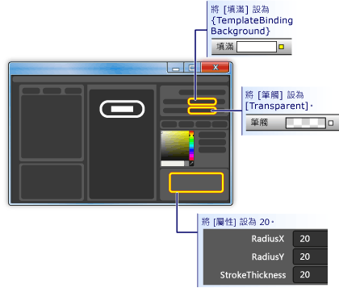
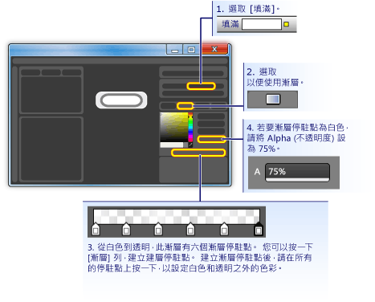
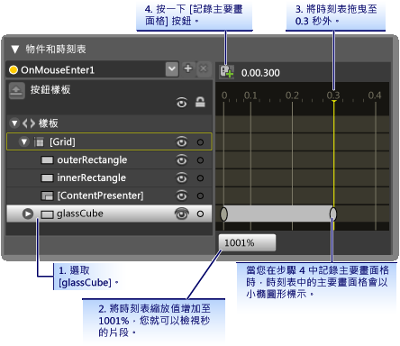
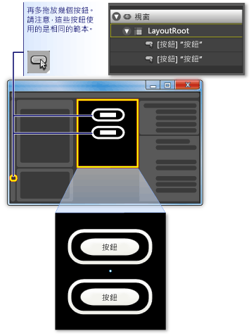

# 逐步解說：使用 Microsoft Expression Blend 建立按鈕
本逐步解說將引導您完成建立程序[!INCLUDE[TLA2#tla_wpf](../../../../includes/tla2sharptla-wpf-md.md)]使用 Microsoft Expression Blend 的自訂的按鈕。  
  
> [!IMPORTANT]
>  Microsoft Expression Blend 的運作方式是產生[!INCLUDE[TLA#tla_xaml](../../../../includes/tlasharptla-xaml-md.md)]，接著會編譯將可執行程式。 如果您偏好使用的[!INCLUDE[TLA#tla_xaml](../../../../includes/tlasharptla-xaml-md.md)]直接管理，還有另一個會建立一個使用相同的應用程式的逐步解說[!INCLUDE[TLA#tla_xaml](../../../../includes/tlasharptla-xaml-md.md)]使用 Visual Studio，而不是 Blend。 請參閱[建立的按鈕所使用的 XAML](walkthrough-create-a-button-by-using-xaml.md)如需詳細資訊。  
  
 下圖顯示 [自訂] 按鈕，您將建立。  
  
   
  
## 將圖形轉換至按鈕  
 在本逐步解說的第一個部分中，您建立自訂的自訂按鈕的外觀。 若要這樣做，您第一次轉換一個矩形的按鈕。 然後您加入其他圖形範本的按鈕，以建立更複雜的 [尋找] 按鈕。 為什麼不使用一般按鈕啟動以及進行自訂？ 因為按鈕具有內建功能，您不需要;自訂按鈕，就更輕鬆地開始一個矩形。  
  
#### 若要在 Expression Blend 中建立新的專案  
  
1.  啟動 Expression Blend。 (按一下**開始**，指向**所有程式**，指向**Microsoft Expression**，然後按一下**Microsoft Expression Blend**。)  
  
2.  如有需要最大化應用程式。  
  
3.  按一下 [檔案] 功能表上的 [新增專案]。  
  
4.  選取 **標準的應用程式 (.exe)**。  
  
5.  將專案命名為`CustomButton`按下 **[確定]**。  
  
 此時您有空白[!INCLUDE[TLA2#tla_wpf](../../../../includes/tla2sharptla-wpf-md.md)]專案。 您可以按 F5 執行應用程式。 如您所料，此應用程式包含空白視窗。 接下來，您會建立圓角的矩形，並將它轉換成按鈕。  
  
#### 將矩形的按鈕  
  
1.  **設定為黑色的視窗背景屬性：** 選取的視窗中，按一下**內容 索引標籤**，並將<xref:System.Windows.Controls.Control.Background%2A>屬性設`Black`。  
  
       
  
2.  **視窗上進行繪製的矩形大約按鈕的大小：** 選取左側的工具面板上的 [矩形] 工具，然後將矩形拖曳到視窗。  
  
       
  
3.  **完成的矩形邊角：** 拖曳矩形的控制點，或直接設定<xref:System.Windows.Shapes.Rectangle.RadiusX%2A>和<xref:System.Windows.Shapes.Rectangle.RadiusY%2A>屬性。 設定的值<xref:System.Windows.Shapes.Rectangle.RadiusX%2A>和<xref:System.Windows.Shapes.Rectangle.RadiusY%2A>為 20。  
  
       
  
4.  **將變更矩形的按鈕：** 選取矩形。 在 **工具**功能表上，按一下**製作按鈕**。  
  
       
  
5.  **指定樣式/樣板的範圍：** 如下所示的對話方塊隨即出現。  
  
     ![[建立樣式資源] 對話方塊中](./media/custom-button-blend-makebutton2.gif "custom_button_blend_MakeButton2")  
  
     針對**資源名稱 （索引鍵）**，選取**套用到全部**。  這會讓產生的樣式和 button 範本套用到所有物件的按鈕。 針對**定義中**，選取**應用程式**。 這會讓產生的樣式和 button 範本對整個應用程式的範圍。 當您在這兩個箱子中設定的值時，在按鈕樣式和範本套用至整個應用程式內的所有按鈕，和您建立應用程式中的任一個按鈕會根據預設，使用此範本。  
  
## 編輯按鈕範本  
 現在，您會有已變更為按鈕的矩形。 在本節中，您將修改按鈕的範本，並進一步自訂其外觀。  
  
#### 若要編輯按鈕範本，若要變更按鈕的外觀  
  
1.  **請移至 編輯範本檢視：** 若要進一步自訂按鈕的外觀，我們需要編輯 按鈕 範本。 此範本的建立，當我們轉換為按鈕的矩形。 若要編輯 按鈕 範本，以滑鼠右鍵按一下  按鈕，然後選取**編輯控制項組件 （範本）** ，然後**編輯範本**。  
  
       
  
     在範本的編輯器中，請注意，[] 按鈕現在已分成<xref:System.Windows.Shapes.Rectangle>而<xref:System.Windows.Controls.ContentPresenter>。 <xref:System.Windows.Controls.ContentPresenter>用來呈現按鈕 （例如字串 「 按鈕 」） 內的內容。 這兩個矩形並<xref:System.Windows.Controls.ContentPresenter>內部的配置<xref:System.Windows.Controls.Grid>。  
  
       
  
2.  **變更範本元件的名稱：** 以滑鼠右鍵按一下範本清查，變更矩形<xref:System.Windows.Shapes.Rectangle>"outerRectangle 」，以名稱"[矩形]"，並將"[ContentPresenter]"變更為"myContentPresenter 」。  
  
       
  
3.  **Alter 矩形，使其空白內 （例如甜甜圈）：** 選取  **outerRectangle**並設定<xref:System.Windows.Shapes.Shape.Fill%2A>設為 透明 」 和<xref:System.Windows.Shapes.Shape.StrokeThickness%2A>為 5。  
  
       
  
     然後設定<xref:System.Windows.Shapes.Shape.Stroke%2A>的範本將會是任何色彩。 若要這樣做，請按一下小型的白色方塊旁**筆劃**，選取**CustomExpression**，並在對話方塊中輸入 「 {TemplateBinding 背景} 」。  
  
       
  
4.  **建立內部的矩形：** 現在，建立另一個矩形 （其命名為"innerRectangle 」），並置於內部的對稱**outerRectangle** 。 這類型的工作，您可能要縮放設定編輯區域中的更大的按鈕。  
  
    > [!NOTE]
    >  您的矩形看起來可能不同於圖中 （例如，它可能會有圓角）。  
  
       
  
5.  **將 ContentPresenter 移至頂端：** 此時，就可以，文字"Button"將不會顯示沒事取這麼長。 如果情況如此，這是因為**innerRectangle**上**myContentPresenter**。 若要修正此問題，拖曳**myContentPresenter**下方**innerRectangle**。 調整矩形的位置並**myContentPresenter**尋找類似下方所示。  
  
    > [!NOTE]
    >  或者，您也可以定位**myContentPresenter**上按一下滑鼠右鍵，然後按**轉寄傳送**。  
  
       
  
6.  **變更 innerRectangle 的外觀：** 設定<xref:System.Windows.Shapes.Rectangle.RadiusX%2A>， <xref:System.Windows.Shapes.Rectangle.RadiusY%2A>，和<xref:System.Windows.Shapes.Shape.StrokeThickness%2A>為 20 的值。 此外，設定<xref:System.Windows.Shapes.Shape.Fill%2A>到背景工作的範本使用自訂運算式 「 {TemplateBinding 背景} 」)，並設定<xref:System.Windows.Shapes.Shape.Stroke%2A>為 「 透明 」。 請注意，設定<xref:System.Windows.Shapes.Shape.Fill%2A>並<xref:System.Windows.Shapes.Shape.Stroke%2A>的**innerRectangle**的相反**outerRectangle**。  
  
       
  
7.  **在上面加入半透明效果圖層：** 自訂的按鈕外觀的最後一步是在最上面加入半透明效果圖層。 此半透明效果圖層是由第三個矩形所組成。 因為半透明效果會涵蓋整個按鈕，玻璃矩形的維度，以便類似**outerRectangle**。 因此，只需產生一份建立矩形**outerRectangle**。 反白顯示**outerRectangle** ，並使用 CTRL + C 和 CTRL + V 以製作複本。 這個新的矩形"glassCube 」 的名稱。  
  
8.  **如有必要，請重新定位 glassCube:** 如果**glassCube**是尚未定位，使其涵蓋整個按鈕，將它拖曳到位置。  
  
9. **提供 glassCube outerRectangle 以稍有不同於：** 變更的屬性**glassCube**。 藉由變更開始<xref:System.Windows.Shapes.Rectangle.RadiusX%2A>並<xref:System.Windows.Shapes.Rectangle.RadiusY%2A>為 10 的屬性和<xref:System.Windows.Shapes.Shape.StrokeThickness%2A>為 2。  
  
       
  
10. **請看起來像玻璃的 glassCube:** 設定<xref:System.Windows.Shapes.Shape.Fill%2A>光滑看使用線形漸層 75%不透明且交替使用的色彩為白色和透明超過 6 大約平均地間距間隔。 這是要設定為漸層停駐的項目：  
  
    -   漸層停駐 1:白色，並且 75%的 Alpha 值  
  
    -   漸層停駐 2:透明  
  
    -   漸層停駐 3:白色，並且 75%的 Alpha 值  
  
    -   漸層停駐 4:透明  
  
    -   漸層停駐 5:白色，並且 75%的 Alpha 值  
  
    -   漸層停駐 6:透明  
  
     這會建立 「 波浪"玻璃外觀。  
  
       
  
11. **隱藏玻璃圖層：** 現在，您看到光滑層是什麼樣子，請移至**外觀窗格**的 **[屬性] 面板**和不透明度設定為 0%，以將其隱藏。 在繼續進行下面的章節，我們將使用屬性觸發程序和事件來顯示和操作玻璃層。  
  
       
  
## 自訂按鈕的行為  
 此時，您已自訂按鈕的呈現方式，藉由編輯其範本，但按鈕不會回應使用者動作為一般的按鈕執行 （例如，變更滑鼠停留時的外觀、 接收焦點，然後按一下。）下面兩個程序示範如何建置到自訂按鈕的這類的行為。 我們將開始簡單屬性觸發程序，然後再加入 事件觸發程序和動畫。  
  
#### 若要設定屬性觸發程序  
  
1.  **建立新的屬性觸發程序：** 具有**glassCube**選取，按一下 **+ 屬性**中**觸發程序**面板 （請參閱圖遵循下一步）。 這會建立預設屬性觸發程序的屬性觸發程序。  
  
2.  **請 IsMouseOver 觸發程序所使用的屬性：** 將屬性變更為<xref:System.Windows.UIElement.IsMouseOver%2A>。 這可讓屬性觸發程序啟動的時機<xref:System.Windows.UIElement.IsMouseOver%2A>屬性是`true`（當使用者指向滑鼠按鈕）。  
  
       
  
3.  **IsMouseOver glasscube 的 100%的觸發程序不透明度：** 請注意，**觸發程序記錄已開啟**（請參閱上圖中）。 這表示的屬性值變更的任何**glassCube**錄製時將成為動作發生於當<xref:System.Windows.UIElement.IsMouseOver%2A>是`true`。 錄製時，變更<xref:System.Windows.UIElement.Opacity%2A>的**glassCube**到 100%。  
  
       
  
     您現在已建立您第一個屬性觸發程序。 請注意，**觸發程序 面板**編輯器的已記錄<xref:System.Windows.UIElement.Opacity%2A>變更為 100%。  
  
     ![[觸發程序] 面板](./media/custom-button-blend-propertytriggerinfo.png "custom_button_blend_PropertyTriggerInfo")  
  
     按下 f5 鍵執行應用程式，並透過並關閉 按鈕，將滑鼠指標。 您應該會看到出現時，玻璃層您滑鼠經過按鈕和指標離開時，便會消失。  
  
4.  **IsMouseOver 觸發程序描邊的值變更：** 讓我們建立一些其他動作的關聯<xref:System.Windows.UIElement.IsMouseOver%2A>觸發程序。 當錄製繼續發生時，請切換您的選擇，從**glassCube**要**outerRectangle**。 然後設定<xref:System.Windows.Shapes.Shape.Stroke%2A>的**outerRectangle** "{DynamicResource {x： 靜態 SystemColors.HighlightBrushKey}}"的自訂運算式。 這會設定<xref:System.Windows.Shapes.Shape.Stroke%2A>一般以反白顯示按鈕所使用的色彩。 若要查看效果，當您將滑鼠移至按鈕的按 f5 鍵。  
  
       
  
5.  **IsMouseOver 觸發模糊的文字：** 讓我們將建立一個動作，以關聯<xref:System.Windows.UIElement.IsMouseOver%2A>屬性觸發程序。 讓半透明效果會出現在它上面時出現有點模糊按鈕的內容。 若要這樣做，我們可以套用模糊<xref:System.Windows.Media.Effects.BitmapEffect>要<xref:System.Windows.Controls.ContentPresenter>(**myContentPresenter**)。  
  
       
  
    > [!NOTE]
    >  返回**屬性 面板**成上一步是先搜尋<xref:System.Windows.Media.Effects.BitmapEffect>，清除 從文字**搜尋方塊中**。  
  
     到目前為止，我們有屬性觸發程序具有數個相關聯的動作時用來建立醒目提示行為的滑鼠指標進入和離開 按鈕的區域。 另一個常見的問題，按鈕是以反白顯示具有焦點時 （就按一下它之後）。 我們可以加入另一個屬性觸發程序，以便將這類行為<xref:System.Windows.UIElement.IsFocused%2A>屬性。  
  
6.  **建立 IsFocused 屬性觸發程序：** 使用相同的程序，與<xref:System.Windows.UIElement.IsMouseOver%2A>（請參閱本章節的第一個步驟），建立另一個屬性觸發程序<xref:System.Windows.UIElement.IsFocused%2A>屬性。 雖然**觸發程序記錄已開啟**，觸發程序中加入下列動作：  
  
    -   **glassCube**取得<xref:System.Windows.UIElement.Opacity%2A>100%。  
  
    -   **outerRectangle**取得<xref:System.Windows.Shapes.Shape.Stroke%2A>的"{DynamicResource {x： 靜態 SystemColors.HighlightBrushKey}}"的自訂運算式值。  
  
 在本逐步解說最後一個步驟中，我們將動畫加入按鈕。 事件會觸發這些動畫，具體而言，<xref:System.Windows.UIElement.MouseEnter>和<xref:System.Windows.Controls.Primitives.ButtonBase.Click>事件。  
  
#### 若要使用事件觸發程序和動畫加入互動功能  
  
1.  **建立 MouseEnter 事件觸發程序：** 加入新的事件觸發程序，然後選取<xref:System.Windows.UIElement.MouseEnter>做為觸發程序中使用的事件。  
  
       
  
2.  **建立動畫時間軸：** 接下來，建立關聯以動畫時間軸<xref:System.Windows.UIElement.MouseEnter>事件。  
  
       
  
     您按下之後**確定**來建立新的時間軸**時間軸 面板**出現和 「 時間軸記錄已開啟 」 會顯示在設計窗格中。 這表示我們可以開始錄製時間表 （以動畫顯示屬性的變更） 中的屬性變更。  
  
    > [!NOTE]
    >  您可能需要調整大小視窗和 （或） 以查看顯示的面板。  
  
       
  
3.  **建立主要畫面格：** 若要建立動畫，請選取您想要建立動畫時間軸，而且可用於這些主要畫面格建立兩個或多個主要畫面格、 設定要之間進行插補的動畫的屬性值的物件。 下圖會引導您完成建立主要畫面格。  
  
       
  
4.  **在此主要畫面格的壓縮 glassCube:** 選取的第二個主要畫面格，壓縮的大小**glassCube**使用其完整大小的 90%**大小轉換**。  
  
       
  
     按 F5 執行應用程式。 將滑鼠指標移動到按鈕。 請注意，在按鈕上壓縮的玻璃層。  
  
5.  **建立另一個事件觸發程序，並讓不同的動畫與其產生關聯：** 讓我們加入一個詳細的動畫。 使用類似的程序，您用來建立上一個事件觸發程序動畫：  
  
    1.  建立新的事件觸發程序使用<xref:System.Windows.Controls.Primitives.ButtonBase.Click>事件。  
  
    2.  建立新的時間軸，包含關聯<xref:System.Windows.Controls.Primitives.ButtonBase.Click>事件。  
  
       
  
    1.  為這個時刻表，建立兩個主要畫面格，一個 0.0 秒時，第二個在 0.3 的秒數。  
  
    2.  在 0.3 秒反白顯示的主要畫面格，設定**旋轉轉換角度**到 360 度。  
  
       
  
    1.  按 F5 執行應用程式。 按一下按鈕。 請注意，半透明層會旋轉。  
  
## 結論  
 您已完成自訂 按鈕。 您未使用已套用至應用程式中的所有按鈕的按鈕範本。 如果您離開編輯模式的範本 （請參閱下圖） 和建立更多按鈕，您會看到它們的外觀和行為類似您自訂的按鈕，而不是像預設按鈕。  
  
   
  
   
  
 按 F5 執行應用程式。 按一下按鈕，並注意它們的行為方式相同。  
  
 請記住，雖然您已自訂範本，您設定<xref:System.Windows.Shapes.Shape.Fill%2A>的屬性**innerRectangle**並<xref:System.Windows.Shapes.Shape.Stroke%2A>屬性**outerRectangle**範本背景 （{TemplateBinding 背景}）。 基於這個原因，當您設定個別的按鈕的背景色彩的背景您設定將用於其各自的屬性。 嘗試立即變更背景的位置。 在下圖中，會使用不同的漸層。 因此，雖然適用於像按鈕控制項的整體的自訂範本，使用範本的控制項仍然可以修改尋找彼此不同。  
  
   
  
 總而言之，在過程中自訂按鈕範本已了解如何執行 Microsoft Expression Blend 中的下列功能：  
  
-   自訂控制項的外觀。  
  
-   設定屬性觸發程序。 屬性觸發程序會很有幫助，因為它們可以使用大部分的物件，而不只是控制項。  
  
-   設定事件觸發程序。 事件觸發程序會很有幫助，因為它們可以使用大部分的物件，而不只是控制項。  
  
-   建立動畫。  
  
-   其他： 建立漸層，在其中新增 BitmapEffects，使用轉換，並設定物件的基本屬性。  
  
## 另請參閱

- [使用 XAML 建立按鈕](walkthrough-create-a-button-by-using-xaml.md)
- [樣式設定和範本化](styling-and-templating.md)
- [動畫概觀](../graphics-multimedia/animation-overview.md)
- [使用純色和漸層繪製的概觀](../graphics-multimedia/painting-with-solid-colors-and-gradients-overview.md)
- [點陣圖效果概觀](../graphics-multimedia/bitmap-effects-overview.md)
