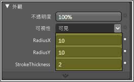
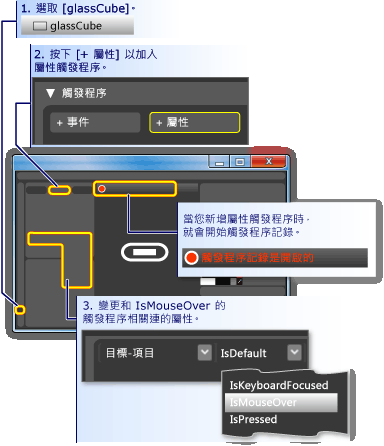
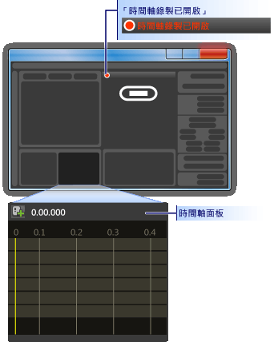

# 逐步解說：使用 Microsoft Expression Blend 建立按鈕
本逐步解說將帶領您使用 Microsoft Expression Blend，逐步完成建立 [!INCLUDE[TLA2#tla_wpf](../../../../includes/tla2sharptla-wpf-md.md)] 自訂按鈕的程序。  
  
> [!IMPORTANT]
>  Microsoft Expression Blend 的運作方式為產生[!INCLUDE[TLA#tla_xaml](../../../../includes/tlasharptla-xaml-md.md)]，接著再將其編譯以製作可執行的程式。  如果您想要直接使用[!INCLUDE[TLA#tla_xaml](../../../../includes/tlasharptla-xaml-md.md)]，則請參閱另一個逐步解說，學習如何使用[!INCLUDE[TLA#tla_xaml](../../../../includes/tlasharptla-xaml-md.md)] 搭配 [!INCLUDE[vs_current_short](../../../../includes/vs-current-short-md.md)] \(而非使用 Blend\)，建立與這個逐步解說相同的應用程式。  如需詳細資訊，請參閱[使用 XAML 建立按鈕](../../../../docs/framework/wpf/controls/walkthrough-create-a-button-by-using-xaml.md)。  
  
 下圖顯示您所要建立的自訂按鈕。  
  
   
  
## 將圖案轉換成按鈕  
 在這個逐步解說的第一個部分，您會建立自訂按鈕的自訂外觀。  若要這個做，您需先將矩形轉換成按鈕。  然後，將其他圖案加入至按鈕的範本，進而建議外觀更複雜的按鈕。  為何不從一般按鈕著手加以自訂呢？  因為一般按鈕具有您不需要的內建功能，若要自訂按鈕，從矩形著手比較容易。  
  
#### 若要在 Expression Blend 中建立新專案  
  
1.  啟動 Expression Blend   \(按一下 \[**開始**\]、依序指向 \[**所有程式**\] 和 \[**Microsoft Expression**\]，然後按一下 \[**Microsoft Expression Blend**\]\)。  
  
2.  視需要將應用程式最大化。  
  
3.  在 \[**檔案**\] 功能表上，按一下 \[**新增專案**\]。  
  
4.  選取 \[**標準應用程式 \(.exe\)**\]。  
  
5.  將專案命名為 `CustomButton`，然後按一下 \[**確定**\]。  
  
 此時，您就有 [!INCLUDE[TLA2#tla_wpf](../../../../includes/tla2sharptla-wpf-md.md)] 專案了。  您可以按下 F5，執行應用程式。  如您所預期，此應用程式僅包含一個空白視窗。  接著，您會建立圓角矩形並將它轉換成按鈕。  
  
#### 若要將矩形轉換成按鈕  
  
1.  **將視窗背景屬性設定為黑色**：選取視窗，按一下 \[**屬性**\] 索引標籤，然後將 <xref:System.Windows.Controls.Control.Background%2A> 屬性設定為 `Black`。  
  
       
  
2.  **在視窗上繪製接近按鈕大小的矩形**：選取左邊工具面板上的矩形工具，並將矩形拖曳到視窗上。  
  
       
  
3.  **使矩形變成圓角**：拖曳矩形的控制點，或直接設定 <xref:System.Windows.Shapes.Rectangle.RadiusX%2A> 和 <xref:System.Windows.Shapes.Rectangle.RadiusY%2A> 屬性。  將 <xref:System.Windows.Shapes.Rectangle.RadiusX%2A> 和 <xref:System.Windows.Shapes.Rectangle.RadiusY%2A> 的值設定為 20。  
  
       
  
4.  **將矩形變為按鈕**：選取矩形。  在 \[**工具**\] 功能表上，按一下 \[**製作按鈕**\]。  
  
       
  
5.  **指定樣式\/範本的範圍**：會出現如下的對話方塊。  
  
       
  
     針對 \[**資源名稱 \(索引碼\)**\]，選取 \[**套用至全部**\]。  如此一來，所產生的樣式和按鈕範本會套用至所有成為按鈕的物件。  針對 \[**定義於**\]，選取 \[**應用程式**\]。  如此一來，所產生之樣式和按鈕範本的範圍會遍及整個應用程式。  當您在這兩個方塊中設定值時，按鈕樣式和範本會套用至整個應用程式內的所有按鈕，而您在應用程式中建立的所有按鈕預設會使用此範本。  
  
## 編輯按鈕範本  
 您現在有個已變成按鈕的矩形。  在本節中，您將會修改按鈕的範本，並進一步自訂按鈕的外觀。  
  
#### 若要編輯按鈕範本以變更按鈕外觀  
  
1.  **進入編輯範本檢視**：若要進一步自訂按鈕的外觀，我們就需要編輯按鈕範本。  這個範本是在我們將矩形轉換成按鈕時建立的。  若要編輯按鈕範本，請用滑鼠右鍵按一下按鈕，並依序選取 \[**編輯控制項組件 \(範本\)**\] 和 \[**編輯範本**\]。  
  
       
  
     在範本編輯器中，請注意按鈕目前已分成 <xref:System.Windows.Shapes.Rectangle> 和 <xref:System.Windows.Controls.ContentPresenter>。  <xref:System.Windows.Controls.ContentPresenter> 用於呈現按鈕內的內容 \(例如，字串 "Button"\)。  矩形和 <xref:System.Windows.Controls.ContentPresenter> 都位於 <xref:System.Windows.Controls.Grid> 的內部。  
  
       
  
2.  **變更範本元件的名稱**：以滑鼠右鍵按一下範本庫存中的矩形，將 <xref:System.Windows.Shapes.Rectangle> 名稱從 "\[Rectangle\]" 變更 "outerRectangle"，然後將 "\[ContentPresenter\]" 變更為 "myContentPresenter"。  
  
       
  
3.  **將矩形內部變為空的 \(像甜甜圈一樣\)**：選取 \[**outerRectangle**\]，然後將 <xref:System.Windows.Shapes.Shape.Fill%2A> 設為 "Transparent" 並將 <xref:System.Windows.Shapes.Shape.StrokeThickness%2A> 設為 5。  
  
       
  
     然後將 <xref:System.Windows.Shapes.Shape.Stroke%2A> 設定為範本所要變成的色彩。  若要這麼做，請按一下 \[**Stroke**\] 旁的白色小方塊、選取 \[**CustomExpression**\]，然後在對話方塊中輸入 "{TemplateBinding Background}"。  
  
       
  
4.  **建立內部矩形**：現在，建立另一個矩形 \(將它命名為 "innerRectangle"\)，並以對稱方式將它放在 \[**outerRectangle**\] 的內部。  對於此種作業，您或許會想在編輯區域中放大按鈕。  
  
    > [!NOTE]
    >  您的矩形可能會與圖中的矩形看起來不同 \(例如，它可能有圓角\)。  
  
       
  
5.  **將 ContentPresenter 移到最上方**：此時，可能再也看不到 "Button" 文字。  若是如此的話，這是因為 \[**innerRectangle**\] 位於 \[**myContentPresenter**\] 的上方。  若要修正這種情形，請將 \[**myContentPresenter**\] 拖曳到 \[**innerRectangle**\] 的下面。  重新調整矩形和 \[**myContentPresenter**\] 的位置，類似下圖所示。  
  
    > [!NOTE]
    >  此外，您也可以用滑鼠右鍵按一下 \[**myContentPresenter**\]，然後按 \[**向前傳送**\]，將它放在最上方。  
  
       
  
6.  **變更 innerRectangle 的外觀**：將 <xref:System.Windows.Shapes.Rectangle.RadiusX%2A>、<xref:System.Windows.Shapes.Rectangle.RadiusY%2A> 和 <xref:System.Windows.Shapes.Shape.StrokeThickness%2A> 值設定為 20。  此外，使用自訂運算式 "{TemplateBinding Background}" \) 將 <xref:System.Windows.Shapes.Shape.Fill%2A> 設為範本的背景，並且將 <xref:System.Windows.Shapes.Shape.Stroke%2A> 設為 "transparent"。  請注意，\[**innerRectangle**\] 與 \[**outerRectangle**\] 的 <xref:System.Windows.Shapes.Shape.Fill%2A> 和 <xref:System.Windows.Shapes.Shape.Stroke%2A> 設定相反。  
  
       
  
7.  **在最上方加入玻璃層**：自訂按鈕外觀的最後一個步驟就是在最上方加入玻璃層。  這個玻璃層是由第三個矩形組成。  因為玻璃將會涵蓋整個按鈕，所以玻璃矩形和 \[**outerRectangle**\] 的維度類似。  因此，只需製作 \[**outerRectangle**\] 的複本，即可建立矩形。  反白顯示 \[**outerRectangle**\] 並使用 CTRL\+C 和 CTRL\+V 製作複本。  將這個新矩形命名為 "glassCube"。  
  
8.  **視需要重新調整 glassCube 的位置**：如果 \[**glassCube**\] 尚未定位為涵蓋整個按鈕，請將它拖曳至定位。  
  
9. **讓 glassCube 的形狀與 outerRectangle 稍微不同**：變更 \[**glassCube**\] 的屬性。  首先，將 <xref:System.Windows.Shapes.Rectangle.RadiusX%2A> 和 <xref:System.Windows.Shapes.Rectangle.RadiusY%2A> 屬性變更為 10 並將 <xref:System.Windows.Shapes.Shape.StrokeThickness%2A> 變更為 2。  
  
       
  
10. **使 glassCube 看起來像玻璃**：使用 75% 不透明的線形漸層將 <xref:System.Windows.Shapes.Shape.Fill%2A> 設為玻璃狀外觀，然後在 6 個大致平分的間隔上交替使用白色和透明。  這用以設定漸層停駐點：  
  
    -   漸層停駐點 1：白色加上 75% 的 Alpha 值  
  
    -   漸層停駐點 2：透明  
  
    -   漸層停駐點 3：白色加上 75% 的 Alpha 值  
  
    -   漸層停駐點 4：透明  
  
    -   漸層停駐點 5：白色加上 75% 的 Alpha 值  
  
    -   漸層停駐點 6：透明  
  
     這可形成「波狀」玻璃外觀。  
  
       
  
11. **隱藏玻璃層**：現在您可看見玻璃層的樣子，請移入的 \[**屬性**\] 面板的 \[**外觀**\] 窗格，並將 \[不透明度\] 設為 0% 以隱藏玻璃層。  在下面幾節中，我們將使用屬性觸發程序和事件來顯示和操作玻璃層。  
  
       
  
## 自訂按鈕行為  
 此時，您雖已經由編輯按鈕的範本來自訂按鈕的外表，但此按鈕並未如典型按鈕一般地回應使用者 \(例如，變更滑鼠移到上方、接收焦點和按一下時的外觀\)。 接下來的兩個程序會顯示如何將這類行為建置到自訂按鈕中。  我們將從簡單的屬性觸發程序著手，然後再加入事件觸發程序和動畫。  
  
#### 若要設定屬性觸發程序  
  
1.  **建立新的屬性觸發程序**：選取 \[**glassCube**\]，然後按一下 \[**觸發程序**\] 面板中的 \[**\+ 屬性**\] \(請參閱接在下一個步驟後的圖形\)。  這會以預設屬性觸發程序建立屬性觸發程序。  
  
2.  **使 IsMouseOver 成為觸發程序所用的屬性**：將屬性變更為 <xref:System.Windows.UIElement.IsMouseOver%2A>。  這可讓屬性觸發程序在 <xref:System.Windows.UIElement.IsMouseOver%2A> 屬性為 `true` \(當使用者用滑鼠指向按鈕時\) 時啟動。  
  
       
  
3.  **IsMouseOver 會對 glassCube 觸發 100% 的不透明度**：請注意 \[**觸發程序記錄已開啟**\] \(請參閱上圖\)。  這表示您在已開啟記錄時對 \[**glassCube**\] 的屬性值所做的任何變更，將成為在 <xref:System.Windows.UIElement.IsMouseOver%2A> 為 `true` 時發生的動作。  在記錄時，將 \[**glassCube**\] 的 <xref:System.Windows.UIElement.Opacity%2A> 變更為 100%。  
  
       
  
     您現在便已建立第一個屬性觸發程序。  請注意編輯器的 \[**觸發程序**\] 面板已記錄 <xref:System.Windows.UIElement.Opacity%2A> 正變更為 100%。  
  
       
  
     按 F5 以執行應用程式，然後將滑鼠指標移入和移出按鈕。  當您將滑鼠移到按鈕上方時，應可看到玻璃層出現，而當指標離開滑鼠時，玻璃層則會消失。  
  
4.  **IsMouseOver 會觸發 Stroke 值變更**：讓我們將其他一些動作與 <xref:System.Windows.UIElement.IsMouseOver%2A> 觸發程序產生關聯。  繼續進行記錄時，請將您的選取項目從 \[**glassCube**\] 切換至 \[**outerRectangle**\]。  然後，將 \[**outerRectangle**\] 的 <xref:System.Windows.Shapes.Shape.Stroke%2A> 設為 "{DynamicResource {x:Static SystemColors.HighlightBrushKey}}" 的自訂運算式。  這可將 <xref:System.Windows.Shapes.Shape.Stroke%2A> 設為按鈕所用的典型醒目提示色彩。  按 F5，即可看見將滑鼠移到按鈕上方時的效果。  
  
       
  
5.  **IsMouseOver 會觸發模糊的文字**：讓我們將一個或多個動作關聯至 <xref:System.Windows.UIElement.IsMouseOver%2A> 屬性觸發程序。  當玻璃出現在按鈕上方時，使按鈕的內容變得有點模糊。  若要這麼做，我們可將模糊 <xref:System.Windows.Media.Effects.BitmapEffect> 套用至 <xref:System.Windows.Controls.ContentPresenter> \(**myContentPresenter**\)。  
  
       
  
    > [!NOTE]
    >  若要讓 \[**屬性**\] 面板回到您搜尋 <xref:System.Windows.Media.Effects.BitmapEffect> 之前的樣子，請清除 \[**搜尋**\] 方塊中的文字。  
  
     此時，我們已使用具有數個相關聯動作的屬性觸發程序，來建立當滑鼠指標移入和移出按鈕區域時的醒目提示行為。  按鈕的另一個典型行為就是當按鈕具有焦點時會醒目提示 \(如同按下按鈕後\)。  我們可以為 <xref:System.Windows.UIElement.IsFocused%2A> 屬性加入另一個屬性觸發程序，以便加入此種行為。  
  
6.  **建立 IsFocused 的屬性觸發程序**：使用與 <xref:System.Windows.UIElement.IsMouseOver%2A> 相同的程序 \(請參閱本節的第一個步驟\)，為 <xref:System.Windows.UIElement.IsFocused%2A> 屬性建立另一個屬性觸發程序。  當 \[**觸發程序記錄已開啟**\] 時，將下列動作加入至觸發程序：  
  
    -   **glassCube** 會取得 100% 的 <xref:System.Windows.UIElement.Opacity%2A>。  
  
    -   **outerRectangle** 取得的 <xref:System.Windows.Shapes.Shape.Stroke%2A> 自訂運算式值為 "{DynamicResource {x:Static SystemColors.HighlightBrushKey}}"。  
  
 在本逐步解說的最後一個步驟中，我們會將動畫加入至按鈕。  這些動畫將由事件所觸發 \- 特別是 <xref:System.Windows.UIElement.MouseEnter> 和 <xref:System.Windows.Controls.Primitives.ButtonBase.Click> 事件。  
  
#### 若要使用事件觸發程序和動畫增添互動性  
  
1.  **建立 MouseEnter 事件觸發程序**：加入新的事件觸發程序，並選取 <xref:System.Windows.UIElement.MouseEnter> 做為要用於觸發程序中的事件。  
  
       
  
2.  **建立動畫時刻表**：接著，將動畫時刻表關聯至 <xref:System.Windows.UIElement.MouseEnter> 事件。  
  
       
  
     在按 \[**確定**\] 建立新時刻表之後，\[**時刻表**\] 面板便會出現，而設計面板中會顯示 \[時刻表記錄已開啟\]。  這表示我們可以開始在時刻表中記錄屬性變更 \(以動畫顯示屬性變更\)。  
  
    > [!NOTE]
    >  您可能需要調整視窗和\/或面板的大小，以查看顯示。  
  
       
  
3.  **建立主要畫面格**：若要建立動畫，請選取您要以動畫顯示的物件、在時刻表上建立兩個或更多個主要畫面格，然後針對這個主要畫面格，設定您希望動畫插補 \(Interpolate\) 於其間的屬性值。  下圖引導您完成主要畫面格的建立。  
  
       
  
4.  **在此主要畫面格上壓縮 glassCube**：選取第二個主要畫面格後，使用 \[**大小轉換**\]，將 \[**glassCube**\] 的大小壓縮為其完整大小的 90%。  
  
       
  
     按下 F5 執行應用程式。  將滑鼠指標移到按鈕之上。  請注意，玻璃層會在按鈕的上方壓縮。  
  
5.  **建立另一個事件觸發程序並使它與不同動畫產生關聯**：讓我們再加入一個動畫。  使用類似您用於建立前一個事件觸發程序動畫的程序：  
  
    1.  使用 <xref:System.Windows.Controls.Primitives.ButtonBase.Click> 事件建立新的事件觸發程序。  
  
    2.  使新的時刻表與 <xref:System.Windows.Controls.Primitives.ButtonBase.Click> 事件產生關聯。  
  
       
  
    1.  針對此時刻表，建立兩個主要畫面格，一個位於 0.0 秒處，另一個則位於 0.3 秒處。  
  
    2.  醒目顯示位於 0.3 秒處的主要畫面格，將 \[**旋轉轉換角度**\] 設定為 360 度。  
  
       
  
    1.  按下 F5 執行應用程式。  按一下這個按鈕。  請注意，玻璃層會旋轉。  
  
## 結論  
 您已完成自訂按鈕。  您是使用已套用至應用程式中所有按鈕的按鈕範本，來完成這項作業。  如果您離開了範本編輯模式 \(請參閱下圖\) 而建立更多的按鈕，您會發現這些按鈕的外觀和行為都很像自訂按鈕，而不像預設按鈕。  
  
   
  
   
  
 按下 F5 執行應用程式。  按一下這些按鈕，並注意它們的行為有何相同之處。  
  
 記得當您自訂範本時，您會將 \[**innerRectangle**\] 的 <xref:System.Windows.Shapes.Shape.Fill%2A> 屬性和 \[**outerRectangle**\] 的 <xref:System.Windows.Shapes.Shape.Stroke%2A> 屬性設定為範本背景 \({TemplateBinding Background}\)。  因為如此，當您設定個別按鈕的背景時，您設定的背景將用於其各自的屬性。  請立刻嘗試變更背景。  在下圖中，會使用不同的漸層。  因此，雖然範本對於控制項 \(像是按鈕\) 的整體自訂很實用，但具有範本的控制項仍可加以修改，使彼此看起來不同。  
  
   
  
 總而言之，在自訂按鈕範本的過程中，您學會了如何在 Microsoft Expression Blend 中執行下列作業：  
  
-   自訂控制項的外觀。  
  
-   設定屬性觸發程序。  屬性觸發程序非常實用，因為它們可用於大部分的物件，而不只是用於控制項。  
  
-   設定事件觸發程序。  事件觸發程序非常實用，因為它們可用於大部分的物件，而不只是用於控制項。  
  
-   建立動畫。  
  
-   其他：建立漸層、加入 BitmapEffect、使用轉換，以及設定物件的基本屬性。  
  
## 請參閱  
 [使用 XAML 建立按鈕](../../../../docs/framework/wpf/controls/walkthrough-create-a-button-by-using-xaml.md)   
 [設定樣式和範本](../../../../docs/framework/wpf/controls/styling-and-templating.md)   
 [動畫概觀](../../../../docs/framework/wpf/graphics-multimedia/animation-overview.md)   
 [使用純色和漸層繪製的概觀](../../../../docs/framework/wpf/graphics-multimedia/painting-with-solid-colors-and-gradients-overview.md)   
 [點陣圖效果概觀](../../../../docs/framework/wpf/graphics-multimedia/bitmap-effects-overview.md)