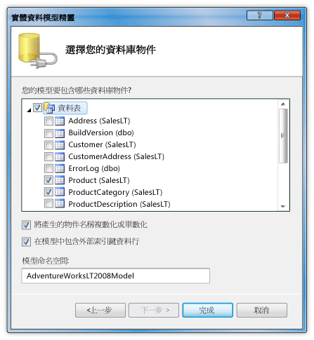

# 逐步解說：在 DataGrid 控制項中顯示來自 SQL Server 資料庫的資料
在這個逐步解說中，您會從 SQL Server 資料庫擷取資料，並且在 <xref:System.Windows.Controls.DataGrid> 控制項中顯示該資料。  您會使用 ADO.NET Entity Framework 建立表示資料的實體類別，以及使用 LINQ 撰寫查詢，用來從實體類別擷取指定的資料。  
  
## 必要條件  
 您需要下列元件才能完成此逐步解說：  
  
-   [!INCLUDE[vs_dev11_long](../../../../includes/vs-dev11-long-md.md)].  
  
-   存取附加了 AdventureWorksLT2008 範例資料庫之執行中的 SQL Server 或 SQL Server Express 執行個體。  您可以從 [CodePlex 網站](http://go.microsoft.com/fwlink/?LinkId=159848) \(英文\) 下載 AdventureWorksLT2008 資料庫。  
  
### 若要建立實體類別  
  
1.  在 Visual Basic 或 C\# 中建立新的 WPF 應用程式專案，並且命名為 `DataGridSQLExample`。  
  
2.  在 \[方案總管\] 中，以滑鼠右鍵按一下專案，指向 \[**加入**\]，然後選取 \[**新項目**\]。  
  
     \[加入新項目\] 對話方塊隨即出現。  
  
3.  在 \[已安裝的範本\] 窗格中選取 \[**資料**\]，並在範本清單中選取 \[**ADO.NET 實體資料模型**\]。  
  
       
  
4.  將檔案命名為 `AdventureWorksModel.edmx`，然後按一下 \[**加入**\]。  
  
     \[實體資料模型精靈\] 隨即出現。  
  
5.  在 \[選擇模型內容\] 畫面中，選取 \[**從資料庫產生**\]，然後按 \[**下一步**\]。  
  
       
  
6.  在 \[選擇資料連接\] 畫面中，提供 AdventureWorksLT2008 資料庫的連接。  如需詳細資訊，請參閱[選擇您的資料連接對話方塊](http://go.microsoft.com/fwlink/?LinkId=160190)。  
  
       
  
7.  確定名稱為 `AdventureWorksLT2008Entities` 並且已選取 \[**另存 App.Config 中的實體連接字串為**\] 核取方塊，然後按 \[**下一步**\]。  
  
8.  在 \[選擇您的資料庫物件\] 畫面中展開 \[資料表\] 節點，然後選取 \[**Product**\] 和 \[**ProductCategory**\] 資料表。  
  
     您可以為所有資料表產生實體類別；不過，在這個範例中，您只會從這兩個資料表擷取資料。  
  
       
  
9. 按一下 \[**完成**\]。  
  
     Product 和 ProductCategory 實體會在 Entity Designer 中顯示。  
  
       
  
### 若要擷取並呈現資料  
  
1.  開啟 MainWindow.xaml 檔案。  
  
2.  將 <xref:System.Windows.Window> 上的 <xref:System.Windows.FrameworkElement.Width%2A> 屬性設定為 450。  
  
3.  在 XAML 編輯器中，於 `<Grid>` 和 `</Grid>` 標籤之間加入下列 <xref:System.Windows.Controls.DataGrid> 標籤，以加入名為 `dataGrid1` 的 <xref:System.Windows.Controls.DataGrid>。  
  
     [!code-xml[DataGrid_SQL_EF_Walkthrough#3](../../../../samples/snippets/csharp/VS_Snippets_Wpf/DataGrid_SQL_EF_Walkthrough/CS/MainWindow.xaml#3)]  
  
       
  
4.  選取 <xref:System.Windows.Window>。  
  
5.  使用 \[屬性\] 視窗或 XAML 編輯器，針對 <xref:System.Windows.FrameworkElement.Loaded> 事件為名為 `Window_Loaded` 的 <xref:System.Windows.Window> 建立事件處理常式。  如需詳細資訊，請參閱 [HOW TO：建立簡單的事件處理常式](http://msdn.microsoft.com/zh-tw/b1456e07-9dec-4354-99cf-18666b64f480)。  
  
     以下顯示 MainWindow.xaml 的 XAML。  
  
    > [!NOTE]
    >  如果您是使用 Visual Basic，則請將 MainWindow.xaml 的第一行中的 `x:Class="DataGridSQLExample.MainWindow"` 取代為 `x:Class="MainWindow"`。  
  
     [!code-xml[DataGrid_SQL_EF_Walkthrough#1](../../../../samples/snippets/csharp/VS_Snippets_Wpf/DataGrid_SQL_EF_Walkthrough/CS/MainWindow.xaml#1)]  
  
6.  開啟 <xref:System.Windows.Window> 的程式碼後置檔案 \(MainWindow.xaml.vb 或 MainWindow.xaml.cs\)。  
  
7.  加入下列程式碼，僅從聯結的資料表擷取特定值，並且將 <xref:System.Windows.Controls.DataGrid> 的 <xref:System.Windows.Controls.ItemsControl.ItemsSource%2A> 屬性設定為查詢的結果。  
  
     [!code-csharp[DataGrid_SQL_EF_Walkthrough#2](../../../../samples/snippets/csharp/VS_Snippets_Wpf/DataGrid_SQL_EF_Walkthrough/CS/MainWindow.xaml.cs#2)]
     [!code-vb[DataGrid_SQL_EF_Walkthrough#2](../../../../samples/snippets/visualbasic/VS_Snippets_Wpf/DataGrid_SQL_EF_Walkthrough/VB/MainWindow.xaml.vb#2)]  
  
8.  執行範例。  
  
     您應該會看到顯示資料的 <xref:System.Windows.Controls.DataGrid>。  
  
       
  
## 後續步驟  
  
## 請參閱  
 <xref:System.Windows.Controls.DataGrid>   
 [如何 i： 開始在 WPF 應用程式中的實體架構?](完整.嗎？LinkId%20=%20159868)