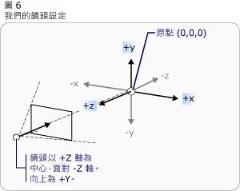

# 立體圖形概觀
[!INCLUDE[TLA#tla_winclient](../../../../includes/tlasharptla-winclient-md.md)] 中的 [!INCLUDE[TLA2#tla_3d](../../../../includes/tla2sharptla-3d-md.md)] 功能可讓開發人員以標記和程序性程式碼繪製、轉換 3D 圖形，以及以動畫顯示 3D 圖形。 開發人員可以結合 [!INCLUDE[TLA#tla_2d](../../../../includes/tlasharptla-2d-md.md)] 和 [!INCLUDE[TLA2#tla_3d](../../../../includes/tla2sharptla-3d-md.md)] 圖形來建立豐富的控制項、提供複雜的資料說明，或者加強應用程式介面的使用者體驗。 [!INCLUDE[TLA2#tla_winclient](../../../../includes/tla2sharptla-winclient-md.md)] 中的 [!INCLUDE[TLA2#tla_3d](../../../../includes/tla2sharptla-3d-md.md)] 支援不適用於提供完整功能的遊戲開發平台。 本主題將提供 [!INCLUDE[TLA2#tla_winclient](../../../../includes/tla2sharptla-winclient-md.md)] 圖形系統中 [!INCLUDE[TLA#tla_3d](../../../../includes/tlasharptla-3d-md.md)] 功能的概觀。  

   
## 2D 容器中的 3D  
 [!INCLUDE[TLA2#tla_3d](../../../../includes/tla2sharptla-3d-md.md)] 圖形中的內容[!INCLUDE[TLA2#tla_winclient](../../../../includes/tla2sharptla-winclient-md.md)]封裝在一個項目， <xref:System.Windows.Controls.Viewport3D>，可參與二維元素結構。 圖形系統會將<xref:System.Windows.Controls.Viewport3D>為二維的視覺元素，例如中許多其他[!INCLUDE[TLA2#tla_winclient](../../../../includes/tla2sharptla-winclient-md.md)]。 <xref:System.Windows.Controls.Viewport3D> 為視窗函式，在檢視區 — 三維的場景。 更精確來說，是一種 [!INCLUDE[TLA2#tla_3d](../../../../includes/tla2sharptla-3d-md.md)] 場景投射到的表面。  
  
 在傳統[!INCLUDE[TLA2#tla_2d](../../../../includes/tla2sharptla-2d-md.md)]應用程式中，使用<xref:System.Windows.Controls.Viewport3D>如同其他的容器項目，例如格線或畫布。  雖然您可以使用<xref:System.Windows.Controls.Viewport3D>與其他[!INCLUDE[TLA2#tla_2d](../../../../includes/tla2sharptla-2d-md.md)]繪圖物件，在相同的場景圖形中，您無法貫穿[!INCLUDE[TLA2#tla_2d](../../../../includes/tla2sharptla-2d-md.md)]並[!INCLUDE[TLA2#tla_3d](../../../../includes/tla2sharptla-3d-md.md)]內的物件<xref:System.Windows.Controls.Viewport3D>。  本主題將著重在如何繪製[!INCLUDE[TLA2#tla_3d](../../../../includes/tla2sharptla-3d-md.md)]圖形內<xref:System.Windows.Controls.Viewport3D>。  
  
   
## 3D 座標空間  
 [!INCLUDE[TLA2#tla_2d](../../../../includes/tla2sharptla-2d-md.md)] 圖形的 [!INCLUDE[TLA2#tla_winclient](../../../../includes/tla2sharptla-winclient-md.md)] 座標系統將原點置於轉譯區域 (通常是螢幕) 的左上角。 在 [!INCLUDE[TLA2#tla_2d](../../../../includes/tla2sharptla-2d-md.md)] 系統中，x 軸的正值是往右，y 軸的正值則是往下。  不過在 [!INCLUDE[TLA2#tla_3d](../../../../includes/tla2sharptla-3d-md.md)] 座標系統中，原點是位於轉譯區域的中心，x 軸的正值是往右，但 y 軸的正值是往上，而 z 軸的正值是從原點朝向檢視器往外。  
  
   
傳統的 2D 和 3D 座標系統表示法  
  
 這些軸所定義的空間是針對 [!INCLUDE[TLA2#tla_winclient](../../../../includes/tla2sharptla-winclient-md.md)] 中 [!INCLUDE[TLA2#tla_3d](../../../../includes/tla2sharptla-3d-md.md)] 物件的靜態參考座標系。 當您在此空間中建置模型，並建立光線和觀景窗來檢視這些模型時，有助於區分此靜態參考座標系 (或稱為「世界空間」) 與您為每個模型套用轉換時建立的當地參考座標系。 也請記住，在世界空間中的物件取決於光線和觀景窗設定，可能看起來完全不同，或者完全無法看見，但觀景窗的位置不會改變世界空間中物件的位置。  
  
   
## 觀景窗和投影  
 在 [!INCLUDE[TLA2#tla_2d](../../../../includes/tla2sharptla-2d-md.md)] 環境中工作的開發人員習慣在二維的螢幕上放置繪圖基元。 當您建立 [!INCLUDE[TLA2#tla_3d](../../../../includes/tla2sharptla-3d-md.md)] 場景時，請務必記住，您是真的要建立 [!INCLUDE[TLA2#tla_3d](../../../../includes/tla2sharptla-3d-md.md)] 物件的 [!INCLUDE[TLA2#tla_2d](../../../../includes/tla2sharptla-2d-md.md)] 表示法。 因為 [!INCLUDE[TLA2#tla_3d](../../../../includes/tla2sharptla-3d-md.md)] 場景會因為旁觀者的視角而有所不同，所以您必須指定該視角。 <xref:System.Windows.Media.Media3D.Camera>類別可讓您指定此視角[!INCLUDE[TLA2#tla_3d](../../../../includes/tla2sharptla-3d-md.md)]場景。  
  
 另一種了解如何在 [!INCLUDE[TLA2#tla_2d](../../../../includes/tla2sharptla-2d-md.md)] 表面上表示 [!INCLUDE[TLA2#tla_3d](../../../../includes/tla2sharptla-3d-md.md)] 場景的方式是將場景描述為在檢視表面上的投影。 <xref:System.Windows.Media.Media3D.ProjectionCamera>可讓您指定不同的投影和其屬性，以變更旁觀者如何看到[!INCLUDE[TLA2#tla_3d](../../../../includes/tla2sharptla-3d-md.md)]模型。 A<xref:System.Windows.Media.Media3D.PerspectiveCamera>指定依透視法縮短場景的投影。  換句話說，<xref:System.Windows.Media.Media3D.PerspectiveCamera>提供消失點的透視圖。  您可以指定觀景窗在場景座標空間中的位置、觀景窗的方向和視野，以及定義場景中「向上」方向的向量。 下圖說明<xref:System.Windows.Media.Media3D.PerspectiveCamera>的投影。  
  
 <xref:System.Windows.Media.Media3D.ProjectionCamera.NearPlaneDistance%2A>並<xref:System.Windows.Media.Media3D.ProjectionCamera.FarPlaneDistance%2A>屬性的<xref:System.Windows.Media.Media3D.ProjectionCamera>限制觀景窗的投影範圍。 由於觀景窗可能會位在場景中的任何地方，觀景窗有可能實際上就位在模型內部或非常靠近模型，因此更難正確區分物件。  <xref:System.Windows.Media.Media3D.ProjectionCamera.NearPlaneDistance%2A> 可讓您指定超過此物件就不會繪製的相機中的最小距離。  相反地，<xref:System.Windows.Media.Media3D.ProjectionCamera.FarPlaneDistance%2A>可讓您指定從相機超出就不會繪製物件，以確保太遠而無法辨識的物件將不會包含在場景中的距離。  
  
   
觀景窗位置  
  
 <xref:System.Windows.Media.Media3D.OrthographicCamera> 指定正交投影[!INCLUDE[TLA2#tla_3d](../../../../includes/tla2sharptla-3d-md.md)]模型到[!INCLUDE[TLA2#tla_2d](../../../../includes/tla2sharptla-2d-md.md)]視覺化介面。 與其他觀景窗相同，它會指定位置、檢視方向和「向上」方向。 不同於<xref:System.Windows.Media.Media3D.PerspectiveCamera>，不過<xref:System.Windows.Media.Media3D.OrthographicCamera>描述不包含透視縮短的投影。 換句話說，<xref:System.Windows.Media.Media3D.OrthographicCamera>描述邊都平行，而不是一個邊某個點相遇的在觀景窗的檢視方塊。 下圖顯示相同的模型，因為檢視使用<xref:System.Windows.Media.Media3D.PerspectiveCamera>和<xref:System.Windows.Media.Media3D.OrthographicCamera>。  
  
   
透視投影和正視投影  
  
 下列程式碼示範一些典型的觀景窗設定。  
  
 [!code-csharp[3dgallery_procedural_snip#Basic3DShapeCodeExampleInline1](~/samples/snippets/csharp/VS_Snippets_Wpf/3DGallery_procedural_snip/CSharp/Basic3DShapeExample.cs#basic3dshapecodeexampleinline1)]
 [!code-vb[3dgallery_procedural_snip#Basic3DShapeCodeExampleInline1](~/samples/snippets/visualbasic/VS_Snippets_Wpf/3DGallery_procedural_snip/visualbasic/basic3dshapeexample.vb#basic3dshapecodeexampleinline1)]  
  
   
## 模型和網格基元  
  
 <xref:System.Windows.Media.Media3D.Model3D> 是抽象的基底類別，代表泛型[!INCLUDE[TLA2#tla_3d](../../../../includes/tla2sharptla-3d-md.md)]物件。 若要建置[!INCLUDE[TLA2#tla_3d](../../../../includes/tla2sharptla-3d-md.md)]場景，您需要一些物件，若要檢視，並構成場景圖形物件衍生自<xref:System.Windows.Media.Media3D.Model3D>。 目前，[!INCLUDE[TLA2#tla_winclient](../../../../includes/tla2sharptla-winclient-md.md)]支援模型化幾何與<xref:System.Windows.Media.Media3D.GeometryModel3D>。 <xref:System.Windows.Media.Media3D.GeometryModel3D.Geometry%2A>此模型的屬性採用網格基元。  
  
 若要建立模型，請先建立基元 (也就是網格)。 [!INCLUDE[TLA2#tla_3d](../../../../includes/tla2sharptla-3d-md.md)] 基元是形成單一 [!INCLUDE[TLA2#tla_3d](../../../../includes/tla2sharptla-3d-md.md)] 實體的頂點集合。 大部分 [!INCLUDE[TLA2#tla_3d](../../../../includes/tla2sharptla-3d-md.md)] 系統都提供以最簡單的封閉圖形 (由三個頂點定義的三角形) 塑造而成的基元。  因為三角形的三個點共面，所以您可以持續加入三角形，以塑造出更複雜的圖形 (稱為網格)。  
  
 [!INCLUDE[TLA2#tla_winclient](../../../../includes/tla2sharptla-winclient-md.md)] [!INCLUDE[TLA2#tla_3d](../../../../includes/tla2sharptla-3d-md.md)]系統目前提供<xref:System.Windows.Media.Media3D.MeshGeometry3D>類別，可讓您指定任何幾何; 目前不支援預先定義[!INCLUDE[TLA2#tla_3d](../../../../includes/tla2sharptla-3d-md.md)]基本項目如球體和三次方的表單。 開始建立<xref:System.Windows.Media.Media3D.MeshGeometry3D>藉由指定一份三角形頂點，做為其<xref:System.Windows.Media.Media3D.MeshGeometry3D.Positions%2A>屬性。 每個頂點指定為<xref:System.Windows.Media.Media3D.Point3D>。  (在 [!INCLUDE[TLA#tla_xaml](../../../../includes/tlasharptla-xaml-md.md)] 中，將此屬性指定為以三個為一組的數字清單代表每個頂點的座標)。根據網格的幾何，網格可以由許多三角形組成，其中有些三角形會共用相同的角 (頂點)。 若要正確繪製網格，[!INCLUDE[TLA2#tla_winclient](../../../../includes/tla2sharptla-winclient-md.md)] 需要哪些三角形共用哪些頂點的相關資訊。 您可以提供這項資訊藉由指定一份三角形索引與<xref:System.Windows.Media.Media3D.MeshGeometry3D.TriangleIndices%2A>屬性。 這份清單指定點中指定的順序<xref:System.Windows.Media.Media3D.MeshGeometry3D.Positions%2A>清單將決定三角形。  
  
 [!code-xaml[basic3d#Basic3DXAML3DN3](~/samples/snippets/xaml/VS_Snippets_Wpf/Basic3D/XAML/Window1.xaml#basic3dxaml3dn3)]  
  
 在上述範例中，<xref:System.Windows.Media.Media3D.MeshGeometry3D.Positions%2A>清單指定八個頂點來定義立方體形狀的網格。 <xref:System.Windows.Media.Media3D.MeshGeometry3D.TriangleIndices%2A>屬性會指定三個索引的 12 個群組的清單。  在清單中的每個數字是指位移<xref:System.Windows.Media.Media3D.MeshGeometry3D.Positions%2A>清單。  比方說，所指定的前三個頂點<xref:System.Windows.Media.Media3D.MeshGeometry3D.Positions%2A>清單是 (1,1,0)，(0,1,0)，以及 (0,0,0)。 前三個所指定的索引<xref:System.Windows.Media.Media3D.MeshGeometry3D.TriangleIndices%2A>清單會是 0、 2 和 1，第三，對應到第一天，而第二個中的點<xref:System.Windows.Media.Media3D.MeshGeometry3D.Positions%2A>清單。 因此，組成立方體模型的第一個三角形將會從 (1,1,0) 到 (0,1,0) 到 (0,0,0) 組成，其餘的十一個三角形也同樣如此決定。  
  
 您可以繼續定義模型藉由指定的值<xref:System.Windows.Media.Media3D.MeshGeometry3D.Normals%2A>和<xref:System.Windows.Media.Media3D.MeshGeometry3D.TextureCoordinates%2A>屬性。  若要轉譯模型的表面，圖形系統需要表面在任意指定的三角形處面對哪個方向的資訊。 系統會使用此資訊來進行模型的光線計算︰直接面向光源的表面看起來就會比偏離光線一些角度的表面還亮。 雖然 [!INCLUDE[TLA2#tla_winclient](../../../../includes/tla2sharptla-winclient-md.md)] 可以使用位置座標決定預設的法向向量，但是您也可以指定不同的法向向量以模擬曲面的外觀。  
  
 <xref:System.Windows.Media.Media3D.MeshGeometry3D.TextureCoordinates%2A>屬性指定的一系列<xref:System.Windows.Point>s，告訴圖形系統如何對應，以決定如何繪製網格的頂點的材質座標。 <xref:System.Windows.Media.Media3D.MeshGeometry3D.TextureCoordinates%2A> 已指定為介於 0 和 1 (含) 之間的值。  如同<xref:System.Windows.Media.Media3D.MeshGeometry3D.Normals%2A>屬性，圖形系統可以計算預設的紋理座標，但是您可以選擇設定不同的紋理座標，來控制例如包含部分重複模式中，紋理的對應。 您可以在後續的主題或 Managed Direct3D SDK 中找到有關紋理座標的詳細資訊。  
  
 下列範例示範如何以程序性程式碼建立立方體模型的一個面。 請注意，您可以將整個立方體繪製為單一一個 GeometryModel3D；此範例會將立方體的面繪製為不同的模型以便稍後對每個面套用不同的紋理。  
  
 [!code-csharp[3doverview#3DOverview3DN6](~/samples/snippets/csharp/VS_Snippets_Wpf/3DOverview/CSharp/Window1.xaml.cs#3doverview3dn6)]
 [!code-vb[3doverview#3DOverview3DN6](~/samples/snippets/visualbasic/VS_Snippets_Wpf/3DOverview/visualbasic/window1.xaml.vb#3doverview3dn6)]  
  
 [!code-csharp[3doverview#3DOverview3DN7](~/samples/snippets/csharp/VS_Snippets_Wpf/3DOverview/CSharp/Window1.xaml.cs#3doverview3dn7)]
 [!code-vb[3doverview#3DOverview3DN7](~/samples/snippets/visualbasic/VS_Snippets_Wpf/3DOverview/visualbasic/window1.xaml.vb#3doverview3dn7)]  
  
   
## 對模型套用材質  
  
 若要讓網格看起來像三維物件，就必須套用紋理以涵蓋由其頂點和三角形所定義的表面，讓觀景窗可以點亮並投影表面。 在  [!INCLUDE[TLA2#tla_2d](../../../../includes/tla2sharptla-2d-md.md)]，您使用<xref:System.Windows.Media.Brush>類別來套用色彩、 圖樣、 漸層或其他視覺內容區域的畫面。  不過，[!INCLUDE[TLA2#tla_3d](../../../../includes/tla2sharptla-3d-md.md)] 物件的外觀是光源模型的函式，而不只是對物件套用的色彩或圖樣。 真實的物體會根據物體表面的質地以不同方式反射光線︰光滑而閃亮的表面看起來會與粗糙或黯淡的表面不同，而一些物體看起來會吸收光線，一些物體則會發亮。 可對 [!INCLUDE[TLA2#tla_2d](../../../../includes/tla2sharptla-2d-md.md)] 物件套用的所有筆刷都可對 [!INCLUDE[TLA2#tla_3d](../../../../includes/tla2sharptla-3d-md.md)] 物件套用，但是您無法直接套用。  
  
 若要定義模型表面的特性[!INCLUDE[TLA2#tla_winclient](../../../../includes/tla2sharptla-winclient-md.md)]使用<xref:System.Windows.Media.Media3D.Material>抽象類別。 Material 的具體子類別會決定模型表面的一些外觀特性，每個特性也提供您可以傳遞 SolidColorBrush、TileBrush 或 VisualBrush 的 Brush 屬性。  
  
- <xref:System.Windows.Media.Media3D.DiffuseMaterial> 指定模型將套用的筆刷，如同該模型已擴散光源。 使用 DiffuseMaterial 非常類似直接對 [!INCLUDE[TLA2#tla_2d](../../../../includes/tla2sharptla-2d-md.md)] 模型使用筆刷；模型表面不會反射光線但看起來閃亮。  
  
- <xref:System.Windows.Media.Media3D.SpecularMaterial> 指定模型將套用的筆刷，如同模型表面堅硬或閃亮，能夠反射強光。 您可以藉由指定的值來設定此反射質地或 「 閃亮 」，材質會提供建議的程度<xref:System.Windows.Media.Media3D.SpecularMaterial.SpecularPower%2A>屬性。  
  
- <xref:System.Windows.Media.Media3D.EmissiveMaterial> 可讓您指定將套用紋理，如同模型已發出的筆刷色彩的光線等於。 這不會讓模型變成光源。不過，這會影響陰影處理的方式，與透過 DiffuseMaterial 或 SpecularMaterial 加上紋理的方式不同。  
  
 為了達到最佳效能，達到的<xref:System.Windows.Media.Media3D.GeometryModel3D>（不檢視，因為它們位於相機中模型的另一端的那些面） 會從場景中挑選。  若要指定<xref:System.Windows.Media.Media3D.Material>要套用至模型，例如平面的背面，設定模型的<xref:System.Windows.Media.Media3D.GeometryModel3D.BackMaterial%2A>屬性。  
  
 若要達到某些表面質地，例如發光或反射效果，您可以對模型連續套用數種不同的筆刷。 您可以套用，並使用重複使用多個 Material<xref:System.Windows.Media.Media3D.MaterialGroup>類別。 在多個轉譯階段中，會從頭到尾套用 MaterialGroup 的子系。  
  
 下列程式碼範例示範如何對 [!INCLUDE[TLA2#tla_3d](../../../../includes/tla2sharptla-3d-md.md)] 模型以筆刷的方式套用純色和繪圖。  
  
 [!code-xaml[basic3d#Basic3DXAML3DN5](~/samples/snippets/xaml/VS_Snippets_Wpf/Basic3D/XAML/Window1.xaml#basic3dxaml3dn5)]  
  
 [!code-xaml[3doverview#3DOverview3DN9](~/samples/snippets/csharp/VS_Snippets_Wpf/3DOverview/CSharp/app.xaml#3doverview3dn9)]  
  
 [!code-csharp[3doverview#3DOverview3DN8](~/samples/snippets/csharp/VS_Snippets_Wpf/3DOverview/CSharp/Window1.xaml.cs#3doverview3dn8)]
 [!code-vb[3doverview#3DOverview3DN8](~/samples/snippets/visualbasic/VS_Snippets_Wpf/3DOverview/visualbasic/window1.xaml.vb#3doverview3dn8)]  
  
   
## 場景照明  
 [!INCLUDE[TLA2#tla_3d](../../../../includes/tla2sharptla-3d-md.md)] 圖形中的光線運作方式和真實世界的光線相同︰讓表面看得見。 而且，光線還會決定投影時要包含場景的哪個部分。 [!INCLUDE[TLA2#tla_winclient](../../../../includes/tla2sharptla-winclient-md.md)] 中的光線物件會建立各種光線和陰影效果，而且會仿照真實世界各種光線的行為。 您在場景中必須至少包含一種光線，否則會看不到模型。  
  
 下列光線衍生自基底類別<xref:System.Windows.Media.Media3D.Light>:  
  
- <xref:System.Windows.Media.Media3D.AmbientLight>：提供環境光線，不論其位置或方向，統一的所有物件。  
  
- <xref:System.Windows.Media.Media3D.DirectionalLight>：位於等較遠的光線來源。  定向光線有<xref:System.Windows.Media.Media3D.DirectionalLight.Direction%2A>指定為 Vector3D，但沒有指定的位置。  
  
- <xref:System.Windows.Media.Media3D.PointLight>：位於光源等。 PointLights 有一個位置，並從該位置投射光線。 場景中的物件會根據其相對於光線的位置和距離來照明。 <xref:System.Windows.Media.Media3D.PointLightBase> 會公開<xref:System.Windows.Media.Media3D.PointLightBase.Range%2A>決定的距離，超過此模型將不會以醒目顯示光線的屬性。 PointLight 也公開衰減屬性，決定光線強度如何隨距離而降低。 您可以為光線衰減指定常數、線性插補或二次插補。  
  
- <xref:System.Windows.Media.Media3D.SpotLight>：繼承自 <xref:System.Windows.Media.Media3D.PointLight>。 Spotlight 照明的方式類似 PointLight，而且有位置和方向兩者。 他們將設定的圓錐形區域中的光線投射<xref:System.Windows.Media.Media3D.SpotLight.InnerConeAngle%2A>和<xref:System.Windows.Media.Media3D.SpotLight.OuterConeAngle%2A>以度為單位指定的屬性。  
  
 燈號都<xref:System.Windows.Media.Media3D.Model3D>物件，因此您可以轉換，並以動畫顯示光線的屬性，包括位置、 色彩、 方向和範圍。  
  
 [!code-xaml[hittest3d#HitTest3D3DN6](~/samples/snippets/csharp/VS_Snippets_Wpf/HitTest3D/CSharp/Window1.xaml#hittest3d3dn6)]  
  
 [!code-csharp[basic3d#Basic3D3DN11](~/samples/snippets/csharp/VS_Snippets_Wpf/Basic3D/CSharp/Window1.xaml.cs#basic3d3dn11)]
 [!code-vb[basic3d#Basic3D3DN11](~/samples/snippets/visualbasic/VS_Snippets_Wpf/Basic3D/visualbasic/window1.xaml.vb#basic3d3dn11)]  
  
 [!code-csharp[basic3d#Basic3D3DN12](~/samples/snippets/csharp/VS_Snippets_Wpf/Basic3D/CSharp/Window1.xaml.cs#basic3d3dn12)]
 [!code-vb[basic3d#Basic3D3DN12](~/samples/snippets/visualbasic/VS_Snippets_Wpf/Basic3D/visualbasic/window1.xaml.vb#basic3d3dn12)]  
  
 [!code-csharp[basic3d#Basic3D3DN13](~/samples/snippets/csharp/VS_Snippets_Wpf/Basic3D/CSharp/Window1.xaml.cs#basic3d3dn13)]
 [!code-vb[basic3d#Basic3D3DN13](~/samples/snippets/visualbasic/VS_Snippets_Wpf/Basic3D/visualbasic/window1.xaml.vb#basic3d3dn13)]  
  
   
## 轉換模型  
 當您建立模型時，模型在場景中有特定的位置。 若要在場景中四處移動模型、旋轉模型，或變更模型的大小，變更定義模型的頂點本身並不實用。  而是要像在 [!INCLUDE[TLA2#tla_2d](../../../../includes/tla2sharptla-2d-md.md)] 一樣，對模型套用轉換。  
  
 每個模型物件都<xref:System.Windows.Media.Media3D.Model3D.Transform%2A>與移動、 重新導向，或調整模型大小的屬性。  當您套用轉換時，可以透過轉換所指定的任何向量或值，有效率地位移模型的所有點。 換句話說，您已經轉換定義模型所在的座標空間 (「模型空間」)，但尚未變更在整個場景的座標系統 (「世界空間」) 中組成模型幾何的值。  
  
 如需轉換模型的詳細資訊，請參閱 [3D 轉換概觀](3-d-transformations-overview.md)。  
  
   
## 以動畫顯示模型  
 [!INCLUDE[TLA2#tla_winclient](../../../../includes/tla2sharptla-winclient-md.md)] [!INCLUDE[TLA2#tla_3d](../../../../includes/tla2sharptla-3d-md.md)] 實作參與和 [!INCLUDE[TLA2#tla_2d](../../../../includes/tla2sharptla-2d-md.md)] 圖形相同的計時和動畫系統。 換句話說，若要以動畫顯示 3D 場景，就要以動畫顯示其模型的屬性。 您可以直接以動畫顯示基元的屬性，但是以動畫顯示變更模型位置或外觀的轉換通常更容易。 因為轉換可以套用至<xref:System.Windows.Media.Media3D.Model3DGroup>物件以及個別模型，它就 Model3DGroup 的子系和另一組群組的子物件的動畫套用一組動畫。 您也可以以動畫顯示場景光線的屬性，達到各種視覺效果。 最後，您還可以選擇以動畫顯示觀景窗的位置或視野，以動畫顯示投影本身。 如需 [!INCLUDE[TLA2#tla_winclient](../../../../includes/tla2sharptla-winclient-md.md)] 計時和動畫系統的背景資訊，請參閱[動畫概觀](animation-overview.md)、[分鏡腳本概觀](storyboards-overview.md)，以及 [Freezable 物件概觀](../advanced/freezable-objects-overview.md)等主題。  
  
 若要以動畫顯示 [!INCLUDE[TLA2#tla_winclient](../../../../includes/tla2sharptla-winclient-md.md)] 中的物件，您要建立時間軸、定義動畫 (這實際上是某些屬性值隨時間的變化)，並指定要套用動畫的屬性。 因為中的所有物件[!INCLUDE[TLA2#tla_3d](../../../../includes/tla2sharptla-3d-md.md)]場景是子系<xref:System.Windows.Controls.Viewport3D>，您想要套用至場景之任何動畫的目標屬性都是 viewport3d 的內容。  
  
 假設您想要讓模型就地搖晃。 您可以選擇要套用<xref:System.Windows.Media.Media3D.RotateTransform3D>模型，並以動畫顯示其旋轉軸從一個向量到另一個。 下列程式碼範例示範如何對轉換之 Rotation3D 的 Axis 屬性套用 Vector3DAnimation，假設 RotateTransform3D 是要使用 TransformGroup 對模型套用的其中一個轉換。  
  
 [!code-csharp[3doverview#3DOverview3DN1](~/samples/snippets/csharp/VS_Snippets_Wpf/3DOverview/CSharp/Window1.xaml.cs#3doverview3dn1)]
 [!code-vb[3doverview#3DOverview3DN1](~/samples/snippets/visualbasic/VS_Snippets_Wpf/3DOverview/visualbasic/window1.xaml.vb#3doverview3dn1)]  
  
 [!code-csharp[3doverview#3DOverview3DN3](~/samples/snippets/csharp/VS_Snippets_Wpf/3DOverview/CSharp/Window1.xaml.cs#3doverview3dn3)]
 [!code-vb[3doverview#3DOverview3DN3](~/samples/snippets/visualbasic/VS_Snippets_Wpf/3DOverview/visualbasic/window1.xaml.vb#3doverview3dn3)]  
  
 [!code-csharp[3doverview#3DOverview3DN4](~/samples/snippets/csharp/VS_Snippets_Wpf/3DOverview/CSharp/Window1.xaml.cs#3doverview3dn4)]
 [!code-vb[3doverview#3DOverview3DN4](~/samples/snippets/visualbasic/VS_Snippets_Wpf/3DOverview/visualbasic/window1.xaml.vb#3doverview3dn4)]  
  
 [!code-csharp[3doverview#3DOverview3DN5](~/samples/snippets/csharp/VS_Snippets_Wpf/3DOverview/CSharp/Window1.xaml.cs#3doverview3dn5)]
 [!code-vb[3doverview#3DOverview3DN5](~/samples/snippets/visualbasic/VS_Snippets_Wpf/3DOverview/visualbasic/window1.xaml.vb#3doverview3dn5)]  
  
   
## 在視窗中新增 3D 內容  
 若要轉譯場景，新增模型和燈號<xref:System.Windows.Media.Media3D.Model3DGroup>，然後設定<xref:System.Windows.Media.Media3D.Model3DGroup>作為<xref:System.Windows.Media.Media3D.ModelVisual3D.Content%2A>的<xref:System.Windows.Media.Media3D.ModelVisual3D>。 新增<xref:System.Windows.Media.Media3D.ModelVisual3D>要<xref:System.Windows.Controls.Viewport3D.Children%2A>的集合<xref:System.Windows.Controls.Viewport3D>。 新增相機<xref:System.Windows.Controls.Viewport3D>藉由設定其<xref:System.Windows.Controls.Viewport3D.Camera%2A>屬性。  
  
 最後，新增<xref:System.Windows.Controls.Viewport3D>至視窗。 當<xref:System.Windows.Controls.Viewport3D>畫布，例如版面配置項目的內容設定指定 Viewport3D 的大小就會包含其<xref:System.Windows.FrameworkElement.Height%2A>並<xref:System.Windows.FrameworkElement.Width%2A>屬性 (繼承自<xref:System.Windows.FrameworkElement>)。  
  
 [!code-xaml[hostingwpfusercontrolinwf#1](~/samples/snippets/csharp/VS_Snippets_Wpf/HostingWpfUserControlInWf/CSharp/HostingWpfUserControlInWf/ConeControl.xaml#1)]  
  
## 另請參閱

- <xref:System.Windows.Controls.Viewport3D>
- <xref:System.Windows.Media.Media3D.PerspectiveCamera>
- <xref:System.Windows.Media.Media3D.DirectionalLight>
- <xref:System.Windows.Media.Media3D.Material>
- [立體轉換概觀](3-d-transformations-overview.md)
- [最大化 WPF 3D 效能](maximize-wpf-3d-performance.md)
- [HOW-TO 主題](3-d-graphics-how-to-topics.md)
- [WPF 中圖案和基本繪圖概觀](shapes-and-basic-drawing-in-wpf-overview.md)
- [使用影像、繪圖和視覺效果繪製](painting-with-images-drawings-and-visuals.md)
