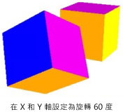

# 立體轉換概觀
本主題說明如何對 [!INCLUDE[TLA#tla_winclient](../../../../includes/tlasharptla-winclient-md.md)] 圖形系統中的 3D 模型套用轉換。 轉換可讓開發人員重新置放模型、調整模型大小，以及調整模型方向，而不需要變更定義模型的基底值。  

## 3D 座標空間  
 3d 圖形中的內容[!INCLUDE[TLA#tla_winclient](../../../../includes/tlasharptla-winclient-md.md)]封裝在一個項目， <xref:System.Windows.Controls.Viewport3D>，可參與二維元素結構。 圖形系統會將 Viewport3D 視為二維的視覺元素，就像 [!INCLUDE[TLA#tla_winclient](../../../../includes/tlasharptla-winclient-md.md)] 中許多其他元素一樣。 Viewport3D 運作的方式就像視窗 (檢視區) 一樣，但是是在三維的場景。 更精確來說，是一種 3D 場景投射到的表面。  雖然您可以在相同的場景圖形中使用 Viewport3D 搭配其他 2D 繪圖物件，但是您不能在 Viewport3D 內貫穿 2D 和 3D 物件。 在以下討論中所描述的座標空間都包含在 Viewport3D 元素中。  
  
 2D 圖形的 [!INCLUDE[TLA#tla_winclient](../../../../includes/tlasharptla-winclient-md.md)] 座標系統將原點置於轉譯表面 (通常是螢幕) 的左上角。 在 2D 系統中，x 軸的正值是往右，y 軸的正值則是往下。 不過在 3D 座標系統中，原點是位於螢幕的中心，x 軸的正值是往右，但 y 軸的正值是往上，而 z 軸的正值是從原點朝向檢視器往外。  
  
   
座標系統比較  
  
 這些軸所定義的空間是針對 [!INCLUDE[TLA#tla_winclient](../../../../includes/tlasharptla-winclient-md.md)] 中 3D 物件的靜態參考座標系。 當您在此空間中建置模型，並建立光線和觀景窗來檢視這些模型時，有助於區分此靜態參考座標系 (或稱為「世界空間」) 與您為每個模型套用轉換時建立的當地參考座標系。 也請記住，在世界空間中的物件取決於光線和觀景窗設定，可能看起來完全不同，或者完全無法看見，但觀景窗的位置不會改變世界空間中物件的位置。  
  
## 轉換模型  
 當您建立模型時，模型在場景中有特定的位置。 若要在場景中四處移動模型、旋轉模型，或變更模型的大小，變更定義模型的頂點本身並不實用。 而是要像在 2D 一樣，對模型套用轉換。  
  
 每個模型物件都<xref:System.Windows.Media.Media3D.Model3D.Transform%2A>與移動、 重新導向，或調整模型大小的屬性。 當您套用轉換時，可以透過轉換所指定的任何向量或值，有效率地位移模型的所有點。 換句話說，您已經轉換定義模型所在的座標空間 (「模型空間」)，但尚未變更在整個場景的座標系統 (「世界空間」) 中組成模型幾何的值。  
  
## 平移轉換  
 3d 轉換繼承自抽象基底類別<xref:System.Windows.Media.Media3D.Transform3D>; 其中包括仿射轉換類別<xref:System.Windows.Media.Media3D.TranslateTransform3D>， <xref:System.Windows.Media.Media3D.ScaleTransform3D>，和<xref:System.Windows.Media.Media3D.RotateTransform3D>。 [!INCLUDE[TLA#tla_winclient](../../../../includes/tlasharptla-winclient-md.md)] 3d 系統也提供<xref:System.Windows.Media.Media3D.MatrixTransform3D>類別，可讓您更精確的矩陣作業中指定相同的轉換。  
  
 <xref:System.Windows.Media.Media3D.TranslateTransform3D> 將所有資料點移動 model3d 中您使用指定的位移向量的方向<xref:System.Windows.Media.Media3D.TranslateTransform3D.OffsetX%2A>， <xref:System.Windows.Media.Media3D.TranslateTransform3D.OffsetY%2A>，和<xref:System.Windows.Media.Media3D.TranslateTransform3D.OffsetZ%2A>屬性。 例如，(2,2,2) 有一個立方體的頂點，(0,1.6,1) 的位移向量會將該頂點 (2,2,2) 移動到 (2,3.6,3)。 立方體的頂點還是在模型空間中的 (2,2,2)，但現在該模型空間已變更它與世界空間的關聯性，因此模型空間中的 (2,2,2) 就是世界空間中的 (2,3.6,3)。  
  
   
使用位移的平移  
  
 下列程式碼範例示範如何套用平移。  
  
 [!code-xaml[animation3dgallery_snip#Translation3DAnimationExampleWholePage](~/samples/snippets/csharp/VS_Snippets_Wpf/Animation3DGallery_snip/CS/Translation3DAnimationExample.xaml#translation3danimationexamplewholepage)]  
  
## 縮放轉換  
 <xref:System.Windows.Media.Media3D.ScaleTransform3D> 變更模型的縮放中心點指定的縮放向量。 指定統一的縮放比例，會將模型沿著 X、Y 和 Z 軸縮放相同的值，以便依比例變更模型的大小。 例如，設定轉換<xref:System.Windows.Media.ScaleTransform.ScaleX%2A>， <xref:System.Windows.Media.ScaleTransform.ScaleY%2A>，和<xref:System.Windows.Media.Media3D.ScaleTransform3D.ScaleZ%2A>屬性為 0.5 一半模型的大小; 將相同的屬性設定為 2 會加倍在所有三個軸。  
  
   
ScaleVector 範例  
  
 指定不一致的縮放變換 (X、 Y 和 Z 值並非全都相同的縮放變換)，您可以讓模型在一或兩個維度伸長或收縮，而不影響其他維度。 例如，設定<xref:System.Windows.Media.ScaleTransform.ScaleX%2A>設為 1，<xref:System.Windows.Media.ScaleTransform.ScaleY%2A>為 2，和<xref:System.Windows.Media.Media3D.ScaleTransform3D.ScaleZ%2A>為 1 會讓轉換的模型高度加倍，但會保持不變，沿著 X 軸和 Z 軸。  
  
 ScaleTransform3D 預設會讓頂點相對於原點 (0,0,0) 展開或收縮。 不過如果您想要轉換的模型不是從原點繪製，從原點縮放模型將不會「就地」縮放模型。 而是當模型的頂點乘上縮放向量時，縮放作業將會有平移模型，同時縮放模型的效果。  
  
   
縮放中心範例  
  
 若要調整 「 就地 」 模型，來指定模型的中心設定 ScaleTransform3D 的<xref:System.Windows.Media.ScaleTransform.CenterX%2A>， <xref:System.Windows.Media.ScaleTransform.CenterY%2A>，和<xref:System.Windows.Media.Media3D.ScaleTransform3D.CenterZ%2A>屬性。 這可確保圖形系統縮放模型空間，然後將它置中指定轉譯<xref:System.Windows.Media.Media3D.Point3D>。 但是如果您已經先根據原點建置模型，再指定不同的中心點，則會看到模型偏離原點。  
  
## 旋轉轉換  
 您可以使用幾種不同的方式旋轉 3D 模型。 一般旋轉轉換是指定一個軸，以及繞著該軸旋轉的角度。 <xref:System.Windows.Media.Media3D.RotateTransform3D>類別可讓您定義<xref:System.Windows.Media.Media3D.Rotation3D>具有其<xref:System.Windows.Media.Media3D.RotateTransform3D.Rotation%2A>屬性。 接著您可以指定<xref:System.Windows.Media.Media3D.AxisAngleRotation3D.Axis%2A>及<xref:System.Windows.Media.Media3D.AxisAngleRotation3D.Angle%2A>屬性，在此情況下的在 Rotation3D 上<xref:System.Windows.Media.Media3D.AxisAngleRotation3D>，來定義轉換。 下列範例會將模型繞著 Y 軸旋轉 60 度。  
  
 [!code-xaml[animation3dgallery_snip#Rotate3DUsingAxisAngleRotation3DExampleWholePage](~/samples/snippets/csharp/VS_Snippets_Wpf/Animation3DGallery_snip/CS/Rotat3DUsingAxisAngleRotation3DExample.xaml#rotate3dusingaxisanglerotation3dexamplewholepage)]  
  
 注意：[!INCLUDE[TLA#tla_winclient](../../../../includes/tlasharptla-winclient-md.md)]3d 是右手系統，這表示旋轉的正角度值會導致軸以逆時針方向旋轉。  
  
 如果未指定值，軸角度旋轉會假設對於原點旋轉<xref:System.Windows.Media.Media3D.RotateTransform3D.CenterX%2A>， <xref:System.Windows.Media.Media3D.RotateTransform3D.CenterY%2A>，和<xref:System.Windows.Media.Media3D.RotateTransform3D.CenterZ%2A>RotateTransform3D 上的屬性。 若使用縮放比例，最好記住旋轉會轉換模型的整個座標空間。 如果模型不是相對於原點建立，或先前已平移，則可能會「以原點為中心」旋轉而不是就地旋轉。  
  
   
以指定的新中心進行的旋轉  
  
 若要「就地」旋轉模型，請指定模型真正的中心做為旋轉的中心。 因為幾何通常是以原點開始建立，所以您可以先調整模型的大小 (縮放模型)，然後設定模型的方向 (旋轉模型)，最後將模型移到想要的位置 (平移模型)，通常都能在一組轉換之後得到預期的結果。  
  
   
旋轉範例  
  
 軸角度旋轉適用於靜態轉換和一些動畫。 不過，如果考慮讓立方體模型繞著 X 軸旋轉 60 度，然後繞著 Z 軸旋轉 45 度。 您可以將這個轉換描述為兩個不連續的仿射轉換，或描述為矩陣。 不過，要順利以動畫顯示此種方式定義的旋轉很困難。 雖然以兩種方法計算的模型開始位置和結束位置都相同，但是模型所採取的中間位置則是具有計算不確定性。 四元數是一種用來計算旋轉開始和結束之間插補的替代方法。  
  
 一個四元數代表 3D 空間中的一個軸和繞著該軸的旋轉。 例如，某個四元數可能代表 (1,1,2) 軸和 50 度的旋轉。 四元數在定義旋轉的威力在於您可以對四元數執行兩個操作︰合成和插補。 套用至幾何的兩個四元數合成表示「將幾何繞著 axis2 旋轉 rotation2，然後繞著 axis1 旋轉 rotation1」。 使用合成，則可以結合幾何上的兩個旋轉來取得代表結果的單一四元數。 因為四元數插補可以計算兩個軸與方向之間的平滑合理路徑，所以可以在原始的四元數與合成的四元數之間進行插補，以達到兩個四元數之間的平滑轉換，讓您以動畫顯示轉換。 針對您想要以動畫顯示的模型，您可以指定的目的地<xref:System.Windows.Media.Media3D.Quaternion>使用旋轉<xref:System.Windows.Media.Media3D.QuaternionRotation3D>如<xref:System.Windows.Media.Media3D.RotateTransform3D.Rotation%2A>屬性。  
  
## 使用轉換集合  
 建立場景時，常會對模型套用多個轉換。 新增轉換<xref:System.Windows.Media.Media3D.Transform3DGroup.Children%2A>的集合<xref:System.Windows.Media.Media3D.Transform3DGroup>類別來分組方便將轉換為套用到場景中的各種模型。 重複使用多個不同群組中的轉換通常很方便，因此您可以對每個執行個體套用一組不同的轉換來重複使用模型。 請注意，在集合中新增轉換的順序非常重要︰集合中的轉換會從第一個套用至最後一個。  
  
## 以動畫顯示轉換  
 [!INCLUDE[TLA#tla_winclient](../../../../includes/tlasharptla-winclient-md.md)] 3D 實作參與和 2D 圖形相同的計時和動畫系統。 換句話說，若要以動畫顯示 3D 場景，就要以動畫顯示其模型的屬性。 您可以直接以動畫顯示基元的屬性，但是以動畫顯示變更模型位置或外觀的轉換通常更容易。 因為轉換可以套用至<xref:System.Windows.Media.Media3D.Model3DGroup>物件以及個別模型，它就 Model3Dgroup 的子系和另一組一整組物件的動畫套用一組動畫。  如需 [!INCLUDE[TLA#tla_winclient](../../../../includes/tlasharptla-winclient-md.md)] 計時和動畫系統的背景資訊，請參閱[動畫概觀](animation-overview.md)和[分鏡腳本概觀](storyboards-overview.md)。  
  
 若要以動畫顯示 [!INCLUDE[TLA#tla_winclient](../../../../includes/tlasharptla-winclient-md.md)] 中的物件，請建立時間軸、定義動畫 (這實際上是某些屬性值隨時間的變化)，並指定要套用動畫的屬性。 這個屬性必須是 FrameworkElement 的屬性。 因為在 3D 場景中所有物件都是 Viewport3D 的子系，所以您想要套用至場景之任何動畫的目標屬性都是 Viewport3D 之屬性的屬性。 請務必小心處理動畫的屬性路徑，因為語法可能很冗長。  
  
 假設您想要就地旋轉物件，但是也想要套用擺動運動，讓物件更多部分供人檢視。 您可以選擇對模型套用 RotateTransform3D，然後讓其旋轉軸從一個向量到另一個向量以動畫顯示。 下列程式碼範例示範套用<xref:System.Windows.Media.Animation.Vector3DAnimation>的轉換的 Rotation3D 的 Axis 屬性，假設 RotateTransform3D 是數個轉換套用至具有模型的其中一個要<xref:System.Windows.Media.TransformGroup>。  
  
 [!code-csharp[3doverview#3DOverview3DN1](~/samples/snippets/csharp/VS_Snippets_Wpf/3DOverview/CSharp/Window1.xaml.cs#3doverview3dn1)]
 [!code-vb[3doverview#3DOverview3DN1](~/samples/snippets/visualbasic/VS_Snippets_Wpf/3DOverview/visualbasic/window1.xaml.vb#3doverview3dn1)]  
  
 [!code-csharp[3doverview#3DOverview3DN3](~/samples/snippets/csharp/VS_Snippets_Wpf/3DOverview/CSharp/Window1.xaml.cs#3doverview3dn3)]
 [!code-vb[3doverview#3DOverview3DN3](~/samples/snippets/visualbasic/VS_Snippets_Wpf/3DOverview/visualbasic/window1.xaml.vb#3doverview3dn3)]  
  
 您可以針對其他轉換屬性使用類似的語法來移動或縮放物件。  例如，您可以套用<xref:System.Windows.Media.Animation.Point3DAnimation>擴展轉換，以讓模型順暢地扭曲圖形上的 ScaleCenter 屬性。  
  
 雖然上述範例是轉換的屬性<xref:System.Windows.Media.Media3D.GeometryModel3D>，也是可以轉換場景中其他模型的屬性。  例如以動畫顯示套用至 Light 物件的平移，您可以建立能大幅變更模型外觀的移動光線和陰影效果。  
  
 因為觀景窗也是模型，所以同樣可以轉換觀景窗屬性。  雖然您可以轉換觀景窗位置或平面距離來變更場景的外觀 (實際上是轉換整個場景投影)，但請注意，以這種方式達成的許多效果就觀者的「視覺感受」來說，會比對場景中的模型位置套用轉換來得少。  
  
## 另請參閱

- [立體圖形概觀](3-d-graphics-overview.md)
- [轉換概觀](transforms-overview.md)
- [2d 轉換範例](https://go.microsoft.com/fwlink/?LinkID=158252)
