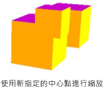

# 立體轉換概觀
本主題描述在 [!INCLUDE[TLA#tla_winclient](../../../../includes/tlasharptla-winclient-md.md)] 圖形系統中如何將轉換套用至立體模型。  轉換允許開發人員重新定位、重新調整大小和旋轉模型，而不需要變更定義它們的基底值。  
  
 [!INCLUDE[autoOutline](../Token/autoOutline_md.md)]  
  
## 立體座標空間  
 [!INCLUDE[TLA#tla_winclient](../../../../includes/tlasharptla-winclient-md.md)] 中的立體圖形內容是封裝在 <xref:System.Windows.Controls.Viewport3D> 項目中，這個項目可以參與二維項目結構。  圖形系統會將 Viewport3D 視為二維視覺化項目，就和 [!INCLUDE[TLA#tla_winclient](../../../../includes/tlasharptla-winclient-md.md)] 中的其他項目一樣。  Viewport3D 的運作方式與視窗 \(檢視區 \(Viewport\)\) 相同，但是使用的是三維場景。  較正確地說，它是投影立體場景的平面。  雖然您可以在相同場景圖形中搭配使用 Viewport3D 與其他 2D 繪圖物件，但是無法貫穿 Viewport3D 內的 2D 和立體物件。  在下列討論中，Viewport3D 項目會包含描述的座標空間 \(Coordinate Space\)。  
  
 2D 圖形的 [!INCLUDE[TLA#tla_winclient](../../../../includes/tlasharptla-winclient-md.md)] 座標系統會將原點放在呈現介面 \(一般是螢幕\) 的左上角。  在 2D 系統中，正 X 軸值是朝向右邊，而正 Y 軸值是朝向下方。  然而，在立體座標系統中，原點是位在螢幕的中央，而正 X 軸值是朝向右邊，但是正 Y 軸值是改為朝向上方，而正 Z 軸值是從原點往外，但朝向檢視器。  
  
   
座標系統比較  
  
 透過這些軸定義的空間是 [!INCLUDE[TLA#tla_winclient](../../../../includes/tlasharptla-winclient-md.md)] 中之立體物件的參考靜態畫面格。  如果在這個空間建置 \(Build\) 模型，並建立光源和鏡頭來檢視模型，則在將轉換套用至模型時，這有助於區分這個靜態參考畫面格 \(或「全局空間」\) 與針對每個模型建立的本機參考畫面格。  也請記住，全局空間中的物件可能看起來會完全不同，或根本看不到 \(取決於光源和鏡頭設定\)，但是鏡頭的位置並不會變更物件在全局空間中的位置。  
  
## 轉換模型  
 當您建立模型時，模型在場景中會有特定位置。  若要在場景中移動模型以進行旋轉，或變更那些模型的大小，則變更用於定義模型本身的頂點並不實用。  只需要如同 2D 中的做法，將轉換套用至模型。  
  
 每個模型物件都有 <xref:System.Windows.Media.Media3D.Model3D.Transform%2A> 屬性，使用這個屬性可以移動模型、重設模型的方向或調整模型的大小。  套用轉換時，可以根據轉換指定的向量或值，有效率地位移模型的所有點。  換句話說，您已轉換在其中定義模型的座標空間 \(模型空間\)，但是未變更以整個場景的座標系統組成模型幾何的值 \(全局空間\)。  
  
## 平移轉換  
 立體轉換繼承自抽象基底類別 <xref:System.Windows.Media.Media3D.Transform3D>，包括仿射 \(Affine\) 轉換類別 <xref:System.Windows.Media.Media3D.TranslateTransform3D>、<xref:System.Windows.Media.Media3D.ScaleTransform3D> 和 <xref:System.Windows.Media.Media3D.RotateTransform3D>。  [!INCLUDE[TLA#tla_winclient](../../../../includes/tlasharptla-winclient-md.md)] 立體系統也提供 <xref:System.Windows.Media.Media3D.MatrixTransform3D> 類別，這個類別可讓您以更精確的矩陣作業指定相同轉換。  
  
 <xref:System.Windows.Media.Media3D.TranslateTransform3D> 會以下列屬性指定的位移 \(Offset\) 向量方向來移動 Model3D 內的所有點：<xref:System.Windows.Media.Media3D.TranslateTransform3D.OffsetX%2A>、<xref:System.Windows.Media.Media3D.TranslateTransform3D.OffsetY%2A> 和 <xref:System.Windows.Media.Media3D.TranslateTransform3D.OffsetZ%2A> 屬性。  例如，如果 Cube 的其中一個頂點是 \(2,2,2\)，則位移向量 \(0,1.6,1\) 會將該頂點 \(2,2,2\) 移至 \(2,3.6,3\)。  在模型空間中，Cube 的頂點仍然會是 \(2,2,2\)，但是現在該模型空間已變更它與全局空間的關聯性 \(Relationship\)，因此模型空間中的 \(2,2,2\) 會是全局空間中的 \(2,3.6,3\)。  
  
   
使用位移進行平移  
  
 下列程式碼範例顯示如何套用平移。  
  
 [!code-xml[animation3dgallery_snip#Translation3DAnimationExampleWholePage](../../../../samples/snippets/csharp/VS_Snippets_Wpf/Animation3DGallery_snip/CS/Translation3DAnimationExample.xaml#translation3danimationexamplewholepage)]  
  
## 縮放轉換  
 <xref:System.Windows.Media.Media3D.ScaleTransform3D> 會根據指定的縮放向量並參考中心點來變更模型的比例。  一致的縮放會根據 X、Y 和 Z 軸中的相同值來縮放模型軸，因此請指定一致的縮放來等比例變更模型的大小。  例如，將轉換的 <xref:System.Windows.Media.ScaleTransform.ScaleX%2A>、<xref:System.Windows.Media.ScaleTransform.ScaleY%2A> 和 <xref:System.Windows.Media.Media3D.ScaleTransform3D.ScaleZ%2A> 屬性設定為 0.5 會讓模型變成一半的大小，而將相同屬性設定為 2 則這三個軸的比例都會變成兩倍。  
  
   
ScaleVector 範例  
  
 透過指定不一致的縮放轉換 \(X、Y 和 Z 值都不同的縮放轉換\)，就可以利用一維或二維來展開或收合模型，而不會影響其他模型。  例如，將 <xref:System.Windows.Media.ScaleTransform.ScaleX%2A> 設定為 1、將 <xref:System.Windows.Media.ScaleTransform.ScaleY%2A> 設定為 2，並將 <xref:System.Windows.Media.Media3D.ScaleTransform3D.ScaleZ%2A> 設定為 1，則會讓所轉換模型的高度變更為兩倍大，但是 X 和 Z 軸會維持不變。  
  
 ScaleTransform3D 預設會讓頂點展開或收合原點 \(0,0,0\)。  但是，如果想要轉換的模型不是從原點開始繪製，則從原點開始縮放模型並不會「就地」縮放模型。 而在模型的頂點乘上縮放向量時，縮放作業會有平移及縮放模型的效果。  
  
   
縮放中心範例  
  
 若要「就地」縮放模型，請設定 ScaleTransform3D 的 <xref:System.Windows.Media.ScaleTransform.CenterX%2A>、<xref:System.Windows.Media.ScaleTransform.CenterY%2A> 和 <xref:System.Windows.Media.Media3D.ScaleTransform3D.CenterZ%2A> 屬性，以指定模型中心。  這確保圖形系統會縮放模型空間，然後將它平移至所指定 <xref:System.Windows.Media.Media3D.Point3D> 的中央。  相反地，如果已從原點建置模型，並指定不同的中心點，則預期會看到模型移離原點。  
  
## 旋轉轉換  
 您可以用多種不同的方式旋轉立體模型。  一般旋轉轉換會指定一個軸，以及繞著該軸旋轉的角度。  <xref:System.Windows.Media.Media3D.RotateTransform3D> 類別可讓您定義具有其 <xref:System.Windows.Media.Media3D.RotateTransform3D.Rotation%2A> 屬性的 <xref:System.Windows.Media.Media3D.Rotation3D>。  然後將 Rotation3D 的 <xref:System.Windows.Media.Media3D.AxisAngleRotation3D.Axis%2A> 和 <xref:System.Windows.Media.Media3D.AxisAngleRotation3D.Angle%2A> 屬性 \(在這種情況下，是 <xref:System.Windows.Media.Media3D.AxisAngleRotation3D>\) 指定為定義轉換。  下列範例會將模型繞著 Y 軸旋轉 60 度。  
  
 [!code-xml[animation3dgallery_snip#Rotate3DUsingAxisAngleRotation3DExampleWholePage](../../../../samples/snippets/csharp/VS_Snippets_Wpf/Animation3DGallery_snip/CS/Rotat3DUsingAxisAngleRotation3DExample.xaml#rotate3dusingaxisanglerotation3dexamplewholepage)]  
  
 注意：[!INCLUDE[TLA#tla_winclient](../../../../includes/tlasharptla-winclient-md.md)] 立體是慣用右手系統，表示旋轉的正角度值會繞著軸進行逆時鐘旋轉。  
  
 軸\-角度旋轉假設在未指定 RotateTransform3D 的 <xref:System.Windows.Media.Media3D.RotateTransform3D.CenterX%2A>、<xref:System.Windows.Media.Media3D.RotateTransform3D.CenterY%2A> 和 <xref:System.Windows.Media.Media3D.RotateTransform3D.CenterZ%2A> 屬性值時，會從原點開始旋轉。  與縮放相同，請記住旋轉會轉換模型的整個座標空間。  如果模型不是從原點開始建立，或先前已進行過平移，則旋轉可能會從原點開始進行「樞紐」，而不是就地旋轉。  
  
   
使用指定的新中心旋轉  
  
 若要「就地」旋轉模型，請將模型的實際中心指定為旋轉的中心。  因為幾何一般是從原點開始建立，所以先調整模型大小 \(縮放\)，然後設定它的方向 \(旋轉\)，最後將它移至所要的位置 \(平移\)，通常都可以取得一組轉換的預期結果。  
  
   
旋轉範例  
  
 軸\-角度旋轉十分適用於靜態轉換及一些動畫。  然而，請考慮將 Cube 模型繞著 X 軸旋轉 60 度，然後繞著 Z 軸旋轉 45 度。  您可以用兩個獨立仿射轉換或矩陣來描述這個轉換。  然而，可能會很難平順地建立以這種方式定義之旋轉的動畫。  雖然透過上述任一方式計算出來的開始和結束位置都會相同，但是模型所用的中繼位置則是具有計算不確定性。  四元數代表一種替代方式，用以計算旋轉開始和結束之間的插補。  
  
 四元數表示立體空間的軸，以及繞著該軸的旋轉。  例如，四元數可能表示 \(1,1,2\) 軸並旋轉 50 度。  四元數定義旋轉的功能是來自兩個您可以對其執行的作業：複合和插補。  複合兩個套用至幾何的四元數，表示「將幾何繞著軸 axis2 旋轉 rotation2，然後再將它繞著軸 axis1 旋轉 rotation1」。 使用複合，可以合併幾何上的兩個旋轉，以取得表示結果的單一四元數。  因為四元數插補可以計算兩個軸和方向之間的平滑合理路徑，所以可以在原點與所組成四元數之間進行插補，以達到不同點之間的平滑轉換，讓您可以建立轉換的動畫。  而針對想要建立動畫的模型，則可以使用 <xref:System.Windows.Media.Media3D.RotateTransform3D.Rotation%2A> 屬性的 <xref:System.Windows.Media.Media3D.QuaternionRotation3D>，指定旋轉的目的 <xref:System.Windows.Media.Media3D.Quaternion>。  
  
## 使用轉換集合  
 建置場景時，一般是將多個轉換套用至模型。  請將轉換加入至 <xref:System.Windows.Media.Media3D.Transform3DGroup> 類別的 <xref:System.Windows.Media.Media3D.Transform3DGroup.Children%2A> 集合以群組轉換，便於套用至場景的各種模型中。  將轉換重複使用於數個不同群組十分方便，而其方式與將不同轉換集套用至每個執行個體以重複使用模型十分類似。  請注意，轉換加入至集合的順序十分重要：會從上往下套用集合中的轉換。  
  
## 將轉換顯示為動畫  
 [!INCLUDE[TLA#tla_winclient](../../../../includes/tlasharptla-winclient-md.md)] 立體實作會參與 2D 圖形的相同計時和動畫系統。  換句話說，若要建立立體場景的動畫，請建立其模型屬性的動畫。  您可以直接建立基本型別之屬性的動畫，但是建立轉換動畫然後用以變更模型的位置或外觀，通常會比較簡單。  因為轉換可以套用至 <xref:System.Windows.Media.Media3D.Model3DGroup> 物件以及個別模型，所以可以將一組動畫套用至 Model3DGroup 的子系，並將另一組動畫套用至物件群組。  如需 [!INCLUDE[TLA#tla_winclient](../../../../includes/tlasharptla-winclient-md.md)] 計時及動畫系統的背景資訊，請參閱[動畫概觀](../../../../docs/framework/wpf/graphics-multimedia/animation-overview.md)和[腳本概觀](../../../../docs/framework/wpf/graphics-multimedia/storyboards-overview.md)。  
  
 若要在 [!INCLUDE[TLA#tla_winclient](../../../../includes/tlasharptla-winclient-md.md)] 中建立物件的動畫，請建立時刻表、定義動畫 \(實際是某個屬性值在不同時間的變更\)，以及指定要套用動畫的屬性。  這個屬性必須是 FrameworkElement 的屬性。  因為立體場景中的所有物件都是 Viewport3D 的子系，所以任何想要套用至場景之動畫的目標屬性都是 Viewport3D 屬性的屬性。  因為語法可能會十分詳細，所以重要的是小心找出動畫的屬性路徑。  
  
 假設想要就地旋轉物件，但是也想要套用擺動動畫以公開 \(Expose\) 較多的物件檢視部分。  您可能會選擇將 RotateTransform3D 套用至模型，並建立從某個向量到另一個向量之旋轉軸的動畫。  下列程式碼範例示範將 <xref:System.Windows.Media.Animation.Vector3DAnimation> 套用至轉換之 Rotation3D 的 Axis 屬性，但前提是 RotateTransform3D 是使用 <xref:System.Windows.Media.TransformGroup> 套用至模型的其中一個轉換。  
  
 [!code-csharp[3doverview#3DOverview3DN1](../../../../samples/snippets/csharp/VS_Snippets_Wpf/3DOverview/CSharp/Window1.xaml.cs#3doverview3dn1)]
 [!code-vb[3doverview#3DOverview3DN1](../../../../samples/snippets/visualbasic/VS_Snippets_Wpf/3DOverview/visualbasic/window1.xaml.vb#3doverview3dn1)]  
  
 [!code-csharp[3doverview#3DOverview3DN3](../../../../samples/snippets/csharp/VS_Snippets_Wpf/3DOverview/CSharp/Window1.xaml.cs#3doverview3dn3)]
 [!code-vb[3doverview#3DOverview3DN3](../../../../samples/snippets/visualbasic/VS_Snippets_Wpf/3DOverview/visualbasic/window1.xaml.vb#3doverview3dn3)]  
  
 使用類似的語法，可以設定用來移動或縮放物件的其他轉換屬性。  例如，您可能會在縮放轉換上將 <xref:System.Windows.Media.Animation.Point3DAnimation> 套用至 ScaleCenter 屬性，讓模型平滑地變換它的形狀。  
  
 雖然先前範例會轉換 <xref:System.Windows.Media.Media3D.GeometryModel3D> 的屬性，但是也可能會轉換場景中其他模型的屬性。  例如，透過建立套用至 Light 物件之平移的動畫，可以建立移動光線和陰影效果，用以明顯變更模型外觀。  
  
 因為鏡頭也是模型，所以可能也會一併轉換鏡頭屬性。  當您可以透過轉換鏡頭位置或平面距離以確定地變更場景外觀時 \(事實上是轉換整個場景投影\)，請注意用這種方式達成的許多效果，對檢視器所造成的「視覺場景」會少於套用至位置或場景中模型位置的轉換。  
  
## 請參閱  
 [立體圖形概觀](../../../../docs/framework/wpf/graphics-multimedia/3-d-graphics-overview.md)   
 [轉換概觀](../../../../docs/framework/wpf/graphics-multimedia/transforms-overview.md)   
 [2D 轉換範例](http://go.microsoft.com/fwlink/?LinkID=158252)