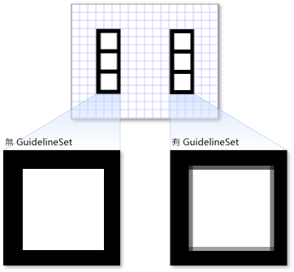

# 繪圖物件概觀
本主題將介紹<xref:System.Windows.Media.Drawing>物件，並說明如何使用它們來有效率地繪製圖形、 點陣圖、 文字及媒體。 使用 <xref:System.Windows.Media.Drawing>物件，當您建立美工圖案、 繪製<xref:System.Windows.Media.DrawingBrush>，或使用<xref:System.Windows.Media.Visual>物件。  
  
 
  
   
## 什麼是繪圖物件？  
 A<xref:System.Windows.Media.Drawing>物件可描繪可見內容，例如圖形、 點陣圖、 視訊或文字行。 不同類型的繪圖可描繪不同類型的內容。 以下列出不同類型的繪圖物件。  
  
-   <xref:System.Windows.Media.GeometryDrawing> – 繪製圖形。  
  
-   <xref:System.Windows.Media.ImageDrawing> – 繪製影像。  
  
-   <xref:System.Windows.Media.GlyphRunDrawing> – 繪製的文字。  
  
-   <xref:System.Windows.Media.VideoDrawing> – 播放音訊或視訊檔。  
  
-   <xref:System.Windows.Media.DrawingGroup> – 繪製其他繪圖。 您可以使用繪圖群組，來將其他繪圖結合為單一複合繪圖。  
  
 <xref:System.Windows.Media.Drawing> 物件是多用途;有很的多種，您可以使用<xref:System.Windows.Media.Drawing>物件。  
  
-   顯示為映像使用<xref:System.Windows.Media.DrawingImage>和<xref:System.Windows.Controls.Image>控制項。  
  
-   您可以使用它與<xref:System.Windows.Media.DrawingBrush>來繪製物件，例如<xref:System.Windows.Controls.Page.Background%2A>的<xref:System.Windows.Controls.Page>。  
  
-   您可以使用它來描述的外觀<xref:System.Windows.Media.DrawingVisual>。  
  
-   您可以使用它來列舉內容<xref:System.Windows.Media.Visual>。  
  
 WPF 提供其他能夠繪製圖形、點陣圖、文字及媒體的物件類型。 例如，您也可以使用<xref:System.Windows.Shapes.Shape>物件來繪製圖形，而<xref:System.Windows.Controls.MediaElement>控制項提供另一種方式將影片新增至您的應用程式。 因此當您應該使用<xref:System.Windows.Media.Drawing>物件？ 您可以犧牲架構等級功能以獲得效能優勢時，或當您需要<xref:System.Windows.Freezable>功能。 因為<xref:System.Windows.Media.Drawing>物件缺少支援[版面配置](../advanced/layout.md)、 輸入和焦點，它們提供效能優勢，使其更適合用來描繪背景、 美工圖案，並使用低層級繪圖<xref:System.Windows.Media.Visual>物件。  
  
 因為它們是一種<xref:System.Windows.Freezable>物件，<xref:System.Windows.Media.Drawing>物件可取得數個特殊的功能，包括下列： 它們可以宣告為[資源](../advanced/xaml-resources.md)、 多個物件，成為唯讀，以改善在共用效能、 複製，並變更為安全執行緒。 如需詳細資訊，所提供的不同功能的相關<xref:System.Windows.Freezable>物件，請參閱[Freezable 物件概觀](../advanced/freezable-objects-overview.md)。  
  
   
## 繪製圖形  
 若要繪製圖形，您使用<xref:System.Windows.Media.GeometryDrawing>。 幾何繪圖<xref:System.Windows.Media.GeometryDrawing.Geometry%2A>屬性會描述要繪製的形狀其<xref:System.Windows.Media.GeometryDrawing.Brush%2A>屬性會描述如何應該繪製的形狀內部，並將其<xref:System.Windows.Media.GeometryDrawing.Pen%2A>屬性描述應該如何繪製其外框。  
  
 下列範例會使用<xref:System.Windows.Media.GeometryDrawing>繪製圖形。 所描述的圖形<xref:System.Windows.Media.GeometryGroup>並將兩個<xref:System.Windows.Media.EllipseGeometry>物件。 用於繪製圖形的內部<xref:System.Windows.Media.LinearGradientBrush>，以繪製其外框<xref:System.Windows.Media.Brushes.Black%2A> <xref:System.Windows.Media.Pen>。  
  
 這個範例會建立下列<xref:System.Windows.Media.GeometryDrawing>。  
  
   
GeometryDrawing  
  
 [!code-csharp[DrawingMiscSnippets_snip#GeometryDrawingExampleInline](~/samples/snippets/csharp/VS_Snippets_Wpf/DrawingMiscSnippets_snip/CSharp/GeometryDrawingExample.cs#geometrydrawingexampleinline)]
 [!code-xaml[DrawingMiscSnippets_snip#GeometryDrawingExampleInline](~/samples/snippets/xaml/VS_Snippets_Wpf/DrawingMiscSnippets_snip/XAML/GeometryDrawingExample.xaml#geometrydrawingexampleinline)]  
  
 如需完整的範例，請參閱[建立 GeometryDrawing](how-to-create-a-geometrydrawing.md)。  
  
 其他<xref:System.Windows.Media.Geometry>類別，例如<xref:System.Windows.Media.PathGeometry>可讓您建立更複雜的圖形建立曲線和弧形。 如需詳細資訊<xref:System.Windows.Media.Geometry>物件，請參閱[幾何概觀](geometry-overview.md)。  
  
 如需詳細資訊，來繪製圖形，請勿使用其他方式的相關<xref:System.Windows.Media.Drawing>物件，請參閱[圖案和基本繪圖概觀 WPF 中](shapes-and-basic-drawing-in-wpf-overview.md)。  
  
   
## 繪製影像  
 若要繪製影像，您使用<xref:System.Windows.Media.ImageDrawing>。 <xref:System.Windows.Media.ImageDrawing>物件的<xref:System.Windows.Media.ImageDrawing.ImageSource%2A>屬性會描述要繪製，影像並將其<xref:System.Windows.Media.ImageDrawing.Rect%2A>屬性會定義要在繪製影像的區域。  
  
 下列範例會在 (75,75) 繪製 100 x 100 像素的影像。 下圖顯示<xref:System.Windows.Media.ImageDrawing>範例所建立。 若要顯示的範圍加入灰色框線<xref:System.Windows.Media.ImageDrawing>。  
  
   
100 x 100 的 ImageDrawing  
  
 [!code-csharp[DrawingMiscSnippets_snip#ImageDrawing100by100Inline](~/samples/snippets/csharp/VS_Snippets_Wpf/DrawingMiscSnippets_snip/CSharp/ImageDrawingExample.cs#imagedrawing100by100inline)]
 [!code-xaml[DrawingMiscSnippets_snip#ImageDrawing100by100Inline](~/samples/snippets/xaml/VS_Snippets_Wpf/DrawingMiscSnippets_snip/XAML/ImageDrawingExample.xaml#imagedrawing100by100inline)]  
  
 如需有關影像的詳細資訊，請參閱[影像處理概觀](imaging-overview.md)。  
  
   
## 播放媒體 (僅程式碼)  
  
> [!NOTE]
>  雖然您可以宣告<xref:System.Windows.Media.VideoDrawing>在[!INCLUDE[TLA#tla_xaml](../../../../includes/tlasharptla-xaml-md.md)]，您只可以載入及播放媒體使用程式碼。 若要播放視訊[!INCLUDE[TLA#tla_xaml](../../../../includes/tlasharptla-xaml-md.md)]，使用<xref:System.Windows.Controls.MediaElement>改。  
  
 若要播放的音訊或視訊檔案，您使用<xref:System.Windows.Media.VideoDrawing>和<xref:System.Windows.Media.MediaPlayer>。 有兩種方法可以載入及播放媒體。 第一種是使用<xref:System.Windows.Media.MediaPlayer>並<xref:System.Windows.Media.VideoDrawing>本身，然後第二個方法是建立您自己<xref:System.Windows.Media.MediaTimeline>搭配<xref:System.Windows.Media.MediaPlayer>和<xref:System.Windows.Media.VideoDrawing>。  
  
> [!NOTE]
>  利用您的應用程式散發媒體時，您無法跟散發影像一樣，使用媒體檔案當作專案資源。 在您的專案檔中，您必須改為將媒體類型設定為 `Content`，並將 `CopyToOutputDirectory` 設定為 `PreserveNewest` 或 `Always`。  
  
 若要播放媒體，而不需要建立您自己<xref:System.Windows.Media.MediaTimeline>，執行下列步驟。  
  
1.  建立 <xref:System.Windows.Media.MediaPlayer> 物件。  
  
     [!code-csharp[DrawingMiscSnippets_snip#VideoDrawingExampleInline1](~/samples/snippets/csharp/VS_Snippets_Wpf/DrawingMiscSnippets_snip/CSharp/VideoDrawingExample.cs#videodrawingexampleinline1)]  
  
2.  使用<xref:System.Windows.Media.MediaPlayer.Open%2A>方法來載入媒體檔案。  
  
     [!code-csharp[DrawingMiscSnippets_snip#VideoDrawingExampleInline2](~/samples/snippets/csharp/VS_Snippets_Wpf/DrawingMiscSnippets_snip/CSharp/VideoDrawingExample.cs#videodrawingexampleinline2)]  
  
3.  建立 <xref:System.Windows.Media.VideoDrawing>。  
  
     [!code-csharp[DrawingMiscSnippets_snip#VideoDrawingExampleInline3](~/samples/snippets/csharp/VS_Snippets_Wpf/DrawingMiscSnippets_snip/CSharp/VideoDrawingExample.cs#videodrawingexampleinline3)]  
  
4.  指定的大小和位置，藉由設定繪製媒體<xref:System.Windows.Media.VideoDrawing.Rect%2A>屬性<xref:System.Windows.Media.VideoDrawing>。  
  
     [!code-csharp[DrawingMiscSnippets_snip#VideoDrawingExampleInline4](~/samples/snippets/csharp/VS_Snippets_Wpf/DrawingMiscSnippets_snip/CSharp/VideoDrawingExample.cs#videodrawingexampleinline4)]  
  
5.  設定<xref:System.Windows.Media.VideoDrawing.Player%2A>的屬性<xref:System.Windows.Media.VideoDrawing>使用<xref:System.Windows.Media.MediaPlayer>您所建立。  
  
     [!code-csharp[DrawingMiscSnippets_snip#VideoDrawingExampleInline5](~/samples/snippets/csharp/VS_Snippets_Wpf/DrawingMiscSnippets_snip/CSharp/VideoDrawingExample.cs#videodrawingexampleinline5)]  
  
6.  使用<xref:System.Windows.Media.MediaPlayer.Play%2A>方法的<xref:System.Windows.Media.MediaPlayer>開始播放媒體。  
  
     [!code-csharp[DrawingMiscSnippets_snip#VideoDrawingExampleInline6](~/samples/snippets/csharp/VS_Snippets_Wpf/DrawingMiscSnippets_snip/CSharp/VideoDrawingExample.cs#videodrawingexampleinline6)]  
  
 下列範例會使用<xref:System.Windows.Media.VideoDrawing>和<xref:System.Windows.Media.MediaPlayer>來播放視訊檔案一次。  
  
 [!code-csharp[DrawingMiscSnippets_snip#VideoDrawingExampleInline](~/samples/snippets/csharp/VS_Snippets_Wpf/DrawingMiscSnippets_snip/CSharp/VideoDrawingExample.cs#videodrawingexampleinline)]  
  
 若要取得其他計時控制項，透過媒體，請使用<xref:System.Windows.Media.MediaTimeline>具有<xref:System.Windows.Media.MediaPlayer>和<xref:System.Windows.Media.VideoDrawing>物件。 <xref:System.Windows.Media.MediaTimeline>可讓您指定是否應重複播放視訊。 若要使用<xref:System.Windows.Media.MediaTimeline>與<xref:System.Windows.Media.VideoDrawing>，執行下列步驟：  
  
1.  宣告<xref:System.Windows.Media.MediaTimeline>並設定其計時行為。  
  
     [!code-csharp[DrawingMiscSnippets_snip#RepeatingVideoDrawingExampleInline1](~/samples/snippets/csharp/VS_Snippets_Wpf/DrawingMiscSnippets_snip/CSharp/VideoDrawingExample.cs#repeatingvideodrawingexampleinline1)]  
  
2.  建立<xref:System.Windows.Media.MediaClock>從<xref:System.Windows.Media.MediaTimeline>。  
  
     [!code-csharp[DrawingMiscSnippets_snip#RepeatingVideoDrawingExampleInline2](~/samples/snippets/csharp/VS_Snippets_Wpf/DrawingMiscSnippets_snip/CSharp/VideoDrawingExample.cs#repeatingvideodrawingexampleinline2)]  
  
3.  建立<xref:System.Windows.Media.MediaPlayer>並用<xref:System.Windows.Media.MediaClock>若要設定其<xref:System.Windows.Media.MediaPlayer.Clock%2A>屬性。  
  
     [!code-csharp[DrawingMiscSnippets_snip#RepeatingVideoDrawingExampleInline3](~/samples/snippets/csharp/VS_Snippets_Wpf/DrawingMiscSnippets_snip/CSharp/VideoDrawingExample.cs#repeatingvideodrawingexampleinline3)]  
  
4.  建立<xref:System.Windows.Media.VideoDrawing>並指派<xref:System.Windows.Media.MediaPlayer>要<xref:System.Windows.Media.VideoDrawing.Player%2A>屬性<xref:System.Windows.Media.VideoDrawing>。  
  
     [!code-csharp[DrawingMiscSnippets_snip#RepeatingVideoDrawingExampleInline4](~/samples/snippets/csharp/VS_Snippets_Wpf/DrawingMiscSnippets_snip/CSharp/VideoDrawingExample.cs#repeatingvideodrawingexampleinline4)]  
  
 下列範例會使用<xref:System.Windows.Media.MediaTimeline>具有<xref:System.Windows.Media.MediaPlayer>和<xref:System.Windows.Media.VideoDrawing>來重複播放視訊。  
  
 [!code-csharp[DrawingMiscSnippets_snip#RepeatingVideoDrawingExampleInline](~/samples/snippets/csharp/VS_Snippets_Wpf/DrawingMiscSnippets_snip/CSharp/VideoDrawingExample.cs#repeatingvideodrawingexampleinline)]  
  
 請注意，當您使用<xref:System.Windows.Media.MediaTimeline>，您使用的互動式<xref:System.Windows.Media.Animation.ClockController>傳回<xref:System.Windows.Media.Animation.Clock.Controller%2A>屬性<xref:System.Windows.Media.MediaClock>控制媒體播放，而不是互動的方法<xref:System.Windows.Media.MediaPlayer>。  
  
   
## 繪製文字  
 若要繪製文字，您使用<xref:System.Windows.Media.GlyphRunDrawing>和<xref:System.Windows.Media.GlyphRun>。 下列範例會使用<xref:System.Windows.Media.GlyphRunDrawing>來繪製文字"Hello World"。  
  
 [!code-csharp[DrawingMiscSnippets_snip#GlyphRunDrawingExampleInline](~/samples/snippets/csharp/VS_Snippets_Wpf/DrawingMiscSnippets_snip/CSharp/GlyphRunDrawingExample.cs#glyphrundrawingexampleinline)]
 [!code-xaml[DrawingMiscSnippets_snip#GlyphRunDrawingExampleInline](~/samples/snippets/xaml/VS_Snippets_Wpf/DrawingMiscSnippets_snip/XAML/GlyphRunExample.xaml#glyphrundrawingexampleinline)]  
  
 A<xref:System.Windows.Media.GlyphRun>是適用於搭配固定格式文件展示及列印案例的低層級物件。 文字繪製到螢幕更簡單的方式是使用<xref:System.Windows.Controls.Label>或<xref:System.Windows.Controls.TextBlock>。 如需詳細資訊<xref:System.Windows.Media.GlyphRun>，請參閱 < [GlyphRun 物件和 Glyphs 元素簡介](../advanced/introduction-to-the-glyphrun-object-and-glyphs-element.md)概觀。  
  
   
## 複合繪圖  
 A<xref:System.Windows.Media.DrawingGroup>可讓您結合多個圖形為單一複合繪圖。 藉由使用<xref:System.Windows.Media.DrawingGroup>，您可以將圖形、 影像及文字合併成單一<xref:System.Windows.Media.Drawing>物件。  
  
 下列範例會使用<xref:System.Windows.Media.DrawingGroup>結合兩個<xref:System.Windows.Media.GeometryDrawing>物件和<xref:System.Windows.Media.ImageDrawing>物件。 此範例會產生下列輸出。  
  
   
複合圖形  
  
 [!code-csharp[DrawingMiscSnippets_snip#GraphicsMMSimpleDrawingGroupExample](~/samples/snippets/csharp/VS_Snippets_Wpf/DrawingMiscSnippets_snip/CSharp/DrawingGroupExample.cs#graphicsmmsimpledrawinggroupexample)]
 [!code-xaml[DrawingMiscSnippets_snip#GraphicsMMSimpleDrawingGroupExample](~/samples/snippets/xaml/VS_Snippets_Wpf/DrawingMiscSnippets_snip/XAML/DrawingGroupExample.xaml#graphicsmmsimpledrawinggroupexample)]  
  
 A<xref:System.Windows.Media.DrawingGroup>也可讓您套用其內容的不透明度遮罩、 轉換、 點陣圖效果以及其他作業。 <xref:System.Windows.Media.DrawingGroup> 以下列順序套用作業： <xref:System.Windows.Media.DrawingGroup.OpacityMask%2A>， <xref:System.Windows.Media.DrawingGroup.Opacity%2A>， <xref:System.Windows.Media.DrawingGroup.BitmapEffect%2A>， <xref:System.Windows.Media.DrawingGroup.ClipGeometry%2A>， <xref:System.Windows.Media.DrawingGroup.GuidelineSet%2A>，然後<xref:System.Windows.Media.DrawingGroup.Transform%2A>。  
  
 下圖中顯示的順序<xref:System.Windows.Media.DrawingGroup>套用作業。  
  
   
DrawingGroup 作業的順序  
  
 下表描述可用來操作屬性<xref:System.Windows.Media.DrawingGroup>物件的內容。  
  
|屬性|描述|圖例|  
|--------------|-----------------|------------------|  
|<xref:System.Windows.Media.DrawingGroup.OpacityMask%2A>|改變的選取部分的不透明度<xref:System.Windows.Media.DrawingGroup>內容。 如需範例，請參閱[如何：控制繪圖的不透明度](https://docs.microsoft.com/previous-versions/dotnet/netframework-3.5/ms748242(v=vs.90))。||  
|<xref:System.Windows.Media.DrawingGroup.Opacity%2A>|統一變更的不透明度<xref:System.Windows.Media.DrawingGroup>內容。 使用這個屬性來讓<xref:System.Windows.Media.Drawing>透明或半透明。 如需範例，請參閱[如何：對繪圖套用不透明度遮罩](https://docs.microsoft.com/previous-versions/dotnet/netframework-3.5/ms753195(v=vs.90))。||  
|<xref:System.Windows.Media.DrawingGroup.BitmapEffect%2A>|適用於<xref:System.Windows.Media.Effects.BitmapEffect>至<xref:System.Windows.Media.DrawingGroup>內容。 如需範例，請參閱[如何：對繪圖套用 BitmapEffect](https://docs.microsoft.com/previous-versions/dotnet/netframework-3.5/ms752341(v=vs.90))。||  
|<xref:System.Windows.Media.DrawingGroup.ClipGeometry%2A>|剪輯<xref:System.Windows.Media.DrawingGroup>您區域的內容說明使用<xref:System.Windows.Media.Geometry>。 如需範例，請參閱[如何：裁剪繪圖](https://docs.microsoft.com/previous-versions/dotnet/netframework-3.5/ms743068(v=vs.90))。||  
|<xref:System.Windows.Media.DrawingGroup.GuidelineSet%2A>|沿著指定的標線將裝置獨立像素貼齊裝置像素。 這個屬性可用於確保在低 DPI 顯示器上呈現清晰的細緻圖形。 如需範例，請參閱[對繪圖套用 GuidelineSet](how-to-apply-a-guidelineset-to-a-drawing.md)。||  
|<xref:System.Windows.Media.DrawingGroup.Transform%2A>|轉換<xref:System.Windows.Media.DrawingGroup>內容。 如需範例，請參閱[如何：對繪圖套用轉換](https://docs.microsoft.com/previous-versions/dotnet/netframework-3.5/ms742304(v=vs.90))。||  
  
   
## 將繪圖顯示為影像  
 若要顯示<xref:System.Windows.Media.Drawing>與<xref:System.Windows.Controls.Image>控制，請使用<xref:System.Windows.Media.DrawingImage>做為<xref:System.Windows.Controls.Image>控制項的<xref:System.Windows.Controls.Image.Source%2A>並設定<xref:System.Windows.Media.DrawingImage>物件的<xref:System.Windows.Media.DrawingImage.Drawing%2A?displayProperty=nameWithType>您想要顯示的繪圖屬性。  
  
 下列範例會使用<xref:System.Windows.Media.DrawingImage>並<xref:System.Windows.Controls.Image>控制項來顯示<xref:System.Windows.Media.GeometryDrawing>。 此範例會產生下列輸出。  
  
   
DrawingImage  
  
 [!code-csharp[DrawingMiscSnippets_snip#DrawingImageExampleWholePage](~/samples/snippets/csharp/VS_Snippets_Wpf/DrawingMiscSnippets_snip/CSharp/DrawingImageExample.cs#drawingimageexamplewholepage)]
 [!code-xaml[DrawingMiscSnippets_snip#DrawingImageExampleWholePage](~/samples/snippets/xaml/VS_Snippets_Wpf/DrawingMiscSnippets_snip/XAML/DrawingImageExample.xaml#drawingimageexamplewholepage)]  
  
   
## 使用繪圖繪製物件  
 A<xref:System.Windows.Media.DrawingBrush>是一種使用繪圖物件繪製區域的筆刷。 您可以使用它來繪製含有繪圖的任何圖形物件。 <xref:System.Windows.Media.Drawing>的屬性<xref:System.Windows.Media.DrawingBrush>描述其<xref:System.Windows.Media.DrawingBrush.Drawing%2A>。 要呈現<xref:System.Windows.Media.Drawing>具有<xref:System.Windows.Media.DrawingBrush>，將它新增至使用筆刷的筆刷<xref:System.Windows.Media.Drawing>屬性，然後使用筆刷來繪製圖形物件，例如控制項或面板。  
  
 下列範例會使用<xref:System.Windows.Media.DrawingBrush>繪製<xref:System.Windows.Shapes.Shape.Fill%2A>的<xref:System.Windows.Shapes.Rectangle>模式中從建立<xref:System.Windows.Media.GeometryDrawing>。 此範例會產生下列輸出。  
  
   
搭配 DrawingBrush 使用的 GeometryDrawing  
  
 [!code-csharp[DrawingMiscSnippets_snip#DrawingBrushExampleWholePage](~/samples/snippets/csharp/VS_Snippets_Wpf/DrawingMiscSnippets_snip/CSharp/DrawingBrushExample.cs#drawingbrushexamplewholepage)]
 [!code-xaml[DrawingMiscSnippets_snip#DrawingBrushExampleWholePage](~/samples/snippets/xaml/VS_Snippets_Wpf/DrawingMiscSnippets_snip/XAML/DrawingBrushExample.xaml#drawingbrushexamplewholepage)]  
  
 <xref:System.Windows.Media.DrawingBrush>類別提供各種選項可自動縮放和並排顯示其內容。 如需詳細資訊<xref:System.Windows.Media.DrawingBrush>，請參閱 <<c2> [ 使用影像、 繪圖和視覺效果繪製](painting-with-images-drawings-and-visuals.md)概觀。  
  
   
## 使用視覺物件呈現繪圖  
 A<xref:System.Windows.Media.DrawingVisual>是一種專為呈現繪圖而設計的視覺物件。 開發人員若想要建置高度自訂的圖形化環境，可以選擇直接在視覺分層處理，但這不屬於本概觀的說明範圍。 如需詳細資訊，請參閱[使用 DrawingVisual 物件](using-drawingvisual-objects.md)概觀。  
  
   
## DrawingContext 物件  
 <xref:System.Windows.Media.DrawingContext>類別可讓您填入<xref:System.Windows.Media.Visual>或<xref:System.Windows.Media.Drawing>視覺內容。 許多這類較低層級圖形物件會使用<xref:System.Windows.Media.DrawingContext>因為它非常有效率地描繪圖形內容。  
  
 雖然<xref:System.Windows.Media.DrawingContext>繪製方法似乎和別的繪製方法類似<xref:System.Drawing.Graphics?displayProperty=nameWithType>型別，它們確實是非常不同。 <xref:System.Windows.Media.DrawingContext> 是與保留的模式圖形系統搭配使用，而<xref:System.Drawing.Graphics?displayProperty=nameWithType>類型搭配即時模式圖形系統。 當您使用<xref:System.Windows.Media.DrawingContext>物件的繪製命令中，您實際上儲存一組轉譯指示 (雖然確切的儲存機制取決於類型的物件，提供<xref:System.Windows.Media.DrawingContext>)，稍後會由圖形系統，;不會繪製在即時的畫面。 如需有關 Windows Presentation Foundation (WPF) 圖形系統的運作方式的詳細資訊，請參閱 < [WPF 圖形轉譯概觀](wpf-graphics-rendering-overview.md)。  
  
 您永遠不會直接具現化<xref:System.Windows.Media.DrawingContext>; 您也可以不過，向繪製的內容從特定的方法，例如<xref:System.Windows.Media.DrawingGroup.Open%2A?displayProperty=nameWithType>和<xref:System.Windows.Media.DrawingVisual.RenderOpen%2A?displayProperty=nameWithType>。  
  
   
## 列舉視覺物件的內容  
 其他用途，除了<xref:System.Windows.Media.Drawing>物件也會提供物件模型來列舉內容<xref:System.Windows.Media.Visual>。  
  
 下列範例會使用<xref:System.Windows.Media.VisualTreeHelper.GetDrawing%2A>方法來擷取<xref:System.Windows.Media.DrawingGroup>的值<xref:System.Windows.Media.Visual>並列舉它。  
  
 [!code-csharp[DrawingMiscSnippets_snip#GraphicsMMRetrieveDrawings](~/samples/snippets/csharp/VS_Snippets_Wpf/DrawingMiscSnippets_snip/CSharp/EnumerateDrawingsExample.xaml.cs#graphicsmmretrievedrawings)]  
  
## 另請參閱
- <xref:System.Windows.Media.Drawing>
- <xref:System.Windows.Media.DrawingGroup>
- [2D 圖形和影像處理](../advanced/optimizing-performance-2d-graphics-and-imaging.md)
- [使用影像、繪圖和視覺效果繪製](painting-with-images-drawings-and-visuals.md)
- [幾何概觀](geometry-overview.md)
- [WPF 中圖案和基本繪圖概觀](shapes-and-basic-drawing-in-wpf-overview.md)
- [WPF 圖形轉譯概觀](wpf-graphics-rendering-overview.md)
- [Freezable 物件概觀](../advanced/freezable-objects-overview.md)
- [HOW-TO 主題](drawings-how-to-topics.md)
