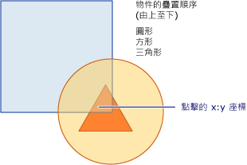

# 視覺分層中的點擊測試
本主題提供視覺分層所提供點擊測試功能的概觀。 點擊測試支援可讓您判斷幾何或點的值是否落在呈現的內容<xref:System.Windows.Media.Visual>，可讓您實作使用者介面行為，例如選取矩形來選取多個物件。  
  
 
  
   
## 點擊測試案例  
 <xref:System.Windows.UIElement>類別提供<xref:System.Windows.UIElement.InputHitTest%2A>方法，可讓您進行點擊測試使用指定的座標值的項目。 在許多情況下，<xref:System.Windows.UIElement.InputHitTest%2A>方法提供實作點擊測試的項目所需的功能。 不過，有幾個案例，您可能需要在視覺分層實作點擊測試。  
  
-   點擊測試非<xref:System.Windows.UIElement>物件： 如果您進行點擊測試非如此<xref:System.Windows.UIElement>物件，例如<xref:System.Windows.Media.DrawingVisual>或圖形物件。  
  
-   使用幾何進行點擊測試︰這適用於您需要使用幾何物件，而不是點的座標值進行點擊測試時。  
  
-   對多個物件進行點擊測試︰這適用於當您需要對多個物件進行點擊測試，例如重疊的物件。 您可以取得和幾何或點交集的所有視覺效果結果，不只有第一個結果。  
  
-   正在略過<xref:System.Windows.UIElement>點擊測試原則︰ 這適用於當您需要忽略<xref:System.Windows.UIElement>點擊測試原則，會考慮為項目是否已停用或隱藏像之類的因素。  
  
> [!NOTE]
>  如需示範在視覺分層進行點擊測試的完整程式碼範例，請參閱[使用 DrawingVisuals 進行點擊測試範例 (英文)](https://go.microsoft.com/fwlink/?LinkID=159994) 和[使用 Win32 交互操作進行點擊測試範例 (英文)](https://go.microsoft.com/fwlink/?LinkID=159995)。  
  
   
## 點擊測試支援  
 目的<xref:System.Windows.Media.VisualTreeHelper.HitTest%2A>中的方法<xref:System.Windows.Media.VisualTreeHelper>類別是要判斷幾何或點的座標值是否在指定的物件，例如控制項或圖形元素呈現內容中。 例如，您可以使用點擊測試來判斷物件的週框矩形內的滑鼠點擊是否落於圓形的幾何內。 您也可以選擇覆寫預設點擊測試實作，以執行您的自訂點擊測試計算。  
  
 下圖說明非矩形物件的區域和其週框之間的關聯性。  
  
   
有效點擊測試區域的圖表  
  
   
## 點擊測試和疊置順序  
 [!INCLUDE[TLA#tla_winclient](../../../../includes/tlasharptla-winclient-md.md)] 視覺分層支援對點或幾何底下的所有物件進行點擊測試，而不只有最上層物件。 以疊置順序傳回結果。 不過，您傳遞做為參數的視覺物件<xref:System.Windows.Media.VisualTreeHelper.HitTest%2A>方法會判斷哪一個部分會被叫用的視覺化樹狀結構的測試。 您可以對整個視覺化樹狀結構或其任何部分進行點擊測試。  
  
 在下圖中，圓形物件位於正方形和三角形物件上方。 如果您只想要進行點擊測試的疊置順序值是最上層的視覺物件，您可以設定要傳回的視覺點擊的測試列舉型別<xref:System.Windows.Media.HitTestResultBehavior.Stop>從<xref:System.Windows.Media.HitTestResultCallback>第一個項目之後停止點擊的測試周遊。  
  
   
視覺化樹狀之疊置順序的圖表  
  
 如果您想要列舉特定點或幾何底下的所有視覺物件，傳回<xref:System.Windows.Media.HitTestResultBehavior.Continue>從<xref:System.Windows.Media.HitTestResultCallback>。 這表示您可以對其他物件底下的視覺物件進行點擊測試，即使它們完全遭到遮蔽。 如需詳細資訊，請參閱「使用點擊測試結果回呼 」一節中的範例程式碼。  
  
> [!NOTE]
>  透明的視覺物件也可以進行點擊測試。  
  
   
## 使用預設點擊測試  
 您可以識別某個點是否視覺物件的幾何內使用<xref:System.Windows.Media.VisualTreeHelper.HitTest%2A>方法，以指定的視覺物件和點座標要測試的值。 視覺物件參數可在視覺化樹狀結構中識別進行點擊測試搜尋的起點。 如果視覺物件的幾何包含座標的視覺化樹狀結構中找到，它會設定為<xref:System.Windows.Media.HitTestResult.VisualHit%2A>屬性<xref:System.Windows.Media.HitTestResult>物件。 <xref:System.Windows.Media.HitTestResult>則會傳回從<xref:System.Windows.Media.VisualTreeHelper.HitTest%2A>方法。 如果您進行點擊測試的視覺化子樹狀結構中不包含點<xref:System.Windows.Media.VisualTreeHelper.HitTest%2A>傳回`null`。  
  
> [!NOTE]
>  預設點擊測試一定會傳回疊置順序中最上層的物件。 若要識別所有視覺物件，甚至是遭到部分或全部遮蔽的物件，可使用點擊測試結果回呼。  
  
 您將當做的點參數傳遞的座標值<xref:System.Windows.Media.VisualTreeHelper.HitTest%2A>方法必須為相對於您在進行點擊測試的視覺物件的座標空間。 例如，如果您在父項座標空間的 (100, 100) 定義巢狀視覺物件，然後對位於 (0, 0) 的子視覺物件進行點擊測試，其相當於父項座標空間的 (100, 100)。  
  
 下列程式碼示範如何設定滑鼠事件處理常式，如<xref:System.Windows.UIElement>用來擷取用於事件的物件進行點擊測試。  
  
 [!code-csharp[HitTestingOverview#100](../../../../samples/snippets/csharp/VS_Snippets_Wpf/HitTestingOverview/CSharp/Window1.xaml.cs#100)]
 [!code-vb[HitTestingOverview#100](../../../../samples/snippets/visualbasic/VS_Snippets_Wpf/HitTestingOverview/visualbasic/window1.xaml.vb#100)]  
  
### 視覺化樹狀結構如何影響點擊測試  
 視覺化樹狀結構中的起點可決定在物件的點擊測試列舉期間會傳回哪些物件。 如果您有多個想要進行點擊測試的物件，在視覺化樹狀結構中做為起點的視覺物件必須是所有相關物件的通用上階。 例如，如果您想要對下圖中的按鈕元素和繪圖視覺物件進行點擊測試，您必須將視覺樹狀結構中的起點設定為兩者的通用上階。 在此情況下，畫布元素是按鈕元素和繪製視覺物件兩者的通用上階。  
  
   
視覺化樹狀階層架構的圖表  
  
> [!NOTE]
>  <xref:System.Windows.UIElement.IsHitTestVisible%2A>屬性會取得或設定值，這個值會宣告是否<xref:System.Windows.UIElement>-衍生的物件可以傳回，作為點擊的測試結果從其呈現內容的某些部分。 這可讓您選擇性地更改視覺化樹狀結構，以判斷哪一個視覺物件要進行點擊測試。  
  
   
## 使用點擊測試結果回呼  
 視覺化樹狀結構中的幾何只要包含指定座標值，您就可以列舉所有視覺物件。 這可讓您識別所有視覺物件，甚至是遭到其他視覺物件部分或全部遮蔽的那些物件。 若要列舉視覺化樹狀結構的使用中的視覺物件<xref:System.Windows.Media.VisualTreeHelper.HitTest%2A>的點擊的測試回呼函式的方法。 當視覺物件中包含您指定的座標值時，系統便會呼叫點擊測試回呼函式。  
  
 在點擊測試結果列舉期間，您不應該執行任何修改視覺化樹狀結構的作業。 在周遊時新增或移除視覺化樹狀結構的物件，可能會導致無法預期的行為。 您可以安全地修改視覺化樹狀結構之後<xref:System.Windows.Media.VisualTreeHelper.HitTest%2A>方法會傳回。 您可能想要提供資料結構，例如<xref:System.Collections.ArrayList>，以儲存在點擊的測驗結果列舉期間的值。  
  
 [!code-csharp[HitTestingOverview#101](../../../../samples/snippets/csharp/VS_Snippets_Wpf/HitTestingOverview/CSharp/Window1.xaml.cs#101)]
 [!code-vb[HitTestingOverview#101](../../../../samples/snippets/visualbasic/VS_Snippets_Wpf/HitTestingOverview/visualbasic/window1.xaml.vb#101)]  
  
 點擊測試回呼方法定義您在視覺化樹狀結構中的特定視覺物件上，識別出點擊測試時執行的動作。 您執行此動作之後，傳回<xref:System.Windows.Media.HitTestResultBehavior>決定是否要繼續的任何其他視覺物件列舉的值。  
  
 [!code-csharp[HitTestingOverview#102](../../../../samples/snippets/csharp/VS_Snippets_Wpf/HitTestingOverview/CSharp/Window1.xaml.cs#102)]
 [!code-vb[HitTestingOverview#102](../../../../samples/snippets/visualbasic/VS_Snippets_Wpf/HitTestingOverview/visualbasic/window1.xaml.vb#102)]  
  
> [!NOTE]
>  點擊視覺物件列舉順序是依照疊置順序。 在最上層疊置順序層級的視覺物件是第一個列舉的物件。 任何其他視覺物件都會以遞減的疊置順序層級列舉。 此列舉類型順序對應至視覺效果的轉譯順序。  
  
 您可以停止列舉視覺物件點擊的測試回呼函式中隨時藉由傳回<xref:System.Windows.Media.HitTestResultBehavior.Stop>。  
  
 [!code-csharp[HitTestingOverview#103](../../../../samples/snippets/csharp/VS_Snippets_Wpf/HitTestingOverview/CSharp/Window1.xaml.cs#103)]
 [!code-vb[HitTestingOverview#103](../../../../samples/snippets/visualbasic/VS_Snippets_Wpf/HitTestingOverview/visualbasic/window1.xaml.vb#103)]  
  
   
## 使用點擊測試篩選回呼  
 您可以使用選用的點擊測試篩選來限制傳遞至點擊測試結果的物件。 這可讓您忽略點擊測試結果中處理時不感興趣的視覺化樹狀結構組件。 若要實作點擊的測試篩選，方法，您可以定義點擊的測試篩選回呼函式，並將它傳遞做為參數值，當您呼叫<xref:System.Windows.Media.VisualTreeHelper.HitTest%2A>方法。  
  
 [!code-csharp[HitTestingOverview#104](../../../../samples/snippets/csharp/VS_Snippets_Wpf/HitTestingOverview/CSharp/Window1.xaml.cs#104)]
 [!code-vb[HitTestingOverview#104](../../../../samples/snippets/visualbasic/VS_Snippets_Wpf/HitTestingOverview/visualbasic/window1.xaml.vb#104)]  
  
 如果您不想提供選用的點擊的測試篩選回呼函式，傳遞`null`做為其參數的值<xref:System.Windows.Media.VisualTreeHelper.HitTest%2A>方法。  
  
 [!code-csharp[HitTestingOverview#105](../../../../samples/snippets/csharp/VS_Snippets_Wpf/HitTestingOverview/CSharp/Window1.xaml.cs#105)]
 [!code-vb[HitTestingOverview#105](../../../../samples/snippets/visualbasic/VS_Snippets_Wpf/HitTestingOverview/visualbasic/window1.xaml.vb#105)]  
  
   
剪除視覺化樹狀結構  
  
 點擊測試篩選回呼函式可讓您列舉呈現內容中包含指定座標的所有視覺效果。 不過，您可能想要忽略點擊測試結果回呼函式中處理時不感興趣的視覺化樹狀結構特定分支。 點擊測試篩選回呼函式的傳回值會決定列舉視覺物件時應採取的動作類型。 例如，如果您傳回值， <xref:System.Windows.Media.HitTestFilterBehavior.ContinueSkipSelfAndChildren>，您可以從點擊的測試結果列舉型別移除目前的視覺物件和其子系。 這表示點擊測試結果回呼函式不會在其列舉中看到這些物件。 剪除物件的視覺化樹狀結構會減少在點擊測試結果列舉通過期間的處理量。 在下列程式碼範例中，篩選會略過標籤和其下階並點擊測試所有其他項目。  
  
 [!code-csharp[HitTestingOverview#106](../../../../samples/snippets/csharp/VS_Snippets_Wpf/HitTestingOverview/CSharp/Window1.xaml.cs#106)]
 [!code-vb[HitTestingOverview#106](../../../../samples/snippets/visualbasic/VS_Snippets_Wpf/HitTestingOverview/visualbasic/window1.xaml.vb#106)]  
  
> [!NOTE]
>  有時候會呼叫點擊測試篩選回呼，以免未呼叫點擊測試結果回呼。  
  
   
## 覆寫預設點擊測試  
 您可以覆寫視覺物件的預設點擊測試支援，藉由覆寫<xref:System.Windows.Media.Visual.HitTestCore%2A>方法。 這表示，當您叫用<xref:System.Windows.Media.VisualTreeHelper.HitTest%2A>方法中的覆寫實的作<xref:System.Windows.Media.Visual.HitTestCore%2A>呼叫。 即使座標落在視覺物件的呈現內容外部，還是會在點擊測試落在視覺物件的週框內時呼叫覆寫方法。  
  
 [!code-csharp[HitTestingOverview#107](../../../../samples/snippets/csharp/VS_Snippets_Wpf/HitTestingOverview/CSharp/Window1.xaml.cs#107)]
 [!code-vb[HitTestingOverview#107](../../../../samples/snippets/visualbasic/VS_Snippets_Wpf/HitTestingOverview/visualbasic/window1.xaml.vb#107)]  
  
 有時候您可能想要對週框和視覺物件的呈現內容進行點擊測試。 藉由使用`PointHitTestParameters`參數值中覆寫<xref:System.Windows.Media.Visual.HitTestCore%2A>方法做為基底方法的參數<xref:System.Windows.Media.Visual.HitTestCore%2A>，您可以根據在點擊視覺物件的週框矩形執行動作，然後再執行第二個點擊的測試轉譯在視覺物件的內容。  
  
 [!code-csharp[HitTestingOverview#108](../../../../samples/snippets/csharp/VS_Snippets_Wpf/HitTestingOverview/CSharp/Window1.xaml.cs#108)]
 [!code-vb[HitTestingOverview#108](../../../../samples/snippets/visualbasic/VS_Snippets_Wpf/HitTestingOverview/visualbasic/window1.xaml.vb#108)]  
  
## 另請參閱  
 <xref:System.Windows.Media.VisualTreeHelper.HitTest%2A>  
 <xref:System.Windows.Media.HitTestResult>  
 <xref:System.Windows.Media.HitTestResultCallback>  
 <xref:System.Windows.Media.HitTestFilterCallback>  
 <xref:System.Windows.UIElement.IsHitTestVisible%2A>  
 [使用 DrawingVisuals 範例進行點擊測試](https://go.microsoft.com/fwlink/?LinkID=159994)  
 [點擊測試使用 Win32 交互操作範例](https://go.microsoft.com/fwlink/?LinkID=159995)  
 [對 Visual 中的幾何進行點擊測試](../../../../docs/framework/wpf/graphics-multimedia/how-to-hit-test-geometry-in-a-visual.md)  
 [使用 Win32 裝載容器進行點擊測試](../../../../docs/framework/wpf/graphics-multimedia/how-to-hit-test-using-a-win32-host-container.md)
