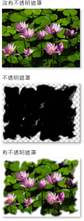

# 不透明度遮罩概觀
不透明度遮罩可讓您將元素或視覺物件的一部分設定成透明或半透明。 要創建不一元蒙版，請將<xref:System.Windows.Media.Brush>應用到<xref:System.Windows.UIElement.OpacityMask%2A>元素或<xref:System.Windows.Media.Visual>的屬性。  筆刷會對應到元素或視覺物件，且每個筆刷像素的不透明度值會用來決定元素或視覺物件每個對應像素最終的不透明度。  
  

## 必要條件  
 此概述假定您熟悉<xref:System.Windows.Media.Brush>物件。 如需筆刷的概觀，請參閱[使用純色和漸層繪製的概觀](painting-with-solid-colors-and-gradients-overview.md)。 有關 和<xref:System.Windows.Media.ImageBrush><xref:System.Windows.Media.DrawingBrush>的資訊，請參閱[使用圖像、繪圖和視覺物件進行繪畫](painting-with-images-drawings-and-visuals.md)。  
  

## 使用不透明度遮罩建立視覺效果  
 不透明度遮罩的運作方式是將其內容對應到元素或視覺物件。 然後筆刷每個像素的 Alpha 色板會用來決定元素或視覺物件所對應像素的最終不透明度 (會忽略筆刷的實際色彩)。 如果筆刷的某一部分是透明的，則元素或視覺物件相對應的部分會變成透明。 如果筆刷的某一部分是不透明的，則元素或視覺物件相對應的部分不會改變。 由不透明度遮罩所指定的不透明度會和元素或視覺物件中現有的任何不透明度設定結合。 例如，如果元素是百分之 25 不透明，並套用從完全不透明轉換成完全透明的不透明度遮罩，結果元素會從百分之 25 不透明度轉換成完全透明。  
  
> [!NOTE]
> 儘管此概述中的示例演示了在圖像元素上使用不一元蒙版，但不一視蒙版可以應用於任何元素或<xref:System.Windows.Media.Visual>，包括面板和控制項。  
  
 不透明度遮罩可以用來建立有趣的視覺效果，例如，建立從檢視淡出的影像或按鈕、為元素添加紋理，或結合漸層來產生玻璃般的表面。 下圖示範不透明度遮罩的使用方式。 會使用棋盤背景來表示遮罩的透明部分。  
  
   
不透明度遮罩範例  
  

## 建立不透明度遮罩  
 要創建不一元性蒙版，請創建<xref:System.Windows.Media.Brush>並應用它到<xref:System.Windows.UIElement.OpacityMask%2A>元素或視覺物件的屬性。 您可以將任何類型的蒙<xref:System.Windows.Media.Brush>版用作不一視版。  
  
- <xref:System.Windows.Media.LinearGradientBrush>：<xref:System.Windows.Media.RadialGradientBrush>用於使元素或視覺淡入淡出視圖。  
  
     下圖顯示了<xref:System.Windows.Media.LinearGradientBrush>用作不一視情況的蒙版。  
  
       
LinearGradientBrush 不透明度遮罩範例  
  
- <xref:System.Windows.Media.ImageBrush>：用於創建紋理和軟或撕裂邊緣效果。  
  
     下圖顯示了<xref:System.Windows.Media.ImageBrush>用作不一視情況的蒙版。  
  
       
LinearGradientBrush 不透明度遮罩範例  
  
- <xref:System.Windows.Media.DrawingBrush>： 用於從形狀、圖像和漸變圖案創建複雜的不一度蒙版。  
  
     下圖顯示了<xref:System.Windows.Media.DrawingBrush>用作不一視情況的蒙版。  
  
       
DrawingBrush 不透明度遮罩範例  
  
 漸層筆刷 （<xref:System.Windows.Media.LinearGradientBrush> <xref:System.Windows.Media.RadialGradientBrush>和 ） 特別適合用作不平的蒙版。 因為填充<xref:System.Windows.Media.SolidColorBrush>一個顏色均勻的區域，它們會使不良的不相皮性蒙版;使用<xref:System.Windows.Media.SolidColorBrush>等效于設置元素或視覺物件的屬性<xref:System.Windows.UIElement.OpacityMask%2A>。  
  

## 使用漸層作為不透明度遮罩  
 若要建立漸層填滿，您必須指定兩個或多個漸層停駐點。 每個漸層停駐點都包含色彩和位置的描述 (如需建立及使用漸層的詳細資訊，請參閱[使用純色和漸層繪製的概觀](painting-with-solid-colors-and-gradients-overview.md))。 使用漸層作為不透明度遮罩的程序也相同，不同之處在於，不透明度遮罩漸層是以 Alpha 色板進行混色，而不是以色彩。 所以漸層內容的實際色彩並不重要，重要的是每個色彩的 Alpha 色板 (或稱不透明度)。 以下是一個範例。  
  
 [!code-xaml[OpacityMasksSnippet#LinearGradientOpacityMaskonImage](~/samples/snippets/csharp/VS_Snippets_Wpf/OpacityMasksSnippet/CS/GradientBrushExample.xaml#lineargradientopacitymaskonimage)]  
  

## 指定不透明度遮罩的漸層停駐點  
 在前面的示例中，系統定義的顏色<xref:System.Windows.Media.Colors.Black%2A>用作漸變的起始顏色。 由於<xref:System.Windows.Media.Colors>類中的所有顏色（除 ）<xref:System.Windows.Media.Colors.Transparent%2A>都是完全不透明的，因此它們可用於簡單地為漸變不全蒙版定義起始顏色。  
  
 為了在定義不全性蒙版時對 Alpha 值進行其他控制，可以使用標記中的 ARGB 十六進位標記法或使用<xref:System.Windows.Media.Color.FromScRgb%2A?displayProperty=nameWithType>方法指定顏色的 Alpha 通道。  
  

### 在 "XAML" 中指定色彩不透明度  
 在[!INCLUDE[TLA#tla_xaml](../../../../includes/tlasharptla-xaml-md.md)]中，使用 ARGB 十六進位標記法來指定單個顏色的不恰當性。 ARGB 十六進位標記法使用以下語法：  
  
 `#` **aa** *rrggbb*  
  
 上一行中的 *aa* 代表用來指定色彩不透明度的兩位數十六進位值。 *rr*、*gg* 和 *bb* 分別代表用來指定色彩中紅色、綠色及藍色量的兩位數十六進位值。 每個十六進位位數的值可以是 0-9 或 A-F。 0 是最小的值，F 是最大的值。 Alpha 值為 00 時會指定完全透明的色彩，而 Alpha 值為 FF 時則會建立完全不透明的色彩。  在下面的示例中，十六進位 ARGB 標記法用於指定兩種顏色。 第一個是完全不透明，而第二個是完全透明。  
  
 [!code-xaml[OpacityMasksSnippet#AARRGGBBValueonOpacityMask](~/samples/snippets/csharp/VS_Snippets_Wpf/OpacityMasksSnippet/CS/GradientBrushExample.xaml#aarrggbbvalueonopacitymask)]  
  

## 使用影像作為不透明度遮罩  
 影像也可用來作為不透明度遮罩。 下圖說明一個範例。 會使用棋盤背景來表示遮罩的透明部分。  
  
   
不透明度遮罩範例  
  
 要將圖像用作不一視情況蒙版，請使用<xref:System.Windows.Media.ImageBrush> 創建要用作不透明度蒙版的圖像時，以支援多個透明度級別的格式（如可擕式網狀圖形 （PNG））保存圖像。 下列範例顯示用來建立上述圖例的程式碼。  
  
 [!code-xaml[OpacityMasksSnippet#UIElementOpacityMask](~/samples/snippets/csharp/VS_Snippets_Wpf/OpacityMasksSnippet/CS/ImageBrushExample.xaml#uielementopacitymask)]  
  

### 使用並排影像作為不透明度遮罩  
 在下面的示例中，同一圖像與另一個<xref:System.Windows.Media.ImageBrush>一起使用，但畫筆的平鋪功能用於生成圖像 50 圖元正方形的切片。  
  
 [!code-xaml[OpacityMasksSnippet#TiledImageasOpacityMask](~/samples/snippets/csharp/VS_Snippets_Wpf/OpacityMasksSnippet/CS/ImageBrushExample.xaml#tiledimageasopacitymask)]  
  

## 從繪圖建立不透明度遮罩  
 繪圖可以用於建立不透明度遮罩。 繪圖本身包含的圖形也能以漸層、純色、影像或甚至其他繪圖來填滿。 下列影像為使用繪圖作為不透明度遮罩的範例。 會使用棋盤背景來表示遮罩的透明部分。  
  
   
DrawingBrush 不透明度遮罩範例  
  
 要將圖形用作不一視版，請使用<xref:System.Windows.Media.DrawingBrush> 下列範例顯示用來建立上述圖例的程式碼：  
  
 [!code-xaml[OpacityMasksSnippet#OpacityMaskfromDrawing](~/samples/snippets/csharp/VS_Snippets_Wpf/OpacityMasksSnippet/CS/DrawingBrushExample.xaml#opacitymaskfromdrawing)]  
  

### 使用並排繪圖作為不透明度遮罩  
 與<xref:System.Windows.Media.ImageBrush>一樣<xref:System.Windows.Media.DrawingBrush>，可以製作 來平鋪其圖形。 在下列範例中，會使用繪圖筆刷來建立並排不透明度遮罩。  
  
 [!code-xaml[OpacityMasksSnippet#TiledDrawingasOpacityMask](~/samples/snippets/csharp/VS_Snippets_Wpf/OpacityMasksSnippet/CS/DrawingBrushExample.xaml#tileddrawingasopacitymask)]  
  
## 另請參閱

- [使用影像、繪圖和視覺效果繪製](painting-with-images-drawings-and-visuals.md)
- [使用純色和漸層繪製的概觀](painting-with-solid-colors-and-gradients-overview.md)
