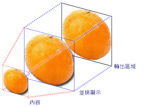

# TileBrush 概觀
<xref:System.Windows.Media.TileBrush> 物件可讓您充分掌控使用影像，繪製區域的足夠<xref:System.Windows.Media.Drawing>，或<xref:System.Windows.Media.Visual>。 本主題描述如何使用<xref:System.Windows.Media.TileBrush>功能以獲得更充分掌控如何<xref:System.Windows.Media.ImageBrush>， <xref:System.Windows.Media.DrawingBrush>，或<xref:System.Windows.Media.VisualBrush>繪製區域。  
  
  
   
## 必要條件  
 若要了解本主題，最好先了解如何使用的基本功能<xref:System.Windows.Media.ImageBrush>， <xref:System.Windows.Media.DrawingBrush>，或<xref:System.Windows.Media.VisualBrush>類別。 如需這些類型的簡介，請參閱[使用影像、 繪圖和視覺效果繪製](../../../../docs/framework/wpf/graphics-multimedia/painting-with-images-drawings-and-visuals.md)。  
  
   
## 以並排顯示繪製區域  
 <xref:System.Windows.Media.ImageBrush><xref:System.Windows.Media.DrawingBrush>，會<xref:System.Windows.Media.VisualBrush>種<xref:System.Windows.Media.TileBrush>物件。 拼貼筆刷讓您對使用影像、繪圖或視覺效果繪製區域的方式擁有更多的控制。 例如，您可以用構成圖樣的一系列影像並排顯示來繪製區域，而不是只以單一自動縮放的影像來繪製區域。  
  
 使用拼貼筆刷繪製區域會牽涉到三個元件：內容、基底並排顯示及輸出區域。  
  
   
具有單一並排顯示之 TileBrush 的元件  
  
   
TileMode 為 Tile 之 TileBrush 的元件  
  
 輸出區域就是要繪製的區域，例如<xref:System.Windows.Shapes.Shape.Fill%2A>的<xref:System.Windows.Shapes.Ellipse>或<xref:System.Windows.Controls.Control.Background%2A>的<xref:System.Windows.Controls.Button>。 下一節中描述的其他兩個元件<xref:System.Windows.Media.TileBrush>。  
  
   
## 筆刷內容  
 有三種不同類型的<xref:System.Windows.Media.TileBrush>和每個繪製不同類型的內容。  
  
-   如果筆刷<xref:System.Windows.Media.ImageBrush>，此內容是映像<xref:System.Windows.Media.ImageBrush.ImageSource%2A>屬性指定的內容<xref:System.Windows.Media.ImageBrush>。  
  
-   如果筆刷是<xref:System.Windows.Media.DrawingBrush>，此內容為繪圖。 <xref:System.Windows.Media.DrawingBrush.Drawing%2A>屬性指定的內容<xref:System.Windows.Media.DrawingBrush>。  
  
-   如果筆刷是<xref:System.Windows.Media.VisualBrush>，此內容為視覺物件。 <xref:System.Windows.Media.VisualBrush.Visual%2A>屬性指定的內容<xref:System.Windows.Media.VisualBrush>。  
  
 您可以指定的位置和維度<xref:System.Windows.Media.TileBrush>使用內容<xref:System.Windows.Media.TileBrush.Viewbox%2A>屬性，雖然它會保留<xref:System.Windows.Media.TileBrush.Viewbox%2A>設為其預設值。 根據預設，<xref:System.Windows.Media.TileBrush.Viewbox%2A>設定為完整包含筆刷的內容。 如需設定的詳細資訊<xref:System.Windows.Controls.Viewbox>，請參閱<xref:System.Windows.Controls.Viewbox>屬性頁。  
  
   
## 基底並排顯示  
 A<xref:System.Windows.Media.TileBrush>其內容投影基底的並排顯示。 <xref:System.Windows.Media.TileBrush.Stretch%2A>屬性會控制如何<xref:System.Windows.Media.TileBrush>內容會縮放以填滿基底的並排顯示。 <xref:System.Windows.Media.TileBrush.Stretch%2A>屬性可以接受下列值所定義<xref:System.Windows.Media.Stretch>列舉型別：  
  
-   <xref:System.Windows.Media.Stretch.None>：筆刷的內容不會縮放以填滿並排顯示。  
  
-   <xref:System.Windows.Media.Stretch.Fill>：筆刷的內容會縮放以符合並排顯示。 因為內容的高度和寬度會分開縮放，所以可能不會保留內容的原始外觀比例。 也就是說，筆刷的內容可能會變形以完全填滿輸出並排顯示。  
  
-   <xref:System.Windows.Media.Stretch.Uniform>：筆刷的內容會縮放，以完全符合並排顯示。 這會維持內容的外觀比例。  
  
-   <xref:System.Windows.Media.Stretch.UniformToFill>：筆刷的內容會縮放，讓它完全填滿輸出區域，同時維持原始外觀比例的內容。  
  
 下圖說明不同<xref:System.Windows.Media.TileBrush.Stretch%2A>設定。  
  
   
  
 在下列範例中，內容<xref:System.Windows.Media.ImageBrush>設定，使它不會自動縮放以填滿輸出區域。  
  
 [!code-xaml[BrushOverviewExamples_snip#GraphicsMMNoStretchExample](../../../../samples/snippets/xaml/VS_Snippets_Wpf/BrushOverviewExamples_snip/XAML/StretchExample.xaml#graphicsmmnostretchexample)]  
  
 [!code-csharp[BrushOverviewExamples_procedural_snip#GraphicsMMNoStretchExample](../../../../samples/snippets/csharp/VS_Snippets_Wpf/BrushOverviewExamples_procedural_snip/CSharp/StretchExample.cs#graphicsmmnostretchexample)]
 [!code-vb[BrushOverviewExamples_procedural_snip#GraphicsMMNoStretchExample](../../../../samples/snippets/visualbasic/VS_Snippets_Wpf/BrushOverviewExamples_procedural_snip/visualbasic/stretchexample.vb#graphicsmmnostretchexample)]  
  
 根據預設，<xref:System.Windows.Media.TileBrush>會產生單一並排顯示 （基底的並排顯示），並會自動縮放該並排顯示以完全填滿輸出區域。 您可以藉由設定變更的大小和位置的基底的並排<xref:System.Windows.Media.TileBrush.Viewport%2A>和<xref:System.Windows.Media.TileBrush.ViewportUnits%2A>屬性。  
  
   
### 基底並排顯示大小  
 <xref:System.Windows.Media.TileBrush.Viewport%2A>屬性會決定的大小和位置的基底的並排顯示，而<xref:System.Windows.Media.TileBrush.ViewportUnits%2A>屬性會決定是否<xref:System.Windows.Media.TileBrush.Viewport%2A>指定使用絕對或相對座標。 如果是相對座標，則它們會相對於輸出區域的大小。 (0,0) 這個點表示輸出區域的左上角，而 (1,1) 則表示輸出區域的右下角。 若要指定<xref:System.Windows.Media.TileBrush.Viewport%2A>屬性使用絕對座標，請將<xref:System.Windows.Media.TileBrush.ViewportUnits%2A>屬性設<xref:System.Windows.Media.BrushMappingMode.Absolute>。  
  
 下圖顯示在輸出之間的差異<xref:System.Windows.Media.TileBrush>使用相對與絕對<xref:System.Windows.Media.TileBrush.ViewportUnits%2A>。 請注意，每個圖例都會顯示並排顯示圖樣，下一節會說明如何指定並排顯示圖樣。  
  
   
  
 在下列範例中，會使用影像建立 50% 寬度和高度的並排顯示。 基底並排顯示位於輸出區域的 (0,0)。  
  
 [!code-xaml[BrushOverviewExamples_snip#GraphicsMMRelativeViewportUnitsExample1](../../../../samples/snippets/xaml/VS_Snippets_Wpf/BrushOverviewExamples_snip/XAML/TileSizeExample.xaml#graphicsmmrelativeviewportunitsexample1)]  
  
 [!code-csharp[BrushOverviewExamples_procedural_snip#GraphicsMMRelativeViewportUnitsExample1](../../../../samples/snippets/csharp/VS_Snippets_Wpf/BrushOverviewExamples_procedural_snip/CSharp/TileSizeExample.cs#graphicsmmrelativeviewportunitsexample1)]
 [!code-vb[BrushOverviewExamples_procedural_snip#GraphicsMMRelativeViewportUnitsExample1](../../../../samples/snippets/visualbasic/VS_Snippets_Wpf/BrushOverviewExamples_procedural_snip/visualbasic/tilesizeexample.vb#graphicsmmrelativeviewportunitsexample1)]  
  
 下一個範例中設定的圖格<xref:System.Windows.Media.ImageBrush>25 乘以 25 個裝置獨立像素。 因為<xref:System.Windows.Media.TileBrush.ViewportUnits%2A>是絕對的<xref:System.Windows.Media.ImageBrush>圖格都是 25 乘以 25 個像素，不論要繪製之區域的大小。  
  
 [!code-xaml[BrushOverviewExamples_snip#GraphicsMMAbsoluteViewportUnitsExample1](../../../../samples/snippets/xaml/VS_Snippets_Wpf/BrushOverviewExamples_snip/XAML/TileSizeExample.xaml#graphicsmmabsoluteviewportunitsexample1)]  
  
 [!code-csharp[BrushOverviewExamples_procedural_snip#GraphicsMMAbsoluteViewportUnitsExample1](../../../../samples/snippets/csharp/VS_Snippets_Wpf/BrushOverviewExamples_procedural_snip/CSharp/TileSizeExample.cs#graphicsmmabsoluteviewportunitsexample1)]
 [!code-vb[BrushOverviewExamples_procedural_snip#GraphicsMMAbsoluteViewportUnitsExample1](../../../../samples/snippets/visualbasic/VS_Snippets_Wpf/BrushOverviewExamples_procedural_snip/visualbasic/tilesizeexample.vb#graphicsmmabsoluteviewportunitsexample1)]  
  
   
### 並排顯示行為  
 A<xref:System.Windows.Media.TileBrush>其基底的並排顯示不完全填滿輸出區域和並排顯示模式以外時，會產生並排顯示的圖樣<xref:System.Windows.Media.TileMode.None>指定。 拼貼筆刷的並排顯示不完全填滿輸出區域中，當其<xref:System.Windows.Media.TileBrush.TileMode%2A>屬性指定是否應該重複來填滿輸出區域的基底的並排顯示而且若是如此，基底的並排顯示應重複。 <xref:System.Windows.Media.TileBrush.TileMode%2A>屬性可以接受下列值所定義<xref:System.Windows.Media.TileMode>列舉型別：  
  
-   <xref:System.Windows.Media.TileMode.None>：只有基底的並排顯示繪製。  
  
-   <xref:System.Windows.Media.TileMode.Tile>：繪製基底的並排顯示，並重複基底的並排顯示，因此一個圖格的右邊緣相鄰的左邊緣的 [下一步]，並同樣地上下填滿剩餘的區域。  
  
-   <xref:System.Windows.Media.TileMode.FlipX>：相同<xref:System.Windows.Media.TileMode.Tile>，但是替代的資料行的圖格會以水平翻轉。  
  
-   <xref:System.Windows.Media.TileMode.FlipY>：相同<xref:System.Windows.Media.TileMode.Tile>，但會以垂直方式翻轉磚的替代資料列。  
  
-   <xref:System.Windows.Media.TileMode.FlipXY>：結合 <xref:System.Windows.Media.TileMode.FlipX> 和 <xref:System.Windows.Media.TileMode.FlipY>。  
  
 下列影像說明不同的並排顯示模式。  
  
   
  
 在下列範例中，會使用影像繪製 100 像素寬及 100 像素高的矩形。 藉由設定筆刷的<xref:System.Windows.Media.TileBrush.Viewport%2A>byla nastavena 0,0,0.25,0.25，到筆刷的基底的並排顯示設為 1/4 的輸出區域。 筆刷<xref:System.Windows.Media.TileBrush.TileMode%2A>設為<xref:System.Windows.Media.TileMode.FlipXY>。 所以會以並排顯示列填滿矩形。  
  
 [!code-xaml[BrushOverviewExamples_snip#GraphicsMMFlipXYExample](../../../../samples/snippets/xaml/VS_Snippets_Wpf/BrushOverviewExamples_snip/XAML/TilingExample.xaml#graphicsmmflipxyexample)]  
  
 [!code-csharp[BrushOverviewExamples_procedural_snip#GraphicsMMFlipXYExample](../../../../samples/snippets/csharp/VS_Snippets_Wpf/BrushOverviewExamples_procedural_snip/CSharp/TilingExample.cs#graphicsmmflipxyexample)]
 [!code-vb[BrushOverviewExamples_procedural_snip#GraphicsMMFlipXYExample](../../../../samples/snippets/visualbasic/VS_Snippets_Wpf/BrushOverviewExamples_procedural_snip/visualbasic/tilingexample.vb#graphicsmmflipxyexample)]  
  
## 另請參閱
- <xref:System.Windows.Media.ImageBrush>
- <xref:System.Windows.Media.DrawingBrush>
- <xref:System.Windows.Media.VisualBrush>
- <xref:System.Windows.Media.TileBrush>
- [使用影像、繪圖和視覺效果繪製](../../../../docs/framework/wpf/graphics-multimedia/painting-with-images-drawings-and-visuals.md)
- [HOW-TO 主題](../../../../docs/framework/wpf/graphics-multimedia/brushes-how-to-topics.md)
- [Freezable 物件概觀](../../../../docs/framework/wpf/advanced/freezable-objects-overview.md)
- [ImageBrush 範例](https://go.microsoft.com/fwlink/?LinkID=160005)
- [VisualBrush 範例](https://go.microsoft.com/fwlink/?LinkID=160049)
