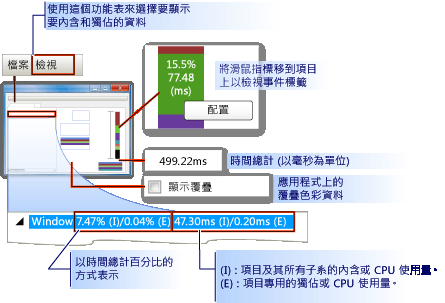

# WPF 圖形轉譯概觀
本主題將概要說明 [!INCLUDE[TLA2#tla_winclient](../../../../includes/tla2sharptla-winclient-md.md)] 視覺圖層。  並著重於 [!INCLUDE[TLA2#tla_winclient](../../../../includes/tla2sharptla-winclient-md.md)] 模型中轉譯支援的 <xref:System.Windows.Media.Visual> 類別角色。  
  
 [!INCLUDE[autoOutline](../Token/autoOutline_md.md)]  
  
   
## 視覺物件的角色  
 <xref:System.Windows.Media.Visual> 類別為基本抽象類別，可以從中衍生每一個 <xref:System.Windows.FrameworkElement> 物件。  也可以做為在 [!INCLUDE[TLA2#tla_winclient](../../../../includes/tla2sharptla-winclient-md.md)] 中寫入新控制項的進入點，而在很多方面可以視為 Win32 應用程式模型中的視窗控制代碼 \(Window Handle\)：HWND。  
  
 <xref:System.Windows.Media.Visual> 物件是核心 [!INCLUDE[TLA2#tla_winclient](../../../../includes/tla2sharptla-winclient-md.md)] 物件，其主要角色在於提供轉譯支援。  使用者介面控制項 \(例如 <xref:System.Windows.Controls.Button> 和 <xref:System.Windows.Controls.TextBox>\) 衍生自 <xref:System.Windows.Media.Visual> 類別，並將它用於保存其轉譯資料。  <xref:System.Windows.Media.Visual> 物件提供下列支援：  
  
-   輸出顯示：轉譯視覺項目的持續性、序列化繪圖內容。  
  
-   轉換：執行視覺項目的轉換。  
  
-   裁剪：提供視覺項目的裁剪區域支援。  
  
-   點擊測試：判斷座標或幾何是否包含在視覺項目的界限內。  
  
-   週框方塊計算：判斷視覺項目的週框。  
  
 但是，<xref:System.Windows.Media.Visual> 物件不包含非轉譯功能的支援，例如：  
  
-   事件處理  
  
-   Layout  
  
-   樣式  
  
-   資料繫結  
  
-   全球化  
  
 <xref:System.Windows.Media.Visual> 已公開為公用抽象類別，必須從中衍生子類別。  下圖顯示在 [!INCLUDE[TLA2#tla_winclient](../../../../includes/tla2sharptla-winclient-md.md)] 中公開之視覺物件的階層。  
  
   
Visual 類別階層  
  
### DrawingVisual 類別  
 <xref:System.Windows.Media.DrawingVisual> 為輕量型繪圖類別，可用於轉譯圖案、影像或文字。  此類別因為不支援配置或事件處理，所以視為輕量型類別，而配置或事件處理卻可改善其執行階段效能。  基於這個理由，繪圖適合用於背景或美工圖案。  <xref:System.Windows.Media.DrawingVisual> 可用於建立自訂視覺物件。  如需詳細資訊，請參閱[使用 DrawingVisual 物件](../../../../docs/framework/wpf/graphics-multimedia/using-drawingvisual-objects.md)。  
  
### Viewport3DVisual 類別  
 <xref:System.Windows.Media.Media3D.Viewport3DVisual> 可做為 2D <xref:System.Windows.Media.Visual> 和 <xref:System.Windows.Media.Media3D.Visual3D> 物件之間的橋樑。  <xref:System.Windows.Media.Media3D.Visual3D> 類別是所有 3D 視覺項目的基底類別。  <xref:System.Windows.Media.Media3D.Viewport3DVisual> 會要求您定義 <xref:System.Windows.Media.Media3D.Viewport3DVisual.Camera%2A> 值和 <xref:System.Windows.Media.Media3D.Viewport3DVisual.Viewport%2A> 值。  Camera 可讓您檢視場景。  Viewport 會建立檢視區 \(Viewport\)，投影會在此對應於 2D 表面。  如需 [!INCLUDE[TLA2#tla_winclient](../../../../includes/tla2sharptla-winclient-md.md)] 中 3D 的詳細資訊，請參閱[立體圖形概觀](../../../../docs/framework/wpf/graphics-multimedia/3-d-graphics-overview.md)。  
  
### ContainerVisual 類別  
 <xref:System.Windows.Media.ContainerVisual> 類別可做為 <xref:System.Windows.Media.Visual> 物件集合的容器。  <xref:System.Windows.Media.DrawingVisual> 類別是從 <xref:System.Windows.Media.ContainerVisual> 類別衍生而來，可以包含視覺物件的集合。  
  
### 視覺物件中的繪圖內容  
 <xref:System.Windows.Media.Visual> 物件會將其轉譯資料儲存為「向量圖形指示清單」。  指示清單中的每個項目都代表一組序列化格式的低階圖形資料和相關資源。  有四種不同類型的轉譯資料可以包含繪圖內容。  
  
|繪圖內容類型|描述|  
|------------|--------|  
|向量圖形|表示向量圖形資料，以及任何相關聯的 <xref:System.Windows.Media.Brush> 和 <xref:System.Windows.Media.Pen> 資訊。|  
|Image|表示 <xref:System.Windows.Rect> 所定義之區域內的影像。|  
|圖像|表示可轉譯 <xref:System.Windows.Media.GlyphRun> 的繪圖，其為指定之字型資源中的一系列圖像 \(Glyph\)。  這就是文字的表現方式。|  
|視訊|表示可轉譯視訊的繪圖。|  
  
 <xref:System.Windows.Media.DrawingContext> 可讓您用視覺內容填入 \(Populate\) <xref:System.Windows.Media.Visual>。  當您使用 <xref:System.Windows.Media.DrawingContext> 物件的 draw 命令時，實際上會儲存一組轉譯資料以在稍後供圖形系統使用，而不是即時繪製到螢幕上。  
  
 當您建立 [!INCLUDE[TLA2#tla_winclient](../../../../includes/tla2sharptla-winclient-md.md)] 控制項 \(例如 <xref:System.Windows.Controls.Button>\) 時，此控制項會隱含產生繪圖本身的轉譯資料。  例如，設定 <xref:System.Windows.Controls.Button> 的 <xref:System.Windows.Controls.ContentControl.Content%2A> 屬性，會導致此控制項儲存圖像的轉譯表示。  
  
 <xref:System.Windows.Media.Visual> 會將其內容描述成 <xref:System.Windows.Media.DrawingGroup> 內含的一個或多個 <xref:System.Windows.Media.Drawing> 物件。  <xref:System.Windows.Media.DrawingGroup> 也會描述套用到其內容的不透明遮罩、轉換、點陣圖效果及其他作業。  轉譯內容時，會按照下列順序套用 <xref:System.Windows.Media.DrawingGroup> 作業：<xref:System.Windows.Media.DrawingGroup.OpacityMask%2A>、<xref:System.Windows.Media.DrawingGroup.Opacity%2A>、<xref:System.Windows.Media.DrawingGroup.BitmapEffect%2A>、<xref:System.Windows.Media.DrawingGroup.ClipGeometry%2A>、<xref:System.Windows.Media.DrawingGroup.GuidelineSet%2A>，然後是 <xref:System.Windows.Media.DrawingGroup.Transform%2A>。  
  
 下圖顯示在轉譯序列中套用 <xref:System.Windows.Media.DrawingGroup> 作業的順序。  
  
   
DrawingGroup 作業的順序  
  
 如需詳細資訊，請參閱[繪圖物件概觀](../../../../docs/framework/wpf/graphics-multimedia/drawing-objects-overview.md)。  
  
#### 視覺分層的繪圖內容  
 您不能直接具現化 \(Instantiate\) <xref:System.Windows.Media.DrawingContext>，但是，您可以從某些方法取得繪圖內容，例如 <xref:System.Windows.Media.DrawingGroup.Open%2A?displayProperty=fullName> 和 <xref:System.Windows.Media.DrawingVisual.RenderOpen%2A?displayProperty=fullName>。  下列範例會從 <xref:System.Windows.Media.DrawingVisual> 擷取 <xref:System.Windows.Media.DrawingContext>，然後使用擷取的項目來繪製矩形。  
  
 [!code-csharp[drawingvisualsample#101](../../../../samples/snippets/csharp/VS_Snippets_Wpf/DrawingVisualSample/CSharp/Window1.xaml.cs#101)]
 [!code-vb[drawingvisualsample#101](../../../../samples/snippets/visualbasic/VS_Snippets_Wpf/DrawingVisualSample/visualbasic/window1.xaml.vb#101)]  
  
#### 列舉視覺分層的繪圖內容  
 除了其他用途以外，<xref:System.Windows.Media.Drawing> 物件也會提供物件模式，以便列舉 <xref:System.Windows.Media.Visual> 的內容。  
  
> [!NOTE]
>  當您列舉視覺內容時，您會擷取 <xref:System.Windows.Media.Drawing> 物件，而不是擷取轉譯資料的基礎表示做為向量圖形指示清單。  
  
 下列範例使用 <xref:System.Windows.Media.VisualTreeHelper.GetDrawing%2A> 方法，擷取 <xref:System.Windows.Media.Visual> 的 <xref:System.Windows.Media.DrawingGroup> 值並加以列舉。  
  
 [!code-csharp[DrawingMiscSnippets_snip#GraphicsMMRetrieveDrawings](../../../../samples/snippets/csharp/VS_Snippets_Wpf/DrawingMiscSnippets_snip/CSharp/EnumerateDrawingsExample.xaml.cs#graphicsmmretrievedrawings)]  
  
   
## 視覺物件如何用於建置控制項  
 [!INCLUDE[TLA2#tla_winclient](../../../../includes/tla2sharptla-winclient-md.md)] 中的許多物件都是由其他視覺物件所組成，意思就是這些物件可以包含各種階層的子代 \(Descendant\) 物件。  [!INCLUDE[TLA2#tla_winclient](../../../../includes/tla2sharptla-winclient-md.md)] 中的有很多使用者介面項目 \(例如控制項\) 是由多個視覺物件所組成，以表示不同類型的轉譯項目。  例如，<xref:System.Windows.Controls.Button> 控制項可以包含很多其他物件，其中包括 <xref:Microsoft.Windows.Themes.ClassicBorderDecorator>、<xref:System.Windows.Controls.ContentPresenter> 和 <xref:System.Windows.Controls.TextBlock>。  
  
 下列程式碼顯示以標記定義的 <xref:System.Windows.Controls.Button> 控制項。  
  
 [!code-xml[VisualsOverview#VisualsOverviewSnippet1](../../../../samples/snippets/csharp/VS_Snippets_Wpf/VisualsOverview/CSharp/Window1.xaml#visualsoverviewsnippet1)]  
  
 如果您列舉構成預設 <xref:System.Windows.Controls.Button> 控制項的視覺物件，您會發現如下所示的視覺物件階層：  
  
   
視覺化樹狀結構階層的圖表  
  
 <xref:System.Windows.Controls.Button> 控制項包含 <xref:Microsoft.Windows.Themes.ClassicBorderDecorator> 項目，而該項目則包含 <xref:System.Windows.Controls.ContentPresenter> 項目。  <xref:Microsoft.Windows.Themes.ClassicBorderDecorator> 項目負責繪製 <xref:System.Windows.Controls.Button> 的框線和背景。  <xref:System.Windows.Controls.ContentPresenter> 項目則負責顯示 <xref:System.Windows.Controls.Button> 的內容。  在此例中，由於您要顯示文字，所以 <xref:System.Windows.Controls.ContentPresenter> 項目會包含 <xref:System.Windows.Controls.TextBlock> 項目。  <xref:System.Windows.Controls.Button> 控制項使用 <xref:System.Windows.Controls.ContentPresenter> 的這項事實，意味著其內容可以由其他項目 \(如 <xref:System.Windows.Controls.Image>\) 或幾何 \(如 <xref:System.Windows.Media.EllipseGeometry>\) 來表示。  
  
### 控制項樣板  
 將控制項展開為控制項階層的關鍵就是 <xref:System.Windows.Controls.ControlTemplate>。  控制項範本指定控制項的預設視覺階層。  當您明確參考某個控制項時，便會隱含參考該控制項的視覺階層。  \`您可以覆寫控制項範本的預設值，以建立控制項的自訂視覺外觀。  例如，您可以修改 <xref:System.Windows.Controls.Button> 控制項的背景色彩值，讓它使用線形漸層色彩值，而非使用純色值。  如需詳細資訊，請參閱[Button 樣式和範本](../../../../docs/framework/wpf/controls/button-styles-and-templates.md)。  
  
 使用者介面項目 \(例如 <xref:System.Windows.Controls.Button> 控制項\) 包含好幾份向量圖形指示清單，用以描述控制項的完整轉譯定義。  下列程式碼顯示以標記定義的 <xref:System.Windows.Controls.Button> 控制項。  
  
 [!code-xml[VisualsOverview#VisualsOverviewSnippet2](../../../../samples/snippets/csharp/VS_Snippets_Wpf/VisualsOverview/CSharp/Window1.xaml#visualsoverviewsnippet2)]  
  
 如果您列舉構成 <xref:System.Windows.Controls.Button> 控制項的視覺物件和向量圖形指示清單，您會發現如下所示的物件階層：  
  
   
視覺化樹狀結構和轉譯資料的圖表  
  
 <xref:System.Windows.Controls.Button> 控制項包含 <xref:Microsoft.Windows.Themes.ClassicBorderDecorator> 項目，而該項目則包含 <xref:System.Windows.Controls.ContentPresenter> 項目。  <xref:Microsoft.Windows.Themes.ClassicBorderDecorator> 項目負責繪製所有獨立圖形項目，這些項目可形成按鈕的框線和背景。  <xref:System.Windows.Controls.ContentPresenter> 項目則負責顯示 <xref:System.Windows.Controls.Button> 的內容。  在此例中，由於您要顯示影像，所以 <xref:System.Windows.Controls.ContentPresenter> 項目會包含 <xref:System.Windows.Controls.Image> 項目。  
  
 請注意有關視覺物件階層和向量圖形指示清單的下列幾點：  
  
-   階層中的順序代表繪圖資訊的轉譯順序。  從根視覺項目開始，會從左至右、從上至下周遊子項目。  如果某個項目具有視覺子項目，則會先周遊子項目，再周遊項目的同層級 \(Sibling\)。  
  
-   階層中的非分葉節點項目 \(例如 <xref:System.Windows.Controls.ContentPresenter>\) 用於包含子項目—但不包含指示清單。  
  
-   如果視覺項目包含向量圖形指示清單與視覺子系，則會在任何視覺子物件的繪圖之前先轉譯父視覺項目中的指示清單。  
  
-   向量圖形指示清單中的項目會從左至右轉譯。  
  
   
## 視覺化樹狀結構  
 視覺化樹狀結構包含所有用於應用程式使用者介面中的視覺項目。  因為視覺項目包含持續性繪圖資訊，所以您可將視覺化樹狀結構視為場景圖形，其中包含將輸出撰寫至顯示裝置所需的全部轉譯資訊。  此樹狀結構累積了應用程式直接建立的所有視覺項目 \(不論是以程式碼或以標記建立的\)。  視覺化樹狀結構也包含項目之範本擴充所建立的全部視覺項目，例如控制項和資料物件。  
  
 下列程式碼顯示以標記定義的 <xref:System.Windows.Controls.StackPanel> 項目。  
  
 [!code-xml[VisualsOverview#VisualsOverviewSnippet3](../../../../samples/snippets/csharp/VS_Snippets_Wpf/VisualsOverview/CSharp/Window1.xaml#visualsoverviewsnippet3)]  
  
 如果您列舉構成標記範例之 <xref:System.Windows.Controls.StackPanel> 項目的視覺物件，您會發現如下所示的視覺物件階層：  
  
   
視覺化樹狀結構階層的圖表  
  
### 轉譯順序  
 視覺化樹狀結構可決定 [!INCLUDE[TLA2#tla_winclient](../../../../includes/tla2sharptla-winclient-md.md)] 視覺和繪圖物件的轉譯順序。  周遊順序是從根視覺項目開始，該項目是視覺化樹狀結構中的最上層節點。  接著會從左至右周遊根視覺項目的子系。  如果視覺項目具有子系，則會先周遊其子系，再周遊視覺項目的同層級。  這意味著子視覺項目的內容會在視覺項目本身的內容前面轉譯。  
  
   
視覺化樹狀結構轉譯順序的圖表  
  
### 根視覺項目  
 「根視覺項目」是視覺化樹狀結構階層中的最上層項目。  在大多數應用程式中，根視覺項目的基底類別是 <xref:System.Windows.Window> 或 <xref:System.Windows.Navigation.NavigationWindow>。  但是，如果您在 Win32 應用程式中裝載 \(Host\) 視覺物件，則根視覺項目會是您在 Win32 視窗中裝載的最上層視覺項目。  如需詳細資訊，請參閱[教學課程：在 Win32 應用程式中裝載視覺物件](../../../../docs/framework/wpf/graphics-multimedia/tutorial-hosting-visual-objects-in-a-win32-application.md)。  
  
### 與邏輯樹狀結構的關聯性  
 [!INCLUDE[TLA2#tla_winclient](../../../../includes/tla2sharptla-winclient-md.md)] 中的邏輯樹狀結構表示執行階段的應用程式項目。  雖然您不會直接操作此樹狀結構，但應用程式的這層視圖很適合用來了解屬性繼承 \(Inheritance\) 與事件路由傳送。  不同於視覺化樹狀結構，邏輯樹狀結構可以表示隱藏式資料物件，例如 <xref:System.Windows.Documents.ListItem>。  在許多案例中，邏輯樹狀結構會非常密切對應到應用程式的標記定義。  下列程式碼顯示以標記定義的 <xref:System.Windows.Controls.DockPanel> 項目。  
  
 [!code-xml[VisualsOverview#VisualsOverviewSnippet5](../../../../samples/snippets/csharp/VS_Snippets_Wpf/VisualsOverview/CSharp/Window1.xaml#visualsoverviewsnippet5)]  
  
 如果您列舉構成標記範例中之 <xref:System.Windows.Controls.DockPanel> 項目的邏輯物件，您會發現如下所示的邏輯物件階層：  
  
   
邏輯樹狀結構的圖表  
  
 視覺化樹狀結構與邏輯樹狀結構兩者都會與目前的應用程式項目集進行同步，進而反映任何新增、刪除或修改項目。  但是，樹狀結構會呈現不同的應用程式視圖。  不同於視覺化樹狀結構，邏輯樹狀結構不會展開控制項的 <xref:System.Windows.Controls.ContentPresenter> 項目。  這表示同一組物件的邏輯樹狀結構與視覺化樹狀結構之間沒有直接一對一的對應關係。  事實上，使用相同項目做為參數，叫用 \(Invoke\) **LogicalTreeHelper** 物件的 <xref:System.Windows.LogicalTreeHelper.GetChildren%2A> 方法和 **VisualTreeHelper** 物件的 <xref:System.Windows.Media.VisualTreeHelper.GetChild%2A> 方法會產生不同的結果。  
  
 如需邏輯樹狀結構的詳細資訊，請參閱 [WPF 中的樹狀結構](../../../../docs/framework/wpf/advanced/trees-in-wpf.md)。  
  
### 使用 XamlPad 檢視視覺化樹狀結構  
 [!INCLUDE[TLA2#tla_winclient](../../../../includes/tla2sharptla-winclient-md.md)] 工具 XamlPad 提供了一個選項，可用於檢視和探索對應於目前定義之 [!INCLUDE[TLA#tla_titlexaml](../../../../includes/tlasharptla-titlexaml-md.md)] 內容的視覺化樹狀結構。  按一下功能表列上的 \[**顯示視覺化樹狀結構**\] 按鈕，以顯示視覺化樹狀結構。  下圖說明在 XamlPad 的 \[**視覺化樹狀結構總管**\] 面板中，將 [!INCLUDE[TLA#tla_titlexaml](../../../../includes/tlasharptla-titlexaml-md.md)] 內容展開為視覺化樹狀結構節點：  
  
   
XamlPad 中的視覺化樹狀結構總管  
  
 請注意 <xref:System.Windows.Controls.Label>、<xref:System.Windows.Controls.TextBox> 和 <xref:System.Windows.Controls.Button> 控制項如何在 XamlPad 的 \[**視覺化樹狀結構總管**\] 面板中，分別顯示各自的視覺物件階層。  這是因為 [!INCLUDE[TLA2#tla_winclient](../../../../includes/tla2sharptla-winclient-md.md)] 控制項具備含有該控制項之視覺化樹狀結構的 <xref:System.Windows.Controls.ControlTemplate>。  當您明確參考某個控制項時，便會隱含參考該控制項的視覺階層。  
  
### 分析視覺效能  
 [!INCLUDE[TLA2#tla_winclient](../../../../includes/tla2sharptla-winclient-md.md)] 提供了一套效能分析工具，可讓您分析應用程式的執行階段行為，並判斷可套用的效能最佳化類型。  Visual Profiler 工具可直接對應到應用程式的視覺化樹狀結構，進而提供效能資料的豐富圖形檢視。  在以下的螢幕擷取畫面中，Visual Profiler 的 \[**CPU Usage**\] 區段可讓您精確細分物件的 [!INCLUDE[TLA2#tla_winclient](../../../../includes/tla2sharptla-winclient-md.md)] 服務使用情形，例如轉譯和配置。  
  
   
Visual Profiler 顯示輸出  
  
   
## 視覺項目轉譯行為  
 [!INCLUDE[TLA2#tla_winclient](../../../../includes/tla2sharptla-winclient-md.md)] 引進好幾項會影響視覺物件轉譯行為的功能：保留模式圖形、向量圖形和與裝置無關的圖形。  
  
### 保留模式圖形  
 了解視覺物件角色的其中一個關鍵，就是了解「即時模式」和「保留模式」圖形系統之間的差異。  以 GDI 或 GDI\+ 為基準的標準 Win32 應用程式會採用即時模式圖形系統。  這表示該應用程式負責重繪失效的工作區 \(Client Area\) 部分，而失效的成因在於調整視窗大小之類的動作，或變更其視覺外觀的物件。  
  
   
Win32 轉譯序列的圖表  
  
 相對地，[!INCLUDE[TLA2#tla_winclient](../../../../includes/tla2sharptla-winclient-md.md)] 則採用保留模式系統。  這表示具有視覺外觀的應用程式物件會定義一組序列化繪圖資料。  一旦定義繪圖資料後，系統此後就會負責回應為了轉譯應用程式物件而提出的所有重新繪製要求。  即使在執行階段，您也可以修改或建立應用程式物件，而且仍依賴此系統回應繪製要求。  保留模式圖形系統的威力在於應用程式會一直以序列化狀態保存繪圖資訊，但轉譯責任則留給系統。  下圖顯示應用程式依賴 [!INCLUDE[TLA2#tla_winclient](../../../../includes/tla2sharptla-winclient-md.md)] 回應繪製要求的方式。  
  
   
WPF 轉譯序列的圖表  
  
#### 智慧型重繪  
 使用保留模式圖形的最大好處之一，就是 [!INCLUDE[TLA2#tla_winclient](../../../../includes/tla2sharptla-winclient-md.md)] 可以有效地最佳化必須在應用程式中重繪的項目。  即使是含多種不透明層級的複雜場景，通常也不需撰寫特殊用途的程式碼來最佳化重繪。  相較之下，在 Win32 程式設計中，您可以盡量減少更新區域中的重繪量，而花費許多心力來最佳化應用程式。  請參閱[在更新區域中重繪](_win32_Redrawing_in_the_Update_Region)，以取得在 Win32 應用程式中最佳化重繪之相關複雜度類型的範例。  
  
### 向量圖形  
 [!INCLUDE[TLA2#tla_winclient](../../../../includes/tla2sharptla-winclient-md.md)] 會使用「向量圖形」做為其轉譯資料格式。  向量圖形包含可變式向量圖形 \(SVG\)、Windows 中繼檔 \(.wmf\) 和 TrueType 字型，可以儲存轉譯資料，並將此資料當做指示清單來傳輸，其中描述如何使用圖形基本型別重建影像。  例如，TrueType 字型為描邊字，描述一組直線、曲線和命令，而非像素陣列。  向量圖形的其中一個主要好處，就是能夠調整為任何大小和解析度。  
  
 點陣圖圖形和向量圖形不同的地方是，它會將轉譯資料儲存為影像的像素 x 像素表示，而針對特定解析度預先呈現。  點陣圖和向量圖形格式之間的其中一個主要差異，就是原始來源影像的精確度。  例如，修改來源影像的大小後，點陣圖圖形系統會自動縮放影像，然而向量圖像系統會調整影像的比例，以保留影像精確度。  
  
 下圖顯示的來源影像已按照 300% 的比例重新調整大小。  請注意相較於以向量圖形影像調整比例，來源影像以點陣圖圖形影像自動縮放時的明顯失真。  
  
   
點陣和向量圖形之間的差異  
  
 下列標記顯示兩個已定義的 <xref:System.Windows.Shapes.Path> 項目。  第二個項目使用 <xref:System.Windows.Media.ScaleTransform>，按照 300% 的比例調整第一個項目的繪圖指示大小。  請注意，<xref:System.Windows.Shapes.Path> 項目中的繪圖指示維持不變。  
  
 [!code-xml[VectorGraphicsSnippets#VectorGraphicsSnippet1](../../../../samples/snippets/csharp/VS_Snippets_Wpf/VectorGraphicsSnippets/CS/PageOne.xaml#vectorgraphicssnippet1)]  
  
### 關於與解析度和裝置無關的圖形  
 有兩個系統因子可以決定螢幕上的文字和圖形大小：解析度和 DPI。  解析度描述出現在螢幕上的像素數目。  隨著解析度越來越高，像素會越來越小，導致圖形和文字看起來更小。  顯示在監視器上設為 1024 x 768 的圖形，在解析度變更為 1600 x 1200 時，看起來會小很多。  
  
 另一個系統設定 DPI 則描述螢幕英吋的大小 \(以像素為單位\)。  大部分 [!INCLUDE[TLA#tla_mswin](../../../../includes/tlasharptla-mswin-md.md)] 系統的 DPI 為 96，表示一螢幕英吋為 96 像素。  提高 DPI 設定會使螢幕英吋變大，降低 DPI 則會使螢幕英吋變小。  這表示螢幕英吋的大小與真實英吋不同，而在大部分系統上，可能就是不同。  當您提高 DPI 時，DPI 感知的圖形和文字會變得更大，這是因為您已增加螢幕英吋的大小。  提高 DPI 會使文字更容易閱讀，尤其是在高解析度的時候。  
  
 並非所有應用程式都是 DPI 感知的：有些應用程式使用硬體像素做為主要度量單位，而變更系統 DPI 對於這些應用程式並沒有任何影響。  許多其他的應用程式會使用 DPI 感知單位來描述字型大小，但使用像素來描述字型以外的項目。  將 DPI 設得太小或太大都會導致這些應用程式發生配置問題，因為應用程式的文字會隨著系統的 DPI 設定而縮放，但應用程式的 UI 卻不會。  使用 [!INCLUDE[TLA2#tla_winclient](../../../../includes/tla2sharptla-winclient-md.md)] 開發的應用程式已經沒有這個問題。  
  
 [!INCLUDE[TLA2#tla_winclient](../../../../includes/tla2sharptla-winclient-md.md)] 使用與裝置無關的像素 \(而非硬體像素\) 做為其主要度量單位，藉以支援自動縮放。應用程式開發人員不需再做任何的工作，圖形和文字就可以適當地縮放。  下圖顯示的範例為 [!INCLUDE[TLA2#tla_winclient](../../../../includes/tla2sharptla-winclient-md.md)] 文字和圖形如何以不同的 DPI 設定顯示。  
  
   
不同 DPI 設定的圖形和文字  
  
   
## VisualTreeHelper 類別  
 <xref:System.Windows.Media.VisualTreeHelper> 類別為靜態 Helper 類別，可以提供在視覺物件層次設計程式的低階功能，而在非常特殊的情況下 \(如開發高效能的自訂控制項\)，這個功能很實用。  在大部分情況下，高階 [!INCLUDE[TLA2#tla_winclient](../../../../includes/tla2sharptla-winclient-md.md)] 架構物件 \(如 <xref:System.Windows.Controls.Canvas> 和 <xref:System.Windows.Controls.TextBlock>\) 可提供更大的彈性而且操作簡易。  
  
### 點擊測試  
 當預設點擊測試 \(Hit Testing\) 支援不符合您的需求時，<xref:System.Windows.Media.VisualTreeHelper> 類別可提供對視覺物件進行點擊測試的方法。  您可以在 <xref:System.Windows.Media.VisualTreeHelper> 類別中使用 <xref:System.Windows.Media.VisualTreeHelper.HitTest%2A> 方法，判斷幾何或點座標值是否在指定之物件 \(如控制項或圖形項目\) 的界限內。  例如，您可以使用點擊測試來判斷在物件的週框內按一下滑鼠是否會落在圓形的幾何內。您也可以選擇覆寫點擊測試的預設實作，以執行自己的自訂點擊測試計算。  
  
 如需點擊測試的詳細資訊，請參閱[視覺分層中的點擊測試](../../../../docs/framework/wpf/graphics-multimedia/hit-testing-in-the-visual-layer.md)。  
  
### 列舉視覺化樹狀結構  
 <xref:System.Windows.Media.VisualTreeHelper> 類別提供了用以列舉視覺化樹狀結構成員的功能。  若要擷取父代 \(Parent\)，請呼叫 <xref:System.Windows.Media.VisualTreeHelper.GetParent%2A> 方法。  若要擷取視覺物件的子系 \(直接子代\)，請呼叫 <xref:System.Windows.Media.VisualTreeHelper.GetChild%2A> 方法。  這個方法會傳回所指定索引處父代的子 <xref:System.Windows.Media.Visual>。  
  
 下列範例顯示如何列舉視覺物件的所有子代，如果您有興趣序列化視覺物件階層的所有轉譯資訊，可以使用這個技術。  
  
 [!code-csharp[VisualsOverview#101](../../../../samples/snippets/csharp/VS_Snippets_Wpf/VisualsOverview/CSharp/Window1.xaml.cs#101)]
 [!code-vb[VisualsOverview#101](../../../../samples/snippets/visualbasic/VS_Snippets_Wpf/VisualsOverview/visualbasic/window1.xaml.vb#101)]  
  
 在大部分情況下，邏輯樹狀結構是 [!INCLUDE[TLA2#tla_winclient](../../../../includes/tla2sharptla-winclient-md.md)] 應用程式中較為實用的項目表示。  雖然您不會直接修改邏輯樹狀結構，但這個應用程式視圖很適合用於了解屬性繼承與事件路由傳送。  不同於視覺化樹狀結構，邏輯樹狀結構可以表示隱藏式資料物件，例如 <xref:System.Windows.Documents.ListItem>。  如需邏輯樹狀結構的詳細資訊，請參閱 [WPF 中的樹狀結構](../../../../docs/framework/wpf/advanced/trees-in-wpf.md)。  
  
 <xref:System.Windows.Media.VisualTreeHelper> 類別會提供用以傳回視覺物件週框的方法。  您可以呼叫 <xref:System.Windows.Media.VisualTreeHelper.GetContentBounds%2A>，藉以傳回視覺物件的週框。  您可以呼叫 <xref:System.Windows.Media.VisualTreeHelper.GetDescendantBounds%2A>，藉以傳回視覺物件之所有子代的週框 \(包含視覺物件本身\)。  下列程式碼顯示如何計算視覺物件與其所有子代的週框。  
  
 [!code-csharp[VisualsOverview#102](../../../../samples/snippets/csharp/VS_Snippets_Wpf/VisualsOverview/CSharp/Window1.xaml.cs#102)]
 [!code-vb[VisualsOverview#102](../../../../samples/snippets/visualbasic/VS_Snippets_Wpf/VisualsOverview/visualbasic/window1.xaml.vb#102)]  
  
## 請參閱  
 <xref:System.Windows.Media.Visual>   
 <xref:System.Windows.Media.VisualTreeHelper>   
 <xref:System.Windows.Media.DrawingVisual>   
 [2D 圖形和影像](../../../../docs/framework/wpf/advanced/optimizing-performance-2d-graphics-and-imaging.md)   
 [視覺分層中的點擊測試](../../../../docs/framework/wpf/graphics-multimedia/hit-testing-in-the-visual-layer.md)   
 [使用 DrawingVisual 物件](../../../../docs/framework/wpf/graphics-multimedia/using-drawingvisual-objects.md)   
 [教學課程：在 Win32 應用程式中裝載視覺物件](../../../../docs/framework/wpf/graphics-multimedia/tutorial-hosting-visual-objects-in-a-win32-application.md)   
 [最佳化 WPF 應用程式效能](../../../../docs/framework/wpf/advanced/optimizing-wpf-application-performance.md)