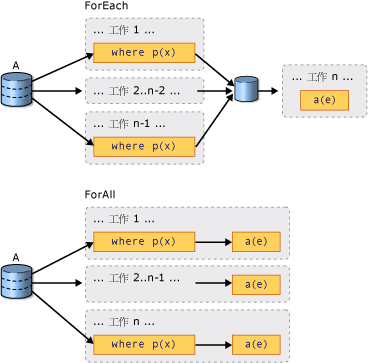

# Introduction to PLINQ
## 什麼是平行查詢？  
 Language\-Integrated Query \(LINQ\) 是在 [!INCLUDE[net_v35_long](../../../includes/net-v35-long-md.md)] 中引入。其突出之處在於可透過類型安全方式查詢任何 <xref:System.Collections.IEnumerable?displayProperty=fullName> 或 <xref:System.Collections.Generic.IEnumerable%601?displayProperty=fullName> 資料來源的整合模型。  LINQ to Objects 是指對記憶體中的集合 \(例如 <xref:System.Collections.Generic.List%601> 和陣列\) 執行的 LINQ 查詢。  本文假設您已具備 LINQ 的基本知識。  如需詳細資訊，請參閱[LINQ \(Language\-Integrated Query\)](../Topic/LINQ%20\(Language-Integrated%20Query\).md)。  
  
 平行 LINQ \(PLINQ\) 是 LINQ 模式的平行實作。  在許多方面 PLINQ 查詢與非平行 LINQ to Objects 查詢十分類似。  就像循序 [!INCLUDE[vbteclinq](../../../includes/vbteclinq-md.md)] 查詢，PLINQ 查詢同樣會對任何記憶體中的 <xref:System.Collections.IEnumerable> 或 <xref:System.Collections.Generic.IEnumerable%601> 資料來源運作，而且採用延後執行模式 \(也就是說查詢要等到被列舉後才會執行\)。  主要差別在於 PLINQ 會嘗試充分運用系統上的所有處理器。  它的作法是將資料來源分割成多個區段，然後以平行方式，以個別的背景工作執行緒在多個處理器上對每個區段執行查詢。  在許多情況下，平行執行可讓查詢速度快許多。  
  
 透過平行執行，PLINQ 的效能改善幅度會明顯高於特定查詢類型的舊版程式碼，且通常只是將 <xref:System.Linq.ParallelEnumerable.AsParallel%2A> 查詢作業加入至資料來源而已。  不過，平行處理原則本身可能會變得很複雜，且在 PLINQ 中並不是所有查詢作業都執行很快。  事實上，平行化作業會使某些查詢變慢。  因此，您應該了解像排序這類的問題會對平行查詢造成的影響。  如需詳細資訊，請參閱[Understanding Speedup in PLINQ](../../../docs/standard/parallel-programming/understanding-speedup-in-plinq.md)。  
  
> [!NOTE]
>  本文件使用 Lambda 運算式來定義 PLINQ 中的委派。  如果您不太熟悉 C\# 或 Visual Basic 中的 Lambda 運算式，請參閱 [Lambda Expressions in PLINQ and TPL](../../../docs/standard/parallel-programming/lambda-expressions-in-plinq-and-tpl.md)。  
  
 本文其餘部分提供主要 PLINQ 類別的概觀，並討論如何建立 PLINQ 查詢。  每節都包含連至詳細資訊和程式碼範例的連結。  
  
## ParallelEnumerable 類別  
 <xref:System.Linq.ParallelEnumerable?displayProperty=fullName> 類別幾乎已公開 PLINQ 的所有功能。它和其餘 <xref:System.Linq?displayProperty=fullName> 命名空間類型都已編譯至 System.Core.dll 組件中。  Visual Studio 中的預設 C\# 和 Visual Basic 專案都會參考這個組件並匯入這個命名空間。  
  
 <xref:System.Linq.ParallelEnumerable> 包含 LINQ to Objects 支援之所有標準查詢運算子的實作，但不會嘗試將每個運算子進行平行處理。  如果您不熟悉 [!INCLUDE[vbteclinq](../../../includes/vbteclinq-md.md)]，請參閱 [Introduction to LINQ](../../../ocs/visual-basic/programming-guide/language-features/linq/introduction-to-linq.md)。  
  
 除了標準查詢運算子，<xref:System.Linq.ParallelEnumerable> 類別還包含一組方法可啟用平行執行特有的行為。  下表列出 PLINQ 特有的這些方法。  
  
|ParallelEnumerable 運算子|描述|  
|----------------------------|--------|  
|<xref:System.Linq.ParallelEnumerable.AsParallel%2A>|PLINQ 的進入點。  指定可能的話，應該平行處理查詢的其餘部分。|  
|<xref:System.Linq.ParallelEnumerable.AsSequential%2A>|指定應該將查詢的其餘部分視為非平行 LINQ 查詢來循序執行。|  
|<xref:System.Linq.ParallelEnumerable.AsOrdered%2A>|指定查詢其餘部分的 PLINQ，應該保留來源序列的順序，或保留到這個順序變更 \(例如使用 orderby 子句，或是 Vlsual Basic 中的 Order By 子句\) 為止。|  
|<xref:System.Linq.ParallelEnumerable.AsUnordered%2A>|指定查詢其餘部分的 PLINQ 不需要保留來源序列的順序。|  
|<xref:System.Linq.ParallelEnumerable.WithCancellation%2A>|指定 PLINQ 應該定期監視所提供之取消語彙基元的狀態，並在收到使用這個語彙基元的要求時執行取消。|  
|<xref:System.Linq.ParallelEnumerable.WithDegreeOfParallelism%2A>|指定 PLINQ 應該用來平行處理查詢的最大處理器數目。|  
|<xref:System.Linq.ParallelEnumerable.WithMergeOptions%2A>|提供提示，表示可能的話，PLINQ 應該如何將平行處理結果合併回耗用端執行緒上成為單一序列。|  
|<xref:System.Linq.ParallelEnumerable.WithExecutionMode%2A>|指定 PLINQ 是否應該平行處理查詢，而不管預設行為是否為循序執行查詢。|  
|<xref:System.Linq.ParallelEnumerable.ForAll%2A>|多執行緒的列舉方法，與逐一查看查詢結果不同，這個方法能夠以平行方式處理結果，而不需要先合併回消費者執行緒。|  
|<xref:System.Linq.ParallelEnumerable.Aggregate%2A> 多載|PLINQ 獨有的多載，可立即對執行緒區域的資料分割執行彙總，最後再加上一個函式，可合併所有資料分割的結果。|  
  
## 選擇加入模型  
 當您撰寫查詢時，在資料來源上叫用 <xref:System.Linq.ParallelEnumerable.AsParallel%2A?displayProperty=fullName> 擴充方法，即可選擇加入 PLINQ，如下列範例所示。  
  
 [!code-csharp[PLINQ#1](../../../samples/snippets/csharp/VS_Snippets_Misc/plinq/cs/plinq2_cs.cs#1)]
 [!code-vb[PLINQ#1](../../../samples/snippets/visualbasic/VS_Snippets_Misc/plinq/vb/plinq2_vb.vb#1)]  
  
 <xref:System.Linq.ParallelEnumerable.AsParallel%2A> 擴充方法會將後續的查詢運算子 \(在本範例中為 `where` 和 `select`\) 繫結至 <xref:System.Linq.ParallelEnumerable?displayProperty=fullName> 實作。  
  
## 執行模式  
 PLINQ 預設採保守模式。  在執行階段，PLINQ 基礎結構會分析查詢的整體結構。  如果查詢很可能會因平行處理變快，PLINQ 會將來源序列分割成多個工作以便同時執行。  如果對查詢採用平行處理並不安全，則 PLINQ 會停留在以循序方式執行查詢。  如果可以選擇可能高度耗費資源的平行演算法或不耗費資源的循序演算法，則 PLINQ 預設會選擇循序演算法。  您可以使用 <xref:System.Linq.ParallelEnumerable.WithExecutionMode%2A> 方法和 <xref:System.Linq.ParallelExecutionMode?displayProperty=fullName> 列舉，指示 PLINQ 選取平行演算法。  當您經由測試和測量得知以平行方式執行特定查詢會更快時，這會很有用。  如需詳細資訊，請參閱[How to: Specify the Execution Mode in PLINQ](../../../docs/standard/parallel-programming/how-to-specify-the-execution-mode-in-plinq.md)。  
  
## 平行處理原則程度  
 PLINQ 預設會使用主機電腦上的所有處理器 \(最多使用 64 個處理器\)。  您可以使用 <xref:System.Linq.ParallelEnumerable.WithDegreeOfParallelism%2A> 方法，指示 PLINQ 使用不超過指定的處理器數目。  當您想要確保電腦上執行的其他處理序會得到一定的 CPU 時間量時，這會很有用。  下列程式碼片段會限制查詢最多使用兩個處理器。  
  
 [!code-csharp[PLINQ#5](../../../samples/snippets/csharp/VS_Snippets_Misc/plinq/cs/plinqsamples.cs#5)]
 [!code-vb[PLINQ#5](../../../samples/snippets/visualbasic/VS_Snippets_Misc/plinq/vb/plinq2_vb.vb#5)]  
  
 在查詢會執行大量非計算繫結工作 \(例如檔案 I\/O\) 的情況下，最好指定大於電腦處理器數目的平行處理原則程度。  
  
## 已排序和未排序平行查詢的比較  
 在某些查詢中，查詢運算子必須產生保留來源序列順序的結果。  基於此目的，PLINQ 提供 <xref:System.Linq.ParallelEnumerable.AsOrdered%2A> 運算子。  <xref:System.Linq.ParallelEnumerable.AsOrdered%2A> 與 <xref:System.Linq.ParallelEnumerable.AsSequential%2A> 不同。  <xref:System.Linq.ParallelEnumerable.AsOrdered%2A> 序列仍然採平行處理方式，但其結果會放入緩衝區中並排序。  因為保留順序通常需要額外的工作，所以處理 <xref:System.Linq.ParallelEnumerable.AsOrdered%2A> 序列的速度可能會比處理預設 <xref:System.Linq.ParallelEnumerable.AsUnordered%2A> 序列更慢。  對特定作業採取排序平行處理方式是否會比採循序處理方式更快，取決於許多因素。  
  
 下列程式碼範例顯示如何選擇加入保留順序。  
  
 [!code-csharp[PLINQ#3](../../../samples/snippets/csharp/VS_Snippets_Misc/plinq/cs/plinq2_cs.cs#3)]
 [!code-vb[PLINQ#3](../../../samples/snippets/visualbasic/VS_Snippets_Misc/plinq/vb/plinq2_vb.vb#3)]  
  
 如需詳細資訊，請參閱[Order Preservation in PLINQ](../../../docs/standard/parallel-programming/order-preservation-in-plinq.md)。  
  
## 比較平行與循序查詢  
 有些作業需要以循序方式傳遞來源資料。  <xref:System.Linq.ParallelEnumerable> 查詢運算子會在必要時自動還原成循序模式。  對於使用者定義的查詢運算子和需要循序執行的使用者委派，PLINQ 提供 <xref:System.Linq.ParallelEnumerable.AsSequential%2A> 方法。  當您使用 <xref:System.Linq.ParallelEnumerable.AsSequential%2A> 時，查詢中的所有後續運算子都會以循序方式執行，直到再次呼叫 <xref:System.Linq.ParallelEnumerable.AsParallel%2A> 為止。  如需詳細資訊，請參閱[How to: Combine Parallel and Sequential LINQ Queries](../../../docs/standard/parallel-programming/how-to-combine-parallel-and-sequential-linq-queries.md)。  
  
## 查詢結果合併選項  
 當 PLINQ 查詢以平行方式執行時，每個背景工作執行緒傳回的結果都必須合併回主執行緒上供 `foreach` \(在 [!INCLUDE[vbprvb](../../../includes/vbprvb-md.md)] 中為 `For Each`\) 迴圈使用，或是插入至清單或陣列中。  在某些情況下 \(例如為了能開始更快產生結果\)，最好指定特定類型的合併作業。  基於此目的，PLINQ 支援 <xref:System.Linq.ParallelEnumerable.WithMergeOptions%2A> 方法和 <xref:System.Linq.ParallelMergeOptions> 列舉。  如需詳細資訊，請參閱[Merge Options in PLINQ](../../../docs/standard/parallel-programming/merge-options-in-plinq.md)。  
  
## ForAll 運算子  
 在循序 [!INCLUDE[vbteclinq](../../../includes/vbteclinq-md.md)] 查詢中，查詢會延到被列舉時才執行，例如被列舉在 `foreach` \(在 [!INCLUDE[vbprvb](../../../includes/vbprvb-md.md)] 中為 `For Each`\) 迴圈中，或是經由叫用 <xref:System.Linq.ParallelEnumerable.ToList%2A>、<xref:System.Linq.ParallelEnumerable.ToArray%2A> 或 <xref:System.Linq.ParallelEnumerable.ToDictionary%2A> 之類的方法而被列舉。  在 PLINQ 中，您也可以使用 `foreach` 來執行查詢並逐一查看結果。  不過，`foreach` 本身並不是以平行方式執行，因此，必須將所有平行工作的輸出合併回執行這個迴圈的執行緒。  在 PLINQ 中，當您必須保留查詢結果的最終順序，或是要依序處理結果 \(例如當您要對每個項目呼叫 `Console.WriteLine`\) 時，您可以使用 `foreach`。  當您需要更快執行查詢，而不需要保留順序，且可以平行處理結果時，請使用 <xref:System.Linq.ParallelEnumerable.ForAll%2A> 方法執行 PLINQ 查詢。  <xref:System.Linq.ParallelEnumerable.ForAll%2A> 不會執行這個最後的合併步驟。  下列程式碼範例顯示如何使用 <xref:System.Linq.ParallelEnumerable.ForAll%2A> 方法。  此處使用 <xref:System.Collections.Concurrent.ConcurrentBag%601?displayProperty=fullName>，是因為這已針對多個同時加入但未嘗試移除任何項目的執行緒進行最佳化。  
  
 [!code-csharp[PLINQ#4](../../../samples/snippets/csharp/VS_Snippets_Misc/plinq/cs/plinq2_cs.cs#4)]
 [!code-vb[PLINQ#4](../../../samples/snippets/visualbasic/VS_Snippets_Misc/plinq/vb/plinq2_vb.vb#4)]  
  
 下圖顯示 `foreach` 和 <xref:System.Linq.ParallelEnumerable.ForAll%2A> 兩者在執行查詢方面的差異。  
  
   
  
## 取消  
 PLINQ 已與 [!INCLUDE[net_v40_short](../../../includes/net-v40-short-md.md)] 中的取消類型整合 \(如需詳細資訊，請參閱 [Cancellation in Managed Threads](../../../docs/standard/threading/cancellation-in-managed-threads.md)\)。因此，與循序 LINQ to Objects 查詢不同，PLINQ 查詢是可以取消的。  若要建立可取消的 PLINQ 查詢，請在查詢上使用 <xref:System.Linq.ParallelEnumerable.WithCancellation%2A> 運算子，並提供 <xref:System.Threading.CancellationToken> 執行個體做為引數。  當語彙基元上的 <xref:System.Threading.CancellationToken.IsCancellationRequested%2A> 屬性設定為 true 時，PLINQ 會注意到它，並停止所有執行緒上的處理，然後擲回 <xref:System.OperationCanceledException>。  
  
 不過，在設定取消語彙基元之後，PLINQ 查詢仍有可能會繼續處理某些項目。  
  
 若要加速回應，您也可以回應長時間執行之使用者委派中的取消要求。  如需詳細資訊，請參閱[How to: Cancel a PLINQ Query](../../../docs/standard/parallel-programming/how-to-cancel-a-plinq-query.md)。  
  
## 例外狀況  
 當 PLINQ 查詢執行時，可能會同時從不同的執行緒擲回多個例外狀況。  另外，用來處理例外狀況的程式碼和擲回例外狀況的程式碼可能位在不同的執行緒上。  PLINQ 會使用 <xref:System.AggregateException> 類型來封裝查詢所擲回的所有例外狀況，並將這些例外狀況封送處理回到呼叫端執行緒。  在呼叫端執行緒上，只需要一個 try\-catch 區塊。  不過，您可以逐一查看 <xref:System.AggregateException> 中封裝的所有例外狀況，並攔截任何您可以放心復原的例外狀況。  在極少數的情況下，某些擲回的例外狀況可能不會包裝在 <xref:System.AggregateException> 中，且 <xref:System.Threading.ThreadAbortException> 也不會受到包裝。  
  
 如果可以將每個例外狀況個別擲回給聯結的執行緒，則引發例外狀況之後，查詢仍可能會繼續處理某些項目。  
  
 如需詳細資訊，請參閱[How to: Handle Exceptions in a PLINQ Query](../../../docs/standard/parallel-programming/how-to-handle-exceptions-in-a-plinq-query.md)。  
  
## 自訂 Partitioner  
 在某些情況下，您可以利用來源資料的某些特性撰寫自訂 Partitioner，以改善查詢效能。  在查詢中，自訂 Partitioner 本身就是被查詢的可列舉物件。  
  
 [!code-csharp[PLINQ#2](../../../samples/snippets/csharp/VS_Snippets_Misc/plinq/cs/plinq2_cs.cs#2)]
 [!code-vb[PLINQ#2](../../../samples/snippets/visualbasic/VS_Snippets_Misc/plinq/vb/plinq3.vb#2)]  
  
 PLINQ 支援固定數目的資料分割 \(但是在執行階段，可能會基於負載平衡的原因，而將資料動態地重新指派給這些資料分割\)。  <xref:System.Threading.Tasks.Parallel.For%2A> 和 <xref:System.Threading.Tasks.Parallel.ForEach%2A> 只支援動態分割，這表示資料分割數目會在執行階段變更。  如需詳細資訊，請參閱[Custom Partitioners for PLINQ and TPL](../../../docs/standard/parallel-programming/custom-partitioners-for-plinq-and-tpl.md)。  
  
## 測量 PLINQ 效能  
 在許多情況下，查詢是可以採平行處理方式的，但是設定平行查詢所帶來的負荷會超過所獲得的效能優勢。  如果查詢不會執行許多計算或是資料來源很小，PLINQ 查詢可能會比循序 LINQ to Objects 查詢更慢。  您可以使用 Visual Studio Team Server 中的「平行效能分析器」來比較各種查詢的效能、找出處理瓶項，以及判斷您的查詢會以平行還是循序方式來執行。  如需詳細資訊，請參閱[並行視覺化檢視](../Topic/Concurrency%20Visualizer.md)與[How to: Measure PLINQ Query Performance](../../../docs/standard/parallel-programming/how-to-measure-plinq-query-performance.md)。  
  
## 請參閱  
 [Parallel LINQ \(PLINQ\)](../../../docs/standard/parallel-programming/parallel-linq-plinq.md)   
 [Understanding Speedup in PLINQ](../../../docs/standard/parallel-programming/understanding-speedup-in-plinq.md)