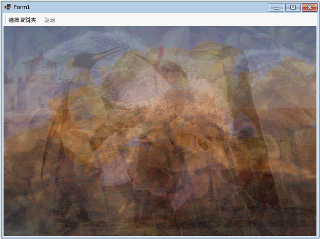

# Walkthrough: Using Dataflow in a Windows Forms Application
此範例示範如何建立的資料流程區塊網路，其可以在 Windows Form 應用程式中執行影像處理。  
  
 這個範例會從指定的資料夾載入影像檔，建立複合影像，並顯示結果。  這個範例使用「資料流程」\(Dataflow\) 模型，透過網路來路由傳送影像。  在資料流程模型中，程式的獨立元件可藉由訊息傳送相互通訊。  當元件收到訊息時，它可以執行某項動作，然後將結果傳遞給另一個元件。  相較之下，「控制流程」\(Control Flow\) 模型中，應用程式使用控制結構，例如條件陳述式、迴圈等，來控制程式中的作業順序。  
  
## 必要條件  
 在開始這個逐步解說之前，請先閱讀[資料流程](../../../docs/standard/parallel-programming/dataflow-task-parallel-library.md) 主題。  
  
> [!TIP]
>  TPL 資料流程式庫 \(<xref:System.Threading.Tasks.Dataflow?displayProperty=fullName> 命名空間\) 並沒有和 [!INCLUDE[net_v45](../../../includes/net-v45-md.md)] 配置在一起。  若要安裝 <xref:System.Threading.Tasks.Dataflow> 命名空間，請在 [!INCLUDE[vs_dev11_long](../../../includes/vs-dev11-long-md.md)] 中開啟您的專案，從 \[專案\] 功能表中選擇 \[**管理 NuGet 封裝**\]，並且線上搜尋 `Microsoft.Tpl.Dataflow` 封裝。  
  
> [!TIP]
>  TPL 資料流程式庫 \(<xref:System.Threading.Tasks.Dataflow?displayProperty=fullName> 命名空間\) 並沒有和 [!INCLUDE[net_v45](../../../includes/net-v45-md.md)] 配置在一起。  若要安裝 <xref:System.Threading.Tasks.Dataflow> 命名空間，請在 [!INCLUDE[vs_dev11_long](../../../includes/vs-dev11-long-md.md)] 中開啟您的專案，從 \[專案\] 功能表中選擇 \[**管理 NuGet 封裝**\]，並且線上搜尋 `Microsoft.Tpl.Dataflow` 封裝。  
  
## 章節  
 此逐步解說包含下列章節：  
  
-   [建立 Windows Form 應用程式](#winforms)  
  
-   [建造資料流程網路](#network)  
  
-   [連接使用者介面 \(UI\) 的資料流程網路](#ui)  
  
-   [完整的範例](#complete)  
  
   
## 建立 Windows Form 應用程式  
 本節說明如何建立基本的 Windows Form 應用程式並加入控制項至主表單。  
  
#### 若要建立新的 Windows Form 應用程式  
  
1.  在 [!INCLUDE[vsprvs](../../../includes/vsprvs-md.md)] 中建立 [!INCLUDE[csprcs](../../../includes/csprcs-md.md)] 或 Visual Basic **Windows Forms Application** 專案。  在這個文件中，此專案的名稱為 `CompositeImages`。  
  
2.  在主要表單的表單設計工具上， Form1.cs \( [!INCLUDE[vbprvb](../../../includes/vbprvb-md.md)]中的 Form1.vb\)，將一個 <xref:System.Windows.Forms.ToolStrip> 控制項。  
  
3.  將 <xref:System.Windows.Forms.ToolStripButton> 控制項加入至 <xref:System.Windows.Forms.ToolStrip> 控制項。  將 <xref:System.Windows.Forms.ToolStripItem.DisplayStyle%2A> 屬性設定為 <xref:System.Windows.Forms.ToolStripItemDisplayStyle>，並將 <xref:System.Windows.Forms.ToolStripItem.Text%2A> 屬性設定為選擇的資料夾 。  
  
4.  將 <xref:System.Windows.Forms.ToolStripButton> 控制項加入至<xref:System.Windows.Forms.ToolStrip>控制項。  設定 <xref:System.Windows.Forms.ToolStripItem.DisplayStyle%2A> 屬性為 <xref:System.Windows.Forms.ToolStripItemDisplayStyle>， <xref:System.Windows.Forms.ToolStripItem.Text%2A> 屬性取消和 <xref:System.Windows.Forms.ToolStripItem.Enabled%2A> 屬性設定為 `False`。  
  
5.  加入至主要表單的 <xref:System.Windows.Forms.PictureBox> 物件。  將 <xref:System.Windows.Forms.Control.Dock%2A> 屬性設為 <xref:System.Windows.Forms.DockStyle>。  
  
   
## 建造資料流程網路  
 本節說明如何建立該資料流的網路影像處理的執行。  
  
#### 建立資料流程網路  
  
1.  加入 System.Threading.Tasks.Dataflow.dll 的參考至您的專案。  
  
2.  確定 Form1.cs \( [!INCLUDE[vbprvb](../../../includes/vbprvb-md.md)]中的 Form1.vb\) 包含下列 `using` \(在 [!INCLUDE[vbprvb](../../../includes/vbprvb-md.md)]中為`Using` \) 陳述式:  
  
     [!code-csharp[TPLDataflow_CompositeImages#1](../../../samples/snippets/csharp/VS_Snippets_Misc/tpldataflow_compositeimages/cs/compositeimages/form1.cs#1)]  
  
3.  加入下列資料成員至 `Form1` 類別中:  
  
     [!code-csharp[TPLDataflow_CompositeImages#2](../../../samples/snippets/csharp/VS_Snippets_Misc/tpldataflow_compositeimages/cs/compositeimages/form1.cs#2)]  
  
4.  將下列方法 `CreateImageProcessingNetwork` 加入至 `Form1` 類別。  這個方法建立影像處理網路。  
  
     [!code-csharp[TPLDataflow_CompositeImages#3](../../../samples/snippets/csharp/VS_Snippets_Misc/tpldataflow_compositeimages/cs/compositeimages/form1.cs#3)]  
  
5.  實作 `LoadBitmaps` 方法。  
  
     [!code-csharp[TPLDataflow_CompositeImages#4](../../../samples/snippets/csharp/VS_Snippets_Misc/tpldataflow_compositeimages/cs/compositeimages/form1.cs#4)]  
  
6.  實作 `CreateCompositeBitmap` 方法。  
  
     [!code-csharp[TPLDataflow_CompositeImages#5](../../../samples/snippets/csharp/VS_Snippets_Misc/tpldataflow_compositeimages/cs/compositeimages/form1.cs#5)]  
  
    > [!NOTE]
    >  `CreateCompositeBitmap` 方法的 C\# 版本使用指標啟用有效管理 <xref:System.Drawing.Bitmap?displayProperty=fullName> 物件。  因此，您必須在專案的 \[**允許使用 Unsafe 程式碼**\] 選項才能使用 [不安全](../Topic/unsafe%20\(C%23%20Reference\).md) 關鍵字。  如需如何啟用 [!INCLUDE[csprcs](../../../includes/csprcs-md.md)] 專案的 Unsafe 程式碼的詳細資訊，請參閱 [專案設計工具、建置頁 \(C\#\)](../Topic/Build%20Page,%20Project%20Designer%20\(C%23\).md)。  
  
 下表說明網路成員。  
  
|成員|類型|說明|  
|--------|--------|--------|  
|`loadBitmaps`|<xref:System.Threading.Tasks.Dataflow.TransformBlock%602>|上層資料夾路徑做為輸入並產生 <xref:System.Drawing.Bitmap> 物件的集合做為輸出。|  
|`createCompositeBitmap`|<xref:System.Threading.Tasks.Dataflow.TransformBlock%602>|取得 <xref:System.Drawing.Bitmap> 物件的集合做為輸入並產生複合點陣圖做為輸出。|  
|`displayCompositeBitmap`|<xref:System.Threading.Tasks.Dataflow.ActionBlock%601>|在表單上顯示複合點陣圖。|  
|`operationCancelled`|<xref:System.Threading.Tasks.Dataflow.ActionBlock%601>|顯示影像表示作業取消並讓使用者選擇另一個資料夾。|  
  
 若要連接資料流程區塊形成網路，範例會使用 <xref:System.Threading.Tasks.Dataflow.ISourceBlock%601.LinkTo%2A> 方法。  <xref:System.Threading.Tasks.Dataflow.ISourceBlock%601.LinkTo%2A> 方法會包含可取得 <xref:System.Predicate%601> 物件識別的一個多載版本目標區塊會接受或拒絕訊息。  此篩選機制可讓訊息區塊只接收對某些值。  在此範例中， Web 可能有兩種分支。  MAIN 分支從磁碟載入影像，建立複合影像和在表單上顯示該影像。  替代分支取消目前作業。  <xref:System.Predicate%601> 物件可讓沿著 MAIN 分支的資料流程區塊轉換成其他分支藉由拒絕特定訊息。  例如，在中，如果使用者取消作業，資料流程區塊 `createCompositeBitmap` 產生 `null` \(在 [!INCLUDE[vbprvb](../../../includes/vbprvb-md.md)]中為`Nothing` \) 做為其輸出。  資料流程區塊 `displayCompositeBitmap` 拒絕 `null` 輸入值，因此，訊息為 `operationCancelled`提供。  資料流程區塊 `operationCancelled` 接受任何訊息，因此會顯示影像來表示作業已取消。  
  
 下圖顯示影像處理網路。  
  
   
  
 由於 `displayCompositeBitmap` 和 `operationCancelled` 資料流程區塊動作在使用者介面 \(UI\) ，則這個動作會在使用者介面執行緒上發生。  在建構時要達到這個目的，，這些物件都提供有 <xref:System.Threading.Tasks.Dataflow.DataflowBlockOptions.TaskScheduler%2A> 屬性設定為 <xref:System.Threading.Tasks.TaskScheduler.FromCurrentSynchronizationContext%2A?displayProperty=fullName>的 <xref:System.Threading.Tasks.Dataflow.ExecutionDataflowBlockOptions> 物件。  <xref:System.Threading.Tasks.TaskScheduler.FromCurrentSynchronizationContext%2A?displayProperty=fullName> 方法會建立 <xref:System.Threading.Tasks.TaskScheduler> 物件會在目前的同步處理內容運作。  因為 `CreateImageProcessingNetwork` 方法會從選取資料夾按鈕的處理常式呼叫，在使用者介面執行緒中執行， `displayCompositeBitmap` 和 `operationCancelled` 資料流程區塊的動作在使用者介面執行緒中執行。  
  
 這個範例使用共用的取消語彙基元而非設定 <xref:System.Threading.Tasks.Dataflow.DataflowBlockOptions.CancellationToken%2A> 屬性，因為 <xref:System.Threading.Tasks.Dataflow.DataflowBlockOptions.CancellationToken%2A> 屬性永久地移除資料流程區塊執行。  即使使用者移除一個或多個作業，取消語彙基元可讓這個範例會重複使用相同的資料流程網路多次。  如需使用 <xref:System.Threading.Tasks.Dataflow.DataflowBlockOptions.CancellationToken%2A> 永久地移除資料流程區塊的範例，請參閱 [How to: Cancel a Dataflow Block](../../../docs/standard/parallel-programming/how-to-cancel-a-dataflow-block.md)。  
  
   
## 連接使用者介面 \(UI\) 的資料流程網路  
 本節說明如何連接資料流程網路到使用者介面。  複合影像的作業的建立和移除選取資料夾啟動和取消按鈕。  當使用者選取其中一個按鈕時，適當的動作已開始以非同步方式。  
  
#### 連接使用者介面 \(UI\) 的資料流程網路  
  
1.  在主要表單的表單設計工具上，替選擇的資料夾按鈕建立 <xref:System.Windows.Forms.ToolStripItem.Click> 事件。  
  
2.  實作可以選擇資料夾按鈕的 <xref:System.Windows.Forms.ToolStripItem.Click> 事件。  
  
     [!code-csharp[TPLDataflow_CompositeImages#6](../../../samples/snippets/csharp/VS_Snippets_Misc/tpldataflow_compositeimages/cs/compositeimages/form1.cs#6)]  
  
3.  在主要表單的表單設計工具上，替取消按鈕建立 <xref:System.Windows.Forms.ToolStripItem.Click> 事件。  
  
4.  實作取消按鈕的 <xref:System.Windows.Forms.ToolStripItem.Click> 事件。  
  
     [!code-csharp[TPLDataflow_CompositeImages#7](../../../samples/snippets/csharp/VS_Snippets_Misc/tpldataflow_compositeimages/cs/compositeimages/form1.cs#7)]  
  
   
## 完整的範例  
 下列範例顯示完整程式碼。  
  
 [!code-csharp[TPLDataflow_CompositeImages#100](../../../samples/snippets/csharp/VS_Snippets_Misc/tpldataflow_compositeimages/cs/compositeimages/form1.cs#100)]  
  
 下圖顯示 Common \\ Sample Pictures \\的資料夾典型的輸出。  
  
   
  
## 後續步驟  
  
## 請參閱  
 [資料流程](../../../docs/standard/parallel-programming/dataflow-task-parallel-library.md)