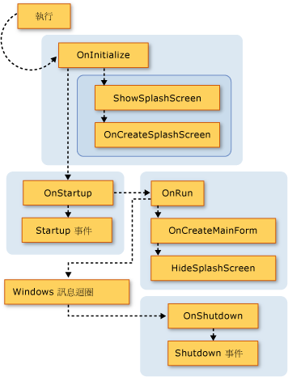

# 擴充 Visual Basic 應用程式模型
您可以將功能加入應用程式模型藉由覆寫`Overridable`成員<xref:Microsoft.VisualBasic.ApplicationServices.WindowsFormsApplicationBase>類別。 這項技術可讓您自訂應用程式模型的行為，並加入您自己的方法呼叫，在應用程式啟動和關機。  
  
## 應用程式模型的視覺概觀  
 本節以視覺化方式呈現 Visual Basic 應用程式模型中的函式呼叫的順序。 下一節描述每個函式詳細資料中的用途。  
  
 下圖顯示一般的 Visual Basic Windows Form 應用程式中的應用程式模型的呼叫順序。 開始時的順序`Sub Main`程序呼叫<xref:Microsoft.VisualBasic.ApplicationServices.WindowsFormsApplicationBase.Run%2A>方法。  
  
   
  
 Visual Basic 應用程式模型也提供<xref:Microsoft.VisualBasic.ApplicationServices.WindowsFormsApplicationBase.StartupNextInstance>和<xref:Microsoft.VisualBasic.ApplicationServices.WindowsFormsApplicationBase.UnhandledException>事件。 下圖顯示引發這些事件的機制。  
  
   
  
   
  
## 覆寫基底方法  
 <xref:Microsoft.VisualBasic.ApplicationServices.WindowsFormsApplicationBase.Run%2A>方法定義所在的次序`Application`執行的方法。 根據預設， `Sub Main` Windows Form 應用程式的程序呼叫<xref:Microsoft.VisualBasic.ApplicationServices.WindowsFormsApplicationBase.Run%2A>方法。  
  
 如果應用程式是正常的應用程式 （多個執行個體應用程式） 或為單一執行個體應用程式中，第一個執行個體<xref:Microsoft.VisualBasic.ApplicationServices.WindowsFormsApplicationBase.Run%2A>方法執行`Overridable`依照下列順序的方法：  
  
1.  <xref:Microsoft.VisualBasic.ApplicationServices.WindowsFormsApplicationBase.OnInitialize%2A>. 根據預設，這個方法會設定視覺化樣式、 文字顯示樣式和目前的主體，主應用程式的執行緒 （如果應用程式使用 Windows 驗證），並呼叫`ShowSplashScreen`如果既未`/nosplash`也`-nosplash`做為命令列引數。  
  
     如果此函數會傳回取消應用程式啟動順序`False`。 這可以是如果在其中應用程式不應該執行的情況下很有用。  
  
     <xref:Microsoft.VisualBasic.ApplicationServices.WindowsFormsApplicationBase.OnInitialize%2A>方法會呼叫下列方法：  
  
    1.  <xref:Microsoft.VisualBasic.ApplicationServices.WindowsFormsApplicationBase.ShowSplashScreen%2A>. 判斷應用程式是否具有定義的啟動顯示畫面，若是如此，則會啟動顯示畫面顯示另一個執行緒上。  
  
         <xref:Microsoft.VisualBasic.ApplicationServices.WindowsFormsApplicationBase.ShowSplashScreen%2A>方法包含的程式碼會顯示啟動顯示畫面上的最小的所指定的毫秒數<xref:Microsoft.VisualBasic.ApplicationServices.WindowsFormsApplicationBase.MinimumSplashScreenDisplayTime%2A>屬性。 若要使用這項功能，您必須加入啟動顯示畫面應用程式使用**專案設計工具**(將`My.Application.MinimumSplashScreenDisplayTime`屬性為兩秒)，或設定`My.Application.MinimumSplashScreenDisplayTime`會覆寫方法中的屬性<xref:Microsoft.VisualBasic.ApplicationServices.WindowsFormsApplicationBase.OnInitialize%2A>或<xref:Microsoft.VisualBasic.ApplicationServices.WindowsFormsApplicationBase.OnCreateSplashScreen%2A>方法。 如需詳細資訊，請參閱<xref:Microsoft.VisualBasic.ApplicationServices.WindowsFormsApplicationBase.MinimumSplashScreenDisplayTime%2A>。  
  
    2.  <xref:Microsoft.VisualBasic.ApplicationServices.WindowsFormsApplicationBase.OnCreateSplashScreen%2A>. 可讓設計工具發出初始化啟動顯示畫面的程式碼。  
  
         根據預設，這個方法沒有任何作用。 如果您選取應用程式啟動顯示畫面[!INCLUDE[vbprvb](~/includes/vbprvb-md.md)]**專案設計工具**，設計工具會覆寫<xref:Microsoft.VisualBasic.ApplicationServices.WindowsFormsApplicationBase.OnCreateSplashScreen%2A>方法設定的方法與<xref:Microsoft.VisualBasic.ApplicationServices.WindowsFormsApplicationBase.SplashScreen%2A>屬性的新執行個體的啟動顯示畫面表單。  
  
2.  <xref:Microsoft.VisualBasic.ApplicationServices.WindowsFormsApplicationBase.OnStartup%2A>. 提供的擴充點引發`Startup`事件。 如果此函數會傳回，就會停止應用程式啟動順序`False`。  
  
     根據預設，這個方法會引發<xref:Microsoft.VisualBasic.ApplicationServices.WindowsFormsApplicationBase.Startup>事件。 如果事件處理常式設定<xref:System.ComponentModel.CancelEventArgs.Cancel>的事件引數屬性`True`，方法會傳回`False`取消應用程式啟動。  
  
3.  <xref:Microsoft.VisualBasic.ApplicationServices.WindowsFormsApplicationBase.OnRun%2A>. 主應用程式時即可開始執行初始設定完成之後提供的起點。  
  
     根據預設之前它進入 Windows Form 訊息迴圈中，, 這個方法會呼叫`OnCreateMainForm`（要建立應用程式的主要表單） 和`HideSplashScreen`（若要關閉啟動顯示畫面） 方法：  
  
    1.  <xref:Microsoft.VisualBasic.ApplicationServices.WindowsFormsApplicationBase.OnCreateMainForm%2A>. 提供方法，讓設計工具發出初始化主要表單的程式碼。  
  
         根據預設，這個方法沒有任何作用。 不過，當您選取主表單中的應用程式[!INCLUDE[vbprvb](~/includes/vbprvb-md.md)]**專案設計工具**，設計工具會覆寫<xref:Microsoft.VisualBasic.ApplicationServices.WindowsFormsApplicationBase.OnCreateMainForm%2A>方法設定的方法與<xref:Microsoft.VisualBasic.ApplicationServices.WindowsFormsApplicationBase.MainForm%2A>主要表單的新執行個體的屬性.  
  
    2.  <xref:Microsoft.VisualBasic.ApplicationServices.WindowsFormsApplicationBase.HideSplashScreen%2A>. 如果應用程式具有定義的啟動顯示畫面，而其為開啟，這個方法會關閉在啟動顯示畫面。  
  
         根據預設，這個方法會關閉在啟動顯示畫面。  
  
4.  <xref:Microsoft.VisualBasic.ApplicationServices.WindowsFormsApplicationBase.OnStartupNextInstance%2A>. 提供方法，以自訂 單一執行個體的應用程式的應用程式的另一個執行個體啟動時的行為。  
  
     根據預設，這個方法會引發<xref:Microsoft.VisualBasic.ApplicationServices.WindowsFormsApplicationBase.StartupNextInstance>事件。  
  
5.  <xref:Microsoft.VisualBasic.ApplicationServices.WindowsFormsApplicationBase.OnShutdown%2A>. 提供的擴充點引發`Shutdown`事件。 此方法不會執行主應用程式中發生未處理例外狀況。  
  
     根據預設，這個方法會引發<xref:Microsoft.VisualBasic.ApplicationServices.WindowsFormsApplicationBase.Shutdown>事件。  
  
6.  <xref:Microsoft.VisualBasic.ApplicationServices.WindowsFormsApplicationBase.OnUnhandledException%2A>. 如果未處理的例外狀況，就會發生任何上述列出的方法中，執行。  
  
     根據預設，這個方法會引發<xref:Microsoft.VisualBasic.ApplicationServices.WindowsFormsApplicationBase.UnhandledException>只要偵錯工具未附加，而且應用程式正在處理的事件`UnhandledException`事件。  
  
 如果是單一執行個體應用程式，應用程式已在執行後續的執行個體的應用程式呼叫<xref:Microsoft.VisualBasic.ApplicationServices.WindowsFormsApplicationBase.OnStartupNextInstance%2A>應用程式，然後結束的原始執行個體上的方法。  
 
 <xref:Microsoft.VisualBasic.ApplicationServices.WindowsFormsApplicationBase.OnStartupNextInstance(Microsoft.VisualBasic.ApplicationServices.StartupNextInstanceEventArgs)>建構函式呼叫<xref:Microsoft.VisualBasic.ApplicationServices.WindowsFormsApplicationBase.UseCompatibleTextRendering%2A>屬性來判斷要用於應用程式的表單的文字轉譯引擎。 根據預設，<xref:Microsoft.VisualBasic.ApplicationServices.WindowsFormsApplicationBase.UseCompatibleTextRendering%2A>屬性會傳回`False`，指出使用 GDI 文字轉譯引擎，這是在預設[!INCLUDE[vbprvblong](~/includes/vbprvblong-md.md)]。 您可以覆寫<xref:Microsoft.VisualBasic.ApplicationServices.WindowsFormsApplicationBase.UseCompatibleTextRendering%2A>屬性，以傳回`True`，這表示使用 GDI + 文字轉譯引擎，這是 Visual Basic.NET 2002年和 Visual Basic.NET 2003年中的預設值。  
  
## 設定應用程式  
 一部分[!INCLUDE[vbprvb](~/includes/vbprvb-md.md)]應用程式模型、<xref:Microsoft.VisualBasic.ApplicationServices.WindowsFormsApplicationBase.UseCompatibleTextRendering>類別提供受保護的內容，設定應用程式。 應該實作類別的建構函式中設定這些屬性。  
  
 在預設 Windows Form 專案中，**專案設計工具**建立程式碼以設定與設計工具設定的屬性。 只有當應用程式正在啟動; 時，會使用這些屬性設定這些應用程式啟動後沒有任何作用。  
  
|屬性|決定|在 專案設計工具的應用程式窗格中的設定|  
|---|---|---|  
|<xref:Microsoft.VisualBasic.ApplicationServices.WindowsFormsApplicationBase.IsSingleInstance%2A>|是否為單一執行個體或多個執行個體的應用程式執行應用程式。|**讓單一執行個體的應用程式**核取方塊|  
|<xref:Microsoft.VisualBasic.ApplicationServices.WindowsFormsApplicationBase.EnableVisualStyles%2A>|如果應用程式將使用視覺化樣式符合 Windows XP。|**啟用 XP 視覺化樣式**核取方塊|  
|<xref:Microsoft.VisualBasic.ApplicationServices.WindowsFormsApplicationBase.SaveMySettingsOnExit%2A>|如果應用程式結束時，應用程式會自動儲存應用程式的使用者設定變更。|**在關閉儲存 My.Settings**核取方塊|  
|<xref:Microsoft.VisualBasic.ApplicationServices.WindowsFormsApplicationBase.ShutdownStyle%2A>|什麼情況會讓應用程式結束，例如啟動表單關閉時，或最後一個表單關閉時。|**關閉模式**清單|  
  
## 另請參閱  
 <xref:Microsoft.VisualBasic.ApplicationServices.ApplicationBase>  
 <xref:Microsoft.VisualBasic.ApplicationServices.WindowsFormsApplicationBase.Startup>  
 <xref:Microsoft.VisualBasic.ApplicationServices.WindowsFormsApplicationBase.StartupNextInstance>  
 <xref:Microsoft.VisualBasic.ApplicationServices.WindowsFormsApplicationBase.UnhandledException>  
 <xref:Microsoft.VisualBasic.ApplicationServices.WindowsFormsApplicationBase.Shutdown>  
 <xref:Microsoft.VisualBasic.ApplicationServices.WindowsFormsApplicationBase.NetworkAvailabilityChanged>  
 <xref:Microsoft.VisualBasic.ApplicationServices.WindowsFormsApplicationBase.NetworkAvailabilityChanged>  
 [Visual Basic 應用程式模型概觀](../../../visual-basic/developing-apps/development-with-my/overview-of-the-visual-basic-application-model.md)  
 [專案設計工具、應用程式頁面 (Visual Basic)](/visualstudio/ide/reference/application-page-project-designer-visual-basic)
